# LEONARDO PATTERN DESIGN SOFTWARE

## GUIDA PER L'UTILIZZO - VERSIONE DEFINITIVA

**VERSIONE 1.3.0**

**CONCESSA A USO LUDICO E DIMOSTRATIVO**

Sviluppatore: LEONARDO GUASQUI  
Contatti: leonardo@guasqui.it  
Sito Web: www.guasqui.it  
Tutti i diritti riservati.

---

## INDICE

1. [Struttura del Software](#struttura-del-software)
2. [Gestione Licenza](#1-gestione-licenza)
3. [Elaborazione Pezzi AAMA](#2-elaborazione-pezzi-aama)
4. [Gestione Testo e Attributi](#3-gestione-testo-e-attributi)
5. [Inserimento Blocchi e Simboli](#4-inserimento-blocchi-e-simboli)
6. [Disegno Geometrico](#5-disegno-geometrico)
7. [Gestione Dati Pezzi](#6-gestione-dati-pezzi)
8. [Estrazione Modaris](#7-estrazione-modaris)
9. [Modifica Avanzata](#8-modifica-avanzata)
10. [Utilità e Calcolo](#9-utilità-e-calcolo)
11. [Gestione Polilinee](#10-gestione-polilinee)
12. [Preparazione Stampa e Nesting](#11-preparazione-stampa-e-nesting)
13. [Gestione Tacche](#12-gestione-tacche)
14. [Gestione Layer e Colori](#13-gestione-layer-e-colori)
15. [Gestione Offset](#14-gestione-offset)
16. [Scorciatoie da Tastiera](#scorciatoie-da-tastiera)
17. [Configurazione](#configurazione)

---

## Struttura del Software

Il nucleo delle funzionalità di Leonardo Pattern Design Software risiede nella cartella **wolfang/core/**. Questa cartella contiene numerosi file LISP (.lsp) che definiscono i comandi e le logiche operative del programma.

### Tipologie di File

* **File LISP (.lsp)**: Contengono il codice sorgente per le funzioni personalizzate di AutoCAD/ZWCAD. Ogni comando è definito da una `(defun c:NOMECOMANDO ...)` nel codice LISP.

* **File DCL (.dcl)**: Definiscono l'interfaccia utente (finestre di dialogo):
    * MaterialManager1.dcl (per gestmat.lsp)
    * Nome_pezzo.dcl (per Nome_pezzo.lsp e ED-NOM.lsp)
    * Tabella-materiale.dcl (per Visualizza-per-mat.lsp)
    * SCAMBIO.dcl (per scambio.lsp)
    * Materialex.dcl e Materialenew.dcl (per ED-MAT.lsp e Materiale.lsp)
    * gestione_nomi.dcl (per gnames.lsp)

* **File di Menu (.mns, .menuc, .menur)**: Definiscono la struttura dei menu a tendina e delle barre degli strumenti

* **File di Configurazione (.txt)**: Liste di materiali, nomi, e altre configurazioni (es. Pelle.txt, Nome1.txt in INSTALLAZIONE/common/)

* **File Icone (.bmp)**: Localizzati in **INSTALLAZIONE/menu/LEONARDO/**

### Directory Principali

```
LEONARDO/
├── INSTALLAZIONE/
│   ├── menu/
│   │   └── LEONARDO/          # File icone (.bmp) e menu
│   └── common/                # File configurazione (.txt)
└── wolfang/
    └── core/                  # File LISP (.lsp) e DCL (.dcl)
```

### Compatibilità

- **AutoCAD** - Compatibilità completa
- **ZWCAD** - Compatibilità completa con comandi specifici

---

## 1. GESTIONE LICENZA

**File:** `Codice_licenza.lsp`

| Comando | Icona | Descrizione |
|---------|-------|-------------|
| `c:activate-license` |  | Avvia il processo di attivazione della licenza |
| `c:show-system-id` |  | Mostra l'ID univoco del sistema |
| `c:reset-license` |  | Resetta lo stato della licenza (solo debug) |

---

## 2. ELABORAZIONE PEZZI AAMA

### Processori AAMA Principali

**File:** `AAMA20.lsp`, `aama_rifilo2.LSP`, `MODARIS-AAMA.lsp`

| Comando | File | Icona | Descrizione |
|---------|------|-------|-------------|
| `c:aama` | AAMA20.lsp |  | Funzione principale AAMA per processare sagome e creare blocchi per nesting |
| `c:aamar` | aama_rifilo2.LSP |  | Processa sagome RIFILO con materiale standard |
| `c:Modaris-AAMA` | MODARIS-AAMA.lsp |  | Elabora blocchi Modaris v3.0 con centroide e dati |

### Comandi di Configurazione AAMA

**File:** `AAMA20.lsp`

| Comando | Descrizione |
|---------|-------------|
| `c:aama_spacing` | Imposta spaziatura tra blocchi (*AAMA-BLOCK-SPACING*) |
| `c:aama_debug` | Attiva/disattiva modalità debug (*AAMA-DEBUG-MODE*) |
| `c:aama_errors` | Visualizza log dettagliato errori |
| `c:aama_clear_errors` | Pulisce log errori registrati |
| `c:aama_settings` | Mostra tutte le impostazioni correnti |
| `c:aama_test` | Test su singola sagoma con debug attivo |

### Comandi RIFILO

**File:** `aama_rifilo2.LSP`

| Comando | Descrizione |
|---------|-------------|
| `c:aamar_init` | Inizializza variabili RIFILO a valori default |
| `c:aamar_material` | Imposta materiale standard |
| `c:aamar_tipologia` | Imposta tipologia standard |
| `c:aamar_quantita` | Imposta quantità standard |
| `c:aamar_spacing` | Imposta spaziatura blocchi RIFILO |
| `c:aamar_debug` | Attiva/disattiva debug RIFILO |
| `c:aamar_errors` | Visualizza log errori RIFILO |
| `c:aamar_clear_errors` | Pulisce log errori RIFILO |
| `c:aamar_settings` | Mostra impostazioni RIFILO correnti |
| `c:aamar_test` | Test RIFILO su singola sagoma |

### Comandi Test e Supporto

**File:** `MODARIS-AAMA.lsp`, `moschino punti batch6.lsp`, `AAMA_ESTRAI_2.lsp`

| Comando | File | Icona | Descrizione |
|---------|------|-------|-------------|
| `c:MA-test` | MODARIS-AAMA.lsp |  | Test attributi Modaris (PNAME, MNAME) e centroide |
| `c:MA-config` | MODARIS-AAMA.lsp |  | Visualizza parametri configurazione globali Modaris |
| `c:test-multipli` | moschino punti batch6.lsp |  | Test estrazione blocchi multipli |
| `c:AAMA_ESTRAI` | AAMA_ESTRAI_2.lsp |  | Esporta oggetti layer "1" in DXF e cancella dal disegno |

### Funzioni Nesting

**File:** `bl.lsp`, `nesting33.lsp`

| Comando | File | Icona | Descrizione |
|---------|------|-------|-------------|
| `c:nestinglinea` | bl.lsp |  | Posiziona pezzi in linea o multi-riga ordinati per dimensioni |
| `c:nesting1` | bl.lsp |  | Nesting semplificato in singola linea orizzontale |
| `c:nestingarea` | bl.lsp |  | Definisce area di lavoro con rettangolo temporaneo |
| `c:nesting3` | nesting33.lsp | 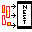 | Nesting avanzato con gestione overflow e creazione nuove tavole |

### Altri Comandi Elaborazione

**File:** `DIMA.lsp`, `geber.lsp`, `offset-delete-script2.lsp`, `sostituisci punti blocco.lsp`

| Comando | File | Icona | Descrizione |
|---------|------|-------|-------------|
| `c:DIMA` | DIMA.lsp |  | Crea dima da layer ENDCUT con offset su OUTCUT/INTCUT |
| `c:geber` | geber.lsp |  | Processore batch tacche: converte blocchi tacca in POINT su layer "4" |
| `c:set_geber_tolerance` | geber.lsp |  | Imposta tolleranze globali per conversione tacche |
| `c:ofi` | offset-delete-script2.lsp |  | OFFSET RINGRANO v4.0 - sposta originale su layer "0" e offset su "OUTCUT" |
| `c:OL` | offset-delete-script2.lsp |  | Alias per c:ofi |
| `c:OR` | offset-delete-script2.lsp |  | Alias per c:ofi |
| `c:O` | offset-delete-script2.lsp |  | Alias per c:ofi |
| `c:blocchi_in_punti` | sostituisci punti blocco.lsp |  | Converte blocchi "PitRTak" in oggetti POINT |

---

## 3. GESTIONE TESTO E ATTRIBUTI

### Allineamento e Rotazione

**File:** `AlignTextToCurveV1-2.lsp`, `ZeroRottaion.LSP`, `ruota testo.lsp`

| Comando | File | Icona | Descrizione |
|---------|------|-------|-------------|
| `c:ATC` | AlignTextToCurveV1-2.lsp | 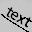 | Allinea testo (esistente o nuovo) a curva selezionata |
| `c:ZR` | ZeroRottaion.LSP |  | Azzera rotazione di testo, blocchi o MLeader |
| `c:EDT` | ruota testo.lsp |  | Ruota testi basandosi su angolo definito da due punti |

### Inserimento Testi Predefiniti - Diciture

**File:** `DICITURE.lsp`

| Comando | Icona | Descrizione |
|---------|-------|-------------|
| `c:EDG` |  | Inserisce testo "COSTOLA" |
| `c:FIL` |  | Inserisce testo "FILO" |
| `c:SCA` |  | Inserisce testo "SCARNIRE" |
| `c:SOT` |  | Inserisce testo "SOTTOMETTITURA" |
| `c:RIM` |  | Inserisce testo "RIMBOCCO" |
| `c:TAL` |  | Inserisce testo "TALYN" |
| `c:SAL` |  | Inserisce testo "SALPA" |
| `c:ANT` |  | Inserisce testo "ANTISTRAPPO" |
| `c:BOM` |  | Inserisce testo "BOMBATURA" |
| `c:RIN` |  | Inserisce testo "RINFORZO" |
| `c:BOR` |  | Inserisce testo "BORDATURA" |
| `c:VAL` |  | Inserisce testo "VALIGIAIA" |
| `c:C5` |  | Inserisce testo "CUC.ROV. 5MM" |
| `c:C5P` |  | Inserisce testo "CUC.ROV. 5MM CON PIPING" |
| `c:C7` |  | Inserisce testo "CUC.ROV. 7MM" |
| `c:C7P` |  | Inserisce testo "CUC.ROV. 7MM CON PIPING" |

### Modifica Testi

**File:** `sost testo.lsp`, `TCASE.LSP`

| Comando | File | Icona | Descrizione |
|---------|------|-------|-------------|
| `c:chg` | sost testo.lsp |  | Sostituisce Old String con New String in oggetti TEXT |
| `c:TCASE` | TCASE.LSP |  | Converte testo in maiuscolo o minuscolo |

---

## 4. INSERIMENTO BLOCCHI E SIMBOLI

### Blocchi Indicazioni

**File:** `BLOCCHI.LSP`

| Comando | Icona | Descrizione |
|---------|-------|-------------|
| `c:VR` |  | Inserisce blocco "verticale" scala 1.5 |
| `c:OR` |  | Inserisce blocco "orizzontale" scala 1.5 |
| `c:WAR` |  | Inserisce blocco "ATTENZIONE" |
| `c:EQ` |  | Inserisce blocco "EQUALIZZARE" |
| `c:TABT` |  | Inserisce blocco "tabella_testi" |
| `c:PEL` |  | Inserisce blocco "PELLE" |
| `c:FOD` |  | Inserisce blocco "fodera" |

### Blocchi Numerazione

**File:** `conta.LSP`

| Comando | Icona | Descrizione |
|---------|-------|-------------|
| `c:conta` | 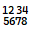 | Inserisce blocchi numerati progressivamente |

### Altri Blocchi

**File:** `numero_articolo.lsp`, `SPESSORE.LSP`, `LEO_FUST.lsp`

| Comando | File | Icona | Descrizione |
|---------|------|-------|-------------|
| `c:NUM` | numero_articolo.lsp |  | Inserisce blocco numero articolo |
| `c:SPESSORE` | SPESSORE.LSP |  | Inserisce blocco spessore materiale con prefisso "SP." |
| `c:LEO_FUST` | LEO_FUST.lsp |  | Inserisce blocco "Leo_Fust" (foro fustella) layer "0" colore 6 |

---

## 5. DISEGNO GEOMETRICO

**File:** `centro.lsp`, `LeoRettangolo.lsp`, `Passante.lsp`, `trapi.LSP`

| Comando | File | Icona | Descrizione |
|---------|------|-------|-------------|
| `c:centro` | centro.lsp |  | Disegna linee forzando angolo 90° dopo primo segmento |
| `c:LEORETTANGOLO` | LeoRettangolo.lsp |  | Disegna rettangolo definendo centro, larghezza e altezza |
| `c:LeoA3` | LeoRettangolo.lsp |  | Disegna rettangolo A3 (297 x 420) |
| `c:LeoA4` | LeoRettangolo.lsp |  | Disegna rettangolo A4 (210 x 297) |
| `c:LeoUM` | LeoRettangolo.lsp |  | Disegna rettangolo standard (650 x 950) |
| `c:LeoUM2` | LeoRettangolo.lsp |  | Disegna rettangolo standard (1300 x 950) |
| `c:LeoUM4` | LeoRettangolo.lsp |  | Disegna rettangolo standard (1300 x 1800) |
| `c:LeoRACRETT` | LeoRettangolo.lsp |  | Disegna rettangolo raccordato |
| `c:Passante` | Passante.lsp |  | Calcola e disegna passante tracolla |
| `c:TRAPI` | trapi.LSP |  | Disegna trapezio definendo basi e altezza |

---

## 6. GESTIONE DATI PEZZI

### Inserimento Dati

**File:** `Materiale.lsp`, `Nome_pezzo.lsp`, `numero_articolo.lsp`, `SPESSORE.LSP`

| Comando | File | Icona | Descrizione | Protezione |
|---------|------|-------|-------------|------------|
| `c:MAT` | Materiale.lsp |  | Apre dialogo DCL per inserimento materiale e calcolo AREANETTA | ✅ |
| `c:NOM` | Nome_pezzo.lsp |  | Apre dialogo DCL per composizione nome pezzo | ✅ |
| `c:NUM` | numero_articolo.lsp |  | Inserisce blocchi "NUM" e "RIF" con numero articolo | ❌ |
| `c:SPESSORE` | SPESSORE.LSP |  | Inserisce blocco spessore | ❌ |

### Modifica Dati

**File:** `ED-MAT.lsp`, `ED-NOM.lsp`, `ED-MATERIALE.lsp`, `ED-INFUST.lsp`

| Comando | File | Icona | Descrizione | Protezione |
|---------|------|-------|-------------|------------|
| `c:ED-MAT` | ED-MAT.lsp |  | Modifica Materiale/Quantità/Tipologia blocco DATIM via DCL | ❌ |
| `c:ED-NOM` | ED-NOM.lsp |  | Modifica nome pezzo tramite dialogo DCL | ❌ |
| `c:ED-MATERIALE` | ED-MATERIALE.lsp |  | Modifica rapida Quantità e Tipologia di DATIM | ✅ |
| `c:ED-INFUST` | ED-INFUST.lsp |  | Aggiunge prefisso "Infustitura" al nome pezzo | ❌ |
| `c:ED-FOD` | ED-INFUST.lsp |  | Aggiunge prefisso "Fodera" al nome pezzo | ❌ |
| `c:ED-RIF` | ED-INFUST.lsp |  | Aggiunge prefisso "Rifilo" al nome pezzo | ❌ |
| `c:ED-SBOZ` | ED-INFUST.lsp |  | Aggiunge prefisso "Taglio" al nome pezzo | ❌ |

---

## 7. ESTRAZIONE MODARIS

**File:** `CONP.lsp`, `CONP_C.lsp`, `MODARIS AAMA.lsp`, `moschino punti batch6.lsp`

| Comando | File | Icona | Descrizione |
|---------|------|-------|-------------|
| `c:CONP` | CONP.lsp |  | Calcola centroide polilinee layer "0" e inserisce POINT |
| `c:CONP_C` | CONP_C.lsp |  | Converte cerchi layer "0" in POINT nel centro |
| `c:estrai-multipli` | MODARIS AAMA.lsp |  | Estrazione batch: inserisce DATIT/DATIM, esplode, pulisce attributi |
| `c:estrai-singolo` | MODARIS AAMA.lsp |  | Estrazione singolo blocco con pulizia completa |

---

## 8. MODIFICA AVANZATA

**File:** `ChainSelV1-1.lsp`, `CookieCutter2 v1.2.lsp`, `RACCORDA_0.LSP`, `SPEZZA_PUNTO.LSP`, `splitCir.lsp`, `TROVA_GAP.lsp`, `QM.lsp`

| Comando | File | Icona | Descrizione | Protezione |
|---------|------|-------|-------------|------------|
| `c:CS` | ChainSelV1-1.lsp |  | Chain Selection: selezione automatica oggetti connessi | ✅ |
| `c:CookieCutter2` | CookieCutter2 v1.2.lsp |  | Cookie Cutter: trim avanzato con esplosione blocchi | ❌ |
| `c:CC` | CookieCutter2 v1.2.lsp |  | Shortcut per CookieCutter2 | ❌ |
| `c:RACCORDA_0` | RACCORDA_0.LSP |  | Raccorda con raggio 0 tra due entità | ❌ |
| `c:SPEZZA_PUNTO` | SPEZZA_PUNTO.LSP |  | Interrompe linea/polilinea/arco in punto selezionato | ✅ |
| `c:splitcir` | splitCir.lsp |  | Interrompe cerchio in due punti e disegna arco | ❌ |
| `c:TROVA_GAP` | TROVA_GAP.lsp |  | Cerca gap tra entità e disegna cerchio su layer "GAP" | ❌ |
| `c:QM` | QM.lsp | 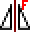 | Mirror rapido di oggetti | ❌ |

---

## 9. UTILITÀ E CALCOLO

**File:** `convesadec4.lsp`, `elenca-font.lsp`, `gestmat.lsp`, `gnames.lsp`, `NOG.lsp`, `scambio.lsp`, `visualizza-per-mat.lsp`

| Comando | File | Icona | Descrizione | Protezione |
|---------|------|-------|-------------|------------|
| `c:HexDecConverter` | convesadec4.lsp |  | Converte testo tra esadecimale (0x) e decimale | ❌ |
| `c:font_test` | elenca-font.lsp |  | Crea righe testo per testare font .shx da directory | ❌ |
| `c:gestmat` | gestmat.lsp |  | Gestore Liste Materiali con interfaccia DCL | ❌ |
| `c:gnames` | gnames.lsp |  | Gestisce liste nomi pezzi (Nome1/2/3.txt) via DCL | ❌ |
| `c:NOG` | NOG.lsp |  | Calcolo Consumi Materiale: genera report CSV/Excel | ✅ |
| `c:sostmat` | scambio.lsp |  | Sostituzione materiale in batch mantenendo quantità/tipologia | ❌ |
| `c:mat1` | visualizza-per-mat.lsp |  | Visualizza e zoom su pezzi per materiale selezionato | ❌ |

---

## 10. GESTIONE POLILINEE

### Selezione e Unione

**File:** `chains.lsp`, `join.lsp`, `PC.lsp`, `PJ.LSP`, `y.LSP`

| Comando | File | Icona | Descrizione |
|---------|------|-------|-------------|
| `c:csj` | chains.lsp |  | Chain Selection con visualizzazione dinamica e frecce colorate |
| `c:leo-poliauto` | chains.lsp |  | Selezione concatenata con unione automatica |
| `c:JoinAll` | join.lsp |  | Unisce Linee/Archi/Polilinee con _.pedit M _j |
| `c:PC` | PC.lsp |  | Chiude polilinee leggere (LWPOLYLINE) aperte |
| `c:PJ` | PJ.LSP | 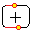 | Unisce Linee/Archi/Polilinee con ._pedit _m _j |
| `c:Y` | y.LSP |  | Filtra e congiunge Linee/Archi in Polilinee leggere |

### Conversione

**File:** `el2pl.lsp`, `spline-to-pline.lsp`

| Comando | File | Icona | Descrizione |
|---------|------|-------|-------------|
| `c:el2pl` | el2pl.lsp | 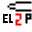 | Converte Ellisse o arco ellittico in Polilinea |
| `c:s2p` | spline-to-pline.lsp |  | Converte spline in polilinee con numero segmenti definito |

### Direzione e Visualizzazione

**File:** `PLD.lsp`, `PLDREV_SHOW_DIRECTION.lsp`

| Comando | File | Icona | Descrizione |
|---------|------|-------|-------------|
| `c:PLDREV_SETCOLOR` | PLD.lsp |  | Imposta colore frecce direzione |
| `c:PLDREV_SETPOS` | PLD.lsp |  | Imposta posizione frecce (Interne/Esterne) |
| `c:PLD` | PLD.lsp |  | Visualizza direzione polilinea con frecce e permette inversione |
| `c:PLDREV_SHOW_DIRECTION` | PLDREV_SHOW_DIRECTION.lsp |  | Mostra direzione rotazione e punto inizio polilinea |
| `c:RvrsLine` | PLDREV_SHOW_DIRECTION.lsp |  | Inverte direzione Linee/Polyline/LWPolyline |

---

## 11. PREPARAZIONE STAMPA E NESTING

### Preparazione Sbozzi

**File:** `sbozzo.lsp`, `sbozzomultiplo.lsp`, `sbozzo_bounding.lsp`, `sbozzo_rettangolare.lsp`

| Comando | File | Icona | Descrizione | Protezione |
|---------|------|-------|-------------|------------|
| `c:SBOZZO` | sbozzo.lsp |  | Crea sbozzo: cancella tacche, offset polilinea, sposta su OUTCUT | ❌ |
| `c:CopyArray` | sbozzomultiplo.lsp | 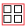 | Array rettangolare con sbozzo e bounding box complessivo | ✅ |
| `c:SBOZZO_BOUND` | sbozzo_bounding.lsp |  | Disegna bounding box rettangolare per polilinee | ❌ |
| `c:SBOZZO_RETT` | sbozzo_rettangolare.lsp |  | Crea bounding box, offset e avvia NESTING3 | ❌ |

### Tavole di Stampa

**File:** `PRESTAMPA.LSP`, `TAVOLA_DI_STAMPA.lsp`, `TAVOLA_DI_STAMPA_A3.lsp`

| Comando | File | Icona | Descrizione | Protezione |
|---------|------|-------|-------------|------------|
| `c:PRESTAMPA` | PRESTAMPA.LSP |  | Prepara polilinee su layer TAVOLA_DI_STAMPA_TAGLIO, crea blocchi con centroide | ❌ |
| `c:TAVOLA_DI_STAMPA_ANTIBUG` | TAVOLA_DI_STAMPA.lsp |  | Prepara sagome e avvia NESTING3 | ✅ |
| `c:TAVOLA_DI_STAMPA_A3` | TAVOLA_DI_STAMPA_A3.lsp | 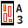 | Prepara sagome per A3 e avvia NESTING3 | ❌ |

---

## 12. GESTIONE TACCHE

### Inserimento e Copia Tacche

**File:** `inserisci_tacca.lsp`, `tacca_da_misura.lsp`, `tacca_dapoli.lsp`, `copia_tacche.lsp`, `misuratrt.lsp`

| Comando | File | Icona | Descrizione |
|---------|------|-------|-------------|
| `c:INSERISCI_TACCA` | inserisci_tacca.lsp |  | Inserisce blocco tacca sulla polilinea |
| `c:tacca_da_misura` | tacca_da_misura.lsp |  | Inserisce tacca a distanza specifica da punto partenza |
| `c:tacca_dapoli` | tacca_dapoli.lsp | 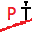 | Copia distanza tra due punti su polilinea sorgente e inserisce tacca su destinazione |
| `c:COPIA_TACCHE` | copia_tacche.lsp | 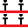 | Copia tacche da polilinea sorgente a destinazione |
| `c:MISURATRT` | misuratrt.lsp | 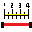 | Misura tratto su polilinea e inserisce valore come testo |

### Modifica Tacche

**File:** `inverti tacca.lsp`, `ribalta tacca.lsp`, `riposiziona_tacche.lsp`, `METTI_V.lsp`

| Comando | File | Icona | Descrizione |
|---------|------|-------|-------------|
| `c:INVERTI_TACCA` | inverti tacca.lsp |  | Inverte direzione tacche selezionate |
| `c:TACCA_RIBALTA` | ribalta tacca.lsp | 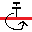 | Ribalta tacche selezionate |
| `c:riposiziona_tacche` | riposiziona_tacche.lsp | 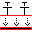 | Riposiziona tacche su nuova polilinea |
| `c:METTI_V` | METTI_V.lsp |  | Inserisce rientranza a 'V' su polilinea |

### Conversione Tacche

**File:** `sostituisci tacche.lsp`

| Comando | Icona | Descrizione |
|---------|-------|-------------|
| `c:sostituisci_tacche` | 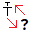 | Menu scelta rapida per conversione tra tipi tacche/punti |
| `c:tacche_in_tagliate` |  | Converte tacche standard in tacche tagliate (tacca_t) |
| `c:tagliate_in_tacche` |  | Converte tacche tagliate in tacche standard |
| `c:tacche_in_punti` |  | Converte tacche/PitRTak in oggetti POINT |
| `c:punti_in_tacche` |  | Converte oggetti POINT in tacche standard |
| `c:mozart_in_tacche` |  | Converte blocchi PitTacCT (Mozart) in tacche standard |
| `c:tacche_in_mozart` |  | Converte tacche standard in blocchi PitTacCT (Mozart) |

---

## 13. GESTIONE LAYER E COLORI

### Gestione Layer di Taglio

**File:** `DEFLINEA.LSP`

| Comando | Icona | Descrizione | Layer | Colore |
|---------|-------|-------------|-------|--------|
| `c:ENDCUT` |  | Sposta su layer ENDCUT (crea layer se necessario) | ENDCUT | 4 (Ciano) |
| `c:OUTCUT` |  | Sposta su layer OUTCUT (taglio esterno/rifilo) | OUTCUT | 1 (Rosso) |
| `c:INTCUT` | 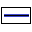 | Sposta su layer INTCUT (taglio interno) | INTCUT | 5 (Blu) |
| `c:PENNA` |  | Ripristina oggetti su layer "0" con colore BYLAYER | 0 | BYLAYER |

**Nota:** Tutti i comandi impostano automaticamente il colore su BYLAYER dopo lo spostamento.

### Gestione Colori Rapida

**File:** `CAMBIA_COLORE.LSP`

| Comando | Icona | Descrizione | Colore ACI |
|---------|-------|-------------|------------|
| `c:BBB` |  | Cambia colore oggetto in Bianco/Nero e sposta su layer "0" | 254 |
| `c:GGG` |  | Cambia colore oggetto in Giallo e sposta su layer "0" | 2 |
| `c:AAA` |  | Cambia colore oggetto in Arancio e sposta su layer "0" | 30 |
| `c:VVV` |  | Cambia colore oggetto in Verde e sposta su layer "0" | 3 |
| `c:FFF` |  | Cambia colore oggetto in Fucsia/Magenta e sposta su layer "0" | 6 |

**Nota:** Tutti i comandi operano sugli oggetti pre-selezionati.

---

## 14. GESTIONE OFFSET

### Offset con Tipo Linea

**File:** `offset_trat.lsp`

| Comando | Icona | Descrizione |
|---------|-------|-------------|
| `c:oft_2` |  | Offset 2 unità con tipo linea CUCITURA (scala 0.3) |
| `c:oft_3` | 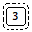 | Offset 3 unità con tipo linea CUCITURA |
| `c:oft_4` |  | Offset 4 unità con tipo linea CUCITURA |
| `c:oft_5` |  | Offset 5 unità con tipo linea CUCITURA |
| `c:oft_6` |  | Offset 6 unità con tipo linea CUCITURA |
| `c:oft_8` |  | Offset 8 unità con tipo linea CUCITURA |
| `c:oft_10` |  | Offset 10 unità con tipo linea CUCITURA |
| `c:oft` |  | Offset distanza personalizzata con tipo linea CUCITURA |

### Gestione Tipo Linea

**File:** `TIPOLINEA.lsp`

| Comando | Icona | Descrizione |
|---------|-------|-------------|
| `c:CUCITURA` |  | Imposta tipo linea CUCITURA (layer 0, scala 0.3) |
| `c:CONTINUA` |  | Ripristina tipo linea BYLAYER (continuo) |

---

## SCORCIATOIE DA TASTIERA

Per visualizzare tutte le scorciatoie, digitare **ALIASEDIT** nella riga di comando.

### Scorciatoie Principali

| Tasto | Comando | Descrizione |
|-------|---------|-------------|
| **Q** | ALIGN | Allinea |
| **QQ** | DIMLINEAR | Quota lineare |
| **W** | TRIM | Taglia (con SHIFT estende) |
| **E** | EXPLODE | Esplodi |
| **ES** | EXTEND | Estendi |
| **EP** | PEDIT | Edita polilinea |
| **EX** | EXTRIM | Taglio esterno/interno a polilinea |
| **R** | FILLET | Raccorda |
| **RA** | FILLETRAD | Imposta raggio raccordo |
| **RR** | ROTATE | Ruota |
| **RT** | RECTANG | Rettangolo |
| **T** | TEXT | Testo |
| **TT** | INSERISCI_TACCA | Inserisci tacca |
| **Y** | PJ | Creazione polilinea |
| **O** | OFFSET | Offset |
| **PL** | PLINE | Polilinea |
| **PC** | PC | Chiudi polilinea |
| **A** | ARC | Arco |
| **S** | MOVE | Sposta |
| **SS** | SELECTSIMILAR | Seleziona simili |
| **SC** | SCALE | Scala |
| **SAR** | SAR | Disegna freccia |
| **SAL** | SAL | Inserisce testo "SALPA" |
| **D** | ERASE | Cancella |
| **F** | MIRROR | Specchia |
| **G** | COPY | Copia |
| **H** | SPEZZA_PUNTO | Spezza nel punto |
| **L** | LINE | Linea |
| **Z** | POINT | Punto |
| **X** | MATCHPROP | Copia proprietà |
| **XL** | XLINE | Linea infinita |
| **C** | CIRCLE | Cerchio |
| **CS** | CS | Chain Selection |
| **CP** | PC | Chiudi polilinea |
| **MT** | MTEXT | Testo multilinea |
| **BR** | BLOCCO_RAPIDO | Blocco rapido |

### Scorciatoie Colori

| Tasto | Comando | Colore |
|-------|---------|--------|
| **AAA** | AAA | Arancio (30) |
| **BBB** | BBB | Bianco (254) |
| **FFF** | FFF | Fucsia (6) |
| **GGG** | GGG | Giallo (2) |
| **VVV** | VVV | Verde (3) |

### Scorciatoie Layer

| Tasto | Comando | Descrizione |
|-------|---------|-------------|
| **V** | INTCUT | Taglio interno |
| **B** | OUTCUT | Taglio rifilo |
| **N** | PENNA | Penna (layer "0") |
| **M** | ENDCUT | Linea di taglio |

### Scorciatoie Dati Pezzi

| Tasto | Comando | Descrizione |
|-------|---------|-------------|
| **NN** | NOM | Nome pezzo |
| **MM** | MAT | Materiale |

### Scorciatoie Cucitura

| Tasto | Comando | Descrizione |
|-------|---------|-------------|
| **C5** | C5 | Testo "CUC.ROV.5MM" |
| **C5P** | C5P | Testo "CUC.ROV.5MM CON PIPING" |
| **C7** | C7 | Testo "CUC.ROV.7MM" |
| **C7P** | C7P | Testo "CUC.ROV.7MM CON PIPING" |

### Acceleratori (Ctrl+Tasto)

| Combinazione | Comando | Descrizione |
|-------------|---------|-------------|
| **Ctrl+Q** | DIMALIGNED | Quota allineata |
| **Ctrl+E** | EXTEND | Estendi |
| **Ctrl+W** | TRIM | Taglia |

### Tasti Funzione

| Tasto | Comando | Descrizione |
|-------|---------|-------------|
| **F5** | CONTINUA | Linea continua |
| **F6** | CUCITURA | Cucitura |

---

## CONFIGURAZIONE

### File di Configurazione

**Directory:** `LEONARDO/INSTALLAZIONE/common/`

| File | Descrizione |
|------|-------------|
| `Pelle.txt` | Lista materiali in pelle |
| `Nome1.txt` | Lista nomi predefiniti - Gruppo 1 |
| `Nome2.txt` | Lista nomi predefiniti - Gruppo 2 |
| `Nome3.txt` | Lista nomi predefiniti - Gruppo 3 |
| `nog_config.txt` | Configurazione calcolo consumi materiali |
| `license.dat` | File licenza (generato automaticamente) |

### File Interfacce DCL

**Directory:** `wolfang/core/`

| File DCL | Utilizzato da | Funzione |
|----------|---------------|----------|
| `MaterialManager1.dcl` | gestmat.lsp | Gestione archivio materiali |
| `Nome_pezzo.dcl` | Nome_pezzo.lsp, ED-NOM.lsp | Composizione nomi pezzo |
| `Tabella-materiale.dcl` | Visualizza-per-mat.lsp | Visualizzazione per materiale |
| `SCAMBIO.dcl` | scambio.lsp | Sostituzione materiali batch |
| `Materialex.dcl` | ED-MAT.lsp, Materiale.lsp | Gestione materiali (extended) |
| `Materialenew.dcl` | ED-MAT.lsp, Materiale.lsp | Gestione materiali (new) |
| `gestione_nomi.dcl` | gnames.lsp | Gestione archivio nomi |

### Struttura File Menu

**Directory:** `LEONARDO/INSTALLAZIONE/menu/LEONARDO/`

| File | Tipo | Descrizione |
|------|------|-------------|
| `LEONARDO 0.mns` | Menu Sorgente | File menu editabile (25.257 bytes) |
| `LEONARDO 0.menuc` | Menu Compilato | File menu compilato (26.773 bytes) |
| `LEONARDO 0.menur` | Menu Risorsa | Risorse menu - icone (647.906 bytes) |

---

## RIEPILOGO COMANDI

### Totale Comandi per Categoria

- **Gestione Licenza:** 3 comandi
- **Elaborazione Pezzi AAMA:** 28 comandi
- **Gestione Testo:** 21 comandi
- **Inserimento Blocchi:** 11 comandi
- **Disegno Geometrico:** 10 comandi
- **Gestione Dati Pezzi:** 12 comandi
- **Estrazione Modaris:** 4 comandi
- **Modifica Avanzata:** 8 comandi
- **Utilità e Calcolo:** 7 comandi
- **Gestione Polilinee:** 13 comandi
- **Preparazione Stampa:** 7 comandi
- **Gestione Tacche:** 18 comandi
- **Gestione Layer e Colori:** 9 comandi
- **Gestione Offset:** 10 comandi

**TOTALE COMANDI DOCUMENTATI:** 161 comandi

---

## COMPATIBILITÀ ZWCAD

Il menu include riferimenti a comandi specifici ZWCAD:

- **ZWRC_ARCSER**, **ZWRC_ARCCON** (archi)
- **ZWRC_SN2BCK** (porta dietro)
- **ZWRC_BREAKATPT** (spezza in punto)
- **ZWRC_POLYGO**, **ZWRC_RECTAN** (forme base)
- **ZWRC_LIST**, **ZWRC_DIST**, **ZWRC_AREA** (interrogazione)
- **ZWRC_IMGATT** (immagini)

---

## CONCLUSIONI

Leonardo Pattern Design Software è un sistema completo per il design di pattern nel settore calzaturiero e pellettiero, con oltre 160 comandi specializzati, interfacce intuitive e piena compatibilità con i principali software CAD.

### Supporto Tecnico

**Email:** leonardo@guasqui.it  
**Sito Web:** www.guasqui.it

---

**Tutti i diritti riservati - Leonardo Guasqui**  
**Versione documento:** Definitiva per GitHub  
**Versione software:** 1.3.0  
**Data ultima revisione:** 2025
