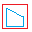
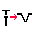
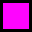

# Leonardo Pattern Design - Appendice Comandi

**VERSIONE 3.2.0** - Riferimento Rapido Completo

**240 comandi** organizzati in 25 categorie funzionali

---

## INDICE CATEGORIE

1. [Elaborazione AAMA](#1-elaborazione-aama)
2. [Gestione Testo e Attributi](#2-gestione-testo-e-attributi)
3. [Inserimento Blocchi](#3-inserimento-blocchi)
4. [Disegno Geometrico](#4-disegno-geometrico)
5. [Gestione Dati Pezzi](#5-gestione-dati-pezzi)
6. [Estrazione Modaris](#6-estrazione-modaris)
7. [Modifica Avanzata](#7-modifica-avanzata)
8. [Utilità e Calcolo](#8-utilità-e-calcolo)
9. [Gestione Polilinee](#9-gestione-polilinee)
10. [Preparazione Stampa](#10-preparazione-stampa)
11. [Gestione Tacche](#11-gestione-tacche)
12. [Gestione Layer](#12-gestione-layer)
13. [Gestione Offset](#13-gestione-offset)
14. [Lavorazioni e Accessori](#14-lavorazioni-e-accessori)
15. [Schede e Documentazione](#15-schede-e-documentazione)
16. [Rotazioni Rapide](#16-rotazioni-rapide)
17. [Specchiatura Avanzata](#17-specchiatura-avanzata)
18. [Nesting Avanzato](#18-nesting-avanzato)
19. [Debug e Diagnostica](#19-debug-e-diagnostica)
20. [Disegno Avanzato](#20-disegno-avanzato)
21. [Polilinee Avanzate](#21-polilinee-avanzate)
22. [Offset Avanzato](#22-offset-avanzato)
23. [Comandi Alias](#23-comandi-alias)
24. [Animazioni e Visualizzazione](#24-animazioni-e-visualizzazione)
25. [Sperimentali 3D](#25-sperimentali-3d)

---

## 1. ELABORAZIONE AAMA

### Processori Principali

| Comando | Icona | Menu | Toolbar | Descrizione |
|---------|-------|------|---------|-------------|
| [`aama`](README_UTENTE.md#il-comando-aama) |  | AAMA → Elaborazione AAMA → AAMA Standard | AAMA | Processa sagome per macchine taglio, crea blocchi standardizzati |
| [`aamar`](README_UTENTE.md#aama-per-rifili) |  | AAMA → Elaborazione AAMA → AAMA Standard Rifilo | AAMA | Processa sagome RIFILO con materiale standard |
| `Modaris-AAMA` |  | AAMA → Elaborazione AAMA → Modaris AAMA | - | Converte blocchi Modaris v3.0 per AAMA |

### Configurazione RIFILO

| Comando | Icona | Menu | Toolbar | Descrizione |
|---------|-------|------|---------|-------------|
| `aamar_material` | - | AAMA → Configurazione RIFILO → Imposta Materiale | - | Imposta materiale standard RIFILO |
| `aamar_tipologia` | - | AAMA → Configurazione RIFILO → Imposta Tipologia | - | Imposta tipologia standard RIFILO |
| `aamar_quantita` | - | AAMA → Configurazione RIFILO → Imposta Quantità | - | Imposta quantità standard RIFILO |
| `aamar_spacing` | - | AAMA → Configurazione RIFILO → Imposta Spaziatura | - | Definisce spaziatura blocchi RIFILO |
| `aamar_settings` | - | AAMA → Configurazione RIFILO → Visualizza Settings | - | Mostra impostazioni correnti RIFILO |

### Layer Speciali

| Comando | Icona | Menu | Toolbar | Descrizione |
|---------|-------|------|---------|-------------|
| `drill1` |  | AAMA → Layer Speciali → Drill 1 | AAMA | Sposta PUNTO su layer 201 (Giallo) |
| `drill2` |  | AAMA → Layer Speciali → Drill 2 | AAMA | Sposta PUNTO su layer 202 (Verde) |
| `drillp` |  | AAMA → Layer Speciali → Drill P | AAMA | Sposta PUNTO su layer 100 (Ciano) |
| `marcatura` |  | AAMA → Layer Speciali → Marcatura | AAMA | Sposta oggetto su layer 91 (Ciano) |
| `proiezione` |  | AAMA → Layer Speciali → Proiezione | AAMA | Sposta oggetto su layer 90 (Fucsia) |

### Nesting e Allineamento

| Comando | Icona | Menu | Toolbar | Descrizione |
|---------|-------|------|---------|-------------|
| [`nestinglinea`](README_UTENTE.md#nesting-disporre-i-pezzi) |  | AAMA → Nesting → Allinea Blocchi | AAMA | Posiziona pezzi in linea o righe multiple |
| `nesting1` |  | AAMA → Nesting → Nesting Singola Linea | - | Nesting semplificato su linea orizzontale |
| [`nestingarea`](README_UTENTE.md#nesting-disporre-i-pezzi) |  | AAMA → Nesting → Definisci Area | - | Definisce area temporanea per nesting |
| [`nesting3`](README_UTENTE.md#nesting-disporre-i-pezzi) |  | Stampe → Nesting → Nesting Avanzato | Tavola di Stampa | Nesting avanzato con overflow automatico |

### Geber e Conversioni

| Comando | Icona | Menu | Toolbar | Descrizione |
|---------|-------|------|---------|-------------|
| `geber` |  | AAMA → Geber → Trasforma Tacche in Punti | AAMA | Converte batch blocchi tacca in punti |
| `set_geber_tolerance` |  | AAMA → Geber → Imposta Tolleranza | AAMA | Imposta tolleranze conversione tacche |
| `blocchi_in_punti` |  | AAMA → Geber → Converti PitRTak | BLOCCHI AVANZATI | Converte blocchi PitRTak in punti |

### Utilità AAMA

| Comando | Icona | Menu | Toolbar | Descrizione |
|---------|-------|------|---------|-------------|
| [`AAMA_ESTRAI`](README_UTENTE.md#esportare-per-il-converter-macchine-da-taglio) |  | AAMA → Elaborazione AAMA → AAMA Estrai | AAMA | Esporta layer "1" in DXF per converter |
| `DIMA` |  | Plugin → Dima | Plugin | Crea dima da layer con offset |
| `ofi` |  | Offset → Offset Ringrano (OFI) | Offset | Offset RINGRANO (originale su "0", offset su OUTCUT) |

---

## 2. GESTIONE TESTO E ATTRIBUTI

### Allineamento e Rotazione

| Comando | Icona | Menu | Toolbar | Descrizione |
|---------|-------|------|---------|-------------|
| `ATC` |  | Blocchi → Allineamento → Allinea Testo a Curva | Modifica Avanzata | Allinea testo a curve con controlli dinamici |
| `ZR` |  | Blocchi → Allineamento → Rotazione Zero | Modifica Avanzata | Azzera rotazione testo/blocchi/MLeader |
| `EDT` |  | Blocchi → Allineamento → Ruota Testo | - | Ruota testo secondo angolo da due punti |

### Diciture Standard

| Comando | Icona | Menu | Toolbar | Descrizione |
|---------|-------|------|---------|-------------|
| `EDG` |  | Blocchi → Diciture Standard → COSTOLA | - | Inserisce testo "COSTOLA" |
| `FIL` |  | Blocchi → Diciture Standard → FILO | - | Inserisce testo "FILO" |
| `SCA` |  | Blocchi → Diciture Standard → SCARNIRE | - | Inserisce testo "SCARNIRE" |
| `SOT` |  | Blocchi → Diciture Standard → SOTTOMETTITURA | - | Inserisce testo "SOTTOMETTITURA" |
| `RIM` |  | Blocchi → Diciture Standard → RIMBOCCO | - | Inserisce testo "RIMBOCCO" |
| `TAL` |  | Blocchi → Diciture Standard → TALYN | - | Inserisce testo "TALYN" |
| `SAL` |  | Blocchi → Diciture Standard → SALPA | - | Inserisce testo "SALPA" |
| `ANT` |  | Blocchi → Diciture Standard → ANTISTRAPPO | - | Inserisce testo "ANTISTRAPPO" |
| `BOM` |  | Blocchi → Diciture Standard → BOMBATURA | - | Inserisce testo "BOMBATURA" |
| `RIN` |  | Blocchi → Diciture Standard → RINFORZO | - | Inserisce testo "RINFORZO" |
| `BOR` |  | Blocchi → Diciture Standard → BORDATURA | - | Inserisce testo "BORDATURA" |
| `VAL` |  | Blocchi → Diciture Standard → VALIGIAIA | - | Inserisce testo "VALIGIAIA" |

### Diciture Cucitura

| Comando | Icona | Menu | Toolbar | Descrizione |
|---------|-------|------|---------|-------------|
| `C5` |  | Blocchi → Cucitura → CUC.ROV. 5MM | - | Inserisce "CUC.ROV. 5MM" |
| `C5P` |  | Blocchi → Cucitura → CUC.ROV. 5MM CON PIPING | - | Inserisce "CUC.ROV. 5MM CON PIPING" |
| `C7` |  | Blocchi → Cucitura → CUC.ROV. 7MM | - | Inserisce "CUC.ROV. 7MM" |
| `C7P` |  | Blocchi → Cucitura → CUC.ROV. 7MM CON PIPING | - | Inserisce "CUC.ROV. 7MM CON PIPING" |

### Modifica Testo

| Comando | Icona | Menu | Toolbar | Descrizione |
|---------|-------|------|---------|-------------|
| `chg` |  | Blocchi → Modifica → Sostituisci Stringa | - | Sostituisce stringa in selezione multipla |
| `TCASE` |  | Blocchi → Modifica → Converti MAIUSCOLO/minuscolo | - | Converte case del testo selezionato |

---

## 3. INSERIMENTO BLOCCHI

### Blocchi di Indicazione

| Comando | Icona | Menu | Toolbar | Descrizione |
|---------|-------|------|---------|-------------|
| [`VR`](README_UTENTE.md#blocchi-di-direzione-materiale) |  | Blocchi → Indicazioni → Verticale | - | Indicazione direzione verticale materiale |
| [`OR`](README_UTENTE.md#blocchi-di-direzione-materiale) |  | Blocchi → Indicazioni → Orizzontale | - | Indicazione direzione orizzontale |
| [`WAR`](README_UTENTE.md#blocchi-di-avviso) |  | Blocchi → Indicazioni → ATTENZIONE | - | Blocco attenzione |
| [`EQ`](README_UTENTE.md#blocchi-di-avviso) |  | Blocchi → Indicazioni → EQUALIZZARE | - | Blocco equalizzare |
| `TABT` |  | Blocchi → Indicazioni → Tabella Testi | - | Blocco tabella testi |
| [`PEL`](README_UTENTE.md#blocchi-tipo-materiale) |  | Blocchi → Indicazioni → PELLE | Dati Pezzo | Indicazione materiale pelle |
| [`FOD`](README_UTENTE.md#blocchi-tipo-materiale) |  | Blocchi → Indicazioni → FODERA | Dati Pezzo | Indicazione materiale fodera |

### Blocchi Dati

| Comando | Icona | Menu | Toolbar | Descrizione |
|---------|-------|------|---------|-------------|
| [`NUM`](README_UTENTE.md#altri-blocchi-utili) |  | Materiali → Gestione Articoli → Inserisci Numero Articolo | Dati Pezzo | Inserisce numero articolo (parte dati pezzo) |
| [`SPESSORE`](README_UTENTE.md#altri-blocchi-utili) |  | Blocchi → Indicazioni → Spessore | Dati Pezzo | Inserisce indicazione spessore finito (SP.) |
| `LEO_FUST` |  | Blocchi → Fustelle → Varie Dimensioni | Fustelle | Inserisce indicazione dimensione foro (P, 0.8-6mm) |

### Numerazione

| Comando | Icona | Menu | Toolbar | Descrizione |
|---------|-------|------|---------|-------------|
| `conta` |  | Plugin → Conta | Plugin | Inserisce blocchi numerati progressivamente |

---

## 4. DISEGNO GEOMETRICO

### Forme Base

| Comando | Icona | Menu | Toolbar | Descrizione |
|---------|-------|------|---------|-------------|
| [`centro`](README_UTENTE.md#strumenti-utili) |  | Disegno → Trova Centro | Modifica Avanzata | Disegna linee verticali/orizzontali da centro |
| [`LEORETTANGOLO`](README_UTENTE.md#strumenti-di-disegno-base) |  | Disegno → Forme Base → Rettangolo Base/Altezza | Modifica Avanzata | Rettangolo da punto centrale, larghezza, altezza |
| [`LeoRACRETT`](README_UTENTE.md#strumenti-di-disegno-base) |  | Disegno → Forme Base → Rettangolo Raccordato | Modifica Avanzata | Rettangolo con angoli raccordati |
| `LeoA3` |  | Disegno → Forme Base → Rettangolo A3 | Modifica Avanzata | Rettangolo formato A3 (297×420mm) |
| `LeoA4` |  | Disegno → Forme Base → Rettangolo A4 | Modifica Avanzata | Rettangolo formato A4 (210×297mm) |
| `LeoUM` |  | Stampe → Tavole → Foglio Plotter Singolo | Tavola di Stampa | Foglio uso mano 700×1000mm per plotter |
| `LeoUM2` |  | Stampe → Tavole → 2 Fogli Plotter | Tavola di Stampa | 2 Fogli plotter (1300×950mm) |
| `LeoUM4` |  | Stampe → Tavole → 4 Fogli Plotter | Tavola di Stampa | 4 Fogli plotter (1300×1800mm) |

### Trapezi e Forme Speciali

| Comando | Icona | Menu | Toolbar | Descrizione |
|---------|-------|------|---------|-------------|
| [`TRAPI`](README_UTENTE.md#strumenti-di-disegno-base) |  | Disegno → Forme Base → Trapezio per Altezza | Modifica Avanzata | Trapezio da basi e altezza |
| [`TRAPL`](README_UTENTE.md#strumenti-di-disegno-base) |  | Disegno → Forme Base → Trapezio per Lato | Modifica Avanzata | Trapezio isoscele da basi e lato obliquo |
| [`Passante`](README_UTENTE.md#strumenti-di-disegno-base) |  | Plugin → Utilities → Passante | Plugin | Calcola e disegna passante tracolla perfetto |
| [`sar`](README_UTENTE.md#strumenti-utili) |  | Disegno → SAR | - | Disegna freccia (Leader) riposizionabile |

### Forme Avanzate

| Comando | Icona | Menu | Toolbar | Descrizione |
|---------|-------|------|---------|-------------|
| `DISEGNAQUADRANGOLO` |  | Disegno → Forme Avanzate → Quadrante a Archi | FASCIA FIANCO | GUI per quadranti borse (lati dritti/archi, raccordi) |
| `fasciafianco` |  | Disegno → Forme Avanzate → Disegna Fascia | FASCIA FIANCO | Due rettangoli collegati (calcolo da lunghezza arco) |
| `fasciafiancoui` |  | Disegno → Forme Avanzate → Fascia UI | FASCIA FIANCO | GUI fascia laterale con raccordi massimi tangenti |
| `fasciafiancoextui` |  | Disegno → Forme Avanzate → Fascia Ext | FASCIA FIANCO | GUI fascia laterale (versione estesa) |
| `DUERETTANGOLI` | - | Disegno → Forme Avanzate → Due Rettangoli | - | Due rettangoli collegati (input da tastiera) |
| `DUERETTANGOLIRAC` | - | Disegno → Forme Avanzate → Due Rettangoli Raccordati | - | Come DUERETTANGOLI + raccordi personalizzabili |
| `FASCIAFIANCOMAX` | - | Disegno → Forme Avanzate → Fascia Fianco Max | - | Come DUERETTANGOLI + raccordi massimi superiori |

---

## 5. GESTIONE DATI PEZZI

### Inserimento Dati

| Comando | Icona | Menu | Toolbar | Descrizione |
|---------|-------|------|---------|-------------|
| [`NOM`](README_UTENTE.md#nome-del-pezzo) |  | Materiali → Nome Pezzo → Inserisci Nome | Dati Pezzo | Dialog 3 liste + input manuale per nome pezzo |
| [`MAT`](README_UTENTE.md#materiale) |  | Materiali → Materiali → Inserisci Materiale | Dati Pezzo | Dialog materiale (4 schede: Pelle/Infust/Tela/Fodera) |

### Modifica Dati

| Comando | Icona | Menu | Toolbar | Descrizione |
|---------|-------|------|---------|-------------|
| [`ED-NOM`](README_UTENTE.md#modificare-dati-esistenti) |  | Materiali → Nome Pezzo → Modifica Nome | Dati Pezzo | Modifica nome pezzo tramite dialog |
| [`ED-MAT`](README_UTENTE.md#modificare-dati-esistenti) |  | Materiali → Materiali → Modifica Materiale | Dati Pezzo | Modifica materiale tramite dialog |
| `ED-MATERIALE` |  | Materiali → Materiali → Modifica Quantità/Tipologia | Dati Pezzo | Modifica rapida quantità e tipologia |

### Prefissi Speciali

| Comando | Icona | Menu | Toolbar | Descrizione |
|---------|-------|------|---------|-------------|
| `ED-INFUST` |  | Materiali → Definisci → Definisci Infustitura | Dati Pezzo | Aggiunge prefisso "Infustitura" al nome |
| `ED-FOD` |  | Materiali → Definisci → Definisci Fodera | Dati Pezzo | Aggiunge prefisso "Fodera" al nome |
| `ED-RIF` |  | Materiali → Definisci → Definisci Rifilo | Dati Pezzo | Aggiunge prefisso "Rifilo" al nome |
| `ED-SBOZ` |  | Materiali → Definisci → Definisci Sbozzo | Dati Pezzo | Aggiunge prefisso "Taglio" al nome |

---

## 6. ESTRAZIONE MODARIS

| Comando | Icona | Menu | Toolbar | Descrizione |
|---------|-------|------|---------|-------------|
| `CONP` |  | Plugin → Modaris → CONP | - | Calcola centroide polilinee layer "0", inserisce punto |
| `CONP_C` |  | Plugin → Modaris → CONP_C | - | Converte cerchi layer "0" in punti al centro |
| `estrai-multipli` |  | Plugin → Modaris → Estrai Multipli | - | Estrazione batch blocchi Modaris + pulizia |
| `estrai-singolo` |  | Plugin → Modaris → Estrai Singolo | - | Estrazione singolo blocco Modaris + pulizia |
| `test-multipli` | - | Plugin → Modaris → Test Multipli | - | Testa attributi blocchi Modaris |

---

## 7. MODIFICA AVANZATA

| Comando | Icona | Menu | Toolbar | Descrizione |
|---------|-------|------|---------|-------------|
| [`CS`](README_UTENTE.md#strumenti-utili) |  | Selezione → Chain Selection | Modifica Avanzata | Selezione concatenata intelligente per endpoint |
| [`CookieCutter2`](README_UTENTE.md#strumenti-utili) |  | Modifica → Svuota Polilinea | Modifica Avanzata | Trim avanzato con esplosione automatica |
| [`RACCORDA_0`](README_UTENTE.md#strumenti-utili) |  | Disegno → Raccordi → Raccordo Raggio Zero | Modifica Avanzata / Raccordo | Raccorda con raggio 0 |
| [`SPEZZA_PUNTO`](README_UTENTE.md#strumenti-utili) |  | Modifica → Spezza in Punto | Modifica Avanzata | Interrompe linea/poli/arco in punto |
| `splitcir` |  | Modifica → Spezza Cerchio | - | Spezza cerchio → polilinea con taglio |
| [`TROVA_GAP`](README_UTENTE.md#strumenti-utili) |  | Modifica → Trova Gap | - | Cerca gap tra entità, disegna cerchio su layer GAP |
| [`QM`](README_UTENTE.md#strumenti-utili) |  | Modifica → Specchia Rapido | Modifica Avanzata | Specchiatura rapida oggetti |
| [`BLOCCO_RAPIDO`](README_UTENTE.md#strumenti-utili) |  | Blocchi → Blocco Rapido | BLOCCHI AVANZATI | Crea blocco nome casuale e inserisce |
| `cbp` |  | Blocchi → Modifica → Cambia Punto Base Blocco | UTILITA SISTEMA | Cambia punto base senza rilocare inserimenti |
| `cbpr` |  | Blocchi → Modifica → Cambia Punto Base con Riferimento | UTILITA SISTEMA | Cambia punto base e riloca inserimenti |
| `perp2ent` |  | Disegno → Perp a Ent | Modifica Avanzata | Disegna linee perpendicolari da punto a entità |

---

## 8. UTILITÀ E CALCOLO

### Gestione Materiali e Nomi

| Comando | Icona | Menu | Toolbar | Descrizione |
|---------|-------|------|---------|-------------|
| `gestmat` |  | Materiali → Gestione Materiali | - | Dialog gestione liste materiali |
| `gnames` |  | Materiali → Gestione Nomi | - | Dialog gestione liste nomi (Nome1/2/3.txt) |
| `sostmat` |  | Materiali → Sostituzione Materiale | Dati Pezzo | Sostituisce materiale batch (mantiene qta/tipologia) |
| `mat1` |  | Materiali → Visualizza per Materiali | Dati Pezzo | Visualizza e zooma pezzi per materiale |
| `seleziona-permat` |  | Materiali → Selezione Materiale | Dati Pezzo | Seleziona sagome per materiale specifico |

### Calcolo Consumi

| Comando | Icona | Menu | Toolbar | Descrizione |
|---------|-------|------|---------|-------------|
| `NOG` |  | Computi → Consumi → Computo Materiali | CONSUMI NOG | Calcolo consumi avanzato con config per categoria |
| `NOG-CONFIG` | - | Computi → Consumi → Configura NOG | - | Modifica config generale calcolo consumi |
| `NOG-ADDMAT` | - | Computi → Consumi → Aggiungi Materiale | - | Aggiunge/aggiorna parametri materiale specifico |
| `NOGG` |  | Computi → Schede → Scheda Pezzi e Spessori | CONSUMI NOG | Calcola area geometrica reale + offset |
| `consumi_metro` |  | Computi → Consumi → Consumi Metro | CONSUMI NOG | Calcola consumi in metri |
| `consumi_rotolo` |  | Computi → Consumi → Consumi Rotolo | CONSUMI NOG | Calcola consumi in rotoli |

### Utilità Varie

| Comando | Icona | Menu | Toolbar | Descrizione |
|---------|-------|------|---------|-------------|
| `HexDecConverter` |  | Plugin → Utilities → Hex/Dec Converter | - | Converte testo tra esadecimale e decimale |
| `font_test` |  | Plugin → Utilities → Font Test | - | Crea righe test font .shx da directory |
| `inizializza2` |  | Plugin → Inizializza | UTILITA SISTEMA | Carica librerie .dll esterne |

---

## 9. GESTIONE POLILINEE

### Selezione e Unione

| Comando | Icona | Menu | Toolbar | Descrizione |
|---------|-------|------|---------|-------------|
| `leo-poliauto` |  | Polilinee → Creazione → Creazione Automatica | Polilinea | Selezione concatenata + unione automatica |
| [`PJ`](README_UTENTE.md#lavorare-con-le-linee) |  | Polilinee → Creazione → Creazione Manuale (PJ) | Polilinea | Unisce linee, archi, polilinee |
| [`Y`](README_UTENTE.md#lavorare-con-le-linee) |  | Polilinee → Creazione → Unione Rapida (Y) | - | Filtra e congiunge in polilinee leggere |
| `JoinAll` |  | Polilinee → Creazione → Join All | - | Unisce linee, archi, polilinee (batch) |
| [`PC`](README_UTENTE.md#lavorare-con-le-linee) |  | Polilinee → Creazione → Chiudi Taglio | Polilinea | Chiude polilinee aperte |
| `pljoinfuzz` |  | Polilinee → Creazione → Join Fuzz | Polilinea | Join con tolleranza (anche se non si toccano) |

### Modifica Polilinee

| Comando | Icona | Menu | Toolbar | Descrizione |
|---------|-------|------|---------|-------------|
| `pedit` |  | Polilinee → Modifica → Edita Polilinea | Polilinea | Editor polilinee standard |

### Conversione

| Comando | Icona | Menu | Toolbar | Descrizione |
|---------|-------|------|---------|-------------|
| `el2pl` |  | Polilinee → Utilità → Ellisse to Polyline | Polilinea | Converte ellisse/arco ellittico in polilinea |
| `s2p` |  | Polilinee → Utilità → Spline to Polyline | Polilinea | Converte spline in polilinee (definisci segmenti) |

### Direzione e Visualizzazione

| Comando | Icona | Menu | Toolbar | Descrizione |
|---------|-------|------|---------|-------------|
| [`PLD`](README_UTENTE.md#lavorare-con-le-linee) |  | Polilinee → Direzione → Visualizza Direzione | Polilinea / Modifica Avanzata | Mostra direzione con marcatore + frecce, opzione inversione |
| `RVRSLINE` |  | Polilinee → Direzione → Inverti Direzione | Polilinea / Modifica Avanzata | Inverte direzione linee/polilinee/LWPolyline |
| `nuovoiniziop` |  | Polilinee → Direzione → Nuovo Inizio | Polilinea | Imposta nuovo punto inizio polilinea |
| `PLDREV_SETCOLOR` |  | Polilinee → Settings → Imposta Colore Frecce | - | Imposta colore frecce direzione (1-7, default Ciano) |
| `PLDREV_SETPOS` |  | Polilinee → Settings → Imposta Posizione Frecce | - | Imposta posizione frecce (Interne/Esterne) |

---

## 10. PREPARAZIONE STAMPA

### Sbozzi

| Comando | Icona | Menu | Toolbar | Descrizione |
|---------|-------|------|---------|-------------|
| [`SBOZZO`](README_UTENTE.md#creare-sbozzi) |  | Stampe → Sbozzo → Sbozzo Singolo | Sbozzo | Cancella tacche, offset, sposta su OUTCUT |
| [`SBOZZO_RETT`](README_UTENTE.md#comandi-avanzati-per-sbozzi) |  | Stampe → Sbozzo → Sbozzo Rettangolare | Sbozzo | Bounding box + offset + NESTING3 |
| [`SBOZZO_BOUND`](README_UTENTE.md#comandi-avanzati-per-sbozzi) |  | Stampe → Sbozzo → Sbozzo Boundary | Sbozzo | Disegna bounding box rettangolare polilinee |
| [`CopyArray`](README_UTENTE.md#comandi-avanzati-per-sbozzi) |  | Stampe → Sbozzo → Sbozzo Multiplo | Sbozzo | Array rettangolare con sbozzo + bbox complessivo |

### Tavole di Stampa

| Comando | Icona | Menu | Toolbar | Descrizione |
|---------|-------|------|---------|-------------|
| `PRESTAMPA` |  | Stampe → Pre-Stampa | - | Prepara layer TAVOLA_DI_STAMPA_TAGLIO + centroidi |
| [`TAVOLA_DI_STAMPA_ANTIBUG`](README_UTENTE.md#preparare-tavole-per-il-plotter) |  | Stampe → Tavole → Tavola Selezione Manuale | Tavola di Stampa | Prepara sagome + NESTING3 per plotter |
| `TAVOLA_DI_STAMPA_A3` |  | Stampe → Tavole → Tavola A3 | Tavola di Stampa | Prepara sagome formato A3 + NESTING3 |

---

## 11. GESTIONE TACCHE

### Inserimento

| Comando | Icona | Menu | Toolbar | Descrizione |
|---------|-------|------|---------|-------------|
| [`INSERISCI_TACCA`](README_UTENTE.md#inserire-una-tacca) |  | Tacche → Inserimento → Inserisci Tacca | Tacche | Inserisce blocco tacca con orientamento automatico |
| [`tacca_da_misura`](README_UTENTE.md#inserire-tacca-a-distanza-precisa) |  | Tacche → Inserimento → Tacca da Misura | - | Inserisce tacca a distanza specifica |
| [`tacca_dapoli`](README_UTENTE.md#inserire-tacche-da-distanze-misurate) |  | Tacche → Inserimento → Tacca da Polilinea | Tacche | Copia distanza tra punti, inserisce tacca |
| [`INSERISCI_BLOCCHI`](README_UTENTE.md#inserire-blocchi-a-distanze-fisse) |  | Tacche → Inserimento → Inserisci Blocchi a distanza | Tacche / BLOCCHI AVANZATI | Inserisce blocchi lungo poli a distanza fissa |

### Copia e Modifica

| Comando | Icona | Menu | Toolbar | Descrizione |
|---------|-------|------|---------|-------------|
| [`COPIA_TACCHE`](README_UTENTE.md#copiare-tacche-da-un-pezzo-allaltro) |  | Tacche → Modifica → Copia Tacche | Tacche | Copia tacche da fianco a quadrante/fascia |
| [`MISURATRT`](README_UTENTE.md#misurare-tratti-su-polilinee) |  | Polilinee → Utilità → Misura Tratto | Tacche / Modifica Avanzata | Misura tratto e inserisce valore come testo |
| [`TACCA_RIBALTA`](README_UTENTE.md#modificare-le-tacche) |  | Tacche → Modifica → Ribalta Tacche | Tacche | Ruota tacche 180° (cambia verso) |
| [`riposiziona_tacche`](README_UTENTE.md#modificare-le-tacche) |  | Tacche → Modifica → Riposiziona Tacche | Tacche | Riposiziona tacche da netto a sbozzo |
| `sostituisci_tacche` |  | Tacche → Conversione → Menu Principale | Tacche | Menu conversioni tacche (6 opzioni) |

### Conversioni Tacche

| Comando | Icona | Menu | Toolbar | Descrizione |
|---------|-------|------|---------|-------------|
| `tacche_in_tagliate` |  | Tacche → Conversione → Tacche in Tagliate | - | Converte "tacca" → "tacca_t" |
| `tagliate_in_tacche` |  | Tacche → Conversione → Tagliate in Tacche | - | Converte "tacca_t" → "tacca" |
| `tacche_in_punti` |  | Tacche → Conversione → Tacche in Punti | - | Converte "tacca" → POINT |
| `punti_in_tacche` |  | Tacche → Conversione → Punti in Tacche | - | Converte POINT → "tacca" |
| `mozart_in_tacche` |  | Tacche → Conversione → Mozart in Tacche | - | Converte "PitTacCT" (Mozart) → "tacca" |
| `tacche_in_mozart` |  | Tacche → Conversione → Tacche in Mozart | - | Converte "tacca" → "PitTacCT" (Mozart) |

### Utilità Tacche

| Comando | Icona | Menu | Toolbar | Descrizione |
|---------|-------|------|---------|-------------|
| `METTI_V` |  | Tacche → Utilità → Inserisci V | Tacche | Inserisce rientranza V su polilinea |
| [`METTI_V_AUTO`](README_UTENTE.md#creare-intagli-a-v-per-dime) |  | Tacche → Utilità → Sostituisci con V Auto | Tacche | Trova tacche vicine e sostituisce con V |
| `Dima_tacche_atom` | - | Tacche → Utilità → Dima Tacche | - | Crea dima + converte tacche in intagli V |

---

## 12. GESTIONE LAYER

### Layer di Taglio

| Comando | Icona | Menu | Toolbar | Descrizione |
|---------|-------|------|---------|-------------|
| `PENNA` |  | Layer → Penna (Layer 0) | Tipolinea e Layer | Ripristina layer "0" con colore BYLAYER |
| `ENDCUT` |  | Layer → Rifilo (ENDCUT) | Tipolinea e Layer | Sposta su layer ENDCUT (Ciano-4) |
| `OUTCUT` |  | Layer → Taglio (OUTCUT) | Tipolinea e Layer | Sposta su layer OUTCUT (Rosso-1) |
| `INTCUT` |  | Layer → Taglio Interno (INTCUT) | Tipolinea e Layer | Sposta su layer INTCUT (Blu-5) |

### Colori Rapidi

| Comando | Icona | Menu | Toolbar | Descrizione |
|---------|-------|------|---------|-------------|
| `BBB` |  | Colori → Bianco | Colori | Colore Bianco (254) + layer "0" |
| `GGG` |  | Colori → Giallo | Colori | Colore Giallo (2) + layer "0" |
| `AAA` |  | Colori → Arancione | Colori | Colore Arancione (30) + layer "0" |
| `VVV` |  | Colori → Verde | Colori | Colore Verde (3) + layer "0" |
| `FFF` |  | Colori → Magenta | Colori | Colore Magenta (6) + layer "0" |

---

## 13. GESTIONE OFFSET

### Offset Standard e Tratteggiato

| Comando | Icona | Menu | Toolbar | Descrizione |
|---------|-------|------|---------|-------------|
| `oft_2` |  | Offset → Offset 2 Tratteggiato | Offset | Offset 2mm tipo linea CUCITURA (scala 0.3) |
| `oft_3` |  | Offset → Offset 3 Tratteggiato | Offset | Offset 3mm tipo linea CUCITURA |
| `oft_4` |  | Offset → Offset 4 Tratteggiato | Offset | Offset 4mm tipo linea CUCITURA |
| `oft_5` |  | Offset → Offset 5 Tratteggiato | Offset | Offset 5mm tipo linea CUCITURA |
| `oft_6` |  | Offset → Offset 6 Tratteggiato | Offset | Offset 6mm tipo linea CUCITURA |
| `oft_8` |  | Offset → Offset 8 Tratteggiato | Offset | Offset 8mm tipo linea CUCITURA |
| `oft_10` |  | Offset → Offset 10 Tratteggiato | Offset | Offset 10mm tipo linea CUCITURA |
| `oft` |  | Offset → Offset Tratteggiato Variabile | Offset | Offset distanza personalizzata CUCITURA |

### Gestione Tipo Linea

| Comando | Icona | Menu | Toolbar | Descrizione |
|---------|-------|------|---------|-------------|
| `CUCITURA` |  | Layer → Cucitura | Tipolinea e Layer | Imposta tipo linea CUCITURA (layer 0, scala 0.3) |
| `CONTINUA` |  | Layer → Linea Continua | Tipolinea e Layer | Ripristina tipo linea BYLAYER (continuo) |

---

## SCORCIATOIE DA TASTIERA

### Comandi Principali

| Tasti | Comando | Descrizione |
|-------|---------|-------------|
| **TT** | INSERISCI_TACCA | Inserisci tacca |
| **Y** | PJ | Creazione polilinea rapida |
| **NN** | NOM | Nome pezzo |
| **MM** | MAT | Materiale |
| **PC** / **CP** | PC | Chiudi polilinea |
| **CS** | CS | Chain Selection |
| **BR** | BLOCCO_RAPIDO | Blocco rapido |

### Layer Rapidi

| Tasti | Comando | Layer | Descrizione |
|-------|---------|-------|-------------|
| **N** | PENNA | 0 | Penna (layer 0) |
| **M** | ENDCUT | ENDCUT | Linea rifilo |
| **B** | OUTCUT | OUTCUT | Taglio esterno |
| **V** | INTCUT | INTCUT | Taglio interno |

### Colori Rapidi

| Tasti | Comando | Colore ACI | Descrizione |
|-------|---------|-----------|-------------|
| **AAA** | AAA | 30 | Arancione |
| **BBB** | BBB | 254 | Bianco |
| **FFF** | FFF | 6 | Fucsia |
| **GGG** | GGG | 2 | Giallo |
| **VVV** | VVV | 3 | Verde |

### Acceleratori (Ctrl+)

| Combinazione | Comando | Descrizione |
|--------------|---------|-------------|
| **Ctrl+Q** | DIMALIGNED | Quota allineata |
| **Ctrl+E** | EXTEND | Estendi |
| **Ctrl+W** | TRIM | Taglia |

### Tasti Funzione

| Tasto | Comando | Descrizione |
|-------|---------|-------------|
| **F5** | CONTINUA | Linea continua |
| **F6** | CUCITURA | Linea cucitura |

---

## 14. LAVORAZIONI E ACCESSORI

### Inserimento Lavorazioni

| Comando | Icona | Menu | Toolbar | Descrizione |
|---------|-------|------|---------|-------------|
| [`LAV`](README_UTENTE.md#inserire-lavorazioni) | - | Materiali → Lavorazioni → Inserisci Lavorazioni | Dati Pezzo | Dialog inserimento lavorazioni multiple (max 16) con ripetizioni |
| `CREA-DATLAV` | - | - | - | Crea blocco DATLAV con 32 attributi (16 nomi + 16 descrizioni) |

### Modifica Lavorazioni

| Comando | Icona | Menu | Toolbar | Descrizione |
|---------|-------|------|---------|-------------|
| [`ED-LAV`](README_UTENTE.md#modificare-lavorazioni-esistenti) | - | Materiali → Lavorazioni → Modifica Lavorazioni | Dati Pezzo | Gestione completa: aggiungi/modifica/rimuovi/riordina lavorazioni |
| `ED-DB-LAV` | - | Materiali → Database → Database Lavorazioni | - | Edita database lavorazioni (C:/LEONARDO/common/lavorazioni.txt) |

### Inserimento Accessori

| Comando | Icona | Menu | Toolbar | Descrizione |
|---------|-------|------|---------|-------------|
| [`ACC`](README_UTENTE.md#inserire-accessori) | - | Materiali → Accessori → Inserisci Accessori | Dati Pezzo | Dialog inserimento accessori metallici multipli (max 16) con quantità |
| `CREA-DATACC` | - | - | - | Crea blocco DATACC con 32 attributi per accessori |

### Modifica Accessori

| Comando | Icona | Menu | Toolbar | Descrizione |
|---------|-------|------|---------|-------------|
| [`ED-ACC`](README_UTENTE.md#modificare-accessori-esistenti) | - | Materiali → Accessori → Modifica Accessori | Dati Pezzo | Gestione completa: aggiungi/modifica/rimuovi/riordina accessori |
| `ED-DB-ACC` | - | Materiali → Database → Database Accessori | - | Edita database accessori (C:/LEONARDO/common/accessori.txt) |

### Computi Specifici

| Comando | Icona | Menu | Toolbar | Descrizione |
|---------|-------|------|---------|-------------|
| `NOGPRO-LAV` | - | Computi → Computi Specifici → Computo Lavorazioni | - | Calcolo consumi specifico per lavorazioni |
| `NOGPRO-ACC` | - | Computi → Computi Specifici → Computo Accessori | - | Calcolo consumi specifico per accessori metallici |

### Schede Lavorazioni e Accessori

| Comando | Icona | Menu | Toolbar | Descrizione |
|---------|-------|------|---------|-------------|
| `SCHEDA-LAV` | - | Computi → Schede → Scheda Lavorazioni | - | Genera scheda lavorazioni e spessori per articolo |
| `SCHEDA-ACC` | - | Computi → Schede → Scheda Accessori | - | Genera scheda accessori metallici per articolo |

---

## 15. SCHEDE E DOCUMENTAZIONE

### Generazione Schede

| Comando | Icona | Menu | Toolbar | Descrizione |
|---------|-------|------|---------|-------------|
| `SCHEDA` | - | Computi → Schede → Scheda Completa | CONSUMI NOG | Alias per SCHEDA_ESEGUI (esecuzione completa) |
| `SCHEDA_ESEGUI` | - | Computi → Schede → Esegui Tutto | CONSUMI NOG | Esecuzione concatenata: genera pezzi + HTML interattivo |
| `SCHEDA_PEZZI` | - | Computi → Schede → Scheda Pezzi | - | Genera scheda pezzi con numero e dettagli |
| `SCHEDA_PEZZI_IMG` | - | Computi → Schede → Scheda con Immagini | - | Genera scheda pezzi con immagini PNG automatiche |

### Export Schede

| Comando | Icona | Menu | Toolbar | Descrizione |
|---------|-------|------|---------|-------------|
| `SCHEDA_GENERA_HTML` | - | Computi → Export → Genera HTML | - | Converte CSV in HTML interattivo con anteprime |
| `SCHEDA_GENERA_XLSX` | - | Computi → Export → Genera Excel | - | Genera file Excel da scheda (richiede DLL) |

---

## 16. ROTAZIONI RAPIDE

| Comando | Icona | Menu | Toolbar | Descrizione |
|---------|-------|------|---------|-------------|
| `R90` | - | Modifica → Rotazioni → Ruota 90° | - | Rotazione 90° oraria (chiede selezione + punto) |
| `R9` | - | Modifica → Rotazioni → Ruota 90° Rapido | - | Versione rapida di R90 (shortcut) |
| `R90M` | - | Modifica → Rotazioni → Ruota -90° | - | Rotazione 90° antioraria (verso sinistra) |
| `R180` | - | Modifica → Rotazioni → Ruota 180° | - | Rotazione 180° (ribalta oggetto) |

---

## 17. SPECCHIATURA AVANZATA

| Comando | Icona | Menu | Toolbar | Descrizione |
|---------|-------|------|---------|-------------|
| `QMD` | - | Modifica → Specchiatura → Quick Mirror Delete | - | Specchia selezione e cancella originale |
| `QMO` | - | Modifica → Specchiatura → Quick Mirror Ortho | - | Specchia singolo oggetto in modo ortogonale |
| `QMOD` | - | Modifica → Specchiatura → Quick Mirror Ortho Delete | - | Specchia ortogonale e cancella originale |

---

## 18. NESTING AVANZATO

| Comando | Icona | Menu | Toolbar | Descrizione |
|---------|-------|------|---------|-------------|
| `nesting` |  | Stampe → Nesting → Nesting Base | - | Nesting base con gestione overflow |
| `nesting5` | - | Stampe → Nesting → Nesting Multi-Riga | - | Nesting multi-riga con spacing configurabile |
| `nesting51` | - | Stampe → Nesting → Nesting Alternato | - | Nesting con direzione alternata (ottimizzazione spazio) |
| `nesting52` | - | Stampe → Nesting → Nesting Sorting | - | Nesting con sorting avanzato per dimensione |

---

## 19. DEBUG E DIAGNOSTICA

### Debug AAMA

| Comando | Icona | Menu | Toolbar | Descrizione |
|---------|-------|------|---------|-------------|
| `aama_debug` | - | AAMA → Debug → Debug Mode | - | Attiva modalità debug AAMA (log dettagliato) |
| `aama_errors` | - | AAMA → Debug → Visualizza Errori | - | Visualizza log errori elaborazione AAMA |
| `aama_clear_errors` | - | AAMA → Debug → Cancella Errori | - | Pulisce file log errori AAMA |
| `aama_test` | - | AAMA → Debug → Test Funzioni | - | Esegue test automatici funzioni AAMA |

### Debug AAMAR (RIFILO)

| Comando | Icona | Menu | Toolbar | Descrizione |
|---------|-------|------|---------|-------------|
| `aamar_init` |  | AAMA → Elaborazione AAMA → Inizializza RIFILO | - | Inizializza sistema RIFILO (prerequisito per aamar) |
| `aamar_debug` | - | AAMA → Debug RIFILO → Debug Mode | - | Attiva modalità debug AAMAR RIFILO |
| `aamar_errors` | - | AAMA → Debug RIFILO → Visualizza Errori | - | Visualizza log errori elaborazione RIFILO |
| `aamar_clear_errors` | - | AAMA → Debug RIFILO → Cancella Errori | - | Pulisce file log errori RIFILO |
| `aamar_test` | - | AAMA → Debug RIFILO → Test Funzioni | - | Esegue test automatici funzioni RIFILO |

### Configurazione Modaris

| Comando | Icona | Menu | Toolbar | Descrizione |
|---------|-------|------|---------|-------------|
| `MA-config` | - | AAMA → Configurazione → Config Modaris-AAMA | - | Configurazione parametri conversione Modaris-AAMA |

---

## 20. DISEGNO AVANZATO

| Comando | Icona | Menu | Toolbar | Descrizione |
|---------|-------|------|---------|-------------|
| `ARCOTANG` | - | Disegno → Archi → Arco Tangente | - | Arco tangente interattivo tra due archi esistenti |

---

## 21. POLILINEE AVANZATE

| Comando | Icona | Menu | Toolbar | Descrizione |
|---------|-------|------|---------|-------------|
| `leo-poliauto1` | - | Polilinee → Creazione → Creazione Auto v1 | - | Polilinea automatica versione legacy (compatibilità) |
| `pell` | - | Polilinee → Conversione → Polilinea da Ellisse | - | Converte ellisse in polilinea (metodo speciale) |
| `setpstart` | - | Polilinee → Direzione → Imposta Punto Inizio | - | Imposta nuovo punto inizio polilinea (standalone) |

---

## 22. OFFSET AVANZATO

| Comando | Icona | Menu | Toolbar | Descrizione |
|---------|-------|------|---------|-------------|
| `OFFSET_TRATTO` | - | Offset → Offset Tratto Specifico | - | Offset di un tratto specifico della polilinea |

---

## 23. COMANDI ALIAS

| Comando | Icona | Menu | Toolbar | Descrizione |
|---------|-------|------|---------|-------------|
| `CC` |  | - | - | Alias per CookieCutter2 (trim avanzato) |
| `inizializza` |  | Plugin → Inizializza | - | Alias per inizializza2 (carica librerie DLL) |

### Varianti Minuscole Tacche

| Comando | Icona | Menu | Toolbar | Descrizione |
|---------|-------|------|---------|-------------|
| [`copia_tacche`](README_UTENTE.md#copiare-tacche-da-un-pezzo-allaltro) |  | - | - | Variante minuscole di COPIA_TACCHE |
| `inserisci_tacca` |  | - | - | Variante minuscole di INSERISCI_TACCA |
| [`ribalta_tacche`](README_UTENTE.md#modificare-le-tacche) |  | - | - | Variante minuscole di TACCA_RIBALTA |

---

## 24. ANIMAZIONI E VISUALIZZAZIONE

| Comando | Icona | Menu | Toolbar | Descrizione |
|---------|-------|------|---------|-------------|
| `PLDREV_SHOW_DIRECTION_ANIMATED` | - | Polilinee → Direzione → Visualizza Animato | - | Visualizzazione animata direzione polilinea (sperimentale) |
| `PLDREV_CHASE` | - | Polilinee → Direzione → Inseguimento Animato | - | Inseguimento animato tracciato polilinea |

---

## 25. SPERIMENTALI 3D

| Comando | Icona | Menu | Toolbar | Descrizione |
|---------|-------|------|---------|-------------|
| `FACE3D` | - | - | - | Creazione faccia 3D interattiva (in sviluppo) |

---

## RIEPILOGO STATISTICO

### Comandi per Categoria

| Categoria | N. Comandi | % Totale |
|-----------|------------|----------|
| Elaborazione AAMA | 35 | 14.6% |
| Gestione Tacche | 23 | 9.6% |
| Gestione Testo | 21 | 8.8% |
| Disegno Geometrico | 19 | 7.9% |
| Gestione Polilinee | 17 | 7.1% |
| Utilità e Calcolo | 14 | 5.8% |
| Modifica Avanzata | 13 | 5.4% |
| Lavorazioni e Accessori | 12 | 5.0% |
| Gestione Dati Pezzi | 12 | 5.0% |
| Inserimento Blocchi | 11 | 4.6% |
| Gestione Offset | 11 | 4.6% |
| Debug e Diagnostica | 10 | 4.2% |
| Gestione Layer/Colori | 9 | 3.8% |
| Preparazione Stampa | 7 | 2.9% |
| Schede e Documentazione | 6 | 2.5% |
| Comandi Alias | 5 | 2.1% |
| Nesting Avanzato | 4 | 1.7% |
| Estrazione Modaris | 4 | 1.7% |
| Rotazioni Rapide | 4 | 1.7% |
| Specchiatura Avanzata | 3 | 1.3% |
| Animazioni e Visualizzazione | 2 | 0.8% |
| Sperimentali 3D | 1 | 0.4% |
| **TOTALE** | **240** | **100%** |

### Toolbar Disponibili

17 toolbar tematiche:
- Dati Pezzo
- Fustelle
- Tipolinea e Layer
- Colori
- Raccordo
- Arco
- Polilinea
- Tacche
- AAMA
- Modifica Avanzata
- Tavola di Stampa
- Sbozzo
- Plugin
- Offset
- CONSUMI NOG
- FASCIA FIANCO
- BLOCCHI AVANZATI
- UTILITA SISTEMA

---

**Sviluppatore**: Leonardo Guasqui
**Email**: leonardo@guasqui.it
**Sito Web**: www.guasqui.it
**Versione Software**: 3.1.0
**Versione Documento**: Appendice Comandi v3.2.0 - Gennaio 2025

**Novità versione 3.2.0**:
- Aggiunti 49 nuovi comandi (da 194 a 240 totali)
- Nuove sezioni: Lavorazioni/Accessori, Schede, Rotazioni, Debug, Nesting Avanzato
- Documentazione completa sistema DATLAV/DATACC per lavorazioni e accessori
- Comandi debug e diagnostica AAMA/RIFILO

*Tutti i diritti riservati*
