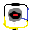
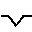

# Leonardo Pattern Design Software - Documentazione Dettagliata

**VERSIONE 3.1.0**

**CONCESSA A USO DIMOSTRATIVO**

Sviluppatore: LEONARDO GUASQUI  
Contatti: leonardo@guasqui.it  
Sito Web: www.guasqui.it  
Tutti i diritti riservati.

---

## INDICE

1. [Struttura del Software](#struttura-del-software)
2. [Gestione Licenza](#1-gestione-licenza)
3. [Elaborazione Pezzi AAMA](#2-elaborazione-pezzi-aama)
4. [Gestione Testo e Attributi](#3-gestione-testo-e-attributi)
5. [Inserimento Blocchi e Simboli](#4-inserimento-blocchi-e-simboli)
6. [Disegno Geometrico](#5-disegno-geometrico)
7. [Gestione Dati Pezzi](#6-gestione-dati-pezzi)
8. [Estrazione Modaris](#7-estrazione-modaris)
9. [Modifica Avanzata](#8-modifica-avanzata)
10. [Utilità e Calcolo](#9-utilità-e-calcolo)
11. [Gestione Polilinee](#10-gestione-polilinee)
12. [Preparazione Stampa e Nesting](#11-preparazione-stampa-e-nesting)
13. [Gestione Tacche](#12-gestione-tacche)
14. [Gestione Layer e Colori](#13-gestione-layer-e-colori)
15. [Gestione Offset](#14-gestione-offset)
16. [Scorciatoie da Tastiera](#scorciatoie-da-tastiera)
17. [Configurazione](#configurazione)

---

## Compatibilità

Leonardo Pattern Design Software è stato sviluppato principalmente per funzionare in ambiente **ZWCAD**, dove offre piena compatibilità e integrazione con tutti i comandi specifici del programma. Questo garantisce un'esperienza utente fluida e accesso a funzionalità avanzate che potrebbero non essere disponibili in altre piattaforme.

Tuttavia, il software può essere installato e utilizzato anche su **AutoCAD**. In questo caso, la compatibilità è **parziale**. Alcune funzionalità specifiche, specialmente quelle legate a comandi ZWCAD proprietari o a interazioni molto specifiche con l'interfaccia, potrebbero non funzionare correttamente o presentare comportamenti diversi. Si consiglia di testare le funzionalità chiave in un ambiente AutoCAD prima di utilizzare il software in produzione.

---

## 1. GESTIONE LICENZA

La gestione della licenza è un aspetto fondamentale del software. Senza una licenza valida, il software non funzionerà correttamente. Questa sezione descrive i comandi necessari per attivare, verificare e gestire lo stato della licenza.

### Dettagli Tecnici del Sistema di Licenza

Il sistema di licenza implementa un algoritmo di cifratura avanzato:

- **ID Sistema**: Generato tramite hash delle variabili d'ambiente (`PROCESSOR_IDENTIFIER`, `COMPUTERNAME`, `USERPROFILE`)
- **Codice Licenza**: Stringa di 10 caratteri utilizzando il charset "gsqlrd491c"
- **Algoritmo**:
  - Matrice di trasformazione creata dall'ID macchina
  - Token base (`gsqlrd491c`) trasformato due volte con matrici diverse
  - Cifratura finale salvata con shift +7 in `C:/Leonardo/license.dat`
- **Validazione**: Il codice inserito deve corrispondere esattamente al codice calcolato per l'ID macchina

| Comando | Icona | Descrizione |
|---------|-------|-------------|
| `c:activate-license` |  | Avvia il processo per attivare la tua licenza software. Questo comando richiederà il codice di attivazione fornito dallo sviluppatore. |
| `c:show-system-id` |  | Visualizza l'identificativo unico del tuo sistema, utile per il supporto. Questo ID è necessario per ottenere il codice di attivazione. |
| `c:reset-license` |  | Resetta lo stato della licenza (utilizzato solo per scopi di diagnostica). Questo comando dovrebbe essere utilizzato solo su richiesta dello sviluppatore. |

---

## 2. ELABORAZIONE PEZZI AAMA

I comandi in questa sezione sono centrali per il processo di preparazione dei pezzi per il nesting e la produzione.Questi comandi sono progettati per convertire le sagome grezze in pezzi pronti per le macchine da taglio o plotter.

### Processori AAMA Principali

| Comando | Icona | Descrizione |
|---------|-------|-------------|
| `c:aama` |  | **Processore principale AAMA**. Workflow tecnico: 1. Seleziona polilinee sui layer `ENDCUT`, `OUTCUT`, `TAVOLA_DI_STAMPA_TAGLIO`, `TAVOLA_DI_STAMPA`, `PIT_DIS_TA_CONT`, `PIT_DIS_AREA` 2. Estrae dati dai blocchi PITDATIT/DATIT (attributo `TESTO1` = nome pezzo) 3. Estrae materiale da PITDATIM/DATIM (attributi `MATERIALE`, `NPEZZI`, `TIPOLOGIA`) 4. Rimuove prefissi materiale (I-, A-, D-, F-) 5. Gestisce layer speciali: 201 (drill1/giallo), 202 (drill2/verde), 100 (drillp/ciano), 90 (proiezione/fucsia), 91 (marcatura/ciano) 6. Crea testo formato: `@NOME;MATERIALE[QTA]TIPOLOGIA` 7. Genera blocco con nome random e lo sposta su layer 1 8. Esporta in DXF includendo tutti i layer (1, 11, 201, 202, 100, 90, 91) |
| `c:aamar` |  | Processa le sagome di "RIFILO" applicando un materiale standard. Questo comando è specifico per i pezzi di rifilo. Estrae la geometria e applica automaticamente un materiale standard precedentemente definito. |
| `c:Modaris-AAMA` |  | Elabora i blocchi Modaris v3.0 e li converte in elaborabili. Questo comando è pensato per integrare i dati provenienti da sistemi CAD Modaris, estraendone le informazioni e preparandole per il flusso AAMA. |

### Comandi RIFILO

I comandi specifici per la gestione dei pezzi di RIFILO consentono di applicare standard uniformi. Questi comandi sono strettamente legati al comando `c:aamar` e consentono di definire i valori standard da applicare.

| Comando | Descrizione |
|---------|-------------|
| `c:aamar_material` | Imposta il materiale standard per le sagome RIFILO. Questo valore verrà applicato automaticamente dal comando `c:aamar`. |
| `c:aamar_tipologia` | Imposta la tipologia standard per le sagome RIFILO. |
| `c:aamar_quantita` | Imposta la quantità standard per le sagome RIFILO. |
| `c:aamar_spacing` | Definisce la spaziatura tra i blocchi RIFILO. Questo valore influisce sull'output del comando `c:aama` quando vengono creati i blocchi. |
| `c:aamar_settings` | Visualizza le impostazioni correnti per i comandi RIFILO. Utile per controllare cosa è stato impostato. |

### Funzioni di Nesting

I comandi di nesting sono essenziali per posizionare i pezzi in modo efficiente sul materiale, minimizzando lo spreco. Il nesting è il processo di posizionamento ottimale delle sagome all'interno di un'area data (la tavola di materiale), tenendo conto di margini, rotazioni e spaziature.

| Comando | Icona | Descrizione |
|---------|-------|-------------|
| `c:nestinglinea` |  | Posiziona i pezzi in linea o su più righe, ordinandoli per dimensione. Utile per una disposizione manuale controllata. |
| `c:nesting1` |  | Esegue un nesting semplificato su una singola linea orizzontale. |
| `c:nestingarea` |  | Definisce un'area di lavoro temporanea per il nesting tramite un rettangolo. |
| `c:nesting3` |  | Esegue un nesting avanzato, gestendo l'overflow e creando nuove tavole se necessario. Questo è il comando principale per il nesting automatico. |
| `c:nesting` | | Esegue il nesting (posizionamento automatico) dei pezzi selezionati. |

### Altri Comandi di Elaborazione

| Comando | Icona | Descrizione |
|---------|-------|-------------|
| `c:DIMA` |  | Crea una dima da un layer specifico, applicando un offset. Utile per generare sagome di controllo o di base. |
| `c:geber` |  | Converte in batch i blocchi tacca in oggetti punto. |
| `c:set_geber_tolerance` |  | Imposta le tolleranze globali per la conversione delle tacche. |
| `c:ofi` |  | Esegue un offset "RINGRANO" (sposta l'originale su layer "0" e l'offset su "OUTCUT"). |
| `c:blocchi_in_punti` |  | Converte i blocchi "PitRTak" in oggetti punto. |

### Utilità AAMA

| Comando | Icona | Descrizione |
|---|---|---|
| `C:AAMA_ESTRAI` |  | Esporta tutti gli oggetti sul layer "1" in un file DXF e poi li cancella dal disegno corrente. |
| `C:drill1` |  | Sposta un PUNTO selezionato sul layer 201 (Giallo). |
| `C:drill2` |  | Sposta un PUNTO selezionato sul layer 202 (Verde). |
| `C:drillp` |  | Sposta un PUNTO selezionato sul layer 100 (Ciano). |
| `C:marcatura` |  | Sposta un oggetto selezionato sul layer 91 (Ciano). |
| `C:proiezione` |  | Sposta un oggetto selezionato sul layer 90 (Fucsia). |

---

## 3. GESTIONE TESTO E ATTRIBUTI

I comandi in questa sezione consentono di gestire il testo all'interno del disegno, allineandolo, ruotandolo e inserendo testi predefiniti. La gestione del testo è cruciale per etichettare i pezzi, indicare caratteristiche specifiche e fornire informazioni aggiuntive visibili nel disegno.

### Allineamento e Rotazione

| Comando | Icona | Descrizione |
|---------|-------|-------------|
| `c:ATC` |  | **Align Text to Curve v1.2** . Allinea dinamicamente testo a curve con controlli avanzati: • Compatibile con: Line, LWPolyline, 2D Polyline, 3D Polyline, Arc, Circle, Ellipse, Spline (anche nested) • **Controlli dinamici**: [+/-] offset incrementale, [O] offset esatto, [</>] rotazione ±45°, [R] rotazione esatta, [Y] toggle readability (anti-capovolgimento), [B] toggle background mask (solo MText) • **Parametri**: offset come fattore altezza testo, rotazione relativa alla curva, justification configurabile • **Settings**: Dialog DCL per configurare tipo oggetto (Text/MText), justification, offset factor, rotation, readability, background mask, multiple text mode • Salva configurazioni ` |
| `c:ZR` |  | Azzera la rotazione di testo, blocchi o MLeader. |
| `c:EDT` |  | Ruota il testo in base a un angolo definito da due punti. |

### Inserimento Testi Predefiniti (Diciture)

Questa serie di comandi consente di inserire rapidamente testi standard utilizzati frequentemente nel settore. Questi testi predefiniti sono memorizzati internamente e vengono inseriti come testo normale.

| Comando | Icona | Descrizione |
|---------|-------|-------------|
| `c:EDG` |  | Inserisce il testo predefinito "COSTOLA". |
| `c:FIL` |  | Inserisce il testo predefinito "FILO". |
| `c:SCA` |  | Inserisce il testo predefinito "SCARNIRE". |
| `c:SOT` |  | Inserisce il testo predefinito "SOTTOMETTITURA". |
| `c:RIM` |  | Inserisce il testo predefinito "RIMBOCCO". |
| `c:TAL` |  | Inserisce il testo predefinito "TALYN". |
| `c:SAL` |  | Inserisce il testo predefinito "SALPA". |
| `c:ANT` |  | Inserisce il testo predefinito "ANTISTRAPPO". |
| `c:BOM` |  | Inserisce il testo predefinito "BOMBATURA". |
| `c:RIN` |  | Inserisce il testo predefinito "RINFORZO". |
| `c:BOR` |  | Inserisce il testo predefinito "BORDATURA". |
| `c:VAL` |  | Inserisce il testo predefinito "VALIGIAIA". |
| `c:C5` |  | Inserisce il testo predefinito "CUC.ROV. 5MM". |
| `c:C5P` |  | Inserisce il testo predefinito "CUC.ROV. 5MM CON PIPING". |
| `c:C7` |  | Inserisce il testo predefinito "CUC.ROV. 7MM". |
| `c:C7P` |  | Inserisce il testo predefinito "CUC.ROV. 7MM CON PIPING". |

### Modifica Testi

| Comando | Icona | Descrizione |
|---------|-------|-------------|
| `c:chg` |  | Sostituisce una stringa di testo esistente con una nuova all'interno degli oggetti testo su una selezione multipla. |
| `c:TCASE` |  | Converte il testo selezionato in MAIUSCOLO o minuscolo o Titolo. |

---

## 4. INSERIMENTO BLOCCHI E SIMBOLI

Questa sezione raccoglie i comandi per l'inserimento rapido di blocchi standard utilizzati per indicare particolari, numerazioni e spessori. I blocchi sono oggetti complessi composti da geometria e attributi, e sono fondamentali per mantenere uno standard visivo e informativo nel disegno.

### Blocchi di Indicazione

| Comando | Icona | Descrizione |
|---------|-------|-------------|
| `c:VR` |  | Inserisce un blocco di indicazione "verticale" per indicare la direzione di resistenza materiale. |
| `c:OR` |  | Inserisce un blocco di indicazione "orizzontale". |
| `c:WAR` |  | Inserisce un blocco di "ATTENZIONE". |
| `c:EQ` |  | Inserisce un blocco per "EQUALIZZARE". |
| `c:TABT` |  | Inserisce un blocco per la "tabella_testi". |
| `c:PEL` |  | Inserisce un blocco per indicare "PELLE". |
| `c:FOD` |  | Inserisce un blocco per indicare "fodera". |

### Blocchi di Numerazione

| Comando | Icona | Descrizione |
|---------|-------|-------------|
| `c:conta` |  | Inserisce blocchi numerati in modo progressivo. |

### Altri Blocchi

| Comando | Icona | Descrizione |
|---------|-------|-------------|
| `c:NUM` |  | Inserisce un blocco per il numero dell'articolo. |
| `c:SPESSORE` |  | Inserisce un blocco per indicare lo spessore del materiale, con prefisso "SP.". |
| `c:LEO_FUST` |  | Inserisce indicazione dimensione foro. |

---

## 5. DISEGNO GEOMETRICO

I comandi in questa sezione facilitano la creazione di forme geometriche di base, utili per la creazione di tavole di stampa o per disegni ausiliari. Questi comandi semplificano la creazione di rettangoli standard, forme specifiche come trapezi o passanti, e linee con angolazioni fisse.

| Comando | Icona | Descrizione |
|---------|-------|-------------|
| `c:centro` |  | Disegna linee perfettamente verticale  |
| `c:LEORETTANGOLO` |  | Disegna un rettangolo definendo il punto di inserimento (centrale), la larghezza e l'altezza. |
| `c:LeoA3` |  | Disegna un rettangolo in formato A3 (297 x 420). |
| `c:LeoA4` |  | Disegna un rettangolo in formato A4 (210 x 297). |
| `c:LeoUM` |  | Disegna un rettangolo standard (650 x 950). |
| `c:LeoUM2` |  | Disegna un rettangolo standard (1300 x 950). |
| `c:LeoUM4` |  | Disegna un rettangolo standard (1300 x 1800). |
| `c:LeoRACRETT` |  | Disegna un rettangolo con angoli raccordati. |
| `c:Passante` |  | Calcola e disegna un passante per tracolla di lunghezza perfetta. |
| `c:TRAPI` |  | Disegna un trapezio definendo le basi e l'altezza. |
| `C:TRAPL` |  | Disegna un trapezio isoscele data la base inferiore, la base superiore e la lunghezza del lato obliquo. |
| `C:sar` |  | Disegna una freccia (Leader) e permette di riposizionarla dinamicamente. |
| `C:DUERETTANGOLI` | | Disegna due rettangoli collegati calcolando la distanza verticale in base alla *lunghezza della linea obliqua* inserita. |
| `C:DUERETTANGOLIRAC` | | Come `DUERETTANGOLI`, ma aggiunge raccordi (fillet) personalizzabili ai 4 angoli di connessione. |
| `C:FASCIAFIANCOMAX` | | Simile a `DUERETTANGOLI`, ma applica raccordi *massimi* (tangenti) solo agli angoli superiori. |
| `C:FASCIAFIANCOUI` |  | È la versione con interfaccia grafica (DCL) di `FASCIAFIANCOMAX`. |
| `C:DISEGNAFASCIAFIANCO` |  | Disegna due rettangoli collegati calcolando la geometria basandosi sulla *lunghezza dell'arco* di connessione. |
| `C:FASCIAFIANCOextUI` |  | È la versione con interfaccia grafica (DCL) di `DISEGNAFASCIAFIANCO`. |

---

## 6. GESTIONE DATI PEZZI

Questa sezione è dedicata all'inserimento e alla modifica dei dati principali associati ai pezzi, come nome e materiale. Questi dati sono fondamentali per la produzione e per il calcolo dei consumi.

### Inserimento Dati

| Comando | Icona | Descrizione |
|---------|-------|-------------|
| `c:MAT` |  | Apre una finestra di dialogo per inserire il materiale. |
| `c:NOM` |  | **Dialog composizione nome pezzo** (file: `Nome_pezzo.lsp` + `Nome_pezzo.DCL`): • **3 liste popup**: Nome1.txt (es. RINF., NETTO, SBOZZO, FORMA, DIMA, FUSTELLA), Nome2.txt (es. QUADRANTE, FIANCO, FONDO, TASCA, PATTINA), Nome3.txt (es. DAVANTI, DIETRO, INTERNO, ESTERNO) • **Opzione input manuale**: Checkbox per bypassare le liste e digitare nome completo • **Output**: Inserisce blocco `DATIT` con attributi (TIPOLOGIA="", TESTO1=nome_composto, IDFISSO=1, CODICE="0000", NU1-7=0) • **File dati**: `C:/LEONARDO/Common/Nome1.txt`, `Nome2.txt`, `Nome3.txt` (caricati dinamicamente, fallback su valori default) |
| `c:NUM` |  | Inserisce il numero dell'articolo. |
| `c:SPESSORE` |  | Inserisce lo spessore del materiale. |

### Modifica Dati

| Comando | Icona | Descrizione |
|---------|-------|-------------|
| `c:ED-MAT` |  | Modifica il materiale, la quantità e la tipologia ( valido per x articoli) di un materiale tramite una finestra di dialogo. |
| `c:ED-NOM` |  | Modifica il nome del pezzo tramite una finestra di dialogo. |
| `c:ED-MATERIALE` |  | Modifica rapidamente la quantità e la tipologia di un materiale. |
| `c:ED-INFUST` |  | Aggiunge il prefisso "Infustitura" al nome del pezzo. |
| `c:ED-FOD` |  | Aggiunge il prefisso "Fodera" al nome del pezzo. |
| `c:ED-RIF` |  | Aggiunge il prefisso "Rifilo" al nome del pezzo. |
| `c:ED-SBOZ` |  | Aggiunge il prefisso "Taglio" al nome del pezzo. |

---

## 7. ESTRAZIONE MODARIS

I comandi in questa sezione sono specifici per l'elaborazione e l'estrazione di dati da blocchi Modaris. Modaris è un sistema CAD leader nel settore calzaturiero e pellettiero, e questi comandi permettono di importare e convertire i dati in un formato compatibile con il flusso di lavoro di Leonardo.

| Comando | Icona | Descrizione |
|---------|-------|-------------|
| `c:CONP` |  | Calcola il centroide delle polilinee sul layer "0" e inserisce un punto. |
| `c:CONP_C` |  | Converte i cerchi sul layer "0" in punti al loro centro. |
| `c:estrai-multipli` |  | Esegue l'estrazione in batch, inserendo DATIT/DATIM, esplodendo e pulendo gli attributi. |
| `c:estrai-singolo` |  | Esegue l'estrazione di un singolo blocco con pulizia completa. |

---

## 8. MODIFICA AVANZATA

Questa sezione contiene comandi per operazioni di modifica complesse, come la selezione concatenata, il taglio avanzato e la gestione dei gap. Questi strumenti sono utili per correggere e ottimizzare la geometria del disegno.

| Comando | Icona | Descrizione |
|---------|-------|-------------|
| `c:CS` |  | **Chain Selection v1.1** . Selezione concatenata intelligente: • Seleziona automaticamente tutti gli oggetti connessi per endpoint (tolleranza 1e-8) • Compatibile con: Line, Arc, LWPolyline aperta, Spline aperta, 2D Polyline aperta, Elliptical Arc • Esclude automaticamente layer congelati, bloccati o spenti • |
| `c:CookieCutter2` |  | **Cookie Cutter v1.2** (by Joe Burke). Trim avanzato con esplosione automatica: • Trim object: Circle, Polyline chiusa, Ellipse chiusa, Spline chiusa • **Workflow**: 1) Verifica self-intersection (tramite AddRegion test), 2) Offset interno/esterno per determinare lato trim, 3) Esplode automaticamente blocchi/hatches/regioni intersecanti, 4) Opzione "Erase all inside/outside" per eliminazione completa • **Gestione hatch solidi**: prompt per convertire in ANSI31 pattern con scala auto-calcolata • **Trim ricorsivo**: taglia anche oggetti generati dal trim precedente • Nasconde xref, ignora oggetti annotation (text, dimensions, leaders, tables) |
| `c:RACCORDA_0` |  | Raccorda due entità con un raggio di 0. |
| `c:SPEZZA_PUNTO` |  | Interrompe una linea, polilinea o arco nel punto selezionato. |
| `c:splitcir` |  | Interrompe un cerchio e lo trasforma in polilinea  |
| `c:TROVA_GAP` |  | Cerca i gap ( misure molto piccole fra le quali due linee non si toccano ma dovrebbero farlo) tra le entità selezionate e disegna un cerchio sul layer "GAP" per una facile individuazione. |
| `c:QM` |  | Esegue uno specchia rapido degli oggetti. |
| `C:BLOCCO_RAPIDO` |  | Crea rapidamente un blocco con un nome casuale dagli oggetti selezionati e lo inserisce. |
| `C:cbp` |  | Cambia il Punto Base di una definizione di blocco senza modificare la posizione degli inserimenti esistenti. |
| `C:cbpr` |  | Cambia il Punto Base di un blocco e Riloca tutti gli inserimenti per mantenere la loro posizione visiva. |
| `C:pell` | | Alias per `el2pl` (converte Ellissi in Polilinee). |
| `C:test-multipli` | | Alias per `MA-test`, testa gli attributi dei blocchi Modaris. |

---

## 9. UTILITÀ E CALCOLO

I comandi in questa sezione offrono funzionalità di utilità generale e calcolo, come la gestione del archivio materiali e il calcolo dei consumi. Questi strumenti sono essenziali per la pianificazione della produzione e la gestione dei costi.

| Comando | Icona | Descrizione |
|---------|-------|-------------|
| `c:HexDecConverter` |  | Converte il testo tra formato esadecimale (0x) e decimale. |
| `c:font_test` |  | Crea righe di testo per testare i font .shx da una directory. |
| `c:gestmat` |  | Gestisce le liste dei materiali tramite un'interfaccia a finestra di dialogo. |
| `c:gnames` |  | Gestisce le liste dei nomi dei pezzi (Nome1/2/3.txt) tramite una finestra di dialogo. |
| `c:NOG` |  | **Calcolo Consumi Materiali v7**. Sistema avanzato di calcolo con configurazione per categoria: • **File configurazione**: `nog_config.txt` (formato: `Categoria;Offset;ScartoSagoma%;ScartoTotale%;ScartoGlobale%`) • **Categorie standard**: A-Pelle, I-Infustiture, D-Tele, F-Fodere, G-Accessori, Altri • **Metodo calcolo**: Bounding Box (rettangolo di delimitazione) invece di area reale polilinea • **Parametri per categoria**: Offset (mm), Scarto Sagoma %, Scarto Totale %, Scarto Globale % • **Formula**: `ConsumoFinale = (Area + 2×Offset)² × Quantità × (1+ScartoSagoma%) × (1+ScartoTotale%) / Tipologia × NumPezzi × (1+ScartoGlobale%)` • **Output CSV**: Formato italiano (virgola decimale), colonne: Categoria, Materiale, Componente, Unità, Qtà, Area Orig, Area Offset, Offset, Scarto Sagoma, Scarto Totale, Scarto Globale, Tipologia, Larghezza/Altezza (orig e offset), Consumi vari, Consumo Totale • Gestisce attributi TIPOLOGIA per divisione consumi (es. 2 pezzi da stesso taglio) |
| `c:NOG-CONFIG` | | Modifica la configurazione generale per il calcolo dei consumi (per categorie di materiale). |
| `c:NOG-ADDMAT` | | Aggiunge o aggiorna i parametri di un materiale specifico (per nome completo). |
| `c:sostmat` |  | Sostituisce il materiale in batch, mantenendo quantità e tipologia. |
| `c:mat1` |  | Visualizza e zooma sui pezzi in base al materiale selezionato. |
| `c:mat1-get` | | Seleziona tutti i blocchi con un materiale specifico. |
| `C:NOGG` |  | Versione alternativa di `NOG` che calcola l'area geometrica *reale* della polilinea e applica un offset geometrico. |
| `C:seleziona-permat` |  | Seleziona (evidenzia) tutte le sagome associate a un materiale specifico. |
| `C:perp2ent` |  | Disegna linee perpendicolari da un punto selezionato a un'entità. |
| `C:inizializza` |  | Carica le librerie `.dll` esterne (cercafust.dll, quadrantearchi.dll, fasciafiancofondo.dll). |

---

## 10. GESTIONE POLILINEE

Questa sezione raccoglie i comandi per la gestione, l'unione, la conversione e la visualizzazione delle direzioni delle polilinee. Le polilinee sono l'elemento geometrico base per rappresentare i contorni dei pezzi.

### Selezione e Unione

| Comando | Icona | Descrizione |
|---------|-------|-------------|
| `c:leo-poliauto` |  | Esegue una selezione concatenata con unione automatica delle polilinee. |
| `c:JoinAll` |  | Unisce linee, archi e polilinee. |
| `c:PC` |  | Chiude le polilaperte. |
| `c:PJ` |  | Unisce linee, archi e polilinee. |
| `c:Y` |  | Filtra e congiunge linee e archi in polilinee leggere. |
| `C:pljoinfuzz` |  | Congiunge (Join) polilinee, linee e archi che sono vicini (entro una tolleranza), anche se non si toccano. |

### Conversione

| Comando | Icona | Descrizione |
|---------|-------|-------------|
| `c:el2pl` |  | Converte un'ellisse o un arco ellittico in una polilinea. |
| `c:s2p` |  | Converte una spline in polilinee, definendo il numero di segmenti. |

### Direzione e Visualizzazione

| Comando | Icona | Descrizione |
|---------|-------|-------------|
| `c:PLDREV_SETCOLOR` |  | Imposta colore frecce direzione (1-7: Rosso, Giallo, Verde, Ciano, Blu, Magenta, Bianco). Default: 4 (Ciano) |
| `c:PLDREV_SETPOS` |  | Imposta posizione frecce: [Interne/Esterne]. Default: Esterne |
| `c:PLD` |  | **Visualizzazione e inversione direzione polilinea**: • **Marcatore inizio**: X + Quadrato sul punto di partenza (param 0) • **Frecce direzione**: Visualizzate lungo la polilinea con offset proporzionale a VIEWSIZE/12 • **Algoritmo rotazione**: Calcola area signed (Shoelace formula). Se area < 0 → rotazione oraria (+1), altrimenti antioraria (-1) • **Inversione LWPOLYLINE**: Riordina vertici (coordinate), inverte bulge (cambia segno e ordine) • **Gestione archi**: Ogni arco (bulge≠0) viene tracciato con suddivisione angolare (2.5° per segmento) • Prompt: [S/N] per confermare inversione |
| `c:PLDREV_SHOW_DIRECTION` |  | Alias di `c:PLD` - Mostra direzione e punto inizio con frecce dinamiche |
| `c:RvrsLine` |  | Inverte la direzione di linee, polilinee o LWPolyline (stessa logica di PLD ma senza visualizzazione) |

---

## 11. PREPARAZIONE STAMPA E NESTING

I comandi in questa sezione sono dedicati alla preparazione dei disegni per la stampa o per il nesting, inclusa la creazione di sbozzi e tavole. Questa è la fase finale del processo di design, dove i pezzi vengono organizzati per la produzione.

### Preparazione Sbozzi

| Comando | Icona | Descrizione |
|---------|-------|-------------|
| `c:SBOZZO` |  | Crea uno sbozzo: cancella le tacche, applica un offset alla polilinea e sposta su OUTCUT. |
| `c:CopyArray` |  | Crea un array rettangolare con sbozzo e un bounding box complessivo. |
| `c:SBOZZO_BOUND` |  | Disegna un bounding box rettangolare per le polilinee. |
| `c:SBOZZO_RETT` |  | Crea un bounding box, applica un offset e avvia il processo di NESTING3. |

### Tavole di Stampa

| Comando | Icona | Descrizione |
|---------|-------|-------------|
| `c:PRESTAMPA` |  | Prepara le polilinee sul layer "TAVOLA_DI_STAMPA_TAGLIO" e crea blocchi con centroide. |
| `c:TAVOLA_DI_STAMPA_ANTIBUG` |  | Prepara le sagome e avvia il processo di NESTING3. |
| `c:TAVOLA_DI_STAMPA_A3` |  | Prepara le sagome per il formato A3 e avvia il processo di NESTING3. |

---

## 12. GESTIONE TACCHE

Questa sezione è interamente dedicata alla gestione delle tacche, inclusi inserimento, copia, modifica e conversione. Le tacche sono elementi cruciali per l'assemblaggio dei pezzi.

### Inserimento e Copia Tacche

**File:** `inserisci_tacca.lsp`, `tacca_da_misura.lsp`, `tacca_dapoli.lsp`, `copia_tacche.lsp`, `misuratrt.lsp`

| Comando | File | Icona | Descrizione |
|---------|------|-------|-------------|
| `c:INSERISCI_TACCA` | inserisci_tacca.lsp |  | Inserisce blocco tacca sulla polilinea con orientamento automatico: • Prompt scelta [I]nterna o [E]sterna (default Interna) • **Algoritmo orientamento**: Calcola `vlax-curve-getfirstderiv` (tangente) al punto closest sulla curva, poi applica rotazione di 180° (π) per tacche interne, 0° per esterne • Loop continuo fino a ESC • Blocco utilizzato: `"tacca"` con scala 1 |
| `c:tacca_da_misura` | tacca_da_misura.lsp |  | Inserisce tacca a distanza specifica da punto partenza |
| `c:tacca_dapoli` | tacca_dapoli.lsp |  | Copia distanza tra due punti su polilinea sorgente e inserisce tacca su destinazione |
| `c:COPIA_TACCHE` | copia_tacche.lsp |  | Copia tacche da polilinea sorgente a destinazione |
| `c:MISURATRT` | misuratrt.lsp |  | Misura tratto su polilinea e inserisce valore come testo |

### Modifica Tacche

**File:** `inverti tacca.lsp`, `ribalta tacca.lsp`, `riposiziona_tacche.lsp`, `METTI_V.lsp`

| Comando | File | Icona | Descrizione |
|---------|------|-------|-------------|
| `c:TACCA_RIBALTA` | ribalta tacca.lsp |  | Ribalta direzione tacche selezionate |
| `c:riposiziona_tacche` | riposiziona_tacche.lsp |  | Riposiziona tacche su nuova polilinea |
| `c:METTI_V` | METTI_V.lsp |  | Inserisce rientranza a 'V' su polilinea |
| `C:Dima_tacche_atom` | dima_tacche_atom.lsp | | Crea una dima (offset) e converte i blocchi "tacca" in intagli a V sulla polilinea esterna. |
| `C:TACCA` | TACCA.lsp | | Comando principale per inserire tacche (a distanze multiple o copiando posizioni). |
| `C:INSERISCI_BLOCCHI` | inserisci_blocchi_distanza.lsp |  | Inserisce un blocco più volte lungo una polilinea a una distanza specifica, orientandolo automaticamente. |
| `C:METTI_V_AUTO` | METTI_V_AUTO.lsp |  | Trova automaticamente tutti i blocchi "tacca" vicini a una polilinea e li sostituisce con intagli a V. |
| `C:ribalta_tacche` | ribalta_tacche.lsp |  | Ruota (ribalta) i blocchi "tacca" selezionati di 180 gradi. |

### Conversione Tacche

**File:** `sostituisci tacche.lsp`

| Comando | Icona | Descrizione |
|---------|-------|-------------|
| `c:sostituisci_tacche` |  | **Menu principale conversioni**. Prompt: `[T]acche=>tagliate, t[A]gliate=>tacche, p[U]nti=>tacche, tacche=>[P]unti, [M]ozart=>standard, standard=>moza[R]t` • Algoritmo comune: 1) Seleziona blocchi sorgente (filter su nome blocco), 2) Seleziona polilinea target, 3) Per ogni blocco: trova punto closest su polilinea, calcola first derivative per orientamento, inserisce nuovo blocco con rotazione calcolata, elimina vecchio blocco |
| `c:tacche_in_tagliate` |  | Converte `"tacca"` → `"tacca_t"` (rotazione +180°) |
| `c:tagliate_in_tacche` |  | Converte `"tacca_t"` → `"tacca"` (rotazione +180°) |
| `c:tacche_in_punti` |  | Converte `"tacca"` → oggetto POINT (elimina blocco) |
| `c:punti_in_tacche` |  | Converte POINT → `"tacca"` (rotazione +180°, elimina punto) |
| `c:mozart_in_tacche` |  | Converte `"PitTacCT"` (Mozart) → `"tacca"` (rotazione +180°) |
| `c:tacche_in_mozart` |  | Converte `"tacca"` → `"PitTacCT"` (Mozart, rotazione +90°) |

---

## 13. GESTIONE LAYER E COLORI

I comandi in questa sezione semplificano lo spostamento degli oggetti su layer specifici e la modifica rapida del colore. La gestione dei layer e dei colori è fondamentale per mantenere l'ordine e la chiarezza del disegno.

### Gestione Layer di Taglio

**File:** `DEFLINEA.LSP`

Tutti i comandi operano su **oggetti pre-selezionati** (utilizzo di `ssgetfirst` per ottenere la selezione corrente).

| Comando | Icona | Descrizione | Layer | Colore |
|---------|-------|-------------|-------|--------|
| `c:ENDCUT` |  | Sposta oggetti pre-selezionati su layer taglio rifilo. **Tecnica**: Usa `_chprop` per cambiare Layer → ENDCUT e Color → BYLAYER | ENDCUT | 4 (Ciano) |
| `c:OUTCUT` |  | Sposta oggetti pre-selezionati su layer taglio esterno/perimetro | OUTCUT | 1 (Rosso) |
| `c:INTCUT` |  | Sposta oggetti pre-selezionati su layer taglio interno (fori, finestre) | INTCUT | 5 (Blu) |
| `c:PENNA` |  | Ripristina oggetti pre-selezionati su layer "0" (disegno/costruzione) con colore BYLAYER | 0 | BYLAYER |

**Inizializzazione automatica**: I layer ENDCUT, OUTCUT, INTCUT, TAVOLA_DI_STAMPA, TAVOLA_DI_STAMPA_TAGLIO vengono creati automaticamente all'avvio se non esistono, con i colori standard assegnati.

### Gestione Colori Rapida

| Comando | Icona | Descrizione | Colore ACI |
|---------|-------|-------------|------------|
| `c:BBB` |  | Cambia colore oggetto in Bianco/Nero e sposta su layer "0" | 254 |
| `c:GGG` |  | Cambia colore oggetto in Giallo e sposta su layer "0" | 2 |
| `c:AAA` |  | Cambia colore oggetto in Arancio e sposta su layer "0" | 30 |
| `c:VVV` |  | Cambia colore oggetto in Verde e sposta su layer "0" | 3 |
| `c:FFF` |  | Cambia colore oggetto in Fucsia/Magenta e sposta su layer "0" | 6 |

**Nota:** Tutti i comandi operano sugli oggetti pre-selezionati.

---

## 14. GESTIONE OFFSET

I comandi in questa sezione applicano offset con tipi di linea specifici, particolarmente utili per le linee di cucitura. L'offset è una tecnica fondamentale per creare sagome di controllo o linee di cucitura parallele.

### Offset con Tipo Linea

| Comando | Icona | Descrizione |
|---------|-------|-------------|
| `c:oft_2` |  | Offset 2 unità con tipo linea CUCITURA (scala 0.3) |
| `c:oft_3` |  | Offset 3 unità con tipo linea CUCITURA |
| `c:oft_4` |  | Offset 4 unità con tipo linea CUCITURA |
| `c:oft_5` |  | Offset 5 unità con tipo linea CUCITURA |
| `c:oft_6` |  | Offset 6 unità con tipo linea CUCITURA |
| `c:oft_8` |  | Offset 8 unità con tipo linea CUCITURA |
| `c:oft_10` |  | Offset 10 unità con tipo linea CUCITURA |
| `c:oft` |  | Offset distanza personalizzata con tipo linea CUCITURA |

### Gestione Tipo Linea

| Comando | Icona | Descrizione |
|---------|-------|-------------|
| `c:CUCITURA` |  | Imposta tipo linea CUCITURA (layer 0, scala 0.3) |
| `c:CONTINUA` |  | Ripristina tipo linea BYLAYER (continuo) |

---

## SCORCIATOIE DA TASTIERA

Per visualizzare tutte le scorciatoie, digitare **ALIASEDIT** nella riga di comando.

### Scorciatoie Principali

| Tasto | Comando | Descrizione |
|-------|---------|-------------|
| **Q** | ALIGN | Allinea |
| **QQ** | DIMLINEAR | Quota lineare |
| **W** | TRIM | Taglia (con SHIFT estende) |
| **E** | EXPLODE | Esplodi |
| **ES** | EXTEND | Estendi |
| **EP** | PEDIT | Edita polilinea |
| **EX** | EXTRIM | Taglio esterno/interno a polilinea |
| **R** | FILLET | Raccorda |
| **RA** | FILLETRAD | Imposta raggio raccordo |
| **RR** | ROTATE | Ruota |
| **RT** | RECTANG | Rettangolo |
| **T** | TEXT | Testo |
| **TT** | INSERISCI_TACCA | Inserisci tacca |
| **Y** | PJ | Creazione polilinea |
| **O** | OFFSET | Offset |
| **PL** | PLINE | Polilinea |
| **PC** | PC | Chiudi polilinea |
| **A** | ARC | Arco |
| **S** | MOVE | Sposta |
| **SS** | SELECTSIMILAR | Seleziona simili |
| **SC** | SCALE | Scala |
| **SAR** | SAR | Disegna freccia |
| **SAL** | SAL | Inserisce testo "SALPA" |
| **D** | ERASE | Cancella |
| **F** | MIRROR | Specchia |
| **G** | COPY | Copia |
| **H** | SPEZZA_PUNTO | Spezza nel punto |
| **L** | LINE | Linea |
| **Z** | POINT | Punto |
| **X** | MATCHPROP | Copia proprietà |
| **XL** | XLINE | Linea infinita |
| **C** | CIRCLE | Cerchio |
| **CS** | CS | Chain Selection |
| **CP** | PC | Chiudi polilinea |
| **MT** | MTEXT | Testo multilinea |
| **BR** | BLOCCO_RAPIDO | Blocco rapido |

### Scorciatoie Colori

| Tasto | Comando | Colore |
|-------|---------|--------|
| **AAA** | AAA | Arancio (30) |
| **BBB** | BBB | Bianco (254) |
| **FFF** | FFF | Fucsia (6) |
| **GGG** | GGG | Giallo (2) |
| **VVV** | VVV | Verde (3) |

### Scorciatoie Layer

| Tasto | Comando | Descrizione |
|-------|---------|-------------|
| **V** | INTCUT | Taglio interno |
| **B** | OUTCUT | Taglio rifilo |
| **N** | PENNA | Penna (layer "0") |
| **M** | ENDCUT | Linea di taglio |

### Scorciatoie Dati Pezzi

| Tasto | Comando | Descrizione |
|-------|---------|-------------|
| **NN** | NOM | Nome pezzo |
| **MM** | MAT | Materiale |

### Scorciatoie Cucitura

| Tasto | Comando | Descrizione |
|-------|---------|-------------|
| **C5** | C5 | Testo "CUC.ROV.5MM" |
| **C5P** | C5P | Testo "CUC.ROV.5MM CON PIPING" |
| **C7** | C7 | Testo "CUC.ROV.7MM" |
| **C7P** | C7P | Testo "CUC.ROV.7MM CON PIPING" |

### Acceleratori (Ctrl+Tasto)

| Combinazione | Comando | Descrizione |
|-------------|---------|-------------|
| **Ctrl+Q** | DIMALIGNED | Quota allineata |
| **Ctrl+E** | EXTEND | Estendi |
| **Ctrl+W** | TRIM | Taglia |

### Tasti Funzione

| Tasto | Comando | Descrizione |
|-------|---------|-------------|
| **F5** | CONTINUA | Linea continua |
| **F6** | CUCITURA | Cucitura |

---

## CONFIGURAZIONE

### File di Configurazione

**Directory:** `LEONARDO/INSTALLAZIONE/common/`

| File | Descrizione |
|------|-------------|
| `Pelle.txt` | Lista materiali in pelle |
| `Nome1.txt` | Lista nomi predefiniti - Gruppo 1 |
| `Nome2.txt` | Lista nomi predefiniti - Gruppo 2 |
| `Nome3.txt` | Lista nomi predefiniti - Gruppo 3 |
| `nog_config.txt` | Configurazione calcolo consumi materiali |
| `license.dat` | File licenza (generato automaticamente) |

**Directory:** `LEONARDO/INSTALLAZIONE/menu/LEONARDO/`

| File | Tipo | Descrizione |
|------|------|-------------|
| `LEONARDO 0.mns` | Menu Sorgente | File menu editabile (25.257 bytes) |
| `LEONARDO 0.menuc` | Menu Compilato | File menu compilato (26.773 bytes) |
| `LEONARDO 0.menur` | Menu Risorsa | Risorse menu - icone (647.906 bytes) |

---

## RIEPILOGO COMANDI

### Totale Comandi per Categoria

- **Gestione Licenza:** 3 comandi
- **Elaborazione Pezzi AAMA:** 35 comandi
- **Gestione Testo:** 21 comandi
- **Inserimento Blocchi:** 11 comandi
- **Disegno Geometrico:** 18 comandi
- **Gestione Dati Pezzi:** 12 comandi
- **Estrazione Modaris:** 4 comandi
- **Modifica Avanzata:** 13 comandi
- **Utilità e Calcolo:** 14 comandi
- **Gestione Polilinee:** 14 comandi
- **Preparazione Stampa:** 7 comandi
- **Gestione Tacche:** 23 comandi
- **Gestione Layer e Colori:** 9 comandi
- **Gestione Offset:** 10 comandi

**TOTALE COMANDI DOCUMENTATI:** 194 comandi

---

## COMPATIBILITÀ ZWCAD

Il menu include riferimenti a comandi specifici ZWCAD:

- **ZWRC_ARCSER**, **ZWRC_ARCCON** (archi)
- **ZWRC_SN2BCK** (porta dietro)
- **ZWRC_BREAKATPT** (spezza in punto)
- **ZWRC_POLYGO**, **ZWRC_RECTAN** (forme base)
- **ZWRC_LIST**, **ZWRC_DIST**, **ZWRC_AREA** (interrogazione)
- **ZWRC_IMGATT** (immagini)

---

## CONCLUSIONI

Leonardo Pattern Design Software è un sistema completo per il design di pattern nel settore calzaturiero e pellettiero, con oltre 194 comandi specializzati, interfacce intuitive e piena compatibilità con i principali software CAD.

### Supporto Tecnico

**Email:** leonardo@guasqui.it  
**Sito Web:** www.guasqui.it

---

## NOTE TECNICHE IMPLEMENTATIVE

### Architettura File

**Struttura cartelle wolfang/core/**:
- `blocchi e testo/` - Gestione testo, blocchi, diciture
- `disegna/` - Forme geometriche, rettangoli, trapezi, passanti
- `inserimenti materiale e diciture/` - Dialog DCL per materiale e nome pezzo
- `modifica/` - Chain selection, cookie cutter, gap detection, quick mirror
- `plugin/` - AAMA, consumi (NOG), gestione materiali, conversioni
- `polilinea/` - Join, close, direzione, conversione ellipse/spline
- `stampa/` - Nesting, sbozzo, tavole di stampa, dime
- `tacche/` - Inserimento, copia, conversione, riposizionamento tacche
- `tipolinea/` - Gestione layer (ENDCUT/OUTCUT/INTCUT), offset con tipo linea

### Convenzioni Codifica

**Nomi blocchi standard**:
- `DATIT` / `PITDATIT` - Blocco nome pezzo (attributo TESTO1)
- `DATIM` / `PITDATIM` - Blocco materiale (attributi MATERIALE, NPEZZI, TIPOLOGIA)
- `tacca` - Tacca standard interna
- `tacca_t` - Tacca tagliata
- `PitTacCT` - Tacca formato Mozart
- `PitRTak` - Tacca formato generico

**Layer standard**:
- Layer `0` - Disegno/costruzione
- Layer `1` - Output processato AAMA
- Layer `11` - Tagli interni processati
- Layer `201`, `202`, `100` - Punti drill (giallo, verde, ciano)
- Layer `90`, `91` - Proiezione (fucsia), Marcatura (ciano)
- Layer `ENDCUT` (4-ciano), `OUTCUT` (1-rosso), `INTCUT` (5-blu)
- Layer `TAVOLA_DI_STAMPA`, `TAVOLA_DI_STAMPA_TAGLIO`

**Prefissi materiali**:
- `A-` Pelle (rimosso da AAMA)
- `I-` Infustiture (rimosso da AAMA)
- `D-` Tele (rimosso da AAMA)
- `F-` Fodere (rimosso da AAMA)
- `G-` Accessori

### Algoritmi Chiave

**Orientamento tacche**: Usa `vlax-curve-getfirstderiv` per calcolare tangente alla curva, poi applica rotazione base (0° o 180°)

**Direzione polilinea**: Shoelace formula per calcolare area signed, segno determina rotazione (CW/CCW)

**Bounding box consumi**: Usa rettangolo di delimitazione invece di area reale per calcolo più conservativo

**Chain selection**: Tolleranza 1e-8 per confronto punti floating point

**Cookie cutter offset**: Distanza offset = (diagonal bounding box) / 1500, con divisione ulteriore /12 se unità decimali

### Dipendenze Esterne

**Librerie .dll** (opzionali):
- `cercafust.dll` - Ricerca fustelle
- `quadrantearchi.dll` - Gestione quadranti archi
- `fasciafiancofondo.dll` - Calcolo geometria fascia fianco

**File configurazione**:
- `C:/Leonardo/license.dat` - Licenza (cifrata)
- `C:/LEONARDO/Common/Pelle.txt` - Lista materiali pelle
- `C:/LEONARDO/Common/Nome1.txt`, `Nome2.txt`, `Nome3.txt` - Nomi pezzi
- `{DWGPREFIX}/nog_config.txt` - Configurazione consumi
- `{Support}/LMAC_ATC_V1-2.cfg` - Configurazione Align Text to Curve

---

**Tutti i diritti riservati - Leonardo Guasqui**
**Versione documento:** Definitiva per GitHub (con dettagli tecnici implementativi)
**Versione software:** 3.1.0
**Data ultima revisione:** 2025
