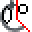

# Leonardo Pattern Design - Guida Utente

**Per Pellettieri e Modellisti**

**Versione**: 3.1.0
**Autore**: Leonardo Guasqui
**Email**: leonardo@guasqui.it
**Sito**: www.guasqui.it

---


## Benvenuto in Leonardo Pattern Design

Questa guida è stata scritta appositamente per chi lavora nel settore della pelletteria e della modellistica, senza richiedere conoscenze informatiche avanzate.

Leonardo Pattern Design è il tuo assistente digitale per:
- Disegnare sagome e modelli
- Gestire materiali e quantità
- Preparare i pezzi per il taglio
- Calcolare i consumi
- Creare la documentazione tecnica

---


## Indice Rapido

**PARTE 1 - INTRODUZIONE**
1. [Primi Passi](#primi-passi) - Licenza e configurazione
2. [Il Flusso di Lavoro Completo](#il-flusso-di-lavoro-completo) - Panoramica processo

**PARTE 2 - DISEGNO E GEOMETRIA**
3. [Disegnare le Sagome](#disegnare-le-sagome) - Rettangoli, forme base, trapezi

**PARTE 3 - DATI PEZZI**
4. [Inserire le Informazioni sui Pezzi](#inserire-le-informazioni-sui-pezzi) - Nome e materiale
5. [Lavorazioni e Accessori](#lavorazioni-e-accessori) - Operazioni e ferramenta
6. [Blocchi di Indicazione e Simboli](#blocchi-di-indicazione-e-simboli) - Indicatori vari

**PARTE 4 - TACCHE**
7. [Lavorare con le Tacche](#lavorare-con-le-tacche) - Inserire, copiare, modificare

**PARTE 5 - PRODUZIONE**
8. [Preparare per il Taglio](#preparare-per-il-taglio) - AAMA, nesting, esportazione
9. [Generare Schede Tecniche](#generare-schede-tecniche) - Documentazione automatica
10. [Calcolare i Consumi](#calcolare-i-consumi) - NOG e configurazione

**PARTE 6 - COMANDI AVANZATI**
11. [Comandi Avanzati con Interfaccia Grafica](#comandi-avanzati-con-interfaccia-grafica) - Fasce, quadrangoli
12. [Comandi Speciali per Modaris](#comandi-speciali-per-modaris) - Importazione Modaris
13. [Testi e Diciture](#testi-e-diciture) - Annotazioni
14. [Numerazione Progressiva](#numerazione-progressiva) - Sistema conta
15. [Comandi Specializzati Avanzati](#comandi-specializzati-avanzati) - DIMA, Geber, OFI

**PARTE 7 - UTILITÀ**
16. [Funzioni Utility Avanzate](#funzioni-utility-avanzate) - PRESTAMPA, inizializza, convertitori
17. [Gestire Archivi](#gestire-archivi-materiali-e-nomi) - Materiali e nomi personalizzati
18. [Comandi Più Usati](#comandi-più-usati) - Scorciatoie, layer, offset

**PARTE 8 - RIFERIMENTI**
19. [Trucchi e Consigli](#trucchi-e-consigli) - Best practices
20. [Risoluzione Problemi](#risoluzione-problemi) - FAQ
21. [Workflow Completo: Esempio](#workflow-completo-esempio-pratico) - Caso pratico
22. [Riferimento Rapido Menu e Toolbar](#riferimento-rapido-menu-e-toolbar) - Trovare comandi nell'interfaccia
23. [Appendice Comandi Completa](#appendice-comandi-completa) - Tutti i 194 comandi con dettagli tecnici
24. [Supporto e Contatti](#supporto-e-contatti) - Assistenza

---


## Primi Passi

### Avvio del Programma

1. Aprire ZWCAD (o AutoCAD)
2. Il menu **LEONARDO** apparirà automaticamente nella barra superiore
3. Se non appare, digitare `MENULOAD` e caricare il menu Leonardo

### Prima di Iniziare

**IMPORTANTE**: Per usare Leonardo devi avere una licenza attiva.

**Per attivare la licenza**:
1. Clicca sull'icona  o digita `show-system-id`
2. Copia il codice che appare
3. Invialo a leonardo@guasqui.it
4. Riceverai un codice di attivazione
5. Clicca su  o digita `activate-license`
6. Inserisci il codice ricevuto

---


## Il Flusso di Lavoro Completo

Ecco come lavorerai normalmente con Leonardo (catena di produzione completa):

```
1. DISEGNO SAGOMA
   - Rettangoli, trapezi, forme base
   - Fasce laterali, quadrangoli
   ↓
2. GESTIONE POLILINEE
   - Unire linee (Y, leo-poliauto)
   - Chiudere sagome (PC)
   - Verificare direzione (PLD)
   - Cercare gap (TROVA_GAP)
   ↓
3. INSERIMENTO DATI PEZZO
   - Nome pezzo (NOM / tasti: NN)
   - Materiale (MAT / tasti: MM)
   - Lavorazioni (LAV) [opzionale]
   - Accessori (ACC) [opzionale]
   ↓
4. INSERIMENTO TACCHE
   - Inserisci tacca (TT)
   - Copia tacche tra pezzi
   - Converti tipi tacche
   ↓
5. PREPARAZIONE MACCHINE DA TAGLIO
   - Verifica finale gap (TROVA_GAP)
   - Processa AAMA → crea blocchi standardizzati
   - Nesting (nesting3) → disponi pezzi su tavola
   - Sposta tutto su layer "1"
   - AAMA_ESTRAI → crea DXF per converter
   ↓
6. CONVERTER MACCHINA → TAGLIO!

FLUSSI PARALLELI (DOCUMENTAZIONE):
- SCHEDA → Genera schede tecniche (CSV + HTML + PNG)
- NOG → Calcola consumi materiali con sfridi
- TAVOLA_DI_STAMPA → Cartamodelli per plotter
```

**Nota chiave**: **AAMA** è il cuore del sistema - trasforma le tue sagome in blocchi standardizzati pronti per le macchine da taglio. **AAMA_ESTRAI** crea poi il file DXF finale per il converter della macchina.

---


## Disegnare le Sagome

### Strumenti di Disegno Base

#### Rettangoli Rapidi

Per creare borse, portafogli e altri oggetti usi spesso rettangoli. Leonardo ti offre scorciatoie:

| Comando | Tasti | Cosa Fa | Quando Usarlo |
|---------|-------|---------|---------------|
| **LeoUM** | `LeoUM` | Rettangolo 700×1000 mm | Foglio uso mano per plotter |
| **LeoUM2** | `LeoUM2` | Rettangolo 1300×950 mm | Foglio doppio per plotter |
| **LeoUM4** | `LeoUM4` | Rettangolo 1300×1800 mm | Foglio grande per plotter |
| **LeoA4** | `LeoA4` | Rettangolo A4 (210×297) | Per stampe documenti |
| **LeoA3** | `LeoA3` | Rettangolo A3 (297×420) | Per stampe grandi |

**Come si usa**:
1. Digita il comando (es: `LeoUM`)
2. Clicca dove vuoi il centro del rettangolo
3. Il rettangolo viene creato automaticamente

**Nota**: I formati UM (Uso Mano) sono specifici per i plotter da taglio usati nella pelletteria.

#### Rettangolo Personalizzato

**Comando**: `LEORETTANGOLO` (o digita `RECT`)

**Passi**:
1. Digita `LEORETTANGOLO`
2. Clicca il punto centrale
3. Inserisci la larghezza (es: 250)
4. Inserisci l'altezza (es: 180)

#### Rettangolo Raccordato

**Comando**: `LeoRACRETT`
**Icona**: 

**Cosa fa**: Disegna un rettangolo con angoli raccordati (arrotondati)

**Quando usarlo**: Per creare forme con angoli morbidi, tipico di tasche, pattine, portafogli

**Passi**:
1. Digita `LeoRACRETT`
2. Clicca il punto centrale
3. Inserisci larghezza
4. Inserisci altezza
5. Inserisci raggio raccordi angoli
6. Leonardo crea il rettangolo con angoli arrotondati

#### Disegnare un Passante per Tracolla

**Comando**: `Passante`

Questo comando è speciale perché calcola automaticamente le misure perfette per un passante!

**Passi**:
1. Digita `Passante`
2. Segui le indicazioni sullo schermo
3. Inserisci le misure richieste
4. Leonardo crea il passante con le proporzioni corrette

#### Trapezi

Per pezzi laterali delle borse spesso servono trapezi:

**Comando**: `TRAPI` (trapezio da altezza)
**Comando**: `TRAPL` (trapezio da lato obliquo)

### Lavorare con le Linee

#### Chiudere una Sagoma

Quando hai disegnato una sagoma con linee separate, devi "chiuderla":

**Comando**: `PC` (tasti veloci)
**Icona**: 

**Cosa fa**: Unisce tutte le linee in una polilinea chiusa (necessario per AAMA)

#### Unire Linee e Archi

Leonardo offre diversi comandi per unire linee e archi in polilinee:

| Comando | Tasti | Icona | Cosa Fa |
|---------|-------|-------|---------|
| `Y` | **Y** |  | Unisce linee/archi creando polilinea leggera |
| `leo-poliauto` | - |  | Selezione concatenata con unione automatica |
| `PJ` | - |  | Unisce linee, archi e polilinee |
| `JoinAll` | - |  | Unisce tutte le linee/archi selezionati |
| `pljoinfuzz` | - |  | Unisce anche linee che NON si toccano perfettamente (entro una tolleranza) |

**Quale usare?**
- **Y**: Il più usato, veloce e semplice
- **leo-poliauto**: Per sagome complesse, trova automaticamente tutto
- **JoinAll**: Quando hai già selezionato tutto e vuoi solo unire
- **pljoinfuzz**: Quando hai piccoli gap tra le linee (alternativa a correggere i gap a mano)

**Come si usa Y**:
1. Premi `Y`
2. Clicca su una linea
3. Leonardo trova e unisce automaticamente tutte le linee collegate

**Come si usa pljoinfuzz**:
1. Seleziona tutte le linee da unire
2. Digita `pljoinfuzz`
3. Inserisci la tolleranza (es: 0.1 per gap fino a 0.1mm)
4. Leonardo unisce anche se ci sono piccoli gap

#### Convertire Ellissi e Spline

A volte hai forme curve che devi convertire in polilinee:

| Comando | Icona | Cosa Fa |
|---------|-------|---------|
| `el2pl` |  | Converte ellissi o archi ellittici in polilinee |
| `s2p` |  | Converte spline in polilinee (ti chiede quanti segmenti) |

**Quando usarli**: Le macchine da taglio spesso non accettano ellissi o spline, solo polilinee. Questi comandi convertono tutto.

#### Invertire la Direzione

Ogni sagoma ha una "direzione" (senso orario o antiorario). A volte devi cambiarla:

**Comandi**:

| Comando | Icona | Cosa Fa |
|---------|-------|---------|
| `PLD` |  | Mostra direzione con frecce, permette di invertirla |
| `RvrsLine` |  | Inverte direzione di linee/polilinee direttamente |
| `PLDREV_SHOW_DIRECTION` |  | Mostra direzione e punto di inizio della polilinea |

**Personalizza le frecce di direzione**:
- `PLDREV_SETCOLOR`: Cambia colore delle frecce
- `PLDREV_SETPOS`: Cambia posizione (interne o esterne alla sagoma)

### Strumenti Utili

#### Trovare gli Spazi (Gap)

**Comando**: `TROVA_GAP`
**Icona**: 

**Cosa fa**: Trova i punti dove due linee **quasi** si toccano ma non sono unite perfettamente (gap). Disegna un cerchio rosso dove trova il problema.

**Quando usarlo**: Prima di fare AAMA, per assicurarti che tutte le sagome siano chiuse perfettamente.

#### Specchiare Rapidamente

**Comando**: `QM` (tasti: `F`)
**Icona**: 

**Cosa fa**: Specchia oggetti velocemente (utile per pezzi simmetrici)

#### Selezione Intelligente Concatenata

**Comando**: `CS`
**Icona**: 

**Cosa fa**: Seleziona automaticamente tutti gli oggetti connessi tra loro (Chain Selection)

**Quando usarlo**: Quando hai una sagoma fatta di tante linee separate che si toccano e vuoi selezionarle tutte velocemente

**Come si usa**:
1. Digita `CS`
2. Clicca su una linea
3. Leonardo seleziona automaticamente tutte le linee connesse a quella

#### Tagliare Usando una Sagoma (Cookie Cutter)

**Comando**: `CookieCutter2`
**Icona**: 

**Cosa fa**: Usa una polilinea come "stampo" per tagliare tutto quello che c'è dentro o fuori

**Quando usarlo**: Per "ritagliare" una forma da un disegno complesso

**Come si usa**:
1. Digita `CookieCutter2`
2. Seleziona la polilinea "stampo" (la forma che vuoi usare per tagliare)
3. Scegli se eliminare quello che è DENTRO o quello che è FUORI
4. Leonardo taglia automaticamente

**Esempio pratico**: Hai disegnato decorazioni complesse e vuoi tenere solo quelle dentro la sagoma della borsa - usi la sagoma come "stampo" ed elimini tutto il resto.

#### Creare Blocchi Rapidamente

**Comando**: `BLOCCO_RAPIDO` (tasti: `BR`)
**Icona**: 

**Cosa fa**: Crea un blocco velocemente dagli oggetti selezionati con nome automatico

**Quando usarlo**: Quando vuoi raggruppare oggetti in un blocco senza pensare al nome

#### Cambiare Punto Base di un Blocco

Se hai un blocco e vuoi cambiare il suo "punto di inserimento":

| Comando | Icona | Cosa Fa |
|---------|-------|---------|
| `cbp` |  | Cambia punto base senza spostare i blocchi già inseriti |
| `cbpr` |  | Cambia punto base E sposta tutti i blocchi per mantenere la posizione |

#### Spezzare Linee e Cerchi

| Comando | Icona | Cosa Fa |
|---------|-------|---------|
| `SPEZZA_PUNTO` (tasti: `H`) |  | Spezza una linea/polilinea/arco esattamente dove clicchi |
| `splitcir` |  | Spezza un cerchio e lo trasforma in polilinea aperta |

**Quando usarli**: Per dividere una linea in due parti o per "aprire" un cerchio in un arco.

#### Raccordare con Raggio Zero

**Comando**: `RACCORDA_0`
**Icona**: 

**Cosa fa**: Raccorda (unisce) due linee con raggio 0, creando un angolo perfetto

**Quando usarlo**: Per "pulire" angoli dove due linee si incrociano male

#### Disegnare Linee Perfettamente Verticali

**Comando**: `centro`
**Icona**: 

**Cosa fa**: Disegna linee perfettamente verticali o orizzontali passanti per un punto

**Quando usarlo**: Per linee di riferimento perfettamente dritte

#### Disegnare Frecce Indicative

**Comando**: `sar` (tasti: `SAR`)
**Icona**: 

**Cosa fa**: Disegna una freccia (leader) e ti permette di riposizionarla dinamicamente

**Quando usarlo**: Per indicazioni e annotazioni sul disegno

---


## Inserire le Informazioni sui Pezzi

### Nome del Pezzo

**Comando**: `NOM` (tasti: `NN`)
**Menu**: Materiali → Nome Pezzo → Inserisci Nome
**Toolbar**: Dati Pezzo (sempre visibile a sinistra)
**Icona**: 

**Cosa fa**: Inserisce il nome del pezzo nella sagoma

**Come funziona**:

1. Digita `NOM` o premi `NN`
2. Si apre una finestra con 3 liste:
   - **Lista 1**: Prefisso (es: NETTO, RINFORZO, SBOZZO)
   - **Lista 2**: Parte principale (es: QUADRANTE, FIANCO, FONDO)
   - **Lista 3**: Dettaglio (es: DESTRO, SINISTRO, SUPERIORE)
3. Seleziona dalle liste OPPURE spunta "Inserimento Manuale" e scrivi direttamente
4. Vedi l'anteprima del nome finale
5. Clicca OK
6. Clicca sulla sagoma dove inserire il nome

**Esempio pratico**:
- Lista 1: NETTO
- Lista 2: FIANCO
- Lista 3: DESTRO
- **Risultato**: "NETTO FIANCO DESTRO"

### Materiale

**Comando**: `MAT` (tasti: `MM`)
**Menu**: Materiali → Materiali → Inserisci Materiale
**Toolbar**: Dati Pezzo (sempre visibile a sinistra)
**Icona**: 

**Cosa fa**: Inserisce il tipo di materiale, quantità e spessore

**Come funziona**:

1. Digita `MAT` o premi `MM`
2. Si apre una finestra con 4 schede:
   - **PELLE**: Materiali in pelle (caricati da archivio)
   - **INFUSTITURA**: Materiali per infustitura
   - **TELA**: Materiali in tela
   - **FODERA**: Materiali per fodere
3. Seleziona la scheda giusta
4. Scegli il materiale dalla lista
5. Imposta:
   - **Quantità**: Quanti pezzi servono (normalmente 1 o 2)
   - **Tipologia**:
     - 1 = Pezzo singolo
     - 2 = Coppia (destro/sinistro)
     - 3 = Set multiplo
   - **Spessore**: Spessore del materiale in mm
6. Clicca OK
7. Clicca sulla sagoma

**Esempio pratico**:
- Materiale: NAPPA NERO
- Quantità: 2
- Tipologia: 2 (coppia)
- Spessore: 1.2

### Modificare Dati Esistenti

#### Modificare il Materiale

**Comando**: `ED-MAT`
**Icona**: 

**Passi**:
1. Digita `ED-MAT`
2. Clicca sul pezzo da modificare
3. La finestra si apre con i dati attuali
4. Modifica quello che serve
5. Clicca OK

#### Modificare il Nome

**Comando**: `ED-NOM`
**Icona**: 

Funziona come `ED-MAT` ma per il nome del pezzo.

#### Aggiungere Prefissi Rapidi

A volte devi solo aggiungere un prefisso al nome esistente:

| Comando | Icona | Prefisso Aggiunto |
|---------|-------|-------------------|
| `ED-INFUST` |  | "Infustitura" |
| `ED-FOD` |  | "Fodera" |
| `ED-RIF` |  | "Rifilo" |
| `ED-SBOZ` |  | "Taglio" |

---


## Lavorazioni e Accessori

Oltre a nome e materiale, ogni pezzo può avere **lavorazioni** (operazioni da fare) e **accessori** (parti metalliche).

### Inserire Lavorazioni

**Comando**: `LAV`

**Cosa sono le lavorazioni?** Sono le operazioni che devi fare sul pezzo:
- Cucitura rovesciata
- Incollaggio
- Ribattuta
- Scarnatura
- Bordatura
- Ribattitura
- E molte altre...

**Come funziona**:

1. **Digita il comando**:
   ```
   Command: LAV
   ```

2. **Si apre una finestra con due liste**:
   - **Sinistra**: Tutte le lavorazioni disponibili (caricate dal database)
   - **Destra**: Lavorazioni che aggiungerai al pezzo (max 16)

3. **Aggiungi lavorazioni**:
   - Seleziona una lavorazione nella lista sinistra
   - Clicca "Aggiungi >>"
   - La lavorazione si sposta a destra
   - Ripeti per tutte le lavorazioni necessarie

4. **Rimuovi se sbagli**:
   - Seleziona nella lista destra
   - Clicca "<< Rimuovi"

5. **Conferma**:
   - Clicca OK
   - Clicca sul pezzo per posizionare il blocco lavorazioni

**Esempio pratico**:

Per un fianco di borsa, aggiungo:
```
1. CUCITURA ROVESCIATA 5mm
2. INCOLLAGGIO
3. RIBATTUTA
4. BORDATURA
```

Quando faccio `SCHEDA`, queste lavorazioni appariranno nella documentazione del pezzo!

### Modificare Lavorazioni Esistenti

**Comando**: `ED-LAV`

**Come funziona**:
1. Digita `ED-LAV`
2. Clicca sul blocco lavorazioni esistente (quello che avevi inserito con LAV)
3. Si apre la finestra con le lavorazioni attuali già selezionate
4. Modifica come vuoi (aggiungi, togli)
5. Clicca OK

### Inserire Accessori

**Comando**: `ACC`

**Cosa sono gli accessori?** Sono le parti metalliche:
- Moschettoni
- Fibbie
- Zip/Cerniere
- Bottoni automatici
- Rivetti
- Occhielli
- Piedini
- E molti altri...

**Come funziona**:

1. **Digita il comando**:
   ```
   Command: ACC
   ```

2. **Si apre una finestra in più passi**:

**Schermata 1 - Scegli accessorio**:
   - Vedi la lista di tutti gli accessori disponibili
   - Vedi la descrizione dell'accessorio selezionato
   - Vedi il costo unitario
   - Clicca "Avanti"

**Schermata 2 - Quantità e misura**:
   - Inserisci quanti ne servono (es: 4)
   - Scegli la misura dalla lista (es: 20mm)
   - Clicca "Aggiungi"

**Schermata 3 - Aggiungi altri**:
   - Puoi aggiungere altri accessori (max 20 diversi)
   - Oppure clicca "Fatto"

3. **Posiziona sul pezzo**:
   - Clicca sul pezzo per inserire il blocco accessori

**Esempio pratico**:

Per una borsa, aggiungo:
```
ACCESSORI:
1. MOSCHETTONE 20mm     → Quantità: 4
2. FIBBIA 30mm          → Quantità: 2
3. ZIP 40cm             → Quantità: 1
4. RIVETTO 8mm          → Quantità: 12
5. PIEDINO 18mm         → Quantità: 4

Costo totale accessori: €26,48
```

### Modificare Accessori Esistenti

**Comando**: `ED-ACC`

**Come funziona**:
1. Digita `ED-ACC`
2. Clicca sul blocco accessori esistente
3. Si apre la finestra con gli accessori attuali
4. Puoi:
   - Modificare quantità
   - Cambiare misure
   - Aggiungere nuovi accessori
   - Togliere accessori
5. Clicca OK

**Il costo totale viene ricalcolato automaticamente!**

### Database Lavorazioni e Accessori

Gli elenchi di lavorazioni e accessori sono salvati in file di testo che puoi modificare:

**File**:
- `C:\LEONARDO\common\lavorazioni.txt` - Elenco lavorazioni
- `C:\LEONARDO\common\accessori.txt` - Elenco accessori con costi

**Formato lavorazioni.txt**:
```
CUCITURA ROVESCIATA|Cucitura interna con margine 5mm
RIBATTUTA|Doppia cucitura a vista
INCOLLAGGIO|Applicazione colla neoprenica
...
```

**Formato accessori.txt**:
```
MOSCHETTONE|2.50|Moschettone ottone|15mm,20mm,25mm,30mm
FIBBIA|1.80|Fibbia rettangolare|20mm,25mm,30mm,35mm,40mm
ZIP|3.20|Cerniera metallica|15cm,20cm,25cm,30cm,40cm,50cm,60cm
...
```

Puoi aprirli con Blocco Note e aggiungere le tue lavorazioni e accessori personalizzati!

### Integrazione con Schede

**IMPORTANTE**: Quando generi le schede tecniche con `SCHEDA`, le lavorazioni e gli accessori vengono automaticamente inclusi!

La pagina HTML mostrerà per ogni pezzo:
- Nome e materiale
- **Lavorazioni da eseguire**
- **Accessori necessari con quantità**
- **Costo accessori**

Il riepilogo finale includerà:
- Totale materiali
- **Totale accessori necessari**
- **Costo complessivo accessori**

---


## Blocchi di Indicazione e Simboli

Oltre ai blocchi per dati (nome, materiale), Leonardo offre blocchi speciali per indicare particolarità dei pezzi.

### Blocchi di Direzione Materiale

| Comando | Tasti | Icona | Cosa Inserisce |
|---------|-------|-------|----------------|
| `VR` | - |  | Indicazione VERTICALE (direzione resistenza materiale) |
| `OR` | - |  | Indicazione ORIZZONTALE |

**Quando usarli**: La pelle e altri materiali hanno una "direzione" (verso di maggiore resistenza). Questi blocchi indicano come deve essere orientato il pezzo sul materiale.

### Blocchi di Avviso

| Comando | Icona | Cosa Inserisce |
|---------|-------|----------------|
| `WAR` |  | Blocco ATTENZIONE (per segnalare particolarità) |
| `EQ` |  | Blocco EQUALIZZARE (per pezzi che devono essere simmetrici) |

### Blocchi Tipo Materiale

| Comando | Icona | Cosa Inserisce |
|---------|-------|----------------|
| `PEL` |  | Indicazione "PELLE" |
| `FOD` |  | Indicazione "FODERA" |

### Altri Blocchi Utili

| Comando | Icona | Cosa Fa |
|---------|-------|---------|
| `NUM` |  | Inserisce numero articolo (parte dei dati pezzo) |
| `SPESSORE` |  | Inserisce indicazione dello **spessore finito** (con prefisso "SP.") |
| `LEO_FUST` |  | Inserisce indicazione dimensione foro |
| `TABT` |  | Inserisce tabella testi |

**Come usarli**: Tutti questi comandi funzionano allo stesso modo:
1. Digita il comando
2. Clicca dove vuoi inserire il blocco
3. Se richiesto, inserisci il valore (es: per SPESSORE inserisci "1.2" per indicare lo spessore finito e verrà mostrato "SP. 1.2")

---


## Lavorare con le Tacche

Le tacche sono fondamentali per l'assemblaggio. Leonardo ti aiuta a inserirle, copiarle e gestirle facilmente.

### Inserire una Tacca

**Comando**: `INSERISCI_TACCA` (tasti veloci: `TT`)
**Menu**: Tacche → Inserimento → Inserisci Tacca
**Toolbar**: Tacche (in basso)
**Icona**: 

**Come si usa**:
1. Digita `TT` o il comando completo
2. Clicca sulla sagoma (polilinea) dove vuoi la tacca
3. Muovi il mouse lungo il bordo
4. Clicca dove posizionare la tacca
5. Leonardo la inserisce automaticamente orientata correttamente

### Inserire Tacca a Distanza Precisa

**Comando**: `tacca_da_misura`
**Icona**: 

**Come si usa**:
1. Clicca sulla sagoma
2. Clicca il punto di partenza (inizio della misura)
3. Digita la distanza (es: 45.5)
4. La tacca viene posizionata esattamente a quella distanza

**Quando è utile**: Quando hai misure precise da rispettare (es: "tacca a 45mm dal vertice")

### Copiare Tacche da un Pezzo all'Altro

**Comando**: `copia_tacche`
**Icona**: 

**Cosa fa**: Copia tutte le tacche da una sagoma a un'altra riportando le misure corrispondenti

**Come si usa**:
1. Digita `copia_tacche`
2. Clicca sulla sagoma **di partenza** (quella con le tacche)
3. Clicca sulla sagoma **di destinazione** (dove copiarle)
4. Leonardo copia automaticamente tutte le tacche nelle posizioni corrispondenti

**Quando è utile**: Per riportare le misure da un **fianco a un quadrante** o da un **quadrante a una fascia** delle borse

### Inserire Tacche da Distanze Misurate

**Comando**: `tacca_dapoli`
**Icona**: 

**Cosa fa**: Copia la distanza tra due punti su una polilinea e inserisce una tacca alla stessa distanza su un'altra polilinea

**Quando usarlo**: Quando hai due pezzi simili e vuoi che le tacche siano alla stessa distanza dal bordo

**Come si usa**:
1. Digita `tacca_dapoli`
2. Clicca sulla polilinea sorgente (quella con la misura di riferimento)
3. Clicca il punto di partenza
4. Clicca il punto di arrivo (Leonardo misura la distanza)
5. Clicca sulla polilinea destinazione
6. Clicca il punto di partenza sulla destinazione
7. La tacca viene inserita alla stessa distanza

### Misurare Tratti su Polilinee

**Comando**: `MISURATRT`
**Icona**: 

**Cosa fa**: Misura la lunghezza di un tratto su una polilinea e inserisce il valore come testo

**Quando usarlo**: Per annotare lunghezze di bordi, cuciture, etc.

**Come si usa**:
1. Digita `MISURATRT`
2. Clicca sulla polilinea
3. Clicca punto iniziale del tratto
4. Clicca punto finale del tratto
5. Leonardo calcola e inserisce un testo con la misura

### Inserire Blocchi a Distanze Fisse

**Comando**: `INSERISCI_BLOCCHI`
**Icona**: 

**Cosa fa**: Inserisce un blocco ripetuto lungo una polilinea a distanza fissa

**Quando usarlo**: Per inserire rivetti, bottoni o decorazioni a distanze regolari lungo un bordo

**Esempio pratico**:
```
Comando: INSERISCI_BLOCCHI
Nome blocco: rivetto
Distanza: 25
[Seleziona polilinea]
→ Inserisce blocchi "rivetto" ogni 25mm lungo il bordo
```

### Modificare le Tacche

#### Ribaltare le Tacche

**Comando**: `TACCA_RIBALTA` o `ribalta_tacche`
**Icona**: 

**Cosa fa**: Gira le tacche di 180° (utile per cambiare il verso)

#### Riposizionare le Tacche

**Comando**: `riposiziona_tacche`
**Icona**: 

**Cosa fa**: Riposiziona tutte le tacche da una sagoma a un'altra, mantenendo le posizioni relative

**Quando usarlo**: Per **copiare le tacche da netto a sbozzo** o quando hai ridisegnato un pezzo e devi riportare le tacche sulla nuova forma

#### Creare Dime con Intagli

**Comando**: `Dima_tacche_atom`

**Cosa fa**: Crea una dima (offset della sagoma) e converte automaticamente i blocchi "tacca" in veri intagli a V sulla polilinea

**Quando usarlo**: Per creare dime fisiche di taglio con intagli reali invece di simboli

### Convertire Tipi di Tacche

Esistono diversi formati di tacche (standard, tagliate, Mozart, punti). Leonardo ti permette di convertire tra formati:

**Comando principale**: `sostituisci_tacche`
**Icona**: 

Si apre un menu con tutte le opzioni di conversione:

| Conversione | Comando Diretto | Icona |
|-------------|-----------------|-------|
| Tacche → Tagliate | `tacche_in_tagliate` |  |
| Tagliate → Tacche | `tagliate_in_tacche` |  |
| Tacche → Punti | `tacche_in_punti` |  |
| Punti → Tacche | `punti_in_tacche` |  |
| Mozart → Tacche | `mozart_in_tacche` |  |
| Tacche → Mozart | `tacche_in_mozart` |  |

### Creare Intagli a V (per Dime)

**Comando**: `METTI_V_AUTO`
**Icona**: 

**Cosa fa**: Trasforma automaticamente tutte le tacche (blocchi) in veri intagli a V nella polilinea

**Quando usarlo**: Per creare dime di taglio, dove servono intagli fisici invece di simboli

---


## Preparare per il Taglio

Questa è la fase più importante: trasformare i tuoi disegni in file pronti per le macchine da taglio automatiche (plotter, laser, lama oscillante).

### Il Comando AAMA

**Comando**: `aama`
**Menu**: AAMA → Elaborazione AAMA → AAMA Standard
**Toolbar**: AAMA (sempre visibile a sinistra)
**Icona**: 

**Cos'è**: AAMA è il cuore del sistema Leonardo. Prepara le sagome per le **macchine da taglio** trasformandole in blocchi pronti per l'esportazione.

**Cosa fa**:
1. Prende tutte le tue sagome con i loro dati (nome, materiale, quantità)
2. Le trasforma in **blocchi singoli standardizzati**
3. Integra tutti i dati nel blocco (nome, materiale, tacche, lavorazioni)
4. Le posiziona in fila pronte per il nesting
5. Le prepara per l'esportazione verso le macchine da taglio

**Prerequisiti** (molto importanti!):
- ✓ Sagome chiuse (polilinee)
- ✓ Nome pezzo inserito (`NOM`)
- ✓ Materiale inserito (`MAT`)
- ✓ Nessun gap (usa `TROVA_GAP` per verificare)

**Come si usa**:
1. Verifica che tutto sia in ordine
2. Digita `aama`
3. Seleziona le sagome da processare
4. Premi INVIO
5. Leonardo processa tutto e crea i blocchi

**Cosa succede**:
- Ogni sagoma diventa un blocco unico con tutti i dati integrati
- I blocchi sono posizionati in fila (pronti per nesting)
- Il formato è compatibile con le macchine da taglio

### AAMA per Rifili

**Comando**: `aamar`
**Icona**: 

**Cosa fa**: Come AAMA ma per pezzi di rifilo (applica materiale standard automaticamente)

**Prima di usarlo**: Imposta il materiale standard con `aamar_material`

### Configurare AAMA per Rifili

Se lavori spesso con pezzi di rifilo, puoi impostare valori standard:

| Comando | Cosa Imposta |
|---------|--------------|
| `aamar_material` | Materiale standard per rifili (es: "RIFILO STANDARD") |
| `aamar_tipologia` | Tipologia standard (1=singolo, 2=coppia, 3=multiplo) |
| `aamar_quantita` | Quantità standard (es: 1) |
| `aamar_spacing` | Distanza tra blocchi quando vengono creati |
| `aamar_settings` | Mostra tutte le impostazioni correnti |

**Esempio**:
```
Command: aamar_material
Inserisci materiale: CARTONE RIFILO

Command: aamar_quantita
Inserisci quantità: 1

Command: aamar_tipologia
Inserisci tipologia: 1

Ora quando usi 'aamar', questi valori vengono applicati automaticamente!
```

### Comandi per Layer Speciali (Macchine da Taglio)

Quando prepari i file per macchine da taglio, a volte devi spostare elementi su layer specifici:

**Per Forature**:

| Comando | Icona | Layer | Cosa Fa |
|---------|-------|-------|---------|
| `drill1` |  | 201 (Giallo) | Sposta punti per foratura tipo 1 |
| `drill2` |  | 202 (Verde) | Sposta punti per foratura tipo 2 |
| `drillp` |  | 100 (Ciano) | Sposta punti per foratura speciale |

**Per Marcature e Proiezioni**:

| Comando | Icona | Layer | Cosa Fa |
|---------|-------|-------|---------|
| `marcatura` |  | 91 (Ciano) | Sposta oggetti per marcatura laser |
| `proiezione` |  | 90 (Fucsia) | Sposta oggetti per proiezione |

**Quando usarli**: Le macchine da taglio laser o plotter spesso hanno layer dedicati per operazioni speciali (forare, marcare, solo proiettare senza tagliare). Questi comandi spostano rapidamente gli oggetti sui layer giusti.

### Esportare per il Converter (Macchine da Taglio)

**Comando**: `AAMA_ESTRAI`
**Menu**: AAMA → Elaborazione AAMA → AAMA Estrai
**Toolbar**: AAMA (sempre visibile a sinistra)
**Icona**: 

**Cos'è**: Dopo aver fatto AAMA e nesting, questo comando crea il **file DXF per il converter** della macchina da taglio.

**Cosa fa**:
1. Esporta tutti gli oggetti sul layer "1" in un file DXF separato
2. Cancella questi oggetti dal disegno corrente (per pulizia)
3. Crea il file pronto per essere convertito dal software della macchina

**Quando usarlo**: Dopo aver completato il nesting, quando sei pronto per mandare il file alla macchina da taglio

**Workflow completo**:
```
1. AAMA → Crea blocchi
2. nesting3 → Disponi pezzi
3. Sposta tutto sul layer "1"
4. AAMA_ESTRAI → Crea DXF per converter
5. Apri il DXF nel converter della macchina → Taglia!
```

### Nesting: Disporre i Pezzi

Dopo AAMA, devi "disporre" i pezzi sulla superficie del materiale (tavola).

#### Nesting Semplice in Linea

**Comando**: `nestinglinea`
**Icona**: 

**Cosa fa**: Mette i pezzi in fila ordinata

**Passi**:
1. Digita `nestinglinea`
2. Seleziona i blocchi da disporre
3. Indica il punto di partenza
4. Leonardo dispone tutto in linea

#### Nesting Avanzato

**Comando**: `nesting3`
**Icona**: 

**Cosa fa**: Nesting intelligente che:
- Dispone i pezzi ottimizzando lo spazio
- Crea nuove tavole se i pezzi non entrano
- Gestisce margini e spaziature

**Passi**:
1. Digita `nesting3`
2. Inserisci dimensioni tavola (larghezza × altezza)
3. Inserisci margini
4. Seleziona blocchi
5. Leonardo fa tutto automaticamente

#### Definire Area di Nesting

**Comando**: `nestingarea`
**Icona**: 

**Cosa fa**: Disegna un rettangolo che definisce l'area disponibile per il nesting

### Creare Sbozzi

Lo "sbozzo" è una sagoma ingrandita che include i margini di cucitura.

**Comando**: `SBOZZO`
**Icona**: 

**Cosa fa**:
1. Cancella le tacche dalla sagoma
2. Crea un offset (margine) attorno alla sagoma
3. Sposta il risultato sul layer OUTCUT (taglio esterno)

**Passi**:
1. Digita `SBOZZO`
2. Seleziona la sagoma
3. Inserisci la distanza dell'offset (es: 5 per 5mm di margine)
4. Leonardo crea lo sbozzo

### Comandi Avanzati per Sbozzi

**Creare Array di Sbozzi**:

**Comando**: `CopyArray`
**Icona**: 

**Cosa fa**: Crea più copie di uno sbozzo disposte in griglia rettangolare con un box che le contiene tutte

**Quando usarlo**: Quando devi produrre molte copie dello stesso pezzo (es: 20 pezzi piccoli uguali)

**Come si usa**:
1. Digita `CopyArray`
2. Seleziona la sagoma
3. Inserisci numero righe (es: 4)
4. Inserisci numero colonne (es: 5)
5. Inserisci spaziatura tra pezzi
6. Leonardo crea array 4×5 (20 copie) con bounding box

**Creare Bounding Box**:

**Comando**: `SBOZZO_BOUND`
**Icona**: 

**Cosa fa**: Disegna un rettangolo che contiene esattamente le polilinee selezionate

**Quando usarlo**: Per definire l'area totale occupata da un gruppo di pezzi

**Creare Sbozzo Rettangolare con Nesting**:

**Comando**: `SBOZZO_RETT`
**Icona**: 

**Cosa fa**: Crea un bounding box rettangolare, applica offset e avvia automaticamente il nesting

**Workflow completo**: Selezioni sagome → Crea box → Applica margini → Nesting automatico

### Preparare Tavole per il Plotter

Per creare tavole di stampa da mandare al plotter (per cartamodelli su carta):

**Comando**: `TAVOLA_DI_STAMPA_ANTIBUG`
**Icona**: 

**Cosa fa**: Prepara le sagome e crea automaticamente tavole pronte per il plotter da stampa

**Come si usa**:
1. Digita `TAVOLA_DI_STAMPA_ANTIBUG`
2. Leonardo prepara le sagome sul layer speciale per stampa
3. Crea blocchi con centroide
4. Avvia automaticamente il processo di nesting per organizzare i pezzi nelle tavole
5. Il risultato è pronto per essere mandato al plotter

**Formato A3**: Usa `TAVOLA_DI_STAMPA_A3` 

**Differenza**:
- `TAVOLA_DI_STAMPA_ANTIBUG`: Formato standard (uso mano)
- `TAVOLA_DI_STAMPA_A3`: Formato A3 specifico

**Quando usarli**: Quando devi stampare cartamodelli su carta per verifiche, prototipi o produzioni manuali

---


## Generare Schede Tecniche

Una delle funzioni più utili di Leonardo è la creazione automatica di schede tecniche complete con immagini e dati di ogni pezzo.

### Cosa sono le Schede Tecniche?

Le schede tecniche sono documenti che mostrano:
- **Foto** di ogni pezzo
- **Nome** del pezzo
- **Materiale** usato
- **Quantità** necessarie
- **Spessore** del materiale
- **Area** di ogni pezzo (in dm²)
- **Riepilogo** totale per materiale

### Come Creare una Scheda Tecnica Completa

**Comando principale**: `SCHEDA` (oppure `SCHEDA_ESEGUI`)

**Cosa ti serve prima**:
- ✓ Aver fatto il comando `aama` su tutti i pezzi
- ✓ Ogni pezzo deve avere Nome e Materiale inseriti
- ✓ Il disegno deve essere salvato

**Procedura passo-passo**:

1. **Digita il comando**:
   ```
   Command: SCHEDA
   ```

2. **Inserisci nome del modello**:
   ```
   Nome modello: BORSA_LAVORO_2024
   ```
   (Questo nome verrà usato per i file generati)

3. **Aspetta che Leonardo lavori**:
   - Leonardo analizza tutti i pezzi
   - Crea una cartella `SCHEDE_PEZZI/BORSA_LAVORO_2024/`
   - Genera un'immagine PNG per ogni pezzo
   - Crea un file Excel (CSV) con tutti i dati
   - Crea una pagina HTML interattiva

4. **Cosa trovi nella cartella**:
   ```
   SCHEDE_PEZZI/
   └── BORSA_LAVORO_2024/
       ├── BORSA_LAVORO_2024_scheda_pezzi.csv    (file Excel)
       ├── BORSA_LAVORO_2024_scheda.html         (pagina web)
       ├── BORSA_LAVORO_2024_1.png               (foto pezzo 1)
       ├── BORSA_LAVORO_2024_2.png               (foto pezzo 2)
       ├── BORSA_LAVORO_2024_3.png               (foto pezzo 3)
       └── ...
   ```

5. **Personalizzare con Foto Reali** (opzionale):
   - Leonardo genera automaticamente i file PNG dal disegno tecnico
   - **Puoi sostituire questi PNG con foto dei pezzi reali!**
   - Usa lo stesso nome file (es: `BORSA_LAVORO_2024_1.png`)
   - Sostituisci il file nella cartella
   - Quando riapri l'HTML vedrai la foto reale invece del disegno tecnico

   **Quando è utile**: Per presentazioni clienti, cataloghi, documentazione di produzione con foto del campione fisico

### Aprire la Scheda HTML

1. Vai nella cartella `SCHEDE_PEZZI/[nome_modello]/`
2. Trova il file `.html` (es: `BORSA_LAVORO_2024_scheda.html`)
3. Doppio click per aprirlo con il browser (Chrome, Firefox, Edge...)

**Cosa puoi fare nella pagina HTML**:

- **Vedere le immagini grandi**: Clicca su un'immagine → si ingrandisce a schermo intero
- **Riordinare i pezzi**: Trascina le card dei pezzi per cambiare l'ordine
- **Stampare**: Pulsante "Stampa" per stampare tutto in formato ottimizzato
- **Vedere i totali**: In fondo c'è una tabella con i totali per ogni materiale

### File CSV (Excel)

Il file CSV si può aprire con Excel ed è utile per:
- Ordinare i pezzi
- Calcolare costi
- Esportare dati verso altri programmi
- Fare analisi

**Formato del CSV**:
```
Numero Pezzo | Nome Pezzo          | Materiale    | N.Pezzi | Tipologia | Spessore | Area(dm2) | Immagine
1            | NETTO FIANCO DX     | NAPPA NERO   | 2       | 2         | 1.2      | 25.4      | modello_1.png
2            | NETTO FIANCO SX     | NAPPA NERO   | 2       | 2         | 1.2      | 25.4      | modello_2.png
3            | NETTO FONDO         | NAPPA NERO   | 1       | 1         | 1.2      | 48.5      | modello_3.png
...
```

### Comandi Separati (Avanzato)

Se vuoi più controllo, puoi usare i comandi separati:

**1. SCHEDA_PEZZI_IMG** - Genera solo CSV e immagini PNG
```
Command: SCHEDA_PEZZI_IMG
```

**2. SCHEDA_GENERA_HTML** - Genera solo HTML da CSV esistente
```
Command: SCHEDA_GENERA_HTML
```

Questo è utile se vuoi rigenerare l'HTML dopo aver modificato il CSV a mano.

### Esempio Pratico Completo

**Scenario**: Hai finito di disegnare una borsa con 15 pezzi.

**Passo 1**: Verifica prerequisiti
```
- Tutti i pezzi hanno nome? ✓
- Tutti i pezzi hanno materiale? ✓
- Hai fatto AAMA? ✓
- File salvato? ✓
```

**Passo 2**: Genera scheda
```
Command: SCHEDA
Nome modello: BORSA_SHOPPING_PRIMAVERA
[Aspetta 30 secondi mentre Leonardo lavora...]
✓ Generati 15 file PNG
✓ Creato CSV
✓ Creato HTML
```

**Passo 3**: Apri e verifica
- Apri `BORSA_SHOPPING_PRIMAVERA_scheda.html`
- Controlla che tutti i pezzi ci siano
- Verifica i totali materiali
- Stampa se serve

**Passo 4**: Condividi
- Manda l'HTML e le immagini al cliente
- Oppure manda solo il CSV al gestionale
- Oppure stampa per l'officina

### Quando usare le Schede

**Usa SCHEDA per**:
- ✓ Documentare il modello finito
- ✓ Presentazioni ai clienti
- ✓ Ordini materiali
- ✓ Istruzioni per il taglio
- ✓ Archivio modelli

**NON usare SCHEDA se**:
- ✗ Non hai ancora finito il disegno
- ✗ Non hai fatto AAMA
- ✗ Mancano nomi o materiali

---


## Calcolare i Consumi

Alla fine del lavoro devi sapere quanto materiale serve.

### Calcolo Consumi Base

**Comando**: `NOG`
**Icona**: 

**Cosa fa**: Calcola i consumi di tutti i materiali usati nel disegno

**Come si usa**:
1. Digita `NOG`
2. Leonardo analizza tutti i pezzi
3. Genera un file Excel (CSV) con:
   - Materiale
   - Quantità pezzi
   - Area totale
   - Consumo previsto (con sfrido)

**Il file viene salvato** nella stessa cartella del disegno.

### Configurare Calcolo Consumi

Per personalizzare come Leonardo calcola i consumi (sfridi, margini, etc.):

**Comando**: `NOG-CONFIG`

**Cosa fa**: Apre la configurazione generale per categorie di materiali

**Quando usarlo**: Per impostare percentuali di sfrido diverse per tipo di materiale (es: pelle 15%, tela 10%, fodera 8%)

**Formato configurazione**:
```
PELLE=15
TELA=10
FODERA=8
CARTONE=5
```

**Comando**: `NOG-ADDMAT`

**Cosa fa**: Aggiunge o aggiorna parametri per un materiale specifico (nome completo)

**Esempio**:
```
Command: NOG-ADDMAT
Nome materiale: NAPPA NERO
Percentuale sfrido: 15
Costo al dm²: 2.50
```

Ora quando calcoli i consumi con NOG, "NAPPA NERO" avrà automaticamente 15% di sfrido e costo €2.50/dm².

### Altri Comandi Utility

**Disegnare Perpendicolari**:

**Comando**: `perp2ent`
**Icona**: 

**Cosa fa**: Disegna linee perpendicolari da un punto a un'entità

**Quando usarlo**: Per misure o costruzioni geometriche precise

### Visualizzare Pezzi per Materiale

**Comando**: `mat1`
**Icona**: 

**Cosa fa**:
1. Ti chiede quale materiale cercare
2. Nasconde tutto il resto
3. Mostra solo i pezzi di quel materiale
4. Fa zoom automatico

**Quando è utile**: Per verificare quanti pezzi hai di un certo materiale, o per controllare che siano corretti

### Selezionare per Materiale

**Comando**: `seleziona-permat`
**Icona**: 

Come `mat1` ma solo seleziona (non nasconde il resto)

---


## Comandi Avanzati con Interfaccia Grafica

Leonardo include alcuni comandi avanzati che aprono finestre grafiche per funzioni complesse.

### Disegnare Quadranti delle Borse

**Comando**: `DISEGNAQUADRANGOLO`

**Cosa fa**: Apre una finestra dove puoi disegnare i **quadranti delle borse** (i lati trapezoidali/quadrangolari tipici di borse e zaini) con:
- Lati dritti o archi (puoi scegliere per ogni lato)
- Raccordi personalizzati su ogni angolo
- Anteprima in tempo reale
- Salvataggio preset

**Quando usarlo**: Per disegnare i **quadranti laterali delle borse**, fondi trapezoidali, pattine con forme complesse

**Come si usa**:
1. Digita `DISEGNAQUADRANGOLO`
2. Si apre una finestra con tutti i parametri
3. Imposta le misure (larghezza superiore, inferiore, altezza)
4. Scegli se vuoi archi sui lati (e quanto "sporgono")
5. Imposta i raccordi degli angoli
6. Guarda l'anteprima
7. Clicca "Disegna" e poi clicca dove vuoi posizionare la forma

**Esempio pratico**:
- Larghezza inferiore: 150mm
- Larghezza superiore: 100mm
- Altezza: 80mm
- Lati laterali: ARCO con sporgenza 10mm
- Raccordi angoli: 5mm

### Disegnare Fasce Laterali

Le fasce laterali sono tipicamente usate per i lati delle borse, dove hai un rettangolo in basso e uno in alto collegati.

#### Comando con Finestra: FASCIAFIANCO

**Comando**: `FASCIAFIANCO`

**Cosa fa**: Disegna automaticamente fasce laterali per borse con GUI completa

**Quando usarlo**: Per creare velocemente i lati delle borse dove c'è un'altezza diversa tra sopra e sotto

**Come si usa**:
1. Digita `FASCIAFIANCO`
2. Si apre una finestra grafica
3. Inserisci le misure:
   - **Rettangolo inferiore**: Larghezza e altezza (es: 100mm × 50mm)
   - **Rettangolo superiore**: Larghezza e altezza (es: 80mm × 40mm)
   - **Lunghezza lato obliquo**: Distanza tra i due rettangoli (es: 150mm)
4. Scegli opzioni:
   - Tipo collegamento: linee rette o archi
   - Raccordi angoli (opzionale)
5. Guarda l'anteprima (se disponibile)
6. Clicca "Disegna"
7. Clicca nel disegno dove vuoi posizionare la fascia

**Esempio pratico**:
```
Fascia laterale per borsa lavoro:
- Rettangolo basso: 120mm × 60mm (base della borsa)
- Rettangolo alto: 100mm × 50mm (top della borsa)
- Lato obliquo: 200mm (altezza borsa)
- Raccordi: 10mm (per angoli morbidi)
```

#### Comandi Alternativi (Senza Finestra)

Se preferisci inserire i valori direttamente da tastiera senza finestra:

**1. DUERETTANGOLI** - Versione base
```
Command: DUERETTANGOLI
```
Ti chiede uno per uno:
- Larghezza inferiore
- Altezza inferiore
- Larghezza superiore
- Altezza superiore
- Lunghezza obliqua

Disegna i due rettangoli collegati con linee rette.

**2. DUERETTANGOLIRAC** - Con raccordi
```
Command: DUERETTANGOLIRAC
```
Come DUERETTANGOLI ma aggiunge raccordi agli angoli del rettangolo superiore.

**3. FASCIAFIANCOMAX** - Raccordi automatici massimi
```
Command: FASCIAFIANCOMAX
```
Disegna la fascia e calcola automaticamente il raggio massimo possibile per i raccordi senza creare sovrapposizioni.

**Quando usare quale**:
- **FASCIAFIANCO** (GUI): Se preferisci finestra grafica e anteprima
- **DUERETTANGOLI**: Per fasce semplici senza raccordi
- **DUERETTANGOLIRAC**: Per fasce con raccordi personalizzati
- **FASCIAFIANCOMAX**: Per ottenere automaticamente raccordi massimi ottimali

#### Calcolo Automatico Distanza Verticale

**Nota importante**: Quando inserisci la "lunghezza lato obliquo", Leonardo calcola automaticamente la distanza verticale corretta usando il teorema di Pitagora!

**Esempio**:
- Larghezza inferiore: 120mm, superiore: 100mm → differenza: 20mm (diviso 2 = 10mm per lato)
- Lunghezza obliqua: 150mm
- Leonardo calcola: distanza verticale = √(150² - 10²) = 149.67mm

Quindi non devi calcolare nulla, basta dare la misura del lato obliquo!

### Cercare Sagome Simili

**Comando**: `CERCASAGOME`

**Cosa fa**: Cerca nel disegno tutte le sagome simili a quella di riferimento che selezioni

**Quando usarlo**:
- Hai 100 pezzi e vuoi trovare tutti i "fianchi destro"
- Vuoi verificare quante volte hai usato una certa sagoma
- Devi controllare duplicati

**Come si usa**:
1. Digita `CERCASAGOME`
2. Si apre una finestra
3. Clicca "Seleziona sagoma di riferimento" nel disegno
4. Imposta la tolleranza (es: 2% significa che accetta sagome del 2% più grandi o piccole)
5. Clicca "Cerca"
6. Leonardo ti mostra quante sagome simili ha trovato e le evidenzia

**Criteri di ricerca**:
- Area (± tolleranza)
- Lunghezza perimetro
- Forma del bounding box
- Proporzioni

### Creare Sbozzo Rettangolare Automatico

**Comando**: `SBOZZO_RETT`

**Cosa fa**: Crea automaticamente uno sbozzo rettangolare attorno alle sagome selezionate

**Quando usarlo**: Quando devi creare rapidamente un rettangolo esterno per il taglio

**Come si usa**:
1. Digita `SBOZZO_RETT`
2. Seleziona le sagome
3. Inserisci la dimensione del margine (es: 5mm)
4. Leonardo crea automaticamente un rettangolo che contiene tutto + il margine

---


## Comandi Speciali per Modaris

Se lavori con file Modaris, Leonardo ti aiuta a convertirli. Modaris è un sistema CAD molto usato nel settore calzaturiero e tessile.

### Estrarre Dati da Modaris

**Comando per blocchi multipli**: `estrai-multipli`
**Icona**: 

**Cosa fa**: Estrae dati da più blocchi Modaris in una sola volta e crea blocchi DATIT/DATIM compatibili con Leonardo

**Come si usa**:
1. Digita `estrai-multipli`
2. Seleziona tutti i blocchi Modaris
3. Leonardo estrae: nomi pezzi, materiali, quantità, spessori
4. Crea blocchi DATIT e DATIM automaticamente

**Comando per singolo blocco**: `estrai-singolo`
**Icona**: 

**Cosa fa**: Come estrai-multipli ma per un blocco singolo con pulizia completa

**Quando usarlo**: Quando hai pochi blocchi o vuoi controllare uno per uno

### Convertire Blocchi Modaris per AAMA

**Comando**: `Modaris-AAMA`
**Icona**: 

**Cosa fa**: Elabora direttamente blocchi Modaris v3.0 per renderli compatibili con il processore AAMA

**Workflow tipico con Modaris**:
```
1. Importa file DXF da Modaris
2. estrai-multipli → Converte blocchi Modaris in DATIT/DATIM
3. aama → Processa come normale flusso Leonardo
4. nesting3 → Disponi pezzi
```

### Convertire Punti e Centroidi

Se i file Modaris hanno solo geometria senza blocchi:

| Comando | Icona | Cosa Fa |
|---------|-------|---------|
| `CONP` |  | Calcola centroide delle polilinee sul layer "0" e inserisce un punto |
| `CONP_C` |  | Converte cerchi sul layer "0" in punti al loro centro |

**Quando usarli**: Quando devi trovare i centri delle sagome per posizionare blocchi dati

---


## Testi e Diciture

### Allineare Testo a una Curva

**Comando**: `ATC`
**Icona**: 

**Cosa fa**: Allinea un testo lungo un bordo curvo

**Quando è utile**: Per indicazioni lungo bordi circolari o archi

**Passi**:
1. Digita `ATC`
2. Seleziona la curva
3. Seleziona il testo (o scrivi nuovo testo)
4. Il testo segue la curva

### Ruotare Testo

**Comando**: `EDT`
**Icona**: 

**Cosa fa**: Ruota il testo secondo un angolo che definisci con due punti

### Azzerare Rotazione

**Comando**: `ZR`
**Icona**: 

**Cosa fa**: Riporta testo/blocchi a rotazione 0° (orizzontale)

### Cambiare Maiuscole/Minuscole

**Comando**: `TCASE`
**Icona**: 

**Cosa fa**: Converte il testo selezionato in:
- MAIUSCOLO
- minuscolo
- Titolo (Prima Lettera Maiuscola)

### Sostituire Testo

**Comando**: `chg`
**Icona**: 

**Cosa fa**: Trova e sostituisce una parola con un'altra in tutti i testi selezionati

**Quando usarlo**: Quando devi cambiare una parola in molti testi (es: cambiare "NETTO" in "SBOZZO" su 20 pezzi)

**Come si usa**:
1. Digita `chg`
2. Seleziona tutti i testi da modificare
3. Inserisci la parola da cercare (es: "NETTO")
4. Inserisci la parola nuova (es: "SBOZZO")
5. Leonardo sostituisce automaticamente in tutti i testi selezionati

### Altre Diciture Standard

Oltre alle diciture già viste (C5, C7, SAL, SCA, etc.), ci sono anche:

| Comando | Icona | Testo Inserito |
|---------|-------|----------------|
| **TAL** |  | TALYN |
| **VAL** |  | VALIGIAIA |

---


## Numerazione Progressiva

A volte devi numerare i pezzi o i punti di riferimento in modo progressivo. Leonardo rende questo processo automatico.

### Comando CONTA

**Comando**: `conta`

**Cosa fa**: Inserisce blocchi numerati automaticamente in modo progressivo (1, 2, 3, 4...)

**Quando usarlo**:
- Numerare pezzi in sequenza
- Creare punti di riferimento numerati
- Indicare ordine di assemblaggio
- Segnare posizioni per accessori

**Come funziona**:

1. **Digita il comando**:
   ```
   Command: conta
   ```

2. **Inserisci numero di partenza**:
   ```
   Indicare numero di inizio: 1
   ```
   (Puoi partire da qualsiasi numero, es: 5, 10, 100...)

3. **Clicca per inserire**:
   - Clicca un punto → Inserisce blocco con "1"
   - Clicca un altro punto → Inserisce blocco con "2"
   - Clicca un altro punto → Inserisce blocco con "3"
   - E così via...

4. **Termina**:
   - Premi ESC o INVIO quando hai finito

**Esempio pratico - Numerare pezzi di una borsa**:
```
Command: conta
Indicare numero di inizio: 1
Punto di inserimento: [click sul primo pezzo] → "1"
Punto di inserimento: [click sul secondo pezzo] → "2"
Punto di inserimento: [click sul terzo pezzo] → "3"
...
Punto di inserimento: [ESC] → Fine
```

**Esempio pratico - Indicare posizioni per rivetti**:
```
Command: conta
Indicare numero di inizio: 1
Punto di inserimento: [click prima posizione rivetto] → "1"
Punto di inserimento: [click seconda posizione] → "2"
Punto di inserimento: [click terza posizione] → "3"
Punto di inserimento: [click quarta posizione] → "4"
[ESC] → Fine
```

### Personalizzare la Numerazione

**Partire da un numero diverso**:
- Se hai già numerato 1-10 e vuoi continuare:
  ```
  Indicare numero di inizio: 11
  ```

**Numerare al contrario** (solo manualmente):
- Usa il comando normale ma inserisci i punti nell'ordine inverso che vuoi

### Aspetto Visivo dei Numeri

Il blocco "conta" è un cerchio con il numero dentro. L'aspetto dipende da come è definito il blocco nel disegno.

**Se il blocco non esiste**:
- Leonardo potrebbe dare errore
- Soluzione: Importa il blocco "conta" da un disegno template
- Oppure crea un blocco semplice con cerchio + testo

**Modificare l'aspetto** (avanzato):
- Puoi ridefinire il blocco "conta" per cambiare:
  - Dimensione del cerchio
  - Stile del testo
  - Colore
  - Font

### Suggerimenti per la Numerazione

**1. Numerare in ordine logico**:
- Segui l'ordine di assemblaggio
- Inizia da un punto di riferimento (es: sempre da sinistra a destra)

**2. Usa numerazione per istruzioni**:
- Ottimo per guide di assemblaggio
- Per spiegare sequenze di cucitura
- Per indicare ordine di incollaggio

**3. Numerazione temporanea**:
- Puoi usare un layer separato per i numeri
- Così li nascondi quando non servono
- O li cancelli tutti insieme alla fine

**4. Numerazione pezzi in nesting**:
- Numera i pezzi dopo il nesting
- Così sai quale pezzo tagliare per primo
- Utile per organizzare la produzione

---


## Comandi Specializzati Avanzati

Questi comandi sono per operazioni molto specifiche o avanzate.

### Creare Dime

**Comando**: `DIMA`
**Icona**: 

**Cosa fa**: Crea una dima (sagoma di controllo) da un layer specifico applicando un offset

**Quando usarlo**: Per creare sagome di controllo qualità o dime di assemblaggio

**Come si usa**:
1. Digita `DIMA`
2. Seleziona il layer sorgente
3. Inserisci l'offset da applicare
4. Leonardo crea la dima

### Convertire Tacche per Macchine Geber

Se lavori con macchine da taglio Geber, Leonardo può convertire le tacche in formato compatibile:

| Comando | Icona | Cosa Fa |
|---------|-------|---------|
| `geber` |  | Converte in batch tutti i blocchi tacca in oggetti POINT |
| `set_geber_tolerance` |  | Imposta le tolleranze globali per la conversione |
| `blocchi_in_punti` |  | Converte blocchi "PitRTak" specifici in punti |

**Workflow Geber**:
```
1. set_geber_tolerance → Imposta tolleranza (es: 0.1mm)
2. geber → Converte tutte le tacche in punti
3. Esporta DXF per macchina Geber
```

### Offset Speciale RINGRANO

**Comando**: `ofi`
**Icona**: 

**Cosa fa**: Esegue un offset "RINGRANO" - sposta l'originale su layer "0" e l'offset su "OUTCUT"

**Quando usarlo**: Per creare rapidamente linee di taglio esterno mantenendo la sagoma originale

**Come funziona**:
1. Digita `ofi`
2. Seleziona sagoma
3. Inserisci distanza offset
4. Leonardo:
   - Sposta originale su layer 0
   - Crea offset su layer OUTCUT (rosso, taglio esterno)

### Gestione Diretta Attributi Modaris

**Comando**: `test-multipli` (alias: `MA-test`)

**Cosa fa**: Testa gli attributi dei blocchi Modaris per verificare compatibilità

**Quando usarlo**: Per diagnosticare problemi con importazioni Modaris

---


## Funzioni Utility Avanzate

### Comando PRESTAMPA

**Comando**: `PRESTAMPA`
**Icona**: 

**Cosa fa**: Prepara automaticamente le sagome per la stampa su carta (cartamodelli)

**Come funziona**:
1. Seleziona tutte le polilinee sui layer di taglio
2. Le sposta su un layer speciale per la stampa
3. Crea un blocco singolo per ogni sagoma con il suo centroide
4. Posiziona i blocchi pronti per essere disposti nella tavola di stampa

**Quando usarlo**: Prima di usare `TAVOLA_DI_STAMPA` o `TAVOLA_DI_STAMPA_A3` per creare i cartamodelli

**Workflow tipico**:
```
PRESTAMPA → TAVOLA_DI_STAMPA_A3 → Stampa su plotter
```

### Inizializzare Leonardo

**Comando**: `inizializza2`
**Icona**: 

**Cosa fa**: Carica tutte le librerie esterne (.dll) necessarie per funzioni avanzate

**Quando usarlo**:
- All'avvio di ZWCAD (viene fatto automaticamente)
- Se hai problemi con comandi avanzati (FASCIAFIANCO, DISEGNAQUADRANGOLO, etc)
- Dopo aggiornamenti del software

**Cosa carica**:
- cercafust.dll (ricerca fustelle)
- quadrantearchi.dll (disegno quadrangoli)
- fasciafiancofondo.dll (fasce laterali)

### Convertitore Esadecimale/Decimale

**Comando**: `HexDecConverter`
**Icona**: 

**Cosa fa**: Converte testi tra formato esadecimale e decimale

**Quando usarlo**: Per codici speciali o numeri tecnici

### Test Font

**Comando**: `font_test`
**Icona**: 

**Cosa fa**: Crea righe di testo con tutti i font .shx disponibili per testarli

**Quando usarlo**: Per scegliere il font migliore per le etichette dei tuoi disegni

### Cambiare Colori Rapidi

A volte devi cambiare rapidamente il colore degli oggetti senza cambiare layer:

| Tasti | Colore | Cosa Fa |
|-------|--------|---------|
| **BBB** | Bianco/Nero | Cambia in bianco/nero e mette su layer 0 |
| **GGG** | Giallo | Cambia in giallo e mette su layer 0 |
| **AAA** | Arancio | Cambia in arancio e mette su layer 0 |
| **VVV** | Verde | Cambia in verde e mette su layer 0 |
| **FFF** | Fucsia | Cambia in fucsia e mette su layer 0 |

**Come usare**:
1. Seleziona gli oggetti
2. Digita i tre tasti (es: **GGG** per giallo)
3. Gli oggetti cambiano colore

---


## Gestire Archivi Materiali e Nomi

### Archivio Materiali

**Comando**: `gestmat`
**Icona**: 

**Cosa fa**: Apre una finestra per gestire tutti i materiali

**Come usarlo**:
1. Digita `gestmat`
2. Puoi:
   - Aggiungere nuovi materiali
   - Modificare materiali esistenti
   - Cancellare materiali
3. Le modifiche vengono salvate automaticamente

**File coinvolti**: `C:\LEONARDO\common\Pelle.txt` (e altri)

### Archivio Nomi

**Comando**: `gnames`
**Icona**: 

**Cosa fa**: Gestisce le liste di nomi predefiniti

**File coinvolti**:
- `Nome1.txt` - Prefissi (NETTO, RINF., SBOZZO, ecc.)
- `Nome2.txt` - Parti principali (FIANCO, FONDO, TASCA, ecc.)
- `Nome3.txt` - Dettagli (DESTRO, SINISTRO, SUPERIORE, ecc.)

**Come modificarli manualmente**:
1. Vai in `C:\LEONARDO\common\`
2. Apri con Blocco Note
3. Scrivi un nome per riga
4. Salva

**Esempio Nome1.txt**:
```
NETTO
RINF.
SBOZZO
DIMA
FODERA
INFUSTITURA
```

### Sostituire Materiali in Massa

**Comando**: `sostmat`
**Icona**: 

**Cosa fa**: Cambia il materiale su più pezzi contemporaneamente

**Esempio**: Hai 10 pezzi con "NAPPA NERO" e vuoi cambiarli tutti in "NAPPA BLU"

**Come si usa**:
1. Digita `sostmat`
2. Inserisci il materiale da cercare: NAPPA NERO
3. Inserisci il nuovo materiale: NAPPA BLU
4. Leonardo cambia automaticamente tutti i pezzi

---


## Comandi Più Usati

### Scorciatoie da Tastiera Essenziali

Le scorciatoie ti fanno risparmiare tempo. Ecco le più importanti:

| Tasti | Comando | Cosa Fa |
|-------|---------|---------|
| **TT** | Inserisci tacca | Inserisce una tacca |
| **NN** | Nome pezzo | Apre finestra nome |
| **MM** | Materiale | Apre finestra materiale |
| **Y** | Unisci linee | Crea polilinea automatica |
| **PC** o **CP** | Chiudi polilinea | Chiude la sagoma |
| **F** | Specchia | Specchia oggetti |
| **G** | Copia | Copia oggetti |
| **S** | Sposta | Sposta oggetti |
| **D** | Cancella | Elimina oggetti |
| **H** | Spezza | Spezza linea nel punto |
| **L** | Linea | Disegna linea |
| **C** | Cerchio | Disegna cerchio |
| **O** | Offset | Crea offset |
| **W** | Taglia | Taglia oggetti |
| **R** | Raccorda | Raccorda angoli |
| **R90** o **R9** | Ruota 90° antiorario | Rotazione rapida |
| **R90M** | Ruota 90° orario | Rotazione opposta |
| **R180** | Ruota 180° | Capovolge oggetto |

### Gestione Layer (Colori)

I layer servono a organizzare il disegno per tipo di linea:

| Tasti | Comando | Layer | Colore | Significato |
|-------|---------|-------|--------|-------------|
| **N** | PENNA | 0 | Bylayer | Disegno normale |
| **B** | OUTCUT | OUTCUT | Rosso | Taglio esterno |
| **V** | INTCUT | INTCUT | Blu | Taglio interno |
| **M** | ENDCUT | ENDCUT | Ciano | Linea di rifilo |

**Come si usano**:
1. Seleziona gli oggetti
2. Premi il tasto (es: `B` per taglio esterno)
3. Gli oggetti cambiano layer e colore

### Offset con Cucitura

Per indicare le linee di cucitura:

| Tasti | Distanza | Comando |
|-------|----------|---------|
| - | 2mm | `oft_2` |
| - | 3mm | `oft_3` |
| - | 5mm | `oft_5` |
| - | 7mm | `oft_7` |
| - | 10mm | `oft_10` |
| - | Personalizzato | `oft` |

**Cosa fanno**: Creano un offset con linea tratteggiata (tipo "cucitura")

### Inserire Diciture Standard

Testi predefiniti usati spesso nel settore:

| Tasti | Testo Inserito |
|-------|----------------|
| **C5** | CUC.ROV. 5MM |
| **C5P** | CUC.ROV. 5MM CON PIPING |
| **C7** | CUC.ROV. 7MM |
| **C7P** | CUC.ROV. 7MM CON PIPING |
| **SAL** | SALPA |
| - | SCARNIRE (comando: `SCA`) |
| - | SOTTOMETTITURA (comando: `SOT`) |
| - | RIMBOCCO (comando: `RIM`) |
| - | COSTOLA (comando: `EDG`) |
| - | FILO (comando: `FIL`) |
| - | ANTISTRAPPO (comando: `ANT`) |
| - | BOMBATURA (comando: `BOM`) |
| - | RINFORZO (comando: `RIN`) |
| - | BORDATURA (comando: `BOR`) |

---


## Trucchi e Consigli

### 1. Usa Sempre TROVA_GAP Prima di AAMA

Prima di fare il comando `aama`, **sempre** usa `TROVA_GAP`:

```
TROVA_GAP → Correggi eventuali gap → AAMA
```

I gap (spazi microscopici) sono la causa principale di errori in AAMA.

### 2. Salva Spesso

ZWCAD/AutoCAD può bloccarsi. Salva ogni 10-15 minuti:
- Premi `Ctrl+S`
- Oppure menu File → Salva

### 3. Crea Template Personalizzati

Se usi sempre gli stessi materiali o nomi:

1. Vai in `C:\LEONARDO\common\`
2. Apri `Pelle.txt` con Blocco Note
3. Aggiungi i tuoi materiali (uno per riga)
4. Salva

Lo stesso per `Nome1.txt`, `Nome2.txt`, `Nome3.txt`

### 4. Organizza per Layer

**Workflow consigliato**:
1. **Disegno iniziale**: Tutto su layer 0 (comando `N`)
2. **Linee di taglio esterno**: Layer OUTCUT (comando `B`)
3. **Fori e tagli interni**: Layer INTCUT (comando `V`)
4. **Linee di cucitura**: Usa `oft_X` (vengono create con tipo linea corretto)

### 5. Nomenclatura Coerente

Usa sempre lo stesso schema per i nomi. Esempio:

```
NETTO FIANCO DESTRO
NETTO FIANCO SINISTRO
NETTO FONDO
RINF. FIANCO DESTRO
RINF. FIANCO SINISTRO
```

Questo ti aiuta nel calcolo consumi e nella ricerca.

### 6. Verifica Direzione Polilinee

Prima di AAMA, controlla che tutte le polilinee abbiano la direzione corretta (senso antiorario):

1. Usa `PLD` su ogni sagoma
2. Se le frecce vanno in senso orario, inverti
3. Questo evita problemi con le macchine da taglio

### 7. Backup Prima di Operazioni Importanti

Prima di fare `aama` o `nesting3`:

1. File → Salva con nome
2. Aggiungi "\_backup" al nome
3. Così hai sempre una versione di sicurezza

### 8. Usa leo-poliauto per Sagome Complesse

Invece di selezionare manualmente tutte le linee:

1. Digita `leo-poliauto`
2. Clicca su una linea della sagoma
3. Leonardo trova e unisce automaticamente tutto

Risparmia tantissimo tempo!

---


## Risoluzione Problemi

### AAMA Non Funziona

**Problema**: Digito `aama` ma non processa le sagome

**Cause possibili**:

1. **Sagoma non chiusa**
   - Soluzione: Usa `PC` per chiudere
   - Verifica: Clicca sulla sagoma, deve selezionarsi tutta

2. **Gap nella sagoma**
   - Soluzione: Usa `TROVA_GAP`, trova i gap e correggili
   - Come correggere: Cancella il gap e ridisegna quel tratto

3. **Manca nome o materiale**
   - Soluzione: Inserisci `NOM` e `MAT` prima di AAMA

4. **Sagoma non è una polilinea**
   - Soluzione: Usa `Y` o `leo-poliauto` per convertirla

### Tacche Non Si Inseriscono

**Problema**: Le tacche non vanno dove voglio

**Soluzione**:
1. Assicurati che la sagoma sia una **polilinea** (non linee separate)
2. Usa `Y` per unire se necessario
3. La polilinea deve essere **chiusa** (usa `PC`)

### Menu Leonardo Non Appare

**Problema**: Il menu Leonardo non si carica

**Soluzione**:
1. Digita `MENULOAD`
2. Clicca "Sfoglia"
3. Vai in `C:\Leonardo\menu\LEONARDO\`
4. Seleziona `LEONARDO 0.menur`
5. Clicca "Carica"

### Licenza Non Attivata

**Problema**: Dice "Licenza non valida"

**Soluzione**:
1. Digita `show-system-id` e copia il codice
2. Invia il codice a leonardo@guasqui.it
3. Attendi il codice di attivazione
4. Digita `activate-license` e inserisci il codice

### File Archivi Non Trovati

**Problema**: Errore "File Nome1.txt non trovato"

**Soluzione**:
1. Verifica che esista la cartella `C:\LEONARDO\common\`
2. Copia i file .txt dalla cartella di installazione
3. Se non li hai, Leonardo usa valori predefiniti

### Calcolo Consumi Non Funziona

**Problema**: NOG non genera il file

**Cause**:
1. **Blocchi non creati con AAMA**: Devi fare `aama` prima
2. **Materiali non inseriti**: Ogni pezzo deve avere materiale (`MAT`)
3. **File di configurazione mancante**: Crea `nog_config.txt` in `C:\LEONARDO\common\`

### Nesting Non Posiziona i Pezzi

**Problema**: I pezzi non vengono disposti

**Soluzione**:
1. I blocchi devono essere stati creati con `aama`
2. Verifica le dimensioni della tavola (devono essere più grandi dei pezzi!)
3. Aumenta i margini se i pezzi sono troppo vicini

---


## Workflow Completo: Esempio Pratico

Ecco un esempio completo di come fare una borsa semplice con 3 pezzi.

### Passo 1: Disegno

```
1. Digita LeoUM → Rettangolo 650×950 (per il fondo)
2. Digita LEORETTANGOLO → 250×180 (per i fianchi)
3. Usa F (specchia) per creare fianco sinistro
4. Verifica con TROVA_GAP che tutto sia chiuso
```

### Passo 2: Inserimento Dati

Per il **FONDO**:
```
1. Digita NN (nome)
   - Scegli: NETTO → FONDO → (vuoto)
   - Risultato: "NETTO FONDO"
2. Digita MM (materiale)
   - Materiale: NAPPA NERO
   - Quantità: 1
   - Tipologia: 1 (singolo)
   - Spessore: 1.2
```

Per il **FIANCO DESTRO**:
```
1. Digita NN
   - NETTO → FIANCO → DESTRO
2. Digita MM
   - NAPPA NERO, Quantità: 1, Tipologia: 1, Spessore: 1.2
```

Per il **FIANCO SINISTRO**:
```
1. Digita NN
   - NETTO → FIANCO → SINISTRO
2. Digita MM
   - NAPPA NERO, Quantità: 1, Tipologia: 1, Spessore: 1.2
```

### Passo 3: Inserimento Tacche

```
1. Sul FONDO:
   - Premi TT
   - Inserisci 4 tacche (una per lato lungo, due sui lati corti)

2. Sul FIANCO DESTRO:
   - Premi TT
   - Inserisci 3 tacche sul lato che si attacca al fondo

3. Sul FIANCO SINISTRO:
   - Usa copia_tacche dal fianco destro
```

### Passo 4: Processamento AAMA

```
1. Digita TROVA_GAP e verifica che non ci siano errori
2. Digita aama
3. Seleziona tutti e 3 i pezzi
4. Premi INVIO
5. Leonardo crea 3 blocchi posizionati in fila
```

### Passo 5: Nesting

```
1. Digita nesting3
2. Larghezza tavola: 1200
3. Altezza tavola: 800
4. Margini: 10
5. Seleziona i 3 blocchi
6. Leonardo li dispone ottimizzando lo spazio
```

### Passo 6: Calcolo Consumi

```
1. Digita NOG
2. Si apre Excel con:
   - NAPPA NERO | 3 pezzi | Area totale | Consumo previsto
3. Salva il file Excel per ordine materiali
```

### Fine!

Hai completato un progetto completo con Leonardo!

---


## Domande Frequenti (FAQ)

### Posso usare Leonardo su AutoCAD?

Sì, ma con limitazioni. Leonardo è ottimizzato per ZWCAD. Su AutoCAD alcune funzioni potrebbero non funzionare perfettamente.

### Dove vengono salvati i file di configurazione?

In `C:\LEONARDO\common\`:
- `Pelle.txt` - Materiali
- `Nome1.txt`, `Nome2.txt`, `Nome3.txt` - Nomi
- `nog_config.txt` - Configurazione consumi
- `license.dat` - Licenza

### Posso personalizzare le liste di materiali?

Sì! Apri i file .txt in `C:\LEONARDO\common\` con Blocco Note e modifica come preferisci (un materiale per riga).

### Come faccio backup della mia configurazione?

Copia l'intera cartella `C:\LEONARDO\common\` in un posto sicuro. Contiene tutte le tue personalizzazioni.

### Il calcolo consumi include lo sfrido?

Sì, se configuri correttamente `nog_config.txt` con le percentuali di sfrido per ogni materiale.

### Posso usare Leonardo per calzature?

Assolutamente sì! Leonardo nasce per pelletteria ma è perfetto anche per calzature e altri prodotti in pelle.

### Come aggiorno Leonardo?

Contatta leonardo@guasqui.it per ricevere gli aggiornamenti. Ti verrà fornito un nuovo pacchetto di installazione.

### Il software funziona offline?

Sì, dopo l'attivazione della licenza Leonardo funziona completamente offline.

---


## Riferimento Rapido Menu e Toolbar

Questa sezione ti aiuta a trovare i comandi nelle interfacce grafiche di Leonardo.

### Struttura Menu Principale

Il menu **LEONARDO** nella barra superiore si organizza così:

#### 📐 Menu DISEGNO
- **Forme Base**: Rettangoli (LEORETTANGOLO, LeoRACRETT, LeoA3, LeoA4), Trapezi (TRAPI, TRAPL)
- **Forme Avanzate**: FASCIAFIANCO, QUADRANTEARCHI, DUERETTANGOLI
- **Raccordi e Smussi**: Raccordo multiplo, Cima, Raccordo raggio zero

#### 📏 Menu POLILINEE
- **Creazione**: PJ, leo-poliauto, Y, JoinAll, pljoinfuzz
- **Modifica**: pedit, PC (chiudi)
- **Direzione**: PLD (visualizza), RVRSLINE (inverti), nuovoiniziop
- **Utilità**: S2P, EL2PL, JoinAll

#### 🔤 Menu BLOCCHI
- **Indicazioni**: VR, OR, WAR, EQ, PEL, FOD, SPESSORE, TABT
- **Fustelle**: LEO_FUST (1-6, P, 0.8-5)
- **Allineamento**: ATC, ZR, EDT
- **Modifica**: chg, TCASE, cbp, cbpr
- **Diciture Standard**: EDG, FIL, SCA, SOT, RIM, TAL, SAL, ANT, BOM, RIN, BOR, VAL
- **Cucitura**: C5, C5P, C7, C7P

#### ↔️ Menu OFFSET
- **Offset Standard**: 2, 3, 4, 5, 6, 8, 10 mm
- **Offset Tratteggiato**: oft_2, oft_3, oft_4, oft_5, oft_8, oft_10, oft
- **Offset Ringrano**: ofi

#### 🖨️ Menu STAMPE
- **Sbozzi**: SBOZZO, SBOZZO_RETT, SBOZZO_BOUND, CopyArray
- **Tavole**: TAVOLA_DI_STAMPA_ANTIBUG, TAVOLA_DI_STAMPA_A3, leoum, leoum2, leoum4
- **Nesting**: NESTING3

#### 🏷️ Menu MATERIALI
- **Gestione Articoli**: NUM (inserisci), ed-NUM (modifica)
- **Nome Pezzo**: NOM (inserisci), ed-nom (modifica), gnames
- **Materiali**: mat (inserisci), ed-mat (modifica), ed-materiale, MAT1, sostmat, seleziona-permat, gestmat

#### 📊 Menu COMPUTI
- **Scheda Pezzi**: SCHEDA_PEZZI_IMG, SCHEDA_GENERA_HTML, SCHEDA_ESEGUI
- **Consumi**: consumi_metro, consumi_rotolo, NOG, NOG-ADDMAT, NOG-CONFIG

#### ⚙️ Menu AAMA
- **Elaborazione AAMA**: aama, aamar, AAMA_ESTRAI, Modaris-AAMA
- **Configurazione AAMA**: aamar_settings, aamar_debug, aamar_errors
- **Configurazione RIFILO**: aamar_material, aamar_tipologia, aamar_quantita, aamar_spacing
- **Layer Speciali**: drill1, drill2, drillp, proiezione, marcatura
- **Geber**: geber, set_geber_tolerance, blocchi_in_punti

#### 🔌 Menu PLUGIN
- **Utilities**: conta, Passante, HexDecConverter, font_test
- **Modaris**: estrai-multipli, estrai-singolo, CONP, CONP_C, test-multipli

### Toolbar Principali

Leonardo organizza i comandi più usati in toolbar tematiche:

#### 🏷️ Toolbar "Dati Pezzo" (sempre visibile a sinistra)
Gestione veloce di articoli, nomi e materiali:
- NUM (numero articolo), NOM (nome pezzo), mat (materiale)
- ed-nom, ed-mat, ed-materiale (modifiche)
- ed-infust, ed-rif, ed-sboz, ed-fod (definizioni)
- spessore, PEL (pelle)
- MAT1 (visualizza), seleziona-permat, sostmat

#### 🔢 Toolbar "Fustelle" (sempre visibile a sinistra)
Accesso rapido a tutte le fustelle:
- P, 0.8, 1, 1.5, 2, 2.5, 3, 3.5, 4, 4.5, 5, 6 mm

#### 🎨 Toolbar "Tipolinea e Layer" (sempre visibile a sinistra)
Cambio rapido layer di taglio:
- Penna (layer 0), Endcut (rifilo), Outcut (taglio esterno), Intcut (taglio interno)
- Cucitura, Continua

#### 🎨 Toolbar "Colori" (sempre visibile a sinistra)
Cambio rapido colori:
- Giallo, Verde, Arancione, Magenta, Bianco

#### 🔄 Toolbar "Raccordo" (in basso)
Raccordi e cime rapidi:
- Raccordo raggio zero, Cima, Raccordo standard

#### 📐 Toolbar "Polilinea" (in basso)
Gestione completa polilinee:
- pedit, PJ, leo-poliauto
- S2P, EL2PL, PC
- pljoinfuzz (join fuzz)
- PLD (direzione), RVRSLINE (inverti), nuovoiniziop

#### 📍 Toolbar "Tacche" (in basso)
Gestione completa tacche:
- MISURATRT (misura tratto)
- inserisci_tacca, tacca_dapoli
- copia_tacche, ribalta_tacche, riposiziona_tacche
- sostituisci_tacche, METTI_V_AUTO, INSERISCI_BLOCCHI

#### ⚙️ Toolbar "AAMA" (sempre visibile a sinistra)
Workflow AAMA completo:
- aama, aamar, aama_estrai
- drill1, drill2, drillp
- proiezione, marcatura
- geber, set_geber_tolerance

#### ✏️ Toolbar "Modifica Avanzata" (in basso)
Comandi avanzati modifica:
- cookiecutter2 (svuota), perp2ent, SPEZZA_PUNTO, RACCORDA_0
- ZR (rotazione zero), Centro, QM (specchia rapido), ATC
- LEORETTANGOLO, LeoRACRETT, LeoA3, LeoA4
- Trapi, Trapl
- PLD, RVRSLINE, MISURATRT, cs

#### 🖨️ Toolbar "Tavola di Stampa" (in basso)
Creazione tavole e nesting:
- TAVOLA_DI_STAMPA_ANTIBUG, TAVOLA_DI_STAMPA_A3, NESTING3
- leoum, leoum2, leoum4

#### 📦 Toolbar "Sbozzo" (in basso)
Creazione sbozzi:
- SBOZZO, SBOZZO_RETT, sbozzo_bound, CopyArray

#### 🔌 Toolbar "Plugin" (in basso)
Utilities e plugin:
- DIMA, conta, Passante

#### ↔️ Toolbar "Offset" (in basso)
Offset rapidi standard e tratteggiati:
- 2, 3, 4, 5, 8, 10 mm (standard)
- oft_2, oft_3, oft_4, oft_5, oft_8, oft_10 (tratteggiati)
- ofi (offset ringrano)

#### 📊 Toolbar "CONSUMI NOG" (in basso)
Calcoli consumi:
- consumi_metro, consumi_rotolo
- SCHEDA_ESEGUI, NOG

#### 🎭 Toolbar "FASCIA FIANCO" (in basso)
Forme avanzate GUI:
- fasciafianco, fasciafiancoui, fasciafiancoextui
- disegnaquadrangolo (quadrante archi)

#### 🔲 Toolbar "BLOCCHI AVANZATI" (in basso)
Gestione avanzata blocchi:
- blocchi_in_punti, blocco_rapido, INSERISCI_BLOCCHI

#### 🛠️ Toolbar "UTILITA SISTEMA" (in basso)
Utilities sistema:
- inizializza2
- cbp, cbpr (modifica punto base blocchi)

### Come Personalizzare le Toolbar

1. **Mostra/Nascondi Toolbar**: Click destro sulla barra toolbar → Seleziona toolbar da mostrare
2. **Sposta Toolbar**: Trascina la barra di titolo della toolbar
3. **Aggancia Toolbar**: Trascina verso i bordi della finestra (sinistra, destra, alto, basso)
4. **Toolbar Galleggianti**: Trascina lontano dai bordi

### Scorciatoie da Tastiera

Alcuni comandi hanno scorciatoie da tastiera configurate:

- **Ctrl+Q**: Quota allineata
- **Ctrl+E**: Estendi
- **Ctrl+W**: Taglia
- **Toolbar+F6**: Cucitura
- **Toolbar+F5**: Continua

---


## Appendice Comandi Completa

Per la **documentazione tecnica completa** di tutti i **240 comandi** disponibili in Leonardo Pattern Design, consulta:

### 📘 [APPENDICE_COMANDI.md](APPENDICE_COMANDI.md)

**Contenuto dell'appendice (v3.2.0)**:

- ✅ **Tutti i 240 comandi** organizzati per categoria (25 categorie)
- ✅ **Icone toolbar** per ogni comando
- ✅ **Posizione nei menu** a tendina completa
- ✅ **Toolbar di appartenenza** per accesso rapido
- ✅ **Descrizione tecnica** di ogni funzione
- ✅ **Scorciatoie da tastiera** complete
- ✅ **Statistiche dettagliate** per categoria

**Nuove categorie aggiunte (v3.2.0)**:

- 🆕 **Lavorazioni e Accessori** (12 comandi) - Sistema DATLAV/DATACC completo
- 🆕 **Schede e Documentazione** (6 comandi) - Generazione schede HTML/Excel
- 🆕 **Rotazioni Rapide** (4 comandi) - R90, R9, R90M, R180
- 🆕 **Specchiatura Avanzata** (3 comandi) - QMD, QMO, QMOD
- 🆕 **Nesting Avanzato** (4 comandi) - Varianti nesting ottimizzate
- 🆕 **Debug e Diagnostica** (10 comandi) - Debug AAMA/RIFILO
- 🆕 **Comandi Alias** (5 comandi) - Shortcut e varianti

**Categorie principali**:

1. Elaborazione AAMA (35 comandi - 14.6%)
2. Gestione Tacche (23 comandi - 9.6%)
3. Gestione Testo (21 comandi - 8.8%)
4. Disegno Geometrico (19 comandi - 7.9%)
5. Gestione Polilinee (17 comandi - 7.1%)
6. Lavorazioni e Accessori (12 comandi - 5.0%)
7. Gestione Dati Pezzi (12 comandi - 5.0%)
8. Debug e Diagnostica (10 comandi - 4.2%)
9. ... e altre 16 categorie specializzate

**Quando consultare l'appendice**:

- 🔍 Quando cerchi un comando specifico e vuoi sapere dove si trova
- 📋 Per avere una visione completa di tutti i comandi disponibili
- 🎯 Per scoprire comandi avanzati che non conosci ancora
- 🗺️ Per capire l'organizzazione dei menu e delle toolbar
- ⌨️ Per memorizzare le scorciatoie da tastiera più utili
- 📊 Per riferimento tecnico durante la formazione

**Formato tabellare**:

Ogni comando è documentato con:

| Comando | Icona | Menu | Toolbar | Descrizione |
|---------|-------|------|---------|-------------|
| `nome_comando` | 🖼️ | Menu → Sottomenu → Voce | Nome Toolbar | Descrizione breve funzione |

---


## Supporto e Contatti

### Assistenza Tecnica

**Email**: leonardo@guasqui.it
**Sito Web**: www.guasqui.it

### Cosa includere nella richiesta di supporto:

1. Descrizione del problema
2. Cosa stavi facendo quando è successo
3. Messaggi di errore (se presenti)
4. Screenshot (se possibile)
5. Versione di ZWCAD/AutoCAD che usi

### Formazione

Sono disponibili corsi di formazione personalizzati per imparare Leonardo. Contatta per informazioni.

---


## Conclusione

Leonardo Pattern Design è stato creato per semplificare il tuo lavoro quotidiano. Prenditi il tempo di imparare i comandi base, e presto tutto diventerà naturale e veloce.

**Ricorda**:
- ✓ Salva spesso
- ✓ Usa TROVA_GAP prima di AAMA
- ✓ Organizza con i layer
- ✓ Crea backup importanti
- ✓ Personalizza gli archivi con i tuoi materiali

Buon lavoro!

---

**Tutti i diritti riservati - Leonardo Guasqui**
**Versione documento**: 1.0 per pellettieri e modellisti
**Data**: 2025-01-12

