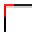

# Leonardo Pattern Design - Appendice Comandi

**VERSIONE 3.2.0** - Riferimento Rapido Completo

**240 comandi** organizzati in 25 categorie funzionali

---

## INDICE CATEGORIE

1. [Elaborazione AAMA](#1-elaborazione-aama)
2. [Gestione Testo e Attributi](#2-gestione-testo-e-attributi)
3. [Inserimento Blocchi](#3-inserimento-blocchi)
4. [Disegno Geometrico](#4-disegno-geometrico)
5. [Gestione Dati Pezzi](#5-gestione-dati-pezzi)
6. [Estrazione Modaris](#6-estrazione-modaris)
7. [Modifica Avanzata](#7-modifica-avanzata)
8. [Utilità e Calcolo](#8-utilità-e-calcolo)
9. [Gestione Polilinee](#9-gestione-polilinee)
10. [Preparazione Stampa](#10-preparazione-stampa)
11. [Gestione Tacche](#11-gestione-tacche)
12. [Gestione Layer](#12-gestione-layer)
13. [Gestione Offset](#13-gestione-offset)
14. [Lavorazioni e Accessori](#14-lavorazioni-e-accessori)
15. [Schede e Documentazione](#15-schede-e-documentazione)
16. [Rotazioni Rapide](#16-rotazioni-rapide)
17. [Specchiatura Avanzata](#17-specchiatura-avanzata)
18. [Nesting Avanzato](#18-nesting-avanzato)
19. [Debug e Diagnostica](#19-debug-e-diagnostica)
20. [Disegno Avanzato](#20-disegno-avanzato)
21. [Polilinee Avanzate](#21-polilinee-avanzate)
22. [Offset Avanzato](#22-offset-avanzato)
23. [Comandi Alias](#23-comandi-alias)
24. [Animazioni e Visualizzazione](#24-animazioni-e-visualizzazione)
25. [Sperimentali 3D](#25-sperimentali-3d)

---

## 1. ELABORAZIONE AAMA

### Processori Principali

| Comando | Icona | Menu | Toolbar | Descrizione |
|---------|-------|------|---------|-------------|
| [`aama`](README_UTENTE.md#il-comando-aama) |  | AAMA → Elaborazione AAMA → AAMA Standard | AAMA | Processa sagome per macchine taglio, crea blocchi standardizzati |
| [`aamar`](README_UTENTE.md#aama-per-rifili) |  | AAMA → Elaborazione AAMA → AAMA Standard Rifilo | AAMA | Processa sagome RIFILO con materiale standard |
| [`Modaris-AAMA`](README_UTENTE.md#modaris-aama-convertitore-leonardo--modaris) |  | AAMA → Elaborazione AAMA → Modaris AAMA | - | Converte blocchi Modaris v3.0 per AAMA |

### Configurazione RIFILO

| Comando | Icona | Menu | Toolbar | Descrizione |
|---------|-------|------|---------|-------------|
| [`aamar_material`](README_UTENTE.md#aamar_material-imposta-materiale-standard) | - | AAMA → Configurazione RIFILO → Imposta Materiale | - | Imposta materiale standard RIFILO |
| [`aamar_tipologia`](README_UTENTE.md#aamar_tipologia-imposta-tipologia-standard) | - | AAMA → Configurazione RIFILO → Imposta Tipologia | - | Imposta tipologia standard RIFILO |
| [`aamar_quantita`](README_UTENTE.md#aamar_quantita-imposta-quantità-standard) | - | AAMA → Configurazione RIFILO → Imposta Quantità | - | Imposta quantità standard RIFILO |
| [`aamar_spacing`](README_UTENTE.md#aamar_spacing-imposta-spaziatura-blocchi) | - | AAMA → Configurazione RIFILO → Imposta Spaziatura | - | Definisce spaziatura blocchi RIFILO |
| [`aamar_settings`](README_UTENTE.md#aamar_settings-visualizza-impostazioni) | - | AAMA → Configurazione RIFILO → Visualizza Settings | - | Mostra impostazioni correnti RIFILO |

### Layer Speciali

| Comando | Icona | Menu | Toolbar | Descrizione |
|---------|-------|------|---------|-------------|
| [`drill1`](README_UTENTE.md#drill1-utensile-foro-1-giallo) |  | AAMA → Layer Speciali → Drill 1 | AAMA | Sposta PUNTO su layer 201 (Giallo) |
| [`drill2`](README_UTENTE.md#drill2-utensile-foro-2-verde) |  | AAMA → Layer Speciali → Drill 2 | AAMA | Sposta PUNTO su layer 202 (Verde) |
| [`drillp`](README_UTENTE.md#drillp-drill-puntate-ciano) |  | AAMA → Layer Speciali → Drill P | AAMA | Sposta PUNTO su layer 100 (Ciano) |
| [`marcatura`](README_UTENTE.md#marcatura-layer-marcatura) |  | AAMA → Layer Speciali → Marcatura | AAMA | Sposta oggetto su layer 91 (Ciano) |
| [`proiezione`](README_UTENTE.md#proiezione-layer-proiezione) |  | AAMA → Layer Speciali → Proiezione | AAMA | Sposta oggetto su layer 90 (Fucsia) |

### Nesting e Allineamento

| Comando | Icona | Menu | Toolbar | Descrizione |
|---------|-------|------|---------|-------------|
| [`nestinglinea`](README_UTENTE.md#nesting-disporre-i-pezzi) |  | AAMA → Nesting → Allinea Blocchi | AAMA | Posiziona pezzi in linea o righe multiple |
| [`nesting1`](README_UTENTE.md#nesting1-nesting-singola-linea-legacy) |  | AAMA → Nesting → Nesting Singola Linea | - | Nesting semplificato su linea orizzontale |
| [`nestingarea`](README_UTENTE.md#nesting-disporre-i-pezzi) |  | AAMA → Nesting → Definisci Area | - | Definisce area temporanea per nesting |
| [`nesting3`](README_UTENTE.md#nesting-disporre-i-pezzi) |  | Stampe → Nesting → Nesting Avanzato | Tavola di Stampa | Nesting avanzato con overflow automatico |

### Geber e Conversioni

| Comando | Icona | Menu | Toolbar | Descrizione |
|---------|-------|------|---------|-------------|
| [`geber`](README_UTENTE.md#geber-configurazione-export-geber) |  | AAMA → Geber → Trasforma Tacche in Punti | AAMA | Converte batch blocchi tacca in punti |
| [`set_geber_tolerance`](README_UTENTE.md#set_geber_tolerance-imposta-tolleranza-geber) |  | AAMA → Geber → Imposta Tolleranza | AAMA | Imposta tolleranze conversione tacche |
| [`blocchi_in_punti`](README_UTENTE.md#blocchi_in_punti-converti-tacche-in-punti-geber) |  | AAMA → Geber → Converti PitRTak | BLOCCHI AVANZATI | Converte blocchi PitRTak in punti |

### Utilità AAMA

| Comando | Icona | Menu | Toolbar | Descrizione |
|---------|-------|------|---------|-------------|
| [`AAMA_ESTRAI`](README_UTENTE.md#esportare-per-il-converter-macchine-da-taglio) |  | AAMA → Elaborazione AAMA → AAMA Estrai | AAMA | Esporta layer "1" in DXF per converter |
| [`DIMA`](README_UTENTE.md#dima-crea-dima-da-netto) |  | Plugin → Dima | Plugin | Crea dima da layer con offset |
| [`ofi`](README_UTENTE.md#ofi-offset-con-tolleranza-per-ringrano) |  | Offset → Offset Ringrano (OFI) | Offset | Offset RINGRANO (originale su "0", offset su OUTCUT) |

---

## 2. GESTIONE TESTO E ATTRIBUTI

### Allineamento e Rotazione

| Comando | Icona | Menu | Toolbar | Descrizione |
|---------|-------|------|---------|-------------|
| [`ATC`](README_UTENTE.md#atc-allinea-testo-a-curva) |  | Blocchi → Allineamento → Allinea Testo a Curva | Modifica Avanzata | Allinea testo a curve con controlli dinamici |
| [`ZR`](README_UTENTE.md#zr-zero-rotation-azzera-rotazione) |  | Blocchi → Allineamento → Rotazione Zero | Modifica Avanzata | Azzera rotazione testo/blocchi/MLeader |
| [`EDT`](README_UTENTE.md#edt-ruota-testo-angolo-definito) |  | Blocchi → Allineamento → Ruota Testo | - | Ruota testo secondo angolo da due punti |

### Diciture Standard

| Comando | Icona | Menu | Toolbar | Descrizione |
|---------|-------|------|---------|-------------|
| [`EDG`](README_UTENTE.md#edg-costola) |  | Blocchi → Diciture Standard → COSTOLA | - | Inserisce testo "COSTOLA" |
| [`FIL`](README_UTENTE.md#fil-filo) |  | Blocchi → Diciture Standard → FILO | - | Inserisce testo "FILO" |
| [`SCA`](README_UTENTE.md#sca-scarnire) |  | Blocchi → Diciture Standard → SCARNIRE | - | Inserisce testo "SCARNIRE" |
| [`SOT`](README_UTENTE.md#sot-sottomettitura) |  | Blocchi → Diciture Standard → SOTTOMETTITURA | - | Inserisce testo "SOTTOMETTITURA" |
| [`RIM`](README_UTENTE.md#rim-rimbocco) |  | Blocchi → Diciture Standard → RIMBOCCO | - | Inserisce testo "RIMBOCCO" |
| [`TAL`](README_UTENTE.md#tal-talyn) |  | Blocchi → Diciture Standard → TALYN | - | Inserisce testo "TALYN" |
| [`SAL`](README_UTENTE.md#sal-salpa) |  | Blocchi → Diciture Standard → SALPA | - | Inserisce testo "SALPA" |
| [`ANT`](README_UTENTE.md#ant-antistrappo) |  | Blocchi → Diciture Standard → ANTISTRAPPO | - | Inserisce testo "ANTISTRAPPO" |
| [`BOM`](README_UTENTE.md#bom-bombatura) |  | Blocchi → Diciture Standard → BOMBATURA | - | Inserisce testo "BOMBATURA" |
| [`RIN`](README_UTENTE.md#rin-rinforzo) |  | Blocchi → Diciture Standard → RINFORZO | - | Inserisce testo "RINFORZO" |
| [`BOR`](README_UTENTE.md#bor-bordatura) |  | Blocchi → Diciture Standard → BORDATURA | - | Inserisce testo "BORDATURA" |
| [`VAL`](README_UTENTE.md#val-valigiaia) |  | Blocchi → Diciture Standard → VALIGIAIA | - | Inserisce testo "VALIGIAIA" |

### Diciture Cucitura

| Comando | Icona | Menu | Toolbar | Descrizione |
|---------|-------|------|---------|-------------|
| [`C5`](README_UTENTE.md#c5-cucitura-rovescia-5mm) |  | Blocchi → Cucitura → CUC.ROV. 5MM | - | Inserisce "CUC.ROV. 5MM" |
| [`C5P`](README_UTENTE.md#c5p-cucitura-rovescia-5mm-con-piping) |  | Blocchi → Cucitura → CUC.ROV. 5MM CON PIPING | - | Inserisce "CUC.ROV. 5MM CON PIPING" |
| [`C7`](README_UTENTE.md#c7-cucitura-rovescia-7mm) |  | Blocchi → Cucitura → CUC.ROV. 7MM | - | Inserisce "CUC.ROV. 7MM" |
| [`C7P`](README_UTENTE.md#c7p-cucitura-rovescia-7mm-con-piping) |  | Blocchi → Cucitura → CUC.ROV. 7MM CON PIPING | - | Inserisce "CUC.ROV. 7MM CON PIPING" |

### Modifica Testo

| Comando | Icona | Menu | Toolbar | Descrizione |
|---------|-------|------|---------|-------------|
| [`chg`](README_UTENTE.md#chg-trova-e-sostituisci-testo) |  | Blocchi → Modifica → Sostituisci Stringa | - | Sostituisce stringa in selezione multipla |
| [`TCASE`](README_UTENTE.md#tcase-cambia-maiuscoleminuscole) |  | Blocchi → Modifica → Converti MAIUSCOLO/minuscolo | - | Converte case del testo selezionato |

---

## 3. INSERIMENTO BLOCCHI

### Blocchi di Indicazione

| Comando | Icona | Menu | Toolbar | Descrizione |
|---------|-------|------|---------|-------------|
| [`VR`](README_UTENTE.md#blocchi-di-direzione-materiale) |  | Blocchi → Indicazioni → Verticale | - | Indicazione direzione verticale materiale |
| [`OR`](README_UTENTE.md#blocchi-di-direzione-materiale) |  | Blocchi → Indicazioni → Orizzontale | - | Indicazione direzione orizzontale |
| [`WAR`](README_UTENTE.md#blocchi-di-avviso) |  | Blocchi → Indicazioni → ATTENZIONE | - | Blocco attenzione |
| [`EQ`](README_UTENTE.md#blocchi-di-avviso) |  | Blocchi → Indicazioni → EQUALIZZARE | - | Blocco equalizzare |
| [`TABT`](README_UTENTE.md#tabt-tabella-testi-informazioni) |  | Blocchi → Indicazioni → Tabella Testi | - | Blocco tabella testi |
| [`PEL`](README_UTENTE.md#blocchi-tipo-materiale) |  | Blocchi → Indicazioni → PELLE | Dati Pezzo | Indicazione materiale pelle |
| [`FOD`](README_UTENTE.md#blocchi-tipo-materiale) |  | Blocchi → Indicazioni → FODERA | Dati Pezzo | Indicazione materiale fodera |

### Blocchi Dati

| Comando | Icona | Menu | Toolbar | Descrizione |
|---------|-------|------|---------|-------------|
| [`NUM`](README_UTENTE.md#altri-blocchi-utili) |  | Materiali → Gestione Articoli → Inserisci Numero Articolo | Dati Pezzo | Inserisce numero articolo (parte dati pezzo) |
| [`SPESSORE`](README_UTENTE.md#altri-blocchi-utili) |  | Blocchi → Indicazioni → Spessore | Dati Pezzo | Inserisce indicazione spessore finito (SP.) |
| [`LEO_FUST`](README_UTENTE.md#leo_fust-indicazione-foro-fustella) |  | Blocchi → Fustelle → Varie Dimensioni | Fustelle | Inserisce indicazione dimensione foro (P, 0.8-6mm) |

### Numerazione

| Comando | Icona | Menu | Toolbar | Descrizione |
|---------|-------|------|---------|-------------|
| [`conta`](README_UTENTE.md#conta-numerazione-progressiva-automatica) |  | Plugin → Conta | Plugin | Inserisce blocchi numerati progressivamente |

---

## 4. DISEGNO GEOMETRICO

### Forme Base

| Comando | Icona | Menu | Toolbar | Descrizione |
|---------|-------|------|---------|-------------|
| [`centro`](README_UTENTE.md#strumenti-utili) |  | Disegno → Trova Centro | Modifica Avanzata | Disegna linee verticali/orizzontali da centro |
| [`LEORETTANGOLO`](README_UTENTE.md#strumenti-di-disegno-base) |  | Disegno → Forme Base → Rettangolo Base/Altezza | Modifica Avanzata | Rettangolo da punto centrale, larghezza, altezza |
| [`LeoRACRETT`](README_UTENTE.md#strumenti-di-disegno-base) |  | Disegno → Forme Base → Rettangolo Raccordato | Modifica Avanzata | Rettangolo con angoli raccordati |
| [`LeoA3`](README_UTENTE.md#leoa3-formato-a3) |  | Disegno → Forme Base → Rettangolo A3 | Modifica Avanzata | Rettangolo formato A3 (297×420mm) |
| [`LeoA4`](README_UTENTE.md#leoa4-formato-a4) |  | Disegno → Forme Base → Rettangolo A4 | Modifica Avanzata | Rettangolo formato A4 (210×297mm) |
| [`LeoUM`](README_UTENTE.md#leoum-foglio-uso-mano) |  | Stampe → Tavole → Foglio Plotter Singolo | Tavola di Stampa | Foglio uso mano 700×1000mm per plotter |
| [`LeoUM2`](README_UTENTE.md#leoum2-foglio-uso-mano-doppio) |  | Stampe → Tavole → 2 Fogli Plotter | Tavola di Stampa | 2 Fogli plotter (1300×950mm) |
| [`LeoUM4`](README_UTENTE.md#leoum4-foglio-uso-mano-quadruplo) |  | Stampe → Tavole → 4 Fogli Plotter | Tavola di Stampa | 4 Fogli plotter (1300×1800mm) |

### Trapezi e Forme Speciali

| Comando | Icona | Menu | Toolbar | Descrizione |
|---------|-------|------|---------|-------------|
| [`TRAPI`](README_UTENTE.md#strumenti-di-disegno-base) |  | Disegno → Forme Base → Trapezio per Altezza | Modifica Avanzata | Trapezio da basi e altezza |
| [`TRAPL`](README_UTENTE.md#strumenti-di-disegno-base) |  | Disegno → Forme Base → Trapezio per Lato | Modifica Avanzata | Trapezio isoscele da basi e lato obliquo |
| [`Passante`](README_UTENTE.md#strumenti-di-disegno-base) |  | Plugin → Utilities → Passante | Plugin | Calcola e disegna passante tracolla perfetto |
| [`sar`](README_UTENTE.md#strumenti-utili) |  | Disegno → SAR | - | Disegna freccia (Leader) riposizionabile |

### Forme Avanzate

| Comando | Icona | Menu | Toolbar | Descrizione |
|---------|-------|------|---------|-------------|
| [`DISEGNAQUADRANGOLO`](README_UTENTE.md#disegnaquadrangolo-quadranti-borse-con-gui) |  | Disegno → Forme Avanzate → Quadrante a Archi | FASCIA FIANCO | GUI per quadranti borse (lati dritti/archi, raccordi) |
| [`fasciafianco`](README_UTENTE.md#riepilogo-comandi-forme-avanzate-borse) |  | Disegno → Forme Avanzate → Disegna Fascia | FASCIA FIANCO | Due rettangoli collegati (calcolo da lunghezza arco) |
| [`fasciafiancoui`](README_UTENTE.md#riepilogo-comandi-forme-avanzate-borse) |  | Disegno → Forme Avanzate → Fascia UI | FASCIA FIANCO | GUI fascia laterale con raccordi massimi tangenti |
| [`fasciafiancoextui`](README_UTENTE.md#riepilogo-comandi-forme-avanzate-borse) |  | Disegno → Forme Avanzate → Fascia Ext | FASCIA FIANCO | GUI fascia laterale (versione estesa) |
| [`DUERETTANGOLI`](README_UTENTE.md#riepilogo-comandi-forme-avanzate-borse) | - | Disegno → Forme Avanzate → Due Rettangoli | - | Due rettangoli collegati (input da tastiera) |
| [`DUERETTANGOLIRAC`](README_UTENTE.md#riepilogo-comandi-forme-avanzate-borse) | - | Disegno → Forme Avanzate → Due Rettangoli Raccordati | - | Come DUERETTANGOLI + raccordi personalizzabili |
| [`FASCIAFIANCOMAX`](README_UTENTE.md#riepilogo-comandi-forme-avanzate-borse) | - | Disegno → Forme Avanzate → Fascia Fianco Max | - | Come DUERETTANGOLI + raccordi massimi superiori |

---

## 5. GESTIONE DATI PEZZI

### Inserimento Dati

| Comando | Icona | Menu | Toolbar | Descrizione |
|---------|-------|------|---------|-------------|
| [`NOM`](README_UTENTE.md#nome-del-pezzo) |  | Materiali → Nome Pezzo → Inserisci Nome | Dati Pezzo | Dialog 3 liste + input manuale per nome pezzo |
| [`MAT`](README_UTENTE.md#materiale) |  | Materiali → Materiali → Inserisci Materiale | Dati Pezzo | Dialog materiale (4 schede: Pelle/Infust/Tela/Fodera) |

### Modifica Dati

| Comando | Icona | Menu | Toolbar | Descrizione |
|---------|-------|------|---------|-------------|
| [`ED-NOM`](README_UTENTE.md#modificare-dati-esistenti) |  | Materiali → Nome Pezzo → Modifica Nome | Dati Pezzo | Modifica nome pezzo tramite dialog |
| [`ED-MAT`](README_UTENTE.md#modificare-dati-esistenti) |  | Materiali → Materiali → Modifica Materiale | Dati Pezzo | Modifica materiale tramite dialog |
| [`ED-MATERIALE`](README_UTENTE.md#ed-materiale-modifica-quantità-e-tipologia) |  | Materiali → Materiali → Modifica Quantità/Tipologia | Dati Pezzo | Modifica rapida quantità e tipologia |

### Prefissi Speciali

| Comando | Icona | Menu | Toolbar | Descrizione |
|---------|-------|------|---------|-------------|
| [`ED-INFUST`](README_UTENTE.md#ed-infust-prefisso-infustitura) |  | Materiali → Definisci → Definisci Infustitura | Dati Pezzo | Aggiunge prefisso "Infustitura" al nome |
| [`ED-FOD`](README_UTENTE.md#ed-fod-prefisso-fodera) |  | Materiali → Definisci → Definisci Fodera | Dati Pezzo | Aggiunge prefisso "Fodera" al nome |
| [`ED-RIF`](README_UTENTE.md#ed-rif-prefisso-rifilo) |  | Materiali → Definisci → Definisci Rifilo | Dati Pezzo | Aggiunge prefisso "Rifilo" al nome |
| [`ED-SBOZ`](README_UTENTE.md#ed-sboz-prefisso-tagliosbozzo) |  | Materiali → Definisci → Definisci Sbozzo | Dati Pezzo | Aggiunge prefisso "Taglio" al nome |

---

## 6. ESTRAZIONE MODARIS

| Comando | Icona | Menu | Toolbar | Descrizione |
|---------|-------|------|---------|-------------|
| [`CONP`](README_UTENTE.md#conp-converti-polilinee-in-punti-centroidi) |  | Plugin → Modaris → CONP | - | Calcola centroide polilinee layer "0", inserisce punto |
| [`CONP_C`](README_UTENTE.md#conp_c-converti-cerchi-in-punti-centri) |  | Plugin → Modaris → CONP_C | - | Converte cerchi layer "0" in punti al centro |
| [`estrai-multipli`](README_UTENTE.md#estrai-multipli-estrazione-batch-attributi-per-modaris) |  | Plugin → Modaris → Estrai Multipli | - | Estrazione batch blocchi Modaris + pulizia |
| [`estrai-singolo`](README_UTENTE.md#estrai-singolo-estrazione-singola-attributi) |  | Plugin → Modaris → Estrai Singolo | - | Estrazione singolo blocco Modaris + pulizia |
| `test-multipli` | - | Plugin → Modaris → Test Multipli | - | Testa attributi blocchi Modaris |

---

## 7. MODIFICA AVANZATA

| Comando | Icona | Menu | Toolbar | Descrizione |
|---------|-------|------|---------|-------------|
| [`CS`](README_UTENTE.md#strumenti-utili) |  | Selezione → Chain Selection | Modifica Avanzata | Selezione concatenata intelligente per endpoint |
| [`CookieCutter2`](README_UTENTE.md#strumenti-utili) |  | Modifica → Svuota Polilinea | Modifica Avanzata | Trim avanzato con esplosione automatica |
| [`RACCORDA_0`](README_UTENTE.md#strumenti-utili) |  | Disegno → Raccordi → Raccordo Raggio Zero | Modifica Avanzata / Raccordo | Raccorda con raggio 0 |
| [`SPEZZA_PUNTO`](README_UTENTE.md#strumenti-utili) |  | Modifica → Spezza in Punto | Modifica Avanzata | Interrompe linea/poli/arco in punto |
| [`splitcir`](README_UTENTE.md#splitcir-spezza-cerchio-e-crea-arco) |  | Modifica → Spezza Cerchio | - | Spezza cerchio → polilinea con taglio |
| [`TROVA_GAP`](README_UTENTE.md#strumenti-utili) |  | Modifica → Trova Gap | - | Cerca gap tra entità, disegna cerchio su layer GAP |
| [`QM`](README_UTENTE.md#strumenti-utili) |  | Modifica → Specchia Rapido | Modifica Avanzata | Specchiatura rapida oggetti |
| [`BLOCCO_RAPIDO`](README_UTENTE.md#strumenti-utili) |  | Blocchi → Blocco Rapido | BLOCCHI AVANZATI | Crea blocco nome casuale e inserisce |
| [`cbp`](README_UTENTE.md#cbp--cbpr-modifica-punto-base-blocchi) |  | Blocchi → Modifica → Cambia Punto Base Blocco | UTILITA SISTEMA | Cambia punto base senza rilocare inserimenti |
| [`cbpr`](README_UTENTE.md#cbp--cbpr-modifica-punto-base-blocchi) |  | Blocchi → Modifica → Cambia Punto Base con Riferimento | UTILITA SISTEMA | Cambia punto base e riloca inserimenti |
| [`perp2ent`](README_UTENTE.md#perp2ent-linea-perpendicolare-a-entità) |  | Disegno → Perp a Ent | Modifica Avanzata | Disegna linee perpendicolari da punto a entità |

---

## 8. UTILITÀ E CALCOLO

### Gestione Materiali e Nomi

| Comando | Icona | Menu | Toolbar | Descrizione |
|---------|-------|------|---------|-------------|
| [`gestmat`](README_UTENTE.md#gestmat-gestione-materiali-con-interfaccia-grafica) |  | Materiali → Gestione Materiali | - | Dialog gestione liste materiali |
| [`gnames`](README_UTENTE.md#gnames-gestione-nomi-pezzi-con-interfaccia-grafica) |  | Materiali → Gestione Nomi | - | Dialog gestione liste nomi (Nome1/2/3.txt) |
| [`sostmat`](README_UTENTE.md#sostmat-sostituire-materiali-in-massa) |  | Materiali → Sostituzione Materiale | Dati Pezzo | Sostituisce materiale batch (mantiene qta/tipologia) |
| [`mat1`](README_UTENTE.md#mat1-visualizza-per-materiale) |  | Materiali → Visualizza per Materiali | Dati Pezzo | Visualizza e zooma pezzi per materiale |
| [`seleziona-permat`](README_UTENTE.md#seleziona-permat-selezione-per-materiale) |  | Materiali → Selezione Materiale | Dati Pezzo | Seleziona sagome per materiale specifico |

### Calcolo Consumi

| Comando | Icona | Menu | Toolbar | Descrizione |
|---------|-------|------|---------|-------------|
| [`NOG`](README_UTENTE.md#nog-calcolo-consumi-completo) |  | Computi → Consumi → Computo Materiali | CONSUMI NOG | Calcolo consumi avanzato con config per categoria |
| [`NOG-CONFIG`](README_UTENTE.md#nog-config-configurazione-sfridi-con-gui) | - | Computi → Consumi → Configura NOG | - | Modifica config generale calcolo consumi |
| [`NOG-ADDMAT`](README_UTENTE.md#nog-addmat-aggiungi-materiale-specifico) | - | Computi → Consumi → Aggiungi Materiale | - | Aggiunge/aggiorna parametri materiale specifico |
| [`NOGG`](README_UTENTE.md#nogg-calcolo-consumi-con-grafico-deprecato) |  | Computi → Schede → Scheda Pezzi e Spessori | CONSUMI NOG | Calcola area geometrica reale + offset |
| [`consumi_metro`](README_UTENTE.md#consumi_metro-consumi-in-metri-lineari) |  | Computi → Consumi → Consumi Metro | CONSUMI NOG | Calcola consumi in metri |
| [`consumi_rotolo`](README_UTENTE.md#consumi_rotolo-calcolo-rotoli-necessari) |  | Computi → Consumi → Consumi Rotolo | CONSUMI NOG | Calcola consumi in rotoli |

### Utilità Varie

| Comando | Icona | Menu | Toolbar | Descrizione |
|---------|-------|------|---------|-------------|
| [`HexDecConverter`](README_UTENTE.md#hexdecconverter-converti-testo-hexdec) |  | Plugin → Utilities → Hex/Dec Converter | - | Converte testo tra esadecimale e decimale |
| [`font_test`](README_UTENTE.md#font_test-test-e-visualizza-font) |  | Plugin → Utilities → Font Test | - | Crea righe test font .shx da directory |
| [`inizializza2`](README_UTENTE.md#inizializza2-carica-plugin-net-alt) |  | Plugin → Inizializza | UTILITA SISTEMA | Carica librerie .dll esterne |

---

## 9. GESTIONE POLILINEE

### Selezione e Unione

| Comando | Icona | Menu | Toolbar | Descrizione |
|---------|-------|------|---------|-------------|
| [`leo-poliauto`](README_UTENTE.md#leo-poliauto-unione-intelligente-concatenata) |  | Polilinee → Creazione → Creazione Automatica | Polilinea | Selezione concatenata + unione automatica |
| [`PJ`](README_UTENTE.md#lavorare-con-le-linee) |  | Polilinee → Creazione → Creazione Manuale (PJ) | Polilinea | Unisce linee, archi, polilinee |
| [`Y`](README_UTENTE.md#lavorare-con-le-linee) |  | Polilinee → Creazione → Unione Rapida (Y) | - | Filtra e congiunge in polilinee leggere |
| [`JoinAll`](README_UTENTE.md#joinall-unione-batch-selezione) |  | Polilinee → Creazione → Join All | - | Unisce linee, archi, polilinee (batch) |
| [`PC`](README_UTENTE.md#lavorare-con-le-linee) |  | Polilinee → Creazione → Chiudi Taglio | Polilinea | Chiude polilinee aperte |
| [`pljoinfuzz`](README_UTENTE.md#pljoinfuzz-unione-con-tolleranza-gap) |  | Polilinee → Creazione → Join Fuzz | Polilinea | Join con tolleranza (anche se non si toccano) |

### Modifica Polilinee

| Comando | Icona | Menu | Toolbar | Descrizione |
|---------|-------|------|---------|-------------|
| [`pedit`](README_UTENTE.md#pedit-modifica-polilinea-esteso) |  | Polilinee → Modifica → Edita Polilinea | Polilinea | Editor polilinee standard |

### Conversione

| Comando | Icona | Menu | Toolbar | Descrizione |
|---------|-------|------|---------|-------------|
| [`el2pl`](README_UTENTE.md#el2pl-ellissi-in-polilinee) |  | Polilinee → Utilità → Ellisse to Polyline | Polilinea | Converte ellisse/arco ellittico in polilinea |
| [`s2p`](README_UTENTE.md#s2p-spline-in-polilinee) |  | Polilinee → Utilità → Spline to Polyline | Polilinea | Converte spline in polilinee (definisci segmenti) |

### Direzione e Visualizzazione

| Comando | Icona | Menu | Toolbar | Descrizione |
|---------|-------|------|---------|-------------|
| [`PLD`](README_UTENTE.md#lavorare-con-le-linee) |  | Polilinee → Direzione → Visualizza Direzione | Polilinea / Modifica Avanzata | Mostra direzione con marcatore + frecce, opzione inversione |
| [`RVRSLINE`](README_UTENTE.md#rvrsline-inverti-direzione-veloce) |  | Polilinee → Direzione → Inverti Direzione | Polilinea / Modifica Avanzata | Inverte direzione linee/polilinee/LWPolyline |
| [`nuovoiniziop`](README_UTENTE.md#nuovoiniziop-cambia-punto-inizio-polilinea) |  | Polilinee → Direzione → Nuovo Inizio | Polilinea | Imposta nuovo punto inizio polilinea |
| [`PLDREV_SETCOLOR`](README_UTENTE.md#pldrev_setcolor-colore-frecce-direzione) |  | Polilinee → Settings → Imposta Colore Frecce | - | Imposta colore frecce direzione (1-7, default Ciano) |
| [`PLDREV_SETPOS`](README_UTENTE.md#pldrev_setpos-posizione-frecce-direzione) |  | Polilinee → Settings → Imposta Posizione Frecce | - | Imposta posizione frecce (Interne/Esterne) |

---

## 10. PREPARAZIONE STAMPA

### Sbozzi

| Comando | Icona | Menu | Toolbar | Descrizione |
|---------|-------|------|---------|-------------|
| [`SBOZZO`](README_UTENTE.md#creare-sbozzi) |  | Stampe → Sbozzo → Sbozzo Singolo | Sbozzo | Cancella tacche, offset, sposta su OUTCUT |
| [`SBOZZO_RETT`](README_UTENTE.md#comandi-avanzati-per-sbozzi) |  | Stampe → Sbozzo → Sbozzo Rettangolare | Sbozzo | Bounding box + offset + NESTING3 |
| [`SBOZZO_BOUND`](README_UTENTE.md#comandi-avanzati-per-sbozzi) |  | Stampe → Sbozzo → Sbozzo Boundary | Sbozzo | Disegna bounding box rettangolare polilinee |
| [`CopyArray`](README_UTENTE.md#comandi-avanzati-per-sbozzi) |  | Stampe → Sbozzo → Sbozzo Multiplo | Sbozzo | Array rettangolare con sbozzo + bbox complessivo |

### Tavole di Stampa

| Comando | Icona | Menu | Toolbar | Descrizione |
|---------|-------|------|---------|-------------|
| [`PRESTAMPA`](README_UTENTE.md#prestampa-preparazione-cartamodelli) |  | Stampe → Pre-Stampa | - | Prepara layer TAVOLA_DI_STAMPA_TAGLIO + centroidi |
| [`TAVOLA_DI_STAMPA_ANTIBUG`](README_UTENTE.md#preparare-tavole-per-il-plotter) |  | Stampe → Tavole → Tavola Selezione Manuale | Tavola di Stampa | Prepara sagome + NESTING3 per plotter |
| [`TAVOLA_DI_STAMPA_A3`](README_UTENTE.md#tavola_di_stampa_a3-layout-automatico-a3) |  | Stampe → Tavole → Tavola A3 | Tavola di Stampa | Prepara sagome formato A3 + NESTING3 |

---

## 11. GESTIONE TACCHE

### Inserimento

| Comando | Icona | Menu | Toolbar | Descrizione |
|---------|-------|------|---------|-------------|
| [`INSERISCI_TACCA`](README_UTENTE.md#inserire-una-tacca) |  | Tacche → Inserimento → Inserisci Tacca | Tacche | Inserisce blocco tacca con orientamento automatico |
| [`tacca_da_misura`](README_UTENTE.md#inserire-tacca-a-distanza-precisa) |  | Tacche → Inserimento → Tacca da Misura | - | Inserisce tacca a distanza specifica |
| [`tacca_dapoli`](README_UTENTE.md#inserire-tacche-da-distanze-misurate) |  | Tacche → Inserimento → Tacca da Polilinea | Tacche | Copia distanza tra punti, inserisce tacca |
| [`INSERISCI_BLOCCHI`](README_UTENTE.md#inserire-blocchi-a-distanze-fisse) |  | Tacche → Inserimento → Inserisci Blocchi a distanza | Tacche / BLOCCHI AVANZATI | Inserisce blocchi lungo poli a distanza fissa |

### Copia e Modifica

| Comando | Icona | Menu | Toolbar | Descrizione |
|---------|-------|------|---------|-------------|
| [`COPIA_TACCHE`](README_UTENTE.md#copiare-tacche-da-un-pezzo-allaltro) |  | Tacche → Modifica → Copia Tacche | Tacche | Copia tacche da fianco a quadrante/fascia |
| [`MISURATRT`](README_UTENTE.md#misurare-tratti-su-polilinee) |  | Polilinee → Utilità → Misura Tratto | Tacche / Modifica Avanzata | Misura tratto e inserisce valore come testo |
| [`TACCA_RIBALTA`](README_UTENTE.md#modificare-le-tacche) |  | Tacche → Modifica → Ribalta Tacche | Tacche | Ruota tacche 180° (cambia verso) |
| [`riposiziona_tacche`](README_UTENTE.md#modificare-le-tacche) |  | Tacche → Modifica → Riposiziona Tacche | Tacche | Riposiziona tacche da netto a sbozzo |
| [`sostituisci_tacche`](README_UTENTE.md#sostituisci_tacche-menu-conversioni-universale) |  | Tacche → Conversione → Menu Principale | Tacche | Menu conversioni tacche (6 opzioni) |

### Conversioni Tacche

| Comando | Icona | Menu | Toolbar | Descrizione |
|---------|-------|------|---------|-------------|
| [`tacche_in_tagliate`](README_UTENTE.md#tacche_in_tagliate-tacche-standard-tacche-tagliate) |  | Tacche → Conversione → Tacche in Tagliate | - | Converte "tacca" → "tacca_t" |
| [`tagliate_in_tacche`](README_UTENTE.md#tagliate_in_tacche-tacche-tagliate-tacche-standard) |  | Tacche → Conversione → Tagliate in Tacche | - | Converte "tacca_t" → "tacca" |
| [`tacche_in_punti`](README_UTENTE.md#tacche_in_punti-tacche-standard-punti-cad) |  | Tacche → Conversione → Tacche in Punti | - | Converte "tacca" → POINT |
| [`punti_in_tacche`](README_UTENTE.md#punti_in_tacche-punti-cad-tacche-standard) |  | Tacche → Conversione → Punti in Tacche | - | Converte POINT → "tacca" |
| [`mozart_in_tacche`](README_UTENTE.md#mozart_in_tacche-tacche-mozart-modaris-tacche-standard) |  | Tacche → Conversione → Mozart in Tacche | - | Converte "PitTacCT" (Mozart) → "tacca" |
| [`tacche_in_mozart`](README_UTENTE.md#tacche_in_mozart-tacche-standard-tacche-mozart-modaris) |  | Tacche → Conversione → Tacche in Mozart | - | Converte "tacca" → "PitTacCT" (Mozart) |

### Utilità Tacche

| Comando | Icona | Menu | Toolbar | Descrizione |
|---------|-------|------|---------|-------------|
| [`METTI_V`](README_UTENTE.md#metti_v-inserisci-intaglio-manuale) |  | Tacche → Utilità → Inserisci V | Tacche | Inserisce rientranza V su polilinea |
| [`METTI_V_AUTO`](README_UTENTE.md#creare-intagli-a-v-per-dime) |  | Tacche → Utilità → Sostituisci con V Auto | Tacche | Trova tacche vicine e sostituisce con V |
| [`Dima_tacche_atom`](README_UTENTE.md#dima_tacche_atom-dime-con-intagli-automatici) | - | Tacche → Utilità → Dima Tacche | - | Crea dima + converte tacche in intagli V |

---

## 12. GESTIONE LAYER

### Layer di Taglio

| Comando | Icona | Menu | Toolbar | Descrizione |
|---------|-------|------|---------|-------------|
| [`PENNA`](README_UTENTE.md#penna-layer-di-disegno) |  | Layer → Penna (Layer 0) | Tipolinea e Layer | Ripristina layer "0" con colore BYLAYER |
| [`ENDCUT`](README_UTENTE.md#endcut-rifiliotaglio-di-finitura) |  | Layer → Rifilo (ENDCUT) | Tipolinea e Layer | Sposta su layer ENDCUT (Ciano-4) |
| [`OUTCUT`](README_UTENTE.md#outcut-taglio-esterno) |  | Layer → Taglio (OUTCUT) | Tipolinea e Layer | Sposta su layer OUTCUT (Rosso-1) |
| [`INTCUT`](README_UTENTE.md#intcut-taglio-interno) |  | Layer → Taglio Interno (INTCUT) | Tipolinea e Layer | Sposta su layer INTCUT (Blu-5) |

### Colori Rapidi

| Comando | Icona | Menu | Toolbar | Descrizione |
|---------|-------|------|---------|-------------|
| [`BBB`](README_UTENTE.md#bbb-grigio-scuro) |  | Colori → Bianco | Colori | Colore Bianco (254) + layer "0" |
| [`GGG`](README_UTENTE.md#ggg-giallo) |  | Colori → Giallo | Colori | Colore Giallo (2) + layer "0" |
| [`AAA`](README_UTENTE.md#aaa-arancione) |  | Colori → Arancione | Colori | Colore Arancione (30) + layer "0" |
| [`VVV`](README_UTENTE.md#vvv-verde) |  | Colori → Verde | Colori | Colore Verde (3) + layer "0" |
| [`FFF`](README_UTENTE.md#fff-fucsia) |  | Colori → Magenta | Colori | Colore Magenta (6) + layer "0" |

---

## 13. GESTIONE OFFSET

### Offset Standard e Tratteggiato

| Comando | Icona | Menu | Toolbar | Descrizione |
|---------|-------|------|---------|-------------|
| [`oft_2`](README_UTENTE.md#oft_2-oft_3-oft_4-oft_5-oft_6-oft_7-oft_10-offset-predefiniti) |  | Offset → Offset 2 Tratteggiato | Offset | Offset 2mm tipo linea CUCITURA (scala 0.3) |
| [`oft_3`](README_UTENTE.md#oft_2-oft_3-oft_4-oft_5-oft_6-oft_7-oft_10-offset-predefiniti) |  | Offset → Offset 3 Tratteggiato | Offset | Offset 3mm tipo linea CUCITURA |
| [`oft_4`](README_UTENTE.md#oft_2-oft_3-oft_4-oft_5-oft_6-oft_7-oft_10-offset-predefiniti) |  | Offset → Offset 4 Tratteggiato | Offset | Offset 4mm tipo linea CUCITURA |
| [`oft_5`](README_UTENTE.md#oft_2-oft_3-oft_4-oft_5-oft_6-oft_7-oft_10-offset-predefiniti) |  | Offset → Offset 5 Tratteggiato | Offset | Offset 5mm tipo linea CUCITURA |
| [`oft_6`](README_UTENTE.md#oft_2-oft_3-oft_4-oft_5-oft_6-oft_7-oft_10-offset-predefiniti) |  | Offset → Offset 6 Tratteggiato | Offset | Offset 6mm tipo linea CUCITURA |
| [`oft_8`](README_UTENTE.md#oft_8-offset-8mm-rapido) |  | Offset → Offset 8 Tratteggiato | Offset | Offset 8mm tipo linea CUCITURA |
| [`oft_10`](README_UTENTE.md#oft_2-oft_3-oft_4-oft_5-oft_6-oft_7-oft_10-offset-predefiniti) |  | Offset → Offset 10 Tratteggiato | Offset | Offset 10mm tipo linea CUCITURA |
| [`oft`](README_UTENTE.md#oft-offset-personalizzato) |  | Offset → Offset Tratteggiato Variabile | Offset | Offset distanza personalizzata CUCITURA |

### Gestione Tipo Linea

| Comando | Icona | Menu | Toolbar | Descrizione |
|---------|-------|------|---------|-------------|
| [`CUCITURA`](README_UTENTE.md#continua-e-cucitura-gestione-tipo-linea) |  | Layer → Cucitura | Tipolinea e Layer | Imposta tipo linea CUCITURA (layer 0, scala 0.3) |
| [`CONTINUA`](README_UTENTE.md#continua-e-cucitura-gestione-tipo-linea) |  | Layer → Linea Continua | Tipolinea e Layer | Ripristina tipo linea BYLAYER (continuo) |

---

## SCORCIATOIE DA TASTIERA

### Comandi Principali

| Tasti | Comando | Descrizione |
|-------|---------|-------------|
| **TT** | INSERISCI_TACCA | Inserisci tacca |
| **Y** | PJ | Creazione polilinea rapida |
| **NN** | NOM | Nome pezzo |
| **MM** | MAT | Materiale |
| **PC** / **CP** | PC | Chiudi polilinea |
| **CS** | CS | Chain Selection |
| **BR** | BLOCCO_RAPIDO | Blocco rapido |

### Layer Rapidi

| Tasti | Comando | Layer | Descrizione |
|-------|---------|-------|-------------|
| **N** | PENNA | 0 | Penna (layer 0) |
| **M** | ENDCUT | ENDCUT | Linea rifilo |
| **B** | OUTCUT | OUTCUT | Taglio esterno |
| **V** | INTCUT | INTCUT | Taglio interno |

### Colori Rapidi

| Tasti | Comando | Colore ACI | Descrizione |
|-------|---------|-----------|-------------|
| **AAA** | AAA | 30 | Arancione |
| **BBB** | BBB | 254 | Bianco |
| **FFF** | FFF | 6 | Fucsia |
| **GGG** | GGG | 2 | Giallo |
| **VVV** | VVV | 3 | Verde |

### Acceleratori (Ctrl+)

| Combinazione | Comando | Descrizione |
|--------------|---------|-------------|
| **Ctrl+Q** | DIMALIGNED | Quota allineata |
| **Ctrl+E** | EXTEND | Estendi |
| **Ctrl+W** | TRIM | Taglia |

### Tasti Funzione

| Tasto | Comando | Descrizione |
|-------|---------|-------------|
| **F5** | CONTINUA | Linea continua |
| **F6** | CUCITURA | Linea cucitura |

---

## 14. LAVORAZIONI E ACCESSORI

### Inserimento Lavorazioni

| Comando | Icona | Menu | Toolbar | Descrizione |
|---------|-------|------|---------|-------------|
| [`LAV`](README_UTENTE.md#inserire-lavorazioni) | - | Materiali → Lavorazioni → Inserisci Lavorazioni | Dati Pezzo | Dialog inserimento lavorazioni multiple (max 16) con ripetizioni |
| [`CREA-DATLAV`](README_UTENTE.md#crea-datlav-crea-blocco-lavorazioni) | - | - | - | Crea blocco DATLAV con 32 attributi (16 nomi + 16 descrizioni) |

### Modifica Lavorazioni

| Comando | Icona | Menu | Toolbar | Descrizione |
|---------|-------|------|---------|-------------|
| [`ED-LAV`](README_UTENTE.md#modificare-lavorazioni-esistenti) | - | Materiali → Lavorazioni → Modifica Lavorazioni | Dati Pezzo | Gestione completa: aggiungi/modifica/rimuovi/riordina lavorazioni |
| [`ED-DB-LAV`](README_UTENTE.md#ed-db-lav-gestione-database-lavorazioni) | - | Materiali → Database → Database Lavorazioni | - | Edita database lavorazioni (C:/LEONARDO/common/lavorazioni.txt) |

### Inserimento Accessori

| Comando | Icona | Menu | Toolbar | Descrizione |
|---------|-------|------|---------|-------------|
| [`ACC`](README_UTENTE.md#inserire-accessori) | - | Materiali → Accessori → Inserisci Accessori | Dati Pezzo | Dialog inserimento accessori metallici multipli (max 16) con quantità |
| [`CREA-DATACC`](README_UTENTE.md#crea-datacc-crea-blocco-accessori) | - | - | - | Crea blocco DATACC con 32 attributi per accessori |

### Modifica Accessori

| Comando | Icona | Menu | Toolbar | Descrizione |
|---------|-------|------|---------|-------------|
| [`ED-ACC`](README_UTENTE.md#modificare-accessori-esistenti) | - | Materiali → Accessori → Modifica Accessori | Dati Pezzo | Gestione completa: aggiungi/modifica/rimuovi/riordina accessori |
| [`ED-DB-ACC`](README_UTENTE.md#ed-db-acc-gestione-database-accessori) | - | Materiali → Database → Database Accessori | - | Edita database accessori (C:/LEONARDO/common/accessori.txt) |

### Computi Specifici

| Comando | Icona | Menu | Toolbar | Descrizione |
|---------|-------|------|---------|-------------|
| [`NOGPRO-LAV`](README_UTENTE.md#nogpro-lav-computo-consumi-lavorazioni) | - | Computi → Computi Specifici → Computo Lavorazioni | - | Calcolo consumi specifico per lavorazioni |
| [`NOGPRO-ACC`](README_UTENTE.md#nogpro-acc-computo-consumi-accessori) | - | Computi → Computi Specifici → Computo Accessori | - | Calcolo consumi specifico per accessori metallici |

### Schede Lavorazioni e Accessori

| Comando | Icona | Menu | Toolbar | Descrizione |
|---------|-------|------|---------|-------------|
| [`SCHEDA-LAV`](README_UTENTE.md#scheda-lav-scheda-tecnica-lavorazioni) | - | Computi → Schede → Scheda Lavorazioni | - | Genera scheda lavorazioni e spessori per articolo |
| [`SCHEDA-ACC`](README_UTENTE.md#scheda-acc-scheda-tecnica-accessori) | - | Computi → Schede → Scheda Accessori | - | Genera scheda accessori metallici per articolo |

---

## 15. SCHEDE E DOCUMENTAZIONE

### Generazione Schede

| Comando | Icona | Menu | Toolbar | Descrizione |
|---------|-------|------|---------|-------------|
| [`SCHEDA`](README_UTENTE.md#scheda-scheda-tecnica-completa-alias) | - | Computi → Schede → Scheda Completa | CONSUMI NOG | Alias per SCHEDA_ESEGUI (esecuzione completa) |
| [`SCHEDA_ESEGUI`](README_UTENTE.md#scheda_esegui-esecuzione-completa-schede) | - | Computi → Schede → Esegui Tutto | CONSUMI NOG | Esecuzione concatenata: genera pezzi + HTML interattivo |
| [`SCHEDA_PEZZI`](README_UTENTE.md#scheda_pezzi-generazione-database-pezzi) | - | Computi → Schede → Scheda Pezzi | - | Genera scheda pezzi con numero e dettagli |
| [`SCHEDA_PEZZI_IMG`](README_UTENTE.md#scheda_pezzi_img-scheda-pezzi-con-immagini) | - | Computi → Schede → Scheda con Immagini | - | Genera scheda pezzi con immagini PNG automatiche |

### Export Schede

| Comando | Icona | Menu | Toolbar | Descrizione |
|---------|-------|------|---------|-------------|
| [`SCHEDA_GENERA_HTML`](README_UTENTE.md#scheda_genera_html-genera-solo-html-da-csv) | - | Computi → Export → Genera HTML | - | Converte CSV in HTML interattivo con anteprime |
| [`SCHEDA_GENERA_XLSX`](README_UTENTE.md#scheda_genera_xlsx-genera-scheda-excel) | - | Computi → Export → Genera Excel | - | Genera file Excel da scheda (richiede DLL) |

---

## 16. ROTAZIONI RAPIDE

| Comando | Icona | Menu | Toolbar | Descrizione |
|---------|-------|------|---------|-------------|
| [`R90`](README_UTENTE.md#r90-rotazione-90-antiorario) | - | Modifica → Rotazioni → Ruota 90° | - | Rotazione 90° oraria (chiede selezione + punto) |
| [`R9`](README_UTENTE.md#r9-rotazione-90-versione-rapida) | - | Modifica → Rotazioni → Ruota 90° Rapido | - | Versione rapida di R90 (shortcut) |
| [`R90M`](README_UTENTE.md#r90m-rotazione-90-orario-mirror) | - | Modifica → Rotazioni → Ruota -90° | - | Rotazione 90° antioraria (verso sinistra) |
| [`R180`](README_UTENTE.md#r180-rotazione-180) | - | Modifica → Rotazioni → Ruota 180° | - | Rotazione 180° (ribalta oggetto) |

---

## 17. SPECCHIATURA AVANZATA

| Comando | Icona | Menu | Toolbar | Descrizione |
|---------|-------|------|---------|-------------|
| [`QMD`](README_UTENTE.md#qmd-quick-mirror-delete) | - | Modifica → Specchiatura → Quick Mirror Delete | - | Specchia selezione e cancella originale |
| [`QMO`](README_UTENTE.md#qmo-quick-mirror-object) | - | Modifica → Specchiatura → Quick Mirror Ortho | - | Specchia singolo oggetto in modo ortogonale |
| [`QMOD`](README_UTENTE.md#qmod-quick-mirror-object-delete) | - | Modifica → Specchiatura → Quick Mirror Ortho Delete | - | Specchia ortogonale e cancella originale |

---

## 18. NESTING AVANZATO

| Comando | Icona | Menu | Toolbar | Descrizione |
|---------|-------|------|---------|-------------|
| [`nesting`](README_UTENTE.md#nesting-nesting-base-con-overflow) |  | Stampe → Nesting → Nesting Base | - | Nesting base con gestione overflow |
| [`nesting5`](README_UTENTE.md#nesting5-nesting-multi-riga-configurabile) | - | Stampe → Nesting → Nesting Multi-Riga | - | Nesting multi-riga con spacing configurabile |
| [`nesting51`](README_UTENTE.md#nesting51-nesting-direzione-alternata) | - | Stampe → Nesting → Nesting Alternato | - | Nesting con direzione alternata (ottimizzazione spazio) |
| [`nesting52`](README_UTENTE.md#nesting52-nesting-con-sorting-avanzato) | - | Stampe → Nesting → Nesting Sorting | - | Nesting con sorting avanzato per dimensione |

---

## 19. DEBUG E DIAGNOSTICA

### Debug AAMA

| Comando | Icona | Menu | Toolbar | Descrizione |
|---------|-------|------|---------|-------------|
| [`aama_debug`](README_UTENTE.md#aama_debug-attivadisattiva-debug-mode-aama) | - | AAMA → Debug → Debug Mode | - | Attiva modalità debug AAMA (log dettagliato) |
| [`aama_errors`](README_UTENTE.md#aama_errors-visualizza-log-errori-aama) | - | AAMA → Debug → Visualizza Errori | - | Visualizza log errori elaborazione AAMA |
| [`aama_clear_errors`](README_UTENTE.md#aama_clear_errors-cancella-log-errori-aama) | - | AAMA → Debug → Cancella Errori | - | Pulisce file log errori AAMA |
| [`aama_test`](README_UTENTE.md#aama_test-test-singolo-pezzo-aama) | - | AAMA → Debug → Test Funzioni | - | Esegue test automatici funzioni AAMA |

### Debug AAMAR (RIFILO)

| Comando | Icona | Menu | Toolbar | Descrizione |
|---------|-------|------|---------|-------------|
| [`aamar_init`](README_UTENTE.md#aamar_init-ripristina-impostazioni-default) |  | AAMA → Elaborazione AAMA → Inizializza RIFILO | - | Inizializza sistema RIFILO (prerequisito per aamar) |
| [`aamar_debug`](README_UTENTE.md#aamar_debug-attivadisattiva-debug-mode-rifilo) | - | AAMA → Debug RIFILO → Debug Mode | - | Attiva modalità debug AAMAR RIFILO |
| [`aamar_errors`](README_UTENTE.md#aamar_errors-visualizza-log-errori-rifilo) | - | AAMA → Debug RIFILO → Visualizza Errori | - | Visualizza log errori elaborazione RIFILO |
| [`aamar_clear_errors`](README_UTENTE.md#aamar_clear_errors-cancella-log-errori-rifilo) | - | AAMA → Debug RIFILO → Cancella Errori | - | Pulisce file log errori RIFILO |
| [`aamar_test`](README_UTENTE.md#aamar_test-test-singolo-pezzo-rifilo) | - | AAMA → Debug RIFILO → Test Funzioni | - | Esegue test automatici funzioni RIFILO |

### Configurazione Modaris

| Comando | Icona | Menu | Toolbar | Descrizione |
|---------|-------|------|---------|-------------|
| [`MA-config`](README_UTENTE.md#ma-config-configurazione-materiali-aama) | - | AAMA → Configurazione → Config Modaris-AAMA | - | Configurazione parametri conversione Modaris-AAMA |

---

## 20. DISEGNO AVANZATO

| Comando | Icona | Menu | Toolbar | Descrizione |
|---------|-------|------|---------|-------------|
| [`ARCOTANG`](README_UTENTE.md#arcotang-arco-tangente-dinamico-interattivo) | - | Disegno → Archi → Arco Tangente | - | Arco tangente interattivo tra due archi esistenti |

---

## 21. POLILINEE AVANZATE

| Comando | Icona | Menu | Toolbar | Descrizione |
|---------|-------|------|---------|-------------|
| [`leo-poliauto1`](README_UTENTE.md#leo-poliauto1-selezione-concatenata-visuale) | - | Polilinee → Creazione → Creazione Auto v1 | - | Polilinea automatica versione legacy (compatibilità) |
| [`pell`](README_UTENTE.md#pell-converti-ellisse-in-polilinea) | - | Polilinee → Conversione → Polilinea da Ellisse | - | Converte ellisse in polilinea (metodo speciale) |
| [`setpstart`](README_UTENTE.md#setpstart-imposta-punto-inizio-polilinea) | - | Polilinee → Direzione → Imposta Punto Inizio | - | Imposta nuovo punto inizio polilinea (standalone) |

---

## 22. OFFSET AVANZATO

| Comando | Icona | Menu | Toolbar | Descrizione |
|---------|-------|------|---------|-------------|
| [`OFFSET_TRATTO`](README_UTENTE.md#offset_tratto-offset-tratto-polilinea-su-un-lato) | - | Offset → Offset Tratto Specifico | - | Offset di un tratto specifico della polilinea |

---

## 23. COMANDI ALIAS

| Comando | Icona | Menu | Toolbar | Descrizione |
|---------|-------|------|---------|-------------|
| [`CC`](README_UTENTE.md#cc-alias-cookiecutter) |  | - | - | Alias per CookieCutter2 (trim avanzato) |
| [`inizializza`](README_UTENTE.md#inizializza-carica-plugin-net) |  | Plugin → Inizializza | - | Alias per inizializza2 (carica librerie DLL) |

### Varianti Minuscole Tacche

| Comando | Icona | Menu | Toolbar | Descrizione |
|---------|-------|------|---------|-------------|
| [`copia_tacche`](README_UTENTE.md#copiare-tacche-da-un-pezzo-allaltro) |  | - | - | Variante minuscole di COPIA_TACCHE |
| [`inserisci_tacca`](README_UTENTE.md#inserisci_tacca-inserisci-tacca-con-scelta-lato) |  | - | - | Variante minuscole di INSERISCI_TACCA |
| [`ribalta_tacche`](README_UTENTE.md#modificare-le-tacche) |  | - | - | Variante minuscole di TACCA_RIBALTA |

---

## 24. ANIMAZIONI E VISUALIZZAZIONE

| Comando | Icona | Menu | Toolbar | Descrizione |
|---------|-------|------|---------|-------------|
| `PLDREV_SHOW_DIRECTION_ANIMATED` | - | Polilinee → Direzione → Visualizza Animato | - | Visualizzazione animata direzione polilinea (sperimentale) |
| `PLDREV_CHASE` | - | Polilinee → Direzione → Inseguimento Animato | - | Inseguimento animato tracciato polilinea |

---

## 25. SPERIMENTALI 3D

| Comando | Icona | Menu | Toolbar | Descrizione |
|---------|-------|------|---------|-------------|
| `FACE3D` | - | - | - | Creazione faccia 3D interattiva (in sviluppo) |

---

## RIEPILOGO STATISTICO

### Comandi per Categoria

| Categoria | N. Comandi | % Totale |
|-----------|------------|----------|
| Elaborazione AAMA | 35 | 14.6% |
| Gestione Tacche | 23 | 9.6% |
| Gestione Testo | 21 | 8.8% |
| Disegno Geometrico | 19 | 7.9% |
| Gestione Polilinee | 17 | 7.1% |
| Utilità e Calcolo | 14 | 5.8% |
| Modifica Avanzata | 13 | 5.4% |
| Lavorazioni e Accessori | 12 | 5.0% |
| Gestione Dati Pezzi | 12 | 5.0% |
| Inserimento Blocchi | 11 | 4.6% |
| Gestione Offset | 11 | 4.6% |
| Debug e Diagnostica | 10 | 4.2% |
| Gestione Layer/Colori | 9 | 3.8% |
| Preparazione Stampa | 7 | 2.9% |
| Schede e Documentazione | 6 | 2.5% |
| Comandi Alias | 5 | 2.1% |
| Nesting Avanzato | 4 | 1.7% |
| Estrazione Modaris | 4 | 1.7% |
| Rotazioni Rapide | 4 | 1.7% |
| Specchiatura Avanzata | 3 | 1.3% |
| Animazioni e Visualizzazione | 2 | 0.8% |
| Sperimentali 3D | 1 | 0.4% |
| **TOTALE** | **240** | **100%** |

### Toolbar Disponibili

17 toolbar tematiche:
- Dati Pezzo
- Fustelle
- Tipolinea e Layer
- Colori
- Raccordo
- Arco
- Polilinea
- Tacche
- AAMA
- Modifica Avanzata
- Tavola di Stampa
- Sbozzo
- Plugin
- Offset
- CONSUMI NOG
- FASCIA FIANCO
- BLOCCHI AVANZATI
- UTILITA SISTEMA

---

**Sviluppatore**: Leonardo Guasqui
**Email**: leonardo@guasqui.it
**Sito Web**: www.guasqui.it
**Versione Software**: 3.1.0
**Versione Documento**: Appendice Comandi v3.2.0 - Gennaio 2025

**Novità versione 3.2.0**:
- Aggiunti 49 nuovi comandi (da 194 a 240 totali)
- Rimosse sezioni licenza (riservate uso interno)
- Nuove sezioni: Lavorazioni/Accessori, Schede, Rotazioni, Debug, Nesting Avanzato
- Documentazione completa sistema DATLAV/DATACC per lavorazioni e accessori
- Comandi debug e diagnostica AAMA/RIFILO

*Tutti i diritti riservati*
