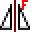
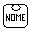
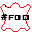

# Leonardo Pattern Design - Guida Utente

**Per Pellettieri e Modellisti**

**Versione**: 3.1.0
**Autore**: Leonardo Guasqui
**Email**: leonardo@guasqui.it
**Sito**: www.guasqui.it

---


## Benvenuto in Leonardo Pattern Design

Questa guida è stata scritta appositamente per chi lavora nel settore della pelletteria e della modellistica, senza richiedere conoscenze informatiche avanzate.

Leonardo Pattern Design è il tuo assistente digitale per:
- Disegnare sagome e modelli
- Gestire materiali e quantità
- Preparare i pezzi per il taglio
- Calcolare i consumi
- Creare la documentazione tecnica

---


## Indice Rapido

**PARTE 1 - INTRODUZIONE E SETUP**
1. [Primi Passi](#primi-passi) - Licenza e configurazione iniziale
2. [Il Flusso di Lavoro Completo](#il-flusso-di-lavoro-completo) - Panoramica del processo produttivo

**PARTE 2 - DISEGNO BASE**
3. [Disegnare le Sagome](#disegnare-le-sagome) - Rettangoli, forme base
4. [Comandi Avanzati con Interfaccia Grafica](#comandi-avanzati-con-interfaccia-grafica) - Fasce, trapezi, quadrangoli

**PARTE 3 - GESTIONE PEZZI**
5. [Inserire le Informazioni sui Pezzi](#inserire-le-informazioni-sui-pezzi) - Nome e materiale
6. [Lavorazioni e Accessori](#lavorazioni-e-accessori) - Operazioni e ferramenta
7. [Blocchi di Indicazione e Simboli](#blocchi-di-indicazione-e-simboli) - Indicatori vari
8. [Lavorare con le Tacche](#lavorare-con-le-tacche) - Inserire, copiare, modificare

**PARTE 4 - MODIFICA E TRASFORMAZIONE**
9. [Rotazioni Rapide](#rotazioni-rapide) - R90, R180, R9, R90M
10. [Specchiature Avanzate (Quick Mirror)](#specchiature-avanzate-quick-mirror) - QMD, QMO, QMOD
11. [Offset Standard e Tratteggiato](#offset-standard-e-tratteggiato) - oft, oft_2-10, OFT_TRATT
12. [Modifica Avanzata](#modifica-avanzata) - Split, gap, blocco rapido, offset tratto
13. [Polilinee Avanzate](#polilinee-avanzate) - Gestione avanzata polyline
14. [Colori Rapidi](#colori-rapidi) - AAA, BBB, FFF, GGG, VVV

**PARTE 5 - LAYER E MACCHINE DA TAGLIO**
15. [Layer Speciali per Macchine da Taglio](#layer-speciali-per-macchine-da-taglio) - drill, marcatura, proiezione
16. [Gestione Layer di Taglio](#gestione-layer-di-taglio) - OUTCUT, INTCUT, ENDCUT

**PARTE 6 - EXPORT E INTEGRAZIONE**
17. [Preparare per il Taglio](#preparare-per-il-taglio) - AAMA, nesting, esportazione DXF
18. [Comandi Speciali per Modaris](#comandi-speciali-per-modaris) - Import/Export Modaris
19. [Macchina da Taglio Geber](#macchina-da-taglio-geber) - Conversione tacche in punti
20. [Creazione Dime e Offset Avanzato](#creazione-dime-e-offset-avanzato) - DIMA, OFI, OFT_8

**PARTE 7 - DOCUMENTAZIONE E CONSUMI**
21. [Generare Schede Tecniche](#generare-schede-tecniche) - Documentazione automatica HTML/XLSX
22. [Calcolare i Consumi](#calcolare-i-consumi) - NOG e configurazione materiali
23. [Testi e Diciture](#testi-e-diciture) - Annotazioni e numerazione

**PARTE 8 - CONFIGURAZIONE E UTILITY**
24. [Gestire Archivi Materiali e Nomi](#gestire-archivi-materiali-e-nomi) - Personalizzazione archivi
25. [Funzioni Utility Avanzate](#funzioni-utility-avanzate) - PRESTAMPA, convertitori, inizializza
26. [Debug e Diagnostica AAMA](#debug-e-diagnostica-aama) - Troubleshooting errori

**PARTE 9 - RIFERIMENTI E SUPPORTO**
27. [Trucchi e Consigli](#trucchi-e-consigli) - Best practices e ROI
28. [Risoluzione Problemi](#risoluzione-problemi) - FAQ e soluzioni comuni
29. [Workflow Completo: Esempio Pratico](#workflow-completo-esempio-pratico) - Caso reale completo
30. [Comandi Più Usati](#comandi-più-usati) - Top 20 comandi professionali
31. [Riferimento Rapido Menu e Toolbar](#riferimento-rapido-menu-e-toolbar) - Navigazione interfaccia
32. [Appendice Comandi Completa](#appendice-comandi-completa) - Tutti i 240 comandi con dettagli
33. [Supporto e Contatti](#supporto-e-contatti) - Assistenza tecnica

---


[↑ Torna all'Indice](#indice-rapido)

## Primi Passi

### Avvio del Programma

1. Aprire ZWCAD (o AutoCAD)
2. Il menu **LEONARDO** apparirà automaticamente nella barra superiore
3. Se non appare, digitare `MENULOAD` e caricare il menu Leonardo

### Prima di Iniziare

**IMPORTANTE**: Per usare Leonardo devi avere una licenza attiva.

**Per attivare la licenza**:
1. Clicca sull'icona  o digita `show-system-id`
2. Copia il codice che appare
3. Invialo a leonardo@guasqui.it
4. Riceverai un codice di attivazione
5. Clicca su  o digita `activate-license`
6. Inserisci il codice ricevuto

---


[↑ Torna all'Indice](#indice-rapido)

## Il Flusso di Lavoro Completo

Ecco come lavorerai normalmente con Leonardo (catena di produzione completa):

```
1. DISEGNO SAGOMA
   - Rettangoli, trapezi, forme base
   - Fasce laterali, quadrangoli
   ↓
2. GESTIONE POLILINEE
   - Unire linee (Y, leo-poliauto)
   - Chiudere sagome (PC)
   - Verificare direzione (PLD)
   - Cercare gap (TROVA_GAP)
   ↓
3. INSERIMENTO DATI PEZZO
   - Nome pezzo (NOM / tasti: NN)
   - Materiale (MAT / tasti: MM)
   - Lavorazioni (LAV) [opzionale]
   - Accessori (ACC) [opzionale]
   ↓
4. INSERIMENTO TACCHE
   - Inserisci tacca (TT)
   - Copia tacche tra pezzi
   - Converti tipi tacche
   ↓
5. PREPARAZIONE MACCHINE DA TAGLIO
   - Verifica finale gap (TROVA_GAP)
   - Processa AAMA → crea blocchi standardizzati
   - Nesting (nesting3) → disponi pezzi su tavola
   - Sposta tutto su layer "1"
   - AAMA_ESTRAI → crea DXF per converter
   ↓
6. CONVERTER MACCHINA → TAGLIO!

FLUSSI PARALLELI (DOCUMENTAZIONE):
- SCHEDA → Genera schede tecniche (CSV + HTML + PNG)
- NOG → Calcola consumi materiali con sfridi
- TAVOLA_DI_STAMPA → Cartamodelli per plotter
```

**Nota chiave**: **AAMA** è il cuore del sistema - trasforma le tue sagome in blocchi standardizzati pronti per le macchine da taglio. **AAMA_ESTRAI** crea poi il file DXF finale per il converter della macchina.

---


[↑ Torna all'Indice](#indice-rapido)

## Disegnare le Sagome

### Strumenti di Disegno Base

#### Rettangoli Rapidi - Formati Plotter e Stampa

Leonardo include comandi per creare rapidamente rettangoli con dimensioni standard, molto usati per organizzare i pezzi su fogli plotter o per stampare documentazione.

##### LeoUM - Foglio Uso Mano

**Comando**: `LeoUM`
**Icona**: 
**Menu**: Disegno → Forme Base → LeoUM

**Dimensioni**: 650 × 950 mm
**Cosa fa**: Crea un rettangolo con le dimensioni standard di un foglio "uso mano" per plotter

**Quando usarlo**:
- Organizzare pezzi per taglio su plotter
- Delimitare area di lavoro plotter piccolo
- Verificare disposizione pezzi prima del nesting

**Come si usa**:
1. Digita `LeoUM`
2. Clicca il punto di inserimento (angolo in basso a sinistra)
3. Il rettangolo viene creato automaticamente

**NOTA**: Il termine "Uso Mano" si riferisce alle dimensioni tradizionali dei fogli usati manualmente nei laboratori di pelletteria, prima dell'automazione.

---

##### LeoUM2 - Foglio Uso Mano Doppio

**Comando**: `LeoUM2`
**Icona**: 
**Menu**: Disegno → Forme Base → LeoUM2

**Dimensioni**: 1300 × 950 mm
**Cosa fa**: Crea un rettangolo doppio rispetto a LeoUM (doppia larghezza)

**Quando usarlo**:
- Plotter di dimensioni medie
- Organizzare pezzi più grandi
- Layout per borse grandi o trolley

**Relazione con LeoUM**: Esattamente doppio in larghezza (2 × 650 = 1300 mm)

---

##### LeoUM4 - Foglio Uso Mano Quadruplo

**Comando**: `LeoUM4`
**Icona**: 
**Menu**: Disegno → Forme Base → LeoUM4

**Dimensioni**: 1300 × 1800 mm
**Cosa fa**: Crea un rettangolo per plotter grandi (doppia larghezza + doppia altezza)

**Quando usarlo**:
- Plotter industriali di grandi dimensioni
- Pezzi molto grandi (borse da viaggio, trolley)
- Massimizzare utilizzo materiale su fogli grandi

**Relazione**: Quasi quadruplo rispetto a LeoUM (doppia larghezza × quasi doppia altezza)

---

##### LeoA4 - Formato A4

**Comando**: `LeoA4`
**Icona**: 
**Menu**: Disegno → Forme Base → LeoA4

**Dimensioni**: 210 × 297 mm (verticale)
**Cosa fa**: Crea un rettangolo formato A4 standard

**Quando usarlo**:
- Preparare documentazione stampata
- Cartamodelli su carta A4
- Testing stampe su stampante ufficio
- Riferimenti dimensionali standard

---

##### LeoA3 - Formato A3

**Comando**: `LeoA3`
**Icona**: 
**Menu**: Disegno → Forme Base → LeoA3

**Dimensioni**: 420 × 297 mm (orizzontale)
**Cosa fa**: Crea un rettangolo formato A3 standard

**Quando usarlo**:
- Stampe di presentazione
- Cartamodelli più grandi
- Documentazione tecnica dettagliata
- Plotter A3

**NOTA**: Esattamente doppio di A4 in superficie

---

### Riepilogo Formati Rettangoli Rapidi

| Comando | Dimensioni (L×H) | Superficie | Uso Tipico |
|---------|------------------|------------|------------|
| `LeoUM` | 650 × 950 mm | 0.62 m² | Plotter piccoli, standard pelletteria |
| `LeoUM2` | 1300 × 950 mm | 1.24 m² | Plotter medi (doppia larghezza) |
| `LeoUM4` | 1300 × 1800 mm | 2.34 m² | Plotter industriali grandi |
| `LeoA4` | 210 × 297 mm | 0.06 m² | Documenti, cartamodelli piccoli |
| `LeoA3` | 420 × 297 mm | 0.12 m² | Presentazioni, stampe grandi |

**Workflow tipico**:
```
1. LeoUM → Disegna area plotter
2. Disponi pezzi dentro l'area
3. Verifica che tutto stia dentro
4. Nesting automatico se serve
5. AAMA_ESTRAI → Export per plotter
```

#### Rettangolo Personalizzato

**Comando**: `LEORETTANGOLO` (o digita `RECT`)

**Passi**:
1. Digita `LEORETTANGOLO`
2. Clicca il punto centrale
3. Inserisci la larghezza (es: 250)
4. Inserisci l'altezza (es: 180)

#### Rettangolo Raccordato

**Comando**: `LeoRACRETT`
**Icona**: 

**Cosa fa**: Disegna un rettangolo con angoli raccordati (arrotondati)

**Quando usarlo**: Per creare forme con angoli morbidi, tipico di tasche, pattine, portafogli

**Passi**:
1. Digita `LeoRACRETT`
2. Clicca il punto centrale
3. Inserisci larghezza
4. Inserisci altezza
5. Inserisci raggio raccordi angoli
6. Leonardo crea il rettangolo con angoli arrotondati

#### Disegnare un Passante per Tracolla

**Comando**: `Passante`

Questo comando è speciale perché calcola automaticamente le misure perfette per un passante!

**Passi**:
1. Digita `Passante`
2. Segui le indicazioni sullo schermo
3. Inserisci le misure richieste
4. Leonardo crea il passante con le proporzioni corrette

#### Trapezi

Per pezzi laterali delle borse spesso servono trapezi:

**Comando**: `TRAPI` (trapezio da altezza)
**Comando**: `TRAPL` (trapezio da lato obliquo)

### Lavorare con le Linee

#### Chiudere una Sagoma

Quando hai disegnato una sagoma con linee separate, devi "chiuderla":

**Comando**: `PC` (tasti veloci)
**Icona**: 

**Cosa fa**: Unisce tutte le linee in una polilinea chiusa (necessario per AAMA)

#### Unire Linee e Archi - Comandi Dettagliati

Leonardo offre diversi comandi per unire linee e archi in polilinee. La scelta del comando dipende dalla situazione.

---

##### Y - Unione Automatica Semplice

**Comando**: `Y` (scorciatoia tastiera)
**Icona**: 

**Cosa fa**: Il comando più usato. Unisce automaticamente tutte le linee e archi collegati creando una polilinea leggera

**Come si usa**:
1. Premi `Y`
2. Clicca su una linea qualsiasi della sagoma
3. Leonardo trova automaticamente tutte le linee/archi collegati
4. Crea una polilinea unica

**Quando usarlo**: Per sagome semplici dove tutte le linee si toccano perfettamente

**Vantaggi**:
- ✅ Velocissimo (un solo click)
- ✅ Trova automaticamente le connessioni
- ✅ Crea polilinee leggere (ottimizzate)

---

##### JoinAll - Unione Batch Selezione

**Comando**: `JoinAll`
**Icona**: 
**Menu**: Polilinee → Unione → Join All

**Cosa fa**: Unisce tutte le linee e archi già selezionati in una o più polilinee

**Quando usarlo**:
- Hai già selezionato gli elementi da unire
- Vuoi unire più sagome separate contemporaneamente
- Hai un mix di linee, archi e polilinee da fondere

**Come si usa**:
1. Seleziona tutte le linee/archi da unire (finestra selezione)
2. Digita `JoinAll`
3. Leonardo unisce tutto ciò che è connesso

**Differenza con Y**:
- **Y**: Selezioni UNA linea, Leonardo trova le altre automaticamente
- **JoinAll**: Selezioni TUTTE le linee prima, poi unisci

**Risultato**:
- Se gli elementi formano una sagoma chiusa → 1 polilinea
- Se hai 3 sagome separate → 3 polilinee
- Elementi non connessi restano separati

**Workflow tipico**:
```
1. Finestra selezione → Seleziona tutto il disegno
2. JoinAll
3. Tutte le sagome vengono unite contemporaneamente
```

---

##### pljoinfuzz - Unione con Tolleranza Gap

**Comando**: `pljoinfuzz`
**Icona**: 
**Menu**: Polilinee → Unione → Join Fuzz

**Cosa fa**: Unisce linee/archi anche se NON si toccano perfettamente, chiudendo piccoli gap automaticamente

**Quando usarlo**:
- Hai piccoli spazi tra le linee (gap microscopici)
- Importato DXF da altro software con imprecisioni
- Le linee "sembrano" unite ma non lo sono
- Alternativa rapida a TROVA_GAP + correzione manuale

**Come si usa**:
1. Seleziona tutte le linee/archi da unire
2. Digita `pljoinfuzz`
3. Inserisci tolleranza gap (es: `0.1` per gap fino a 0.1mm)
4. Leonardo:
   - Trova gap entro la tolleranza
   - Chiude automaticamente i gap
   - Unisce tutto in polilinea

**Parametro tolleranza**:
- `0.01` = Chiude gap fino a 0.01mm (molto preciso)
- `0.1` = Chiude gap fino a 0.1mm (standard)
- `1.0` = Chiude gap fino a 1mm (molto tollerante)

**ATTENZIONE**:
- Tolleranza troppo alta può unire linee che non dovrebbero essere unite
- Usa la tolleranza più piccola possibile
- Controlla sempre il risultato

**Esempio pratico**:
```
Situazione: DXF importato, linee sembrano unite ma Y non funziona
1. Seleziona sagoma
2. pljoinfuzz
3. Tolleranza: 0.1
4. Risultato: Polilinea unita con gap chiusi
```

**Workflow consigliato**:
```
1. Prova prima con Y (più pulito)
2. Se fallisce → usa TROVA_GAP per vedere i gap
3. Se gap sono molti e piccoli → pljoinfuzz tolleranza 0.1
4. Se gap sono pochi → correggi manualmente
```

---

##### leo-poliauto - Unione Intelligente Concatenata

**Comando**: `leo-poliauto`
**Icona**: 
**Menu**: Polilinee → Unione → Leo PoliAuto

**Cosa fa**: Selezione concatenata intelligente con unione automatica progressiva

**Quando usarlo**:
- Sagome molto complesse con tanti elementi
- Vuoi vedere step-by-step cosa viene unito
- Controllo maggiore sul processo di unione

**Come si usa**:
1. Digita `leo-poliauto`
2. Clicca primo elemento
3. Clicca elementi successivi in sequenza
4. Leonardo unisce man mano che selezioni
5. Premi INVIO per terminare

**Vantaggi**:
- ✅ Controllo visivo del processo
- ✅ Utile per debugging sagome complesse
- ✅ Evita selezioni accidentali

---

### Riepilogo Unione Polilinee

| Comando | Selezione | Gap Support | Velocità | Uso Tipico |
|---------|-----------|-------------|----------|------------|
| `Y` | Auto (1 click) | ❌ No | ⚡ Velocissimo | Sagome semplici perfette |
| `JoinAll` | Manuale (prima) | ❌ No | ⚡⚡ Veloce | Batch multiple sagome |
| `pljoinfuzz` | Manuale (prima) | ✅ Sì (tolleranza) | ⚡⚡ Medio | DXF importati con gap |
| `leo-poliauto` | Progressiva | ❌ No | ⚡ Lento | Controllo visivo |

**Decision Tree**:
```
Sagome si toccano perfettamente?
├─ Sì → Usa Y (più veloce)
│
└─ No, ci sono gap
   ├─ Gap piccoli (< 0.5mm) → pljoinfuzz tolleranza 0.1
   └─ Gap grandi → TROVA_GAP + correggi manualmente

Multiple sagome da unire?
├─ Sì → Seleziona tutto + JoinAll
└─ No → Y su singola sagoma
```

---

#### Convertire Ellissi e Spline

Le macchine da taglio accettano solo polilinee. Ellissi e spline devono essere convertite.

---

##### el2pl - Ellissi in Polilinee

**Comando**: `el2pl`
**Icona**: 
**Menu**: Polilinee → Conversione → Ellisse to Polyline

**Cosa fa**: Converte ellissi e archi ellittici in polilinee con approssimazione accurata

**Quando usarlo**:
- Hai disegnato ellissi
- Importato file con forme ellittiche
- Preparazione per macchine da taglio (non supportano ellissi)
- Export DXF universale

**Come si usa**:
1. Digita `el2pl`
2. Seleziona l'ellisse da convertire
3. Leonardo crea polilinea approssimata
4. L'ellisse originale viene eliminata (o mantenuta secondo DELOBJ)

**Algoritmo**:
- Usa interpolazione Bézier per approssimazione accurata
- Crea segmenti con archi di polilinea
- Precisione molto alta (errore < 0.01mm)

**Variabile DELOBJ**:
- `DELOBJ = 0`: Mantiene ellisse originale
- `DELOBJ = 1`: Elimina ellisse originale
- `DELOBJ = 2`: Chiede ogni volta

**Esempio pratico**:
```
1. Disegna ellisse per foro ovale
2. el2pl → Seleziona ellisse
3. Ellisse diventa polilinea
4. AAMA → Export per macchina
```

**NOTA**: L'ellisse viene convertita in polilinea con bulge (archi), non in segmenti lineari. Questo mantiene la curva morbida.

---

##### s2p - Spline in Polilinee

**Comando**: `s2p`
**Icona**: 
**Menu**: Polilinee → Conversione → Spline to Polyline

**Cosa fa**: Converte spline (curve libere) in polilinee con segmenti lineari

**Quando usarlo**:
- Hai curve spline da forme importate
- Disegnato con strumento spline
- Preparazione export macchine (non supportano spline)
- Curve complesse da software 3D

**Come si usa**:
1. Digita `s2p`
2. Seleziona la spline
3. Inserisci numero segmenti (es: `100` per alta precisione)
4. Leonardo crea polilinea con segmenti lineari

**Parametro numero segmenti**:
- `20` = Bassa precisione, pochi segmenti (curve molto spezzettate)
- `50` = Media precisione (uso standard)
- `100` = Alta precisione (consigliato per curve complesse)
- `200+` = Altissima precisione (file pesanti, solo se necessario)

**Come scegliere il numero**:
```
Curva semplice dolce → 30-50 segmenti
Curva complessa con dettagli → 80-120 segmenti
Curva molto articolata → 150-200 segmenti
```

**Differenza el2pl vs s2p**:
- **el2pl**: Mantiene archi (bulge) → curve morbide
- **s2p**: Segmenti lineari → approssimazione a spezzata

**Workflow importazione forme complesse**:
```
1. Import da Rhino/SolidWorks (contiene spline)
2. s2p → Segmenti: 100
3. Converti tutte le spline
4. Ora hai solo polilinee lineari
5. AAMA → Export per macchina
```

**ATTENZIONE**:
- Più segmenti = File più pesante
- Più segmenti = Maggiore precisione
- Usa il minimo necessario per il lavoro

---

### Riepilogo Conversioni Curve

| Comando | Input | Output | Precisione | Usa per |
|---------|-------|--------|------------|---------|
| `el2pl` | Ellisse | Polilinea con archi | ⭐⭐⭐⭐⭐ Altissima | Fori ovali, forme ellittiche |
| `s2p` | Spline | Polilinea lineare | ⭐⭐⭐⭐ Dipende da segmenti | Curve libere, import 3D |

**Best Practice**:
1. Controlla sempre il risultato visivamente dopo conversione
2. Per ellissi, usa el2pl (mantiene curve morbide)
3. Per spline, usa 80-120 segmenti come standard
4. Testa con pochi segmenti prima su curve complesse
5. Aumenta segmenti solo se necessario (file diventano pesanti)

**Workflow preparazione taglio**:
```
1. Converti tutte ellissi → el2pl
2. Converti tutte spline → s2p (100 segmenti)
3. Unisci tutto → Y o JoinAll
4. Verifica con TROVA_GAP
5. AAMA → Export
```

#### Invertire la Direzione

Ogni sagoma ha una "direzione" (senso orario o antiorario). A volte devi cambiarla:

**Comandi**:

| Comando | Icona | Cosa Fa |
|---------|-------|---------|
| `PLD` |  | Mostra direzione con frecce, permette di invertirla |
| `RvrsLine` |  | Inverte direzione di linee/polilinee direttamente |
| `PLDREV_SHOW_DIRECTION` |  | Mostra direzione e punto di inizio della polilinea |

**Personalizza le frecce di direzione**:

---

#### PLDREV_SETCOLOR - Colore Frecce Direzione

**Comando**: `PLDREV_SETCOLOR`
**Cosa fa**: Cambia il colore delle frecce che mostrano la direzione delle polilinee

**Come si usa**:
```
1. PLDREV_SETCOLOR
2. Inserisci numero colore (1-255)
   Esempio: 1=Rosso, 2=Giallo, 3=Verde, 4=Ciano, 5=Blu, 6=Magenta
3. Il colore viene salvato per le prossime volte
```

---

#### PLDREV_SETPOS - Posizione Frecce Direzione

**Comando**: `PLDREV_SETPOS`
**Cosa fa**: Cambia se le frecce di direzione appaiono DENTRO o FUORI la sagoma

**Come si usa**:
```
1. PLDREV_SETPOS
2. Scegli: [I]nterne o [E]sterne
3. La posizione viene salvata
```

**Consiglio**: Usa esterne per sagome piccole (più visibili)

---

#### RVRSLINE - Inverti Direzione Veloce

**Comando**: `RVRSLINE` (o `RvrsLine`)
**Icona**: 

**Cosa fa**: Inverte la direzione di linee e polilinee SENZA mostrare frecce (più veloce di PLD)

**Quando usarlo**: Quando sai già che devi invertire e vuoi farlo rapidamente

**Come si usa**:
```
1. RVRSLINE
2. Seleziona polilinea/linea
3. Direzione invertita immediatamente
```

---

#### nuovoiniziop - Cambia Punto Inizio Polilinea

**Comando**: `nuovoiniziop`
**Cosa fa**: Cambia il punto di inizio di una polilinea (importante per AAMA e macchine da taglio)

**Quando usarlo**:
- La macchina inizia il taglio dal punto sbagliato
- Vuoi che inizi da una tacca specifica
- Ottimizzare percorso taglio

**Come si usa**:
```
1. nuovoiniziop
2. Seleziona polilinea
3. Click sul nuovo punto di inizio
4. La polilinea viene ricostruita con quel punto come inizio
```

---

#### pedit - Modifica Polilinea (Esteso)

**Comando**: `pedit`
**Cosa fa**: Comando standard AutoCAD PEDIT con estensioni Leonardo per modificare polilinee

**Operazioni disponibili**:
- Chiudere/Aprire polilinea
- Unire (Join) più linee in polilinea
- Modificare larghezza
- Editare vertici
- Fit/Spline curve
- Decurve (rimuove archi)

**Come si usa** (esempio Join):
```
1. pedit
2. Seleziona una linea
3. Convertire in polilinea? → Sì
4. [J]oin
5. Seleziona altre linee da unire
6. INVIO → Linee unite in polilinea
```

**Consiglio**: Per unioni semplici usa invece `Y` o `JoinAll` (più veloci)

### Strumenti Utili

#### Trovare gli Spazi (Gap)

**Comando**: `TROVA_GAP`
**Icona**: 

**Cosa fa**: Trova i punti dove due linee **quasi** si toccano ma non sono unite perfettamente (gap). Disegna un cerchio rosso dove trova il problema.

**Quando usarlo**: Prima di fare AAMA, per assicurarti che tutte le sagome siano chiuse perfettamente.

#### Specchiare Rapidamente

**Comando**: `QM` (tasti: `F`)
**Icona**: 

**Cosa fa**: Specchia oggetti velocemente (utile per pezzi simmetrici)

#### Selezione Intelligente Concatenata

**Comando**: `CS`
**Icona**: 

**Cosa fa**: Seleziona automaticamente tutti gli oggetti connessi tra loro (Chain Selection)

**Quando usarlo**: Quando hai una sagoma fatta di tante linee separate che si toccano e vuoi selezionarle tutte velocemente

**Come si usa**:
1. Digita `CS`
2. Clicca su una linea
3. Leonardo seleziona automaticamente tutte le linee connesse a quella

#### Tagliare Usando una Sagoma (Cookie Cutter)

**Comando**: `CookieCutter2`
**Icona**: 

**Cosa fa**: Usa una polilinea come "stampo" per tagliare tutto quello che c'è dentro o fuori

**Quando usarlo**: Per "ritagliare" una forma da un disegno complesso

**Come si usa**:
1. Digita `CookieCutter2`
2. Seleziona la polilinea "stampo" (la forma che vuoi usare per tagliare)
3. Scegli se eliminare quello che è DENTRO o quello che è FUORI
4. Leonardo taglia automaticamente

**Esempio pratico**: Hai disegnato decorazioni complesse e vuoi tenere solo quelle dentro la sagoma della borsa - usi la sagoma come "stampo" ed elimini tutto il resto.

#### Creare Blocchi Rapidamente

**Comando**: `BLOCCO_RAPIDO` (tasti: `BR`)
**Icona**: 

**Cosa fa**: Crea un blocco velocemente dagli oggetti selezionati con nome automatico

**Quando usarlo**: Quando vuoi raggruppare oggetti in un blocco senza pensare al nome

#### Cambiare Punto Base di un Blocco

Se hai un blocco e vuoi cambiare il suo "punto di inserimento":

| Comando | Icona | Cosa Fa |
|---------|-------|---------|
| `cbp` |  | Cambia punto base senza spostare i blocchi già inseriti |
| `cbpr` |  | Cambia punto base E sposta tutti i blocchi per mantenere la posizione |

#### Spezzare Linee e Cerchi

| Comando | Icona | Cosa Fa |
|---------|-------|---------|
| `SPEZZA_PUNTO` (tasti: `H`) |  | Spezza una linea/polilinea/arco esattamente dove clicchi |
| `splitcir` |  | Spezza un cerchio e lo trasforma in polilinea aperta |

**Quando usarli**: Per dividere una linea in due parti o per "aprire" un cerchio in un arco.

#### Raccordare con Raggio Zero

**Comando**: `RACCORDA_0`
**Icona**: 

**Cosa fa**: Raccorda (unisce) due linee con raggio 0, creando un angolo perfetto

**Quando usarlo**: Per "pulire" angoli dove due linee si incrociano male

#### Disegnare Linee Perfettamente Verticali

**Comando**: `centro`
**Icona**: 

**Cosa fa**: Disegna linee perfettamente verticali o orizzontali passanti per un punto

**Quando usarlo**: Per linee di riferimento perfettamente dritte

#### Disegnare Frecce Indicative

**Comando**: `sar` (tasti: `SAR`)
**Icona**: 

**Cosa fa**: Disegna una freccia (leader) e ti permette di riposizionarla dinamicamente

**Quando usarlo**: Per indicazioni e annotazioni sul disegno

---


[↑ Torna all'Indice](#indice-rapido)

## Inserire le Informazioni sui Pezzi

### Nome del Pezzo

**Comando**: `NOM` (tasti: `NN`)
**Menu**: Materiali → Nome Pezzo → Inserisci Nome
**Toolbar**: Dati Pezzo (sempre visibile a sinistra)
**Icona**: 

**Cosa fa**: Inserisce il nome del pezzo nella sagoma

**Come funziona**:

1. Digita `NOM` o premi `NN`
2. Si apre una finestra con 3 liste:
   - **Lista 1**: Prefisso (es: NETTO, RINFORZO, SBOZZO)
   - **Lista 2**: Parte principale (es: QUADRANTE, FIANCO, FONDO)
   - **Lista 3**: Dettaglio (es: DESTRO, SINISTRO, SUPERIORE)
3. Seleziona dalle liste OPPURE spunta "Inserimento Manuale" e scrivi direttamente
4. Vedi l'anteprima del nome finale
5. Clicca OK
6. Clicca sulla sagoma dove inserire il nome

**Esempio pratico**:
- Lista 1: NETTO
- Lista 2: FIANCO
- Lista 3: DESTRO
- **Risultato**: "NETTO FIANCO DESTRO"

### Materiale

**Comando**: `MAT` (tasti: `MM`)
**Menu**: Materiali → Materiali → Inserisci Materiale
**Toolbar**: Dati Pezzo (sempre visibile a sinistra)
**Icona**: 

**Cosa fa**: Inserisce il tipo di materiale, quantità e spessore

**Come funziona**:

1. Digita `MAT` o premi `MM`
2. Si apre una finestra con 4 schede:
   - **PELLE**: Materiali in pelle (caricati da archivio)
   - **INFUSTITURA**: Materiali per infustitura
   - **TELA**: Materiali in tela
   - **FODERA**: Materiali per fodere
3. Seleziona la scheda giusta
4. Scegli il materiale dalla lista
5. Imposta:
   - **Quantità**: Quanti pezzi servono (normalmente 1 o 2)
   - **Tipologia**:
     - 1 = Pezzo singolo
     - 2 = Coppia (destro/sinistro)
     - 3 = Set multiplo
   - **Spessore**: Spessore del materiale in mm
6. Clicca OK
7. Clicca sulla sagoma

**Esempio pratico**:
- Materiale: NAPPA NERO
- Quantità: 2
- Tipologia: 2 (coppia)
- Spessore: 1.2

### Modificare Dati Esistenti

#### Modificare il Materiale

**Comando**: `ED-MAT`
**Icona**: 

**Passi**:
1. Digita `ED-MAT`
2. Clicca sul pezzo da modificare
3. La finestra si apre con i dati attuali
4. Modifica quello che serve
5. Clicca OK

#### Modificare il Nome

**Comando**: `ED-NOM`
**Icona**: 

Funziona come `ED-MAT` ma per il nome del pezzo.

#### Aggiungere Prefissi Rapidi

A volte devi solo aggiungere un prefisso al nome esistente:

| Comando | Icona | Prefisso Aggiunto |
|---------|-------|-------------------|
| `ED-INFUST` |  | "Infustitura" |
| `ED-FOD` |  | "Fodera" |
| `ED-RIF` |  | "Rifilo" |
| `ED-SBOZ` |  | "Taglio" |

---


[↑ Torna all'Indice](#indice-rapido)

## Lavorazioni e Accessori

Oltre a nome e materiale, ogni pezzo può avere **lavorazioni** (operazioni da fare) e **accessori** (parti metalliche).

### Inserire Lavorazioni

**Comando**: `LAV`

**Cosa sono le lavorazioni?** Sono le operazioni che devi fare sul pezzo:
- Cucitura rovesciata
- Incollaggio
- Ribattuta
- Scarnatura
- Bordatura
- Ribattitura
- E molte altre...

**Come funziona**:

1. **Digita il comando**:
   ```
   Command: LAV
   ```

2. **Si apre una finestra con due liste**:
   - **Sinistra**: Tutte le lavorazioni disponibili (caricate dal database)
   - **Destra**: Lavorazioni che aggiungerai al pezzo (max 16)

3. **Aggiungi lavorazioni**:
   - Seleziona una lavorazione nella lista sinistra
   - Clicca "Aggiungi >>"
   - La lavorazione si sposta a destra
   - Ripeti per tutte le lavorazioni necessarie

4. **Rimuovi se sbagli**:
   - Seleziona nella lista destra
   - Clicca "<< Rimuovi"

5. **Conferma**:
   - Clicca OK
   - Clicca sul pezzo per posizionare il blocco lavorazioni

**Esempio pratico**:

Per un fianco di borsa, aggiungo:
```
1. CUCITURA ROVESCIATA 5mm
2. INCOLLAGGIO
3. RIBATTUTA
4. BORDATURA
```

Quando faccio `SCHEDA`, queste lavorazioni appariranno nella documentazione del pezzo!

### Modificare Lavorazioni Esistenti

**Comando**: `ED-LAV`

**Come funziona**:
1. Digita `ED-LAV`
2. Clicca sul blocco lavorazioni esistente (quello che avevi inserito con LAV)
3. Si apre la finestra con le lavorazioni attuali già selezionate
4. Modifica come vuoi (aggiungi, togli)
5. Clicca OK

### Inserire Accessori

**Comando**: `ACC`

**Cosa sono gli accessori?** Sono le parti metalliche:
- Moschettoni
- Fibbie
- Zip/Cerniere
- Bottoni automatici
- Rivetti
- Occhielli
- Piedini
- E molti altri...

**Come funziona**:

1. **Digita il comando**:
   ```
   Command: ACC
   ```

2. **Si apre una finestra in più passi**:

**Schermata 1 - Scegli accessorio**:
   - Vedi la lista di tutti gli accessori disponibili
   - Vedi la descrizione dell'accessorio selezionato
   - Vedi il costo unitario
   - Clicca "Avanti"

**Schermata 2 - Quantità e misura**:
   - Inserisci quanti ne servono (es: 4)
   - Scegli la misura dalla lista (es: 20mm)
   - Clicca "Aggiungi"

**Schermata 3 - Aggiungi altri**:
   - Puoi aggiungere altri accessori (max 20 diversi)
   - Oppure clicca "Fatto"

3. **Posiziona sul pezzo**:
   - Clicca sul pezzo per inserire il blocco accessori

**Esempio pratico**:

Per una borsa, aggiungo:
```
ACCESSORI:
1. MOSCHETTONE 20mm     → Quantità: 4
2. FIBBIA 30mm          → Quantità: 2
3. ZIP 40cm             → Quantità: 1
4. RIVETTO 8mm          → Quantità: 12
5. PIEDINO 18mm         → Quantità: 4

Costo totale accessori: €26,48
```

### Modificare Accessori Esistenti

**Comando**: `ED-ACC`

**Come funziona**:
1. Digita `ED-ACC`
2. Clicca sul blocco accessori esistente
3. Si apre la finestra con gli accessori attuali
4. Puoi:
   - Modificare quantità
   - Cambiare misure
   - Aggiungere nuovi accessori
   - Togliere accessori
5. Clicca OK

**Il costo totale viene ricalcolato automaticamente!**

### Database Lavorazioni e Accessori

Gli elenchi di lavorazioni e accessori sono salvati in file di testo che puoi modificare:

**File**:
- `C:\LEONARDO\common\lavorazioni.txt` - Elenco lavorazioni
- `C:\LEONARDO\common\accessori.txt` - Elenco accessori con costi

**Formato lavorazioni.txt**:
```
CUCITURA ROVESCIATA|Cucitura interna con margine 5mm
RIBATTUTA|Doppia cucitura a vista
INCOLLAGGIO|Applicazione colla neoprenica
...
```

**Formato accessori.txt**:
```
MOSCHETTONE|2.50|Moschettone ottone|15mm,20mm,25mm,30mm
FIBBIA|1.80|Fibbia rettangolare|20mm,25mm,30mm,35mm,40mm
ZIP|3.20|Cerniera metallica|15cm,20cm,25cm,30cm,40cm,50cm,60cm
...
```

Puoi aprirli con Blocco Note e aggiungere le tue lavorazioni e accessori personalizzati!

### Integrazione con Schede

**IMPORTANTE**: Quando generi le schede tecniche con `SCHEDA`, le lavorazioni e gli accessori vengono automaticamente inclusi!

La pagina HTML mostrerà per ogni pezzo:
- Nome e materiale
- **Lavorazioni da eseguire**
- **Accessori necessari con quantità**
- **Costo accessori**

Il riepilogo finale includerà:
- Totale materiali
- **Totale accessori necessari**
- **Costo complessivo accessori**

---

### Comandi Avanzati Lavorazioni e Accessori

#### CREA-DATLAV - Crea Blocco Lavorazioni

**Comando**: `CREA-DATLAV`
**Menu**: - (comando interno)
**Toolbar**: -

**Cosa fa**: Crea il blocco attributi **DATLAV** (Data Lavorazioni) con 32 attributi per gestire fino a 16 lavorazioni diverse per pezzo

**Struttura blocco DATLAV**:
- **32 attributi** organizzati in coppie:
  - **OP1, OP3, OP5... OP31** (dispari): Nomi operazioni (16 slot)
  - **OP2, OP4, OP6... OP32** (pari): Descrizioni dettagliate
- Attributi **invisibili se vuoti**, visibili automaticamente quando popolati
- Punto base: (0,0,0)
- Spaziatura verticale: 0.25 unità tra righe
- Altezza testo: 0.20 unità

**Quando usarlo**:
- Prima installazione di Leonardo (blocco non presente nel disegno)
- Aggiornamento struttura blocco lavorazioni
- Ricreazione blocco dopo eliminazione accidentale

**Come si usa**:
```
1. CREA-DATLAV
2. Leonardo crea automaticamente il blocco con 32 attributi
3. Messaggio di conferma con riepilogo
4. Il blocco è pronto per essere usato da LAV
```

**Output comando**:
```
+==================================================+
|   BLOCCO DATLAV CREATO CON SUCCESSO!            |
+==================================================+
Caratteristiche:
  - 32 attributi OP1-OP32
  - Campi dispari (OP1,OP3,OP5...) = Nomi operazioni
  - Campi pari (OP2,OP4,OP6...) = Descrizioni
  - Attributi invisibili se vuoti, visibili se popolati
  - Fino a 16 lavorazioni per blocco
```

**NOTA IMPORTANTE**: Normalmente NON è necessario usare questo comando manualmente - il blocco DATLAV è già incluso nell'installazione standard di Leonardo.

---

#### CREA-DATACC - Crea Blocco Accessori

**Comando**: `CREA-DATACC`
**Menu**: - (comando interno)
**Toolbar**: -

**Cosa fa**: Crea il blocco attributi **DATACC** (Data Accessori) con 32 attributi per gestire fino a 16 accessori metallici diversi per pezzo

**Struttura blocco DATACC**:
- **32 attributi** organizzati in coppie:
  - **ACC1, ACC3, ACC5... ACC31** (dispari): Nomi accessori (16 slot)
  - **ACC2, ACC4, ACC6... ACC32** (pari): Quantità/Misura (es: "4 x 20mm")
- Attributi **invisibili se vuoti**, visibili automaticamente quando popolati
- Include calcolo automatico costi da database
- Punto base: (0,0,0)
- Spaziatura verticale: 0.25 unità tra righe

**Quando usarlo**:
- Prima installazione di Leonardo
- Aggiornamento struttura blocco accessori
- Ricreazione blocco dopo eliminazione

**Come si usa**:
```
1. CREA-DATACC
2. Leonardo crea il blocco con 32 attributi
3. Il blocco è pronto per essere usato da ACC
```

**Differenza DATLAV vs DATACC**:
| Aspetto | DATLAV | DATACC |
|---------|--------|--------|
| **Scopo** | Lavorazioni/operazioni | Accessori metallici |
| **Tag attributi** | OP1-OP32 | ACC1-ACC32 |
| **Campo dispari** | Nome lavorazione | Nome accessorio |
| **Campo pari** | Descrizione operazione | Quantità × Misura |
| **Include costi** | No | Sì (da database) |
| **Comando inserimento** | LAV | ACC |
| **Comando modifica** | ED-LAV | ED-ACC |

**NOTA**: Come CREA-DATLAV, questo comando è per uso interno/amministrativo. Il blocco DATACC è già presente nell'installazione standard.

---

#### ED-DB-LAV - Gestione Database Lavorazioni

**Comando**: `ED-DB-LAV`
**Menu**: Materiali → Database → Database Lavorazioni
**Toolbar**: -

**Cosa fa**: Apre il file database lavorazioni (`C:\LEONARDO\common\lavorazioni.txt`) con l'editor predefinito del sistema per aggiungere/modificare/eliminare lavorazioni disponibili

**File gestito**: `C:\LEONARDO\common\lavorazioni.txt`

**Formato file**:
```
NOME_LAVORAZIONE|Descrizione dettagliata operazione
CUCITURA ROVESCIATA|Cucitura interna con margine 5mm
RIBATTUTA|Doppia cucitura a vista per rinforzo
INCOLLAGGIO|Applicazione colla neoprenica
SCARNATURA|Assottigliamento bordi 2mm
BORDATURA|Rifinitura bordo con fascia
RIBATTITURA|Fissaggio con rivetti metallici
IMBASTITURA|Cucitura temporanea allineamento
```

**Quando usarlo**:
- Aggiungere nuove lavorazioni personalizzate
- Modificare descrizioni esistenti
- Eliminare lavorazioni obsolete
- Standardizzare terminologia aziendale

**Come si usa**:
```
1. ED-DB-LAV
2. Si apre Blocco Note (o editor predefinito)
3. Modifica il file:
   - Aggiungi nuova riga: NOME|Descrizione
   - Modifica righe esistenti
   - Elimina righe non necessarie
4. Salva e chiudi
5. Le modifiche sono immediatamente disponibili in LAV
```

**Esempio - Aggiungere lavorazione personalizzata**:
```
Prima (lavorazioni.txt):
CUCITURA ROVESCIATA|Cucitura interna con margine 5mm
RIBATTUTA|Doppia cucitura a vista

Dopo (aggiungo lavorazione per calzature):
CUCITURA ROVESCIATA|Cucitura interna con margine 5mm
RIBATTUTA|Doppia cucitura a vista
MONTAGGIO SUOLA|Incollaggio e cucitura suola gommata    ← NUOVO
APPLICAZIONE TACCO|Fissaggio tacco con viti e colla     ← NUOVO
```

**IMPORTANTE**:
- Usa il separatore `|` (pipe) tra nome e descrizione
- Una lavorazione per riga
- Non usare caratteri speciali (solo lettere, numeri, spazi)
- Backup consigliato prima di modifiche massive

---

#### ED-DB-ACC - Gestione Database Accessori

**Comando**: `ED-DB-ACC`
**Menu**: Materiali → Database → Database Accessori
**Toolbar**: -

**Cosa fa**: Apre il file database accessori (`C:\LEONARDO\common\accessori.txt`) con editor predefinito per gestire accessori metallici con prezzi e misure disponibili

**File gestito**: `C:\LEONARDO\common\accessori.txt`

**Formato file**:
```
NOME_ACCESSORIO|Prezzo_Unitario|Descrizione|Misure_Disponibili
MOSCHETTONE|2.50|Moschettone ottone|15mm,20mm,25mm,30mm
FIBBIA|1.80|Fibbia rettangolare|20mm,25mm,30mm,35mm,40mm
ZIP|3.20|Cerniera metallica|15cm,20cm,25cm,30cm,40cm,50cm,60cm
RIVETTO|0.15|Rivetto tubolare|6mm,8mm,10mm,12mm
BOTTONE AUTO|0.25|Bottone automatico|10mm,12mm,15mm,18mm
OCCHIELLO|0.30|Occhiello metallico|8mm,10mm,12mm,15mm
PIEDINO|1.20|Piedino protettivo|15mm,18mm,20mm
```

**Campi obbligatori**:
1. **Nome**: Identificativo accessorio (maiuscolo)
2. **Prezzo**: Costo unitario in Euro (usa "." per decimali)
3. **Descrizione**: Descrizione breve
4. **Misure**: Lista misure separate da virgola

**Quando usarlo**:
- Aggiungere nuovi tipi di accessori
- Aggiornare prezzi (listini fornitori)
- Aggiungere misure disponibili
- Rimuovere accessori fuori produzione

**Come si usa**:
```
1. ED-DB-ACC
2. Si apre editor con accessori.txt
3. Modifica:
   - Aggiorna prezzi
   - Aggiungi nuove righe per nuovi accessori
   - Aggiungi misure: 15mm,20mm,25mm → 15mm,20mm,25mm,32mm
4. Salva e chiudi
5. Le modifiche sono visibili in ACC
```

**Esempio - Aggiornare listino prezzi**:
```
Prima (accessori.txt):
MOSCHETTONE|2.50|Moschettone ottone|15mm,20mm,25mm,30mm
FIBBIA|1.80|Fibbia rettangolare|20mm,25mm,30mm,35mm

Dopo (nuovo listino 2025):
MOSCHETTONE|2.80|Moschettone ottone|15mm,20mm,25mm,30mm    ← Prezzo aggiornato
FIBBIA|1.95|Fibbia rettangolare|20mm,25mm,30mm,35mm       ← Prezzo aggiornato
GANCIO RAPIDO|3.50|Gancio a scatto rapido|20mm,25mm,30mm   ← Nuovo accessorio
```

**Calcolo automatico costi**:
- Leonardo usa questi prezzi per calcolare il **costo totale accessori** in SCHEDA
- Il costo è: `Quantità × Prezzo_Unitario`
- Esempio: 4 × MOSCHETTONE 20mm = 4 × 2.80 = €11.20

**IMPORTANTE**:
- Usa sempre "." (punto) per decimali, mai ","
- Separatore campi: `|` (pipe)
- Separatore misure: `,` (virgola)
- Backup consigliato prima di modifiche

---

#### NOGPRO-LAV - Computo Consumi Lavorazioni

**Comando**: `NOGPRO-LAV`
**Menu**: Computi → Computi Specifici → Computo Lavorazioni
**Toolbar**: -

**Cosa fa**: Genera un rapporto dettagliato di **tutte le lavorazioni** necessarie per un articolo, contando quante volte appare ogni lavorazione e su quali pezzi

**Output generato**: File CSV con riepilogo lavorazioni

**Quando usarlo**:
- Pianificare ciclo produttivo
- Calcolare tempi di lavorazione
- Assegnare operazioni ai reparti
- Preventivare costi manodopera
- Documentazione tecnica per produzione

**Come si usa**:
```
1. NOGPRO-LAV
2. Leonardo scansiona tutti i blocchi DATLAV nel disegno
3. Conta ogni lavorazione e su quali pezzi appare
4. Genera file CSV: "LAVORAZIONI_[NOME_FILE].csv"
5. Apri con Excel/Calc per analisi
```

**Esempio rapporto generato**:
```
RAPPORTO LAVORAZIONI - BORSA MODELLO XYZ123

LAVORAZIONE                  | PEZZI COINVOLTI           | RIPETIZIONI
-----------------------------|---------------------------|------------
CUCITURA ROVESCIATA 5mm      | Fianco DX, Fianco SX      | 2
INCOLLAGGIO                  | Fondo, Manico             | 2
RIBATTUTA                    | Fianco DX, Fianco SX      | 2
BORDATURA                    | Tasca                     | 1
APPLICAZIONE CERNIERA        | Tasca                     | 1
RIBATTITURA                  | Manico                    | 1

TOTALE LAVORAZIONI: 6 tipi diversi
TOTALE OPERAZIONI: 9
PEZZI CON LAVORAZIONI: 5/12
```

**Utilizzo pratico**:
```
Scenario: Produzione 100 borse
Dal rapporto vedo:
- CUCITURA ROVESCIATA 5mm: 2 volte → 200 cuciture totali
- INCOLLAGGIO: 2 volte → 200 incollaggi
- etc.

Posso quindi:
1. Calcolare tempo: 200 × 3min = 600 min = 10 ore cucitura
2. Assegnare: Reparto cucitura → 200 pezzi
3. Preventivare: 10 ore × €15/h = €150 manodopera cucitura
```

**Integrazione con schede**:
- NOGPRO-LAV è specializzato per analisi produzione
- SCHEDA-LAV è per documentazione pezzo
- SCHEDA include lavorazioni nella scheda tecnica completa

---

#### NOGPRO-ACC - Computo Consumi Accessori

**Comando**: `NOGPRO-ACC`
**Menu**: Computi → Computi Specifici → Computo Accessori
**Toolbar**: -

**Cosa fa**: Genera rapporto dettagliato di **tutti gli accessori metallici** necessari, con quantità totali e **costo complessivo**

**Output generato**: File CSV con distinta accessori e costi

**Quando usarlo**:
- Ordinare accessori ai fornitori
- Calcolare costo accessori per preventivo
- Pianificare magazzino
- Distinta base materiali
- Controllo costi di produzione

**Come si usa**:
```
1. NOGPRO-ACC
2. Leonardo scansiona tutti i blocchi DATACC
3. Somma quantità per ogni accessorio/misura
4. Calcola costi da database accessori.txt
5. Genera "ACCESSORI_[NOME_FILE].csv"
```

**Esempio rapporto generato**:
```
DISTINTA ACCESSORI - BORSA MODELLO XYZ123

ACCESSORIO       | MISURA | PEZZI          | QTÀ TOT | COSTO UNIT | COSTO TOT
-----------------|--------|----------------|---------|------------|----------
MOSCHETTONE      | 20mm   | Manico, Spalla | 6       | €2.80      | €16.80
FIBBIA           | 30mm   | Spalla         | 2       | €1.95      | €3.90
ZIP              | 40cm   | Tasca          | 1       | €3.20      | €3.20
RIVETTO          | 8mm    | Rinforzi       | 12      | €0.15      | €1.80
PIEDINO          | 18mm   | Fondo          | 4       | €1.20      | €4.80
BOTTONE AUTO     | 15mm   | Tasca          | 2       | €0.25      | €0.50

TOTALE ACCESSORI: 6 tipi
TOTALE PEZZI METALLICI: 27
COSTO TOTALE ACCESSORI: €31.00
```

**Utilizzo pratico - Ordine fornitori**:
```
Produzione 100 borse:

Da NOGPRO-ACC vedo che per 1 borsa servono:
- 6 × MOSCHETTONE 20mm
- 2 × FIBBIA 30mm
- 1 × ZIP 40cm
- 12 × RIVETTO 8mm
- 4 × PIEDINO 18mm
- 2 × BOTTONE AUTO 15mm

Per 100 borse ordino:
- 600 moschettoni 20mm     → Fornitura: 1 scatola da 1000
- 200 fibbie 30mm          → Fornitura: 1 scatola da 500
- 100 zip 40cm             → Fornitura: 2 rotoli da 50
- 1200 rivetti 8mm         → Fornitura: 1 scatola da 5000
- 400 piedini 18mm         → Fornitura: 1 scatola da 500
- 200 bottoni auto 15mm    → Fornitura: 1 scatola da 500

Costo materiali: 100 × €31.00 = €3.100,00
```

**Calcolo margini**:
```
Borsa vendita: €120,00
- Pelle: €35,00
- Fodere: €8,00
- Accessori: €31,00 (da NOGPRO-ACC)
- Lavorazioni: €25,00
---------------
Margine lordo: €21,00 (17.5%)
```

---

#### SCHEDA-LAV - Scheda Tecnica Lavorazioni

**Comando**: `SCHEDA-LAV`
**Menu**: Computi → Schede → Scheda Lavorazioni
**Toolbar**: -

**Cosa fa**: Genera scheda tecnica con **solo le lavorazioni** per ogni pezzo, utile per reparto produzione

**Output**: File CSV con lavorazioni per pezzo

**Quando usarlo**:
- Documentazione per reparto lavorazioni
- Istruzioni operative specifiche
- Controllo qualità
- Scheda di accompagnamento pezzi

**Come si usa**:
```
1. SCHEDA-LAV
2. Leonardo genera CSV con lavorazioni per pezzo
3. File salvato: "SCHEDA_LAVORAZIONI_[ARTICOLO].csv"
4. Apri con Excel per stampare
```

**Formato scheda generata**:
```
SCHEDA LAVORAZIONI - ARTICOLO: BORSA_XYZ123
Generata: 15/11/2025

PEZZO                | LAVORAZIONI DA ESEGUIRE
---------------------|----------------------------------------
FIANCO DESTRO        | 1. CUCITURA ROVESCIATA 5mm
                     | 2. RIBATTUTA
                     | 3. BORDATURA
---------------------|----------------------------------------
FIANCO SINISTRO      | 1. CUCITURA ROVESCIATA 5mm
                     | 2. RIBATTUTA
                     | 3. BORDATURA
---------------------|----------------------------------------
FONDO                | 1. INCOLLAGGIO
                     | 2. APPLICAZIONE RINFORZO
---------------------|----------------------------------------
TASCA                | 1. BORDATURA
                     | 2. APPLICAZIONE CERNIERA
---------------------|----------------------------------------
```

**Differenza SCHEDA-LAV vs NOGPRO-LAV**:
| Aspetto | SCHEDA-LAV | NOGPRO-LAV |
|---------|------------|------------|
| **Scopo** | Documentazione pezzo | Analisi produzione |
| **Formato** | Per pezzo (quali lavorazioni fare) | Per lavorazione (quante volte) |
| **Output** | Scheda tecnica stampabile | Rapporto quantità |
| **Utente finale** | Operatore produzione | Responsabile pianificazione |
| **Include costi** | No | No |

---

#### SCHEDA-ACC - Scheda Tecnica Accessori

**Comando**: `SCHEDA-ACC`
**Menu**: Computi → Schede → Scheda Accessori
**Toolbar**: -

**Cosa fa**: Genera scheda tecnica con **solo gli accessori metallici** per ogni pezzo, con quantità e misure

**Output**: File CSV con accessori per pezzo

**Quando usarlo**:
- Documentazione montaggio accessori
- Istruzioni per reparto assemblaggio
- Controllo presenza accessori
- Preparazione kit montaggio

**Come si usa**:
```
1. SCHEDA-ACC
2. Leonardo genera CSV con accessori per pezzo
3. File: "SCHEDA_ACCESSORI_[ARTICOLO].csv"
```

**Formato scheda generata**:
```
SCHEDA ACCESSORI - ARTICOLO: BORSA_XYZ123
Generata: 15/11/2025

PEZZO            | ACCESSORI DA MONTARE              | QUANTITÀ
-----------------|-----------------------------------|----------
MANICO           | MOSCHETTONE 20mm                  | 2
                 | RIVETTO 8mm                       | 4
-----------------|-----------------------------------|----------
SPALLA           | MOSCHETTONE 20mm                  | 4
                 | FIBBIA 30mm                       | 2
-----------------|-----------------------------------|----------
TASCA            | ZIP 40cm                          | 1
                 | BOTTONE AUTOMATICO 15mm           | 2
-----------------|-----------------------------------|----------
FONDO            | PIEDINO 18mm                      | 4
-----------------|-----------------------------------|----------
```

**Uso in produzione**:
```
Scenario: Assemblaggio borsa

1. Operatore prende scheda SCHEDA-ACC
2. Per ogni pezzo vede quali accessori montare
3. Prepara kit accessori:
   - Per MANICO: 2 moschettoni + 4 rivetti
   - Per SPALLA: 4 moschettoni + 2 fibbie
   - etc.
4. Monte accessori secondo scheda
5. Controlla completezza
```

---

#### SCHEDA - Scheda Tecnica Completa (Alias)

**Comando**: `SCHEDA`
**Menu**: Computi → Schede → Scheda Completa
**Toolbar**: CONSUMI NOG

**Cosa fa**: **Alias** per `SCHEDA_ESEGUI` - genera scheda tecnica completa con materiali, lavorazioni, accessori e immagini

**Equivalenza**: `SCHEDA` = `SCHEDA_ESEGUI`

**Output generato**:
1. **SCHEDA_PEZZI.csv** - Dati pezzi (nome, materiale, quantità, tipologia)
2. **SCHEDA_PEZZI_IMG.csv** - Come sopra + immagini PNG automatiche
3. **SCHEDA.html** - Pagina HTML interattiva con anteprime grafiche

**Quando usarlo**:
- Documentazione tecnica completa articolo
- Scheda prodotto per clienti
- Archivio storico collezioni
- Presentazione progetti

**Come si usa**:
```
1. SCHEDA
2. Leonardo esegue automaticamente:
   - Generazione dati pezzi
   - Esportazione immagini PNG
   - Creazione HTML interattivo
3. File generati in cartella disegno
4. Apri SCHEDA.html con browser
```

**Contenuto scheda HTML**:
- **Header**: Nome articolo, data, totale pezzi
- **Tabella pezzi**:
  - Anteprima immagine PNG
  - Nome pezzo
  - Materiale
  - Quantità × Tipologia
  - Lavorazioni
  - Accessori con quantità
- **Riepilogo materiali**: Totali per categoria (Pelle, Fodere, Tele, etc.)
- **Riepilogo accessori**: Totali con costi
- **Costo totale accessori**

**NOTA**: Usa SCHEDA per documentazione completa. Per solo lavorazioni o solo accessori usa SCHEDA-LAV o SCHEDA-ACC.

---

#### SCHEDA_ESEGUI - Esecuzione Completa Schede

**Comando**: `SCHEDA_ESEGUI`
**Menu**: Computi → Schede → Esegui Tutto
**Toolbar**: CONSUMI NOG

**Cosa fa**: Esecuzione concatenata di tutti i comandi scheda in sequenza automatica, genera documentazione tecnica completa

**Processo eseguito**:
```
┌─────────────────────────────────────┐
│ 1. SCHEDA_PEZZI                     │
│    → Genera CSV dati base           │
│    ↓                                │
│ 2. Esportazione immagini PNG        │
│    → Screenshot automatici pezzi    │
│    ↓                                │
│ 3. SCHEDA_GENERA_HTML               │
│    → Converte CSV in HTML           │
│    → Include anteprime PNG          │
│    → Calcola totali                 │
│    ↓                                │
│ 4. Output finale                    │
│    → SCHEDA.html pronto             │
└─────────────────────────────────────┘
```

**File generati**:
1. **SCHEDA_PEZZI.csv** - Database pezzi
2. **[PEZZO]_001.png, [PEZZO]_002.png...** - Immagini pezzi
3. **SCHEDA.html** - Pagina interattiva

**Quando usarlo**:
- Prima consegna documentazione cliente
- Archiviazione collezione completa
- Documentazione produzione esterna
- Presentazione progetti

**Come si usa**:
```
1. Completa disegno con tutti i dati:
   - Nome pezzi (NOM)
   - Materiali (MAT)
   - Lavorazioni (LAV)
   - Accessori (ACC)

2. SCHEDA_ESEGUI

3. Leonardo esegue automaticamente:
   [1/3] Generazione dati pezzi...        ✓
   [2/3] Esportazione immagini (12 pezzi)... ✓
   [3/3] Creazione HTML...                ✓

4. Apri SCHEDA.html nel browser

5. Verifica:
   - Tutti i pezzi presenti
   - Immagini corrette
   - Lavorazioni complete
   - Accessori con quantità
   - Totali materiali corretti
   - Costo accessori calcolato
```

**Vantaggi esecuzione automatica**:
- **Nessun passaggio manuale**: Un solo comando
- **Consistenza**: Sequenza corretta garantita
- **Velocità**: 12 pezzi documentati in ~2 minuti
- **Completezza**: Tutti i dati inclusi

**Troubleshooting**:
```
Problema: Immagini PNG non generate
Soluzione: Verifica che i pezzi siano su layer OUTCUT/ENDCUT

Problema: Lavorazioni non appaiono in HTML
Soluzione: Verifica blocchi DATLAV presenti con LAV

Problema: Costi accessori = 0
Soluzione: Verifica prezzi in C:\LEONARDO\common\accessori.txt con ED-DB-ACC
```

---

#### SCHEDA_PEZZI - Generazione Database Pezzi

**Comando**: `SCHEDA_PEZZI`
**Menu**: Computi → Schede → Scheda Pezzi
**Toolbar**: -

**Cosa fa**: Genera file CSV con tutti i dati dei pezzi (nome, materiale, quantità, tipologia) **senza immagini**

**Output**: File `SCHEDA_PEZZI.csv`

**Quando usarlo**:
- Esportazione dati per Excel/gestionale
- Analisi materiali senza grafica
- Integrazione con ERP/database aziendali
- Report veloci senza elaborazione immagini

**Come si usa**:
```
1. SCHEDA_PEZZI
2. Leonardo scansiona blocchi dati nel disegno
3. Estrae: Nome, Materiale, Quantità, Tipologia, Lavorazioni, Accessori
4. Genera SCHEDA_PEZZI.csv
5. Apri con Excel/Calc
```

**Formato CSV generato**:
```
N,NOME_PEZZO,MATERIALE,QUANTITA,TIPOLOGIA,LAVORAZIONI,ACCESSORI
1,FIANCO DESTRO,VITELLO NERO,1,NORMALE,"CUCITURA ROVESCIATA; RIBATTUTA","MOSCHETTONE 20mm x2"
2,FIANCO SINISTRO,VITELLO NERO,1,NORMALE,"CUCITURA ROVESCIATA; RIBATTUTA","MOSCHETTONE 20mm x2"
3,FONDO,VITELLO NERO,1,NORMALE,"INCOLLAGGIO","PIEDINO 18mm x4"
4,MANICO,VITELLO NERO,2,SIMMETRICI,"CUCITURA 7mm","MOSCHETTONE 20mm x2; RIVETTO 8mm x4"
5,TASCA,FODERA COTONE,1,NORMALE,"BORDATURA","ZIP 40cm x1; BOTTONE AUTO 15mm x2"
```

**Utilizzo Excel - Analisi materiali**:
```
Apri SCHEDA_PEZZI.csv in Excel:

1. Filtro per materiale:
   - Seleziona colonna MATERIALE
   - Filtra "VITELLO NERO" → 8 pezzi
   - Filtra "FODERA COTONE" → 4 pezzi

2. Somma quantità:
   - =SOMMA(C:C) → Totale pezzi

3. Tabella pivot:
   - Raggruppa per MATERIALE
   - Conta pezzi per categoria
```

**Differenza SCHEDA_PEZZI vs SCHEDA_PEZZI_IMG**:
| Aspetto | SCHEDA_PEZZI | SCHEDA_PEZZI_IMG |
|---------|--------------|------------------|
| **Include immagini** | No | Sì (PNG) |
| **Velocità** | Veloce (secondi) | Lenta (minuti) |
| **Dimensione file** | Piccola (~10 KB) | Grande (~5 MB con PNG) |
| **Uso tipico** | Analisi dati, export ERP | Documentazione visiva |

---

#### SCHEDA_PEZZI_IMG - Scheda Pezzi con Immagini

**Comando**: `SCHEDA_PEZZI_IMG`
**Menu**: Computi → Schede → Scheda con Immagini
**Toolbar**: -

**Cosa fa**: Come SCHEDA_PEZZI ma genera anche **immagini PNG automatiche** di ogni pezzo per documentazione visiva

**Output generato**:
1. **SCHEDA_PEZZI_IMG.csv** - Database pezzi con riferimenti immagini
2. **[NOME_PEZZO]_001.png, 002.png...** - Screenshot automatici pezzi

**Processo automatico**:
```
Per ogni pezzo nel disegno:
1. Isola pezzo (nasconde altri)
2. Zoom extents sul pezzo
3. Screenshot PNG ad alta risoluzione
4. Salva come [NOME_PEZZO]_NNN.png
5. Ripristina visualizzazione
6. Passa al pezzo successivo
```

**Quando usarlo**:
- Documentazione completa con anteprime
- Cataloghi prodotti
- Schede tecniche illustrate
- Archiviazione visuale progetti

**Come si usa**:
```
1. SCHEDA_PEZZI_IMG

2. Leonardo processa ogni pezzo:
   [1/12] Esportazione FIANCO_DESTRO...      ✓ → FIANCO_DESTRO_001.png
   [2/12] Esportazione FIANCO_SINISTRO...    ✓ → FIANCO_SINISTRO_001.png
   [3/12] Esportazione FONDO...              ✓ → FONDO_001.png
   ...
   [12/12] Completato!

3. Verifica file generati:
   - SCHEDA_PEZZI_IMG.csv (database)
   - 12 file PNG (immagini pezzi)
```

**Formato CSV con immagini**:
```
N,NOME_PEZZO,MATERIALE,QTY,TIP,IMMAGINE,LAVORAZIONI,ACCESSORI
1,FIANCO DESTRO,VITELLO NERO,1,NORM,FIANCO_DESTRO_001.png,"CUC.ROV.","MOSCH 20mm x2"
2,FIANCO SINISTRO,VITELLO NERO,1,NORM,FIANCO_SINISTRO_001.png,"CUC.ROV.","MOSCH 20mm x2"
...
```

**Parametri esportazione PNG**:
- **Risoluzione**: 1920×1080 pixel
- **Formato**: PNG 24-bit con trasparenza
- **Sfondo**: Bianco
- **Zoom**: Extents (pezzo centrato e ingrandito)
- **Layer visualizzati**: OUTCUT, ENDCUT, INTCUT, tacche

**Integrazione con HTML**:
```
SCHEDA_GENERA_HTML legge SCHEDA_PEZZI_IMG.csv:
- Colonna "IMMAGINE" contiene nome file PNG
- HTML mostra anteprima cliccabile
- Click apre immagine full-size
```

**Esempio output HTML**:
```html
<tr>
  <td></td>
  <td>FIANCO DESTRO</td>
  <td>VITELLO NERO</td>
  <td>1 × NORMALE</td>
  <td>CUCITURA ROVESCIATA; RIBATTUTA</td>
  <td>MOSCHETTONE 20mm ×2</td>
</tr>
```

**Performance**:
- 12 pezzi: ~2-3 minuti
- 50 pezzi: ~10-12 minuti
- Dipende da complessità sagome

**NOTA**: Per velocità usa SCHEDA_PEZZI (senza immagini). Per documentazione completa usa SCHEDA_PEZZI_IMG o SCHEDA_ESEGUI.

---

[↑ Torna all'Indice](#indice-rapido)

## Blocchi di Indicazione e Simboli

Oltre ai blocchi per dati (nome, materiale), Leonardo offre blocchi speciali per indicare particolarità dei pezzi.

### Blocchi di Direzione Materiale

| Comando | Tasti | Icona | Cosa Inserisce |
|---------|-------|-------|----------------|
| `VR` | - |  | Indicazione VERTICALE (direzione resistenza materiale) |
| `OR` | - |  | Indicazione ORIZZONTALE |

**Quando usarli**: La pelle e altri materiali hanno una "direzione" (verso di maggiore resistenza). Questi blocchi indicano come deve essere orientato il pezzo sul materiale.

### Blocchi di Avviso

| Comando | Icona | Cosa Inserisce |
|---------|-------|----------------|
| `WAR` |  | Blocco ATTENZIONE (per segnalare particolarità) |
| `EQ` |  | Blocco EQUALIZZARE (per pezzi che devono essere simmetrici) |

### Blocchi Tipo Materiale

| Comando | Icona | Cosa Inserisce |
|---------|-------|----------------|
| `PEL` |  | Indicazione "PELLE" |
| `FOD` |  | Indicazione "FODERA" |

### Altri Blocchi Utili - Dati Tecnici

| Comando | Icona | Cosa Fa |
|---------|-------|---------|
| `NUM` |  | Inserisce numero articolo (parte dei dati pezzo) |
| `SPESSORE` |  | Inserisce indicazione dello **spessore finito** (con prefisso "SP.") |

---

#### LEO_FUST - Indicazione Foro Fustella

**Comando**: `LEO_FUST`
**Icona**: 
**Menu**: Blocchi → Dati → Foro Fustella
**Layer**: Layer 0 (automatico)
**Colore**: Ciano (6) - automatico

**Cosa fa**: Inserisce un blocco con l'indicazione della dimensione del foro per fustella, utilizzato per segnare i fori che verranno eseguiti dalla macchina da taglio

**Quando usarlo**:
- Borse con occhielli metallici (es: fori per cinture)
- Fori per passaggio cerniere
- Fori per rivetti o bottoni automatici
- Qualsiasi foro che deve essere fatto dalla fustella

**Come si usa**:
```
1. Digita LEO_FUST
2. Inserisci dimensione del foro (es: "8" per foro diametro 8mm)
3. INVIO
4. Clicca dove posizionare l'indicazione (ripetibile)
5. Clicca più punti per inserire più indicazioni
6. Premi ESC per terminare
```

**Esempio pratico**:
```
Situazione: Borsa con 4 fori da 6mm per la cintura

1. LEO_FUST
2. Scrivi: 6
3. INVIO
4. Click sui 4 punti dove vanno i fori
5. ESC

Risultato: 4 blocchi che indicano "Ø6" nei punti selezionati
```

**Caratteristiche**:
- **Layer automatico**: Il blocco viene sempre inserito sul Layer 0
- **Colore automatico**: Sempre ciano (colore 6) indipendentemente dal layer corrente
- **Parametrico**: La dimensione è un attributo modificabile
- **Ripetibile**: Continua a inserire finché non premi ESC

**Best practice**:
- Usa dimensioni standard delle fustelle (6, 8, 10, 12mm)
- Posiziona vicino al foro reale
- Utile anche per documentazione (schede tecniche)

---

#### TABT - Tabella Testi Informazioni

**Comando**: `TABT`
**Icona**: 
**Menu**: Blocchi → Utilità → Tabella Testi

**Cosa fa**: Inserisce un blocco "tabella_testi" predefinito utilizzato per organizzare informazioni tecniche, note o specifiche del modello in formato tabellare

**Quando usarlo**:
- Creare cartigli personalizzati
- Aggiungere note tecniche organizzate
- Documentare specifiche del pezzo
- Tavole di produzione con informazioni strutturate

**Come si usa**:
```
1. Digita TABT
2. Clicca dove inserire la tabella (ripetibile)
3. Clicca più posizioni per inserire più tabelle
4. ESC per terminare
```

**Caratteristiche**:
- **Blocco predefinito**: Usa il blocco "tabella_testi" dal database Leonardo
- **Scala standard**: 1:1 (dimensioni reali)
- **Ripetibile**: Puoi inserire multiple tabelle consecutive

**Dopo l'inserimento**:
```
1. Doppio click sulla tabella
2. Modifica gli attributi (campi testo)
3. Inserisci le informazioni necessarie
4. OK per confermare
```

**Esempio d'uso**:
```
Tavola di produzione con specifiche:

┌─────────────────────────────┐
│ MODELLO: Borsa Shopper 2024 │
│ CLIENTE: Brand XYZ          │
│ STAGIONE: SS 2025           │
│ REVISIONE: R3               │
└─────────────────────────────┘

1. TABT
2. Click angolo in basso a destra del foglio
3. Doppio click sulla tabella
4. Compila i campi
```

**NOTA**: La struttura della tabella dipende dal blocco "tabella_testi" definito nel tuo template Leonardo

---

#### conta - Numerazione Progressiva Automatica

**Comando**: `conta`
**Icona**: Nessuna icona (solo comando tastiera)
**Menu**: Blocchi → Utilità → Conta Progressivo

**Cosa fa**: Inserisce blocchi con numerazione progressiva automatica, perfetto per numerare tacche, fori, punti di riferimento o pezzi in sequenza

**Quando usarlo**:
- Numerare tacche in sequenza (tacca 1, 2, 3, 4...)
- Numerare fori o rivetti
- Creare numerazione di assemblaggio
- Identificare punti di controllo qualità
- Numerazione step lavorazioni

**Come si usa**:
```
1. Digita conta
2. Inserisci numero di partenza (es: "1" oppure "10")
3. INVIO
4. Clicca primo punto → Inserisce numero iniziale
5. Clicca secondo punto → Inserisce numero+1
6. Clicca terzo punto → Inserisce numero+2
7. Continua per tutti i punti
8. ESC per terminare
```

**Esempi pratici**:

**Esempio 1 - Numerazione tacche**:
```
Situazione: 8 tacche da numerare partendo da 1

1. conta
2. Numero inizio: 1
3. Click tacca 1 → Blocco "1"
4. Click tacca 2 → Blocco "2"
5. Click tacca 3 → Blocco "3"
...
10. Click tacca 8 → Blocco "8"
11. ESC
```

**Esempio 2 - Numerazione fori da 10**:
```
Situazione: Borsa con 6 fori da numerare partendo da 10

1. conta
2. Numero inizio: 10
3. Click foro 1 → "10"
4. Click foro 2 → "11"
5. Click foro 3 → "12"
...
8. Click foro 6 → "15"
9. ESC
```

**Esempio 3 - Step assemblaggio**:
```
Situazione: Documentare 5 step assemblaggio

1. conta
2. Numero inizio: 1
3. Posiziona numeri sui punti chiave:
   - Step 1: Unire manico
   - Step 2: Cucire laterali
   - Step 3: Inserire fodera
   - Step 4: Applicare cerniera
   - Step 5: Rifinire bordi
```

**Caratteristiche**:
- **Auto-incremento**: Ogni click aumenta il numero di 1
- **Parametrico**: Puoi partire da qualsiasi numero
- **Blocco dinamico**: Usa il blocco "conta" del database
- **Scala standard**: 1:1

**Workflow tipico numerazione tacche**:
```
1. Inserisci tutte le tacche sulla sagoma (comando TT)
2. conta → Inizio: 1
3. Numera le tacche in senso orario partendo dall'angolo in basso a sinistra
4. ESC
5. Usa gli stessi numeri per le tacche del pezzo accoppiato
```

**ATTENZIONE**:
- ⚠️ Il comando non chiede conferma: ogni click inserisce un numero
- ⚠️ Se sbagli posizione, usa UNDO (`U`) e riprova
- ⚠️ I numeri sono attributi del blocco "conta" - verificalo nel template

**Best practice**:
- Segui sempre lo stesso senso (orario o antiorario) per coerenza
- Numera partendo da un punto di riferimento fisso
- Usa numeri diversi per elementi diversi (tacche 1-10, fori 20-30)
- Documenta la numerazione usata (es: schema su layer apposito)

---


[↑ Torna all'Indice](#indice-rapido)

## Lavorare con le Tacche

Le tacche sono fondamentali per l'assemblaggio. Leonardo ti aiuta a inserirle, copiarle e gestirle facilmente.

### Inserire una Tacca

**Comando**: `INSERISCI_TACCA` (tasti veloci: `TT`)
**Menu**: Tacche → Inserimento → Inserisci Tacca
**Toolbar**: Tacche (in basso)
**Icona**: 

**Come si usa**:
1. Digita `TT` o il comando completo
2. Clicca sulla sagoma (polilinea) dove vuoi la tacca
3. Muovi il mouse lungo il bordo
4. Clicca dove posizionare la tacca
5. Leonardo la inserisce automaticamente orientata correttamente

### Inserire Tacca a Distanza Precisa

**Comando**: `tacca_da_misura`
**Icona**: 

**Come si usa**:
1. Clicca sulla sagoma
2. Clicca il punto di partenza (inizio della misura)
3. Digita la distanza (es: 45.5)
4. La tacca viene posizionata esattamente a quella distanza

**Quando è utile**: Quando hai misure precise da rispettare (es: "tacca a 45mm dal vertice")

### Copiare Tacche da un Pezzo all'Altro

**Comando**: `copia_tacche`
**Icona**: 

**Cosa fa**: Copia tutte le tacche da una sagoma a un'altra riportando le misure corrispondenti

**Come si usa**:
1. Digita `copia_tacche`
2. Clicca sulla sagoma **di partenza** (quella con le tacche)
3. Clicca sulla sagoma **di destinazione** (dove copiarle)
4. Leonardo copia automaticamente tutte le tacche nelle posizioni corrispondenti

**Quando è utile**: Per riportare le misure da un **fianco a un quadrante** o da un **quadrante a una fascia** delle borse

### Inserire Tacche da Distanze Misurate

**Comando**: `tacca_dapoli`
**Icona**: 

**Cosa fa**: Copia la distanza tra due punti su una polilinea e inserisce una tacca alla stessa distanza su un'altra polilinea

**Quando usarlo**: Quando hai due pezzi simili e vuoi che le tacche siano alla stessa distanza dal bordo

**Come si usa**:
1. Digita `tacca_dapoli`
2. Clicca sulla polilinea sorgente (quella con la misura di riferimento)
3. Clicca il punto di partenza
4. Clicca il punto di arrivo (Leonardo misura la distanza)
5. Clicca sulla polilinea destinazione
6. Clicca il punto di partenza sulla destinazione
7. La tacca viene inserita alla stessa distanza

### Misurare Tratti su Polilinee

**Comando**: `MISURATRT`
**Icona**: 

**Cosa fa**: Misura la lunghezza di un tratto su una polilinea e inserisce il valore come testo

**Quando usarlo**: Per annotare lunghezze di bordi, cuciture, etc.

**Come si usa**:
1. Digita `MISURATRT`
2. Clicca sulla polilinea
3. Clicca punto iniziale del tratto
4. Clicca punto finale del tratto
5. Leonardo calcola e inserisce un testo con la misura

### Inserire Blocchi a Distanze Fisse

**Comando**: `INSERISCI_BLOCCHI`
**Icona**: 

**Cosa fa**: Inserisce un blocco ripetuto lungo una polilinea a distanza fissa

**Quando usarlo**: Per inserire rivetti, bottoni o decorazioni a distanze regolari lungo un bordo

**Esempio pratico**:
```
Comando: INSERISCI_BLOCCHI
Nome blocco: rivetto
Distanza: 25
[Seleziona polilinea]
→ Inserisce blocchi "rivetto" ogni 25mm lungo il bordo
```

### Modificare le Tacche

#### Ribaltare le Tacche

**Comando**: `TACCA_RIBALTA` o `ribalta_tacche`
**Icona**: 

**Cosa fa**: Gira le tacche di 180° (utile per cambiare il verso)

#### Riposizionare le Tacche

**Comando**: `riposiziona_tacche`
**Icona**: 

**Cosa fa**: Riposiziona tutte le tacche da una sagoma a un'altra, mantenendo le posizioni relative

**Quando usarlo**: Per **copiare le tacche da netto a sbozzo** o quando hai ridisegnato un pezzo e devi riportare le tacche sulla nuova forma

#### Dima_tacche_atom - Dime con Intagli Automatici

**Comando**: `Dima_tacche_atom`
**Icona**: Nessuna (solo tastiera)

**Cosa fa**: Crea automaticamente una dima (offset della sagoma) e converte i blocchi "tacca" in intagli fisici a V sulla polilinea della dima

**Quando usarlo**:
- Creare dime fisiche per controllo qualità
- Template per taglio manuale
- Maschere con intagli per assemblaggio

**Come si usa**:
```
1. Digita Dima_tacche_atom
2. Seleziona sagoma con tacche
3. Leonardo:
   - Crea offset della sagoma (dima)
   - Trova tutti i blocchi "tacca"
   - Converte ogni tacca in intaglio V sulla dima
   - Rimuove i blocchi tacca
4. Risultato: Dima con intagli reali
```

**Vantaggi**:
- ✅ Automazione completa (un solo comando)
- ✅ Intagli geometricamente precisi
- ✅ Adatto per export macchine controllo numerico

---

#### METTI_V - Inserisci Intaglio Manuale

**Comando**: `METTI_V`
**Icona**: Nessuna

**Cosa fa**: Inserisce manualmente un intaglio a V su una polilinea nel punto selezionato

**Quando usarlo**:
- Aggiungere intagli singoli su dime
- Correggere o aggiungere tacche fisiche
- Personalizzare intagli

**Come si usa**:
```
1. Digita METTI_V
2. Seleziona polilinea
3. Clicca punto dove inserire l'intaglio
4. L'intaglio a V viene creato
```

---

### Convertire Tipi di Tacche

Leonardo supporta diversi formati di tacche usati da software diversi e macchine da taglio. Puoi convertire liberamente tra questi formati.

**Formati supportati**:
- **Tacche standard** (blocco "tacca") - Formato Leonardo nativo
- **Tacche tagliate** (blocco "tacca_t") - Tacche con linea di taglio
- **Punti** (entità POINT) - Punti geometrici CAD
- **Tacche Mozart** (blocco "PitTacCT") - Formato importazione Modaris

---

#### sostituisci_tacche - Menu Conversioni Universale

**Comando**: `sostituisci_tacche`
**Icona**: Nessuna
**Menu**: Tacche → Conversioni → Sostituisci Tacche

**Cosa fa**: Apre un menu interattivo con TUTTE le conversioni di tacche disponibili, permettendo di scegliere la conversione desiderata

**Quando usarlo**:
- Non ricordi il comando esatto della conversione
- Vuoi vedere tutte le opzioni disponibili
- Workflow guidato per conversioni

**Come si usa**:
```
1. Digita sostituisci_tacche
2. Si apre menu testuale:

   ┌──────────────────────────────────────┐
   │ CONVERSIONI TACCHE                    │
   ├──────────────────────────────────────┤
   │ 1. Tacche → Tacche Tagliate          │
   │ 2. Tacche Tagliate → Tacche          │
   │ 3. Tacche → Punti CAD                │
   │ 4. Punti CAD → Tacche                │
   │ 5. Tacche Mozart → Tacche Standard   │
   │ 6. Tacche Standard → Tacche Mozart   │
   │ 0. Esci                              │
   └──────────────────────────────────────┘

3. Digita numero (es: 1)
4. Segui le istruzioni per la conversione
```

**Conversioni disponibili** (stesso della tabella sotto)

---

#### tacche_in_tagliate - Tacche Standard → Tacche Tagliate

**Comando**: `tacche_in_tagliate`
**Icona**: 
**Menu**: Tacche → Conversioni → Tacche in Tagliate

**Cosa fa**: Converte blocchi "tacca" standard in blocchi "tacca_t" (tacche con linea di taglio)

**Quando usarlo**:
- Quando serve una tacca che verrà effettivamente tagliata dalla macchina
- Per dime di controllo con intagli fisici
- Quando la macchina da taglio richiede tacche come tagli

**Come si usa**:
1. Digita `tacche_in_tagliate`
2. Seleziona le tacche standard da convertire
3. Clicca sulla polilinea di riferimento
4. Le tacche vengono convertite in "tacca_t" e riposizionate

**Differenza tacca vs tacca_t**:
- **tacca**: Simbolo grafico, serve per allineamento visivo
- **tacca_t**: Include linea di taglio, verrà incisa dalla macchina

---

#### tagliate_in_tacche - Tacche Tagliate → Tacche Standard

**Comando**: `tagliate_in_tacche`
**Icona**: 
**Menu**: Tacche → Conversioni → Tagliate in Tacche

**Cosa fa**: Converte blocchi "tacca_t" in blocchi "tacca" standard

**Quando usarlo**:
- Convertire da dima (con tagli) a pattern normale
- Quando non serve più il taglio fisico
- Standardizzare tutte le tacche

**Come si usa**: Identico a tacche_in_tagliate ma in direzione opposta

---

#### tacche_in_punti - Tacche Standard → Punti CAD

**Comando**: `tacche_in_punti`
**Icona**: 
**Menu**: Tacche → Conversioni → Tacche in Punti

**Cosa fa**: Converte blocchi "tacca" (e "PitRTak") in entità POINT geometriche

**Quando usarlo**:
- Export verso software CAD che non supportano blocchi Leonardo
- Conversione per software terzi (Rhinoceros, SolidWorks, etc.)
- Preparazione file DXF universali
- Quando serve solo la posizione, non il simbolo

**Come si usa**:
1. Digita `tacche_in_punti`
2. Seleziona le tacche da convertire
3. Clicca sulla polilinea di riferimento
4. Le tacche diventano punti geometrici CAD

**IMPORTANTE**:
- I punti vengono posizionati sul punto più vicino della polilinea
- L'orientamento tacca originale viene perso
- I punti sono entità CAD standard (compatibili con tutto)

**Workflow export universale**:
```
1. tacche_in_punti → Converti tacche in punti
2. File → Salva DXF
3. Apri in qualsiasi software CAD
```

---

#### punti_in_tacche - Punti CAD → Tacche Standard

**Comando**: `punti_in_tacche`
**Icona**: 
**Menu**: Tacche → Conversioni → Punti in Tacche

**Cosa fa**: Converte entità POINT in blocchi "tacca" standard Leonardo

**Quando usarlo**:
- Importare tacche da altri software CAD
- Convertire punti di riferimento in tacche
- Workflow inverso dopo modifica esterna
- Importazione da software terzi

**Come si usa**:
1. Digita `punti_in_tacche`
2. Seleziona i punti da convertire (entità POINT)
3. Clicca sulla polilinea di riferimento
4. Ogni punto diventa una tacca orientata correttamente

**Calcolo automatico orientamento**:
- Leonardo calcola la normale alla polilinea nel punto più vicino
- La tacca viene orientata perpendicolare al bordo
- L'orientamento è sempre corretto automaticamente

**Esempio pratico**:
```
Import da Rhino:
1. Rhino → Export DXF con punti
2. Leonardo → Apri DXF
3. punti_in_tacche → Converti
4. Risultato: Tacche Leonardo orientate correttamente
```

---

#### mozart_in_tacche - Tacche Mozart (Modaris) → Tacche Standard

**Comando**: `mozart_in_tacche`
**Icona**: 
**Menu**: Tacche → Conversioni → Mozart in Tacche

**Cosa fa**: Converte blocchi "PitTacCT" (formato Modaris/Mozart) in blocchi "tacca" Leonardo

**Quando usarlo**:
- Importazione file da Modaris (Lectra)
- Conversione pattern da software moda
- Workflow Modaris → Leonardo
- Standardizzare tacche importate

**Come si usa**:
1. Importa file DXF da Modaris (contiene blocchi PitTacCT)
2. Digita `mozart_in_tacche`
3. Seleziona le tacche Mozart
4. Clicca sulla polilinea di riferimento
5. Le tacche Mozart diventano tacche Leonardo standard

**Formato Mozart/Modaris**:
- **PitTacCT**: Blocco tacca standard Modaris
- Usato in software moda e CAD industriale
- Leonardo lo riconosce e converte automaticamente

**Workflow importazione Modaris**:
```
1. Modaris → Export DXF
2. Leonardo → Apri DXF
3. mozart_in_tacche → Converti tacche
4. Ora puoi lavorare normalmente con Leonardo
```

---

#### tacche_in_mozart - Tacche Standard → Tacche Mozart (Modaris)

**Comando**: `tacche_in_mozart`
**Icona**: 
**Menu**: Tacche → Conversioni → Tacche in Mozart

**Cosa fa**: Converte blocchi "tacca" Leonardo in blocchi "PitTacCT" (formato Modaris)

**Quando usarlo**:
- Export verso Modaris (Lectra)
- Preparazione file per software moda
- Workflow Leonardo → Modaris
- Compatibilità con sistemi industriali

**Come si usa**:
1. Digita `tacche_in_mozart`
2. Seleziona le tacche Leonardo
3. Clicca sulla polilinea di riferimento
4. Le tacche diventano formato Mozart/Modaris

**Calcolo orientamento Mozart**:
- L'orientamento viene ricalcolato per standard Modaris
- Rotazione automatica di 90° rispetto al bordo
- Compatibilità garantita con Modaris

**Workflow export Modaris**:
```
1. tacche_in_mozart → Converti tacche
2. File → Salva DXF
3. Modaris → Importa DXF
4. Le tacche sono riconosciute correttamente
```

---

### Riepilogo Conversioni Tacche

| Da | A | Comando | Uso Tipico |
|----|---|---------|------------|
| Tacche | Tagliate | `tacche_in_tagliate` | Dime con intagli fisici |
| Tagliate | Tacche | `tagliate_in_tacche` | Tornare a tacche simbolo |
| Tacche | Punti | `tacche_in_punti` | Export CAD universale |
| Punti | Tacche | `punti_in_tacche` | Import da CAD esterno |
| Mozart | Tacche | `mozart_in_tacche` | Import da Modaris |
| Tacche | Mozart | `tacche_in_mozart` | Export verso Modaris |

**Come funzionano tutte le conversioni**:
1. Seleziona elementi da convertire
2. Clicca sulla polilinea di riferimento
3. Leonardo:
   - Trova il punto più vicino sulla polilinea
   - Calcola la normale (perpendicolare) al bordo
   - Inserisce il nuovo elemento orientato correttamente
   - Elimina l'elemento originale

**Caratteristiche comuni**:
- ✅ Orientamento automatico corretto
- ✅ Posizionamento preciso sul bordo
- ✅ Conversione batch (multiple tacche contemporaneamente)
- ✅ Operazione reversibile (puoi sempre tornare indietro)

**Best Practices**:
1. Salva backup prima di conversioni massive
2. Verifica orientamento tacche dopo conversione
3. Usa punti per export universale
4. Usa Mozart per compatibilità Modaris
5. Usa tacche_t solo quando serve taglio fisico

**Workflow Import/Export**:
```
Import Modaris:
Modaris DXF → mozart_in_tacche → Lavora in Leonardo

Export Modaris:
Leonardo → tacche_in_mozart → Salva DXF → Import Modaris

Export CAD universale:
Leonardo → tacche_in_punti → Salva DXF → Apri ovunque
```

### Creare Intagli a V (per Dime)

**Comando**: `METTI_V_AUTO`
**Icona**: 

**Cosa fa**: Trasforma automaticamente tutte le tacche (blocchi) in veri intagli a V nella polilinea

**Quando usarlo**: Per creare dime di taglio, dove servono intagli fisici invece di simboli

---


[↑ Torna all'Indice](#indice-rapido)

## Preparare per il Taglio

Questa è la fase più importante: trasformare i tuoi disegni in file pronti per le macchine da taglio automatiche (plotter, laser, lama oscillante).

### Il Comando AAMA

**Comando**: `aama`
**Menu**: AAMA → Elaborazione AAMA → AAMA Standard
**Toolbar**: AAMA (sempre visibile a sinistra)
**Icona**: 

**Cos'è**: AAMA è il cuore del sistema Leonardo. Prepara le sagome per le **macchine da taglio** trasformandole in blocchi pronti per l'esportazione.

**Cosa fa**:
1. Prende tutte le tue sagome con i loro dati (nome, materiale, quantità)
2. Le trasforma in **blocchi singoli standardizzati**
3. Integra tutti i dati nel blocco (nome, materiale, tacche, lavorazioni)
4. Le posiziona in fila pronte per il nesting
5. Le prepara per l'esportazione verso le macchine da taglio

**Prerequisiti** (molto importanti!):
- ✓ Sagome chiuse (polilinee)
- ✓ Nome pezzo inserito (`NOM`)
- ✓ Materiale inserito (`MAT`)
- ✓ Nessun gap (usa `TROVA_GAP` per verificare)

**Come si usa**:
1. Verifica che tutto sia in ordine
2. Digita `aama`
3. Seleziona le sagome da processare
4. Premi INVIO
5. Leonardo processa tutto e crea i blocchi

**Cosa succede**:
- Ogni sagoma diventa un blocco unico con tutti i dati integrati
- I blocchi sono posizionati in fila (pronti per nesting)
- Il formato è compatibile con le macchine da taglio

### AAMA per Rifili

**Comando**: `aamar`
**Icona**: 

**Cosa fa**: Come AAMA ma per pezzi di rifilo (applica materiale standard automaticamente)

**Prima di usarlo**: Imposta il materiale standard con `aamar_material`

### Configurare AAMA per Rifili

Se lavori spesso con pezzi di rifilo, puoi impostare valori standard:

| Comando | Cosa Imposta |
|---------|--------------|
| `aamar_material` | Materiale standard per rifili (es: "RIFILO STANDARD") |
| `aamar_tipologia` | Tipologia standard (1=singolo, 2=coppia, 3=multiplo) |
| `aamar_quantita` | Quantità standard (es: 1) |
| `aamar_spacing` | Distanza tra blocchi quando vengono creati |
| `aamar_settings` | Mostra tutte le impostazioni correnti |

**Esempio**:
```
Command: aamar_material
Inserisci materiale: CARTONE RIFILO

Command: aamar_quantita
Inserisci quantità: 1

Command: aamar_tipologia
Inserisci tipologia: 1

Ora quando usi 'aamar', questi valori vengono applicati automaticamente!
```

### Comandi per Layer Speciali (Macchine da Taglio)

Quando prepari i file per macchine da taglio, a volte devi spostare elementi su layer specifici:

**Per Forature**:

| Comando | Icona | Layer | Cosa Fa |
|---------|-------|-------|---------|
| `drill1` |  | 201 (Giallo) | Sposta punti per foratura tipo 1 |
| `drill2` |  | 202 (Verde) | Sposta punti per foratura tipo 2 |
| `drillp` |  | 100 (Ciano) | Sposta punti per foratura speciale |

**Per Marcature e Proiezioni**:

| Comando | Icona | Layer | Cosa Fa |
|---------|-------|-------|---------|
| `marcatura` |  | 91 (Ciano) | Sposta oggetti per marcatura laser |
| `proiezione` |  | 90 (Fucsia) | Sposta oggetti per proiezione |

**Quando usarli**: Le macchine da taglio laser o plotter spesso hanno layer dedicati per operazioni speciali (forare, marcare, solo proiettare senza tagliare). Questi comandi spostano rapidamente gli oggetti sui layer giusti.

### Esportare per il Converter (Macchine da Taglio)

**Comando**: `AAMA_ESTRAI`
**Menu**: AAMA → Elaborazione AAMA → AAMA Estrai
**Toolbar**: AAMA (sempre visibile a sinistra)
**Icona**: 

**Cos'è**: Dopo aver fatto AAMA e nesting, questo comando crea il **file DXF per il converter** della macchina da taglio.

**Cosa fa**:
1. Esporta tutti gli oggetti sul layer "1" in un file DXF separato
2. Cancella questi oggetti dal disegno corrente (per pulizia)
3. Crea il file pronto per essere convertito dal software della macchina

**Quando usarlo**: Dopo aver completato il nesting, quando sei pronto per mandare il file alla macchina da taglio

**Workflow completo**:
```
1. AAMA → Crea blocchi
2. nesting3 → Disponi pezzi
3. Sposta tutto sul layer "1"
4. AAMA_ESTRAI → Crea DXF per converter
5. Apri il DXF nel converter della macchina → Taglia!
```

### Nesting: Disporre i Pezzi

Dopo AAMA, devi "disporre" i pezzi sulla superficie del materiale (tavola).

#### Nesting Semplice in Linea

**Comando**: `nestinglinea`
**Icona**: 

**Cosa fa**: Mette i pezzi in fila ordinata

**Passi**:
1. Digita `nestinglinea`
2. Seleziona i blocchi da disporre
3. Indica il punto di partenza
4. Leonardo dispone tutto in linea

#### Nesting Avanzato

**Comando**: `nesting3`
**Icona**: 

**Cosa fa**: Nesting intelligente che:
- Dispone i pezzi ottimizzando lo spazio
- Crea nuove tavole se i pezzi non entrano
- Gestisce margini e spaziature

**Passi**:
1. Digita `nesting3`
2. Inserisci dimensioni tavola (larghezza × altezza)
3. Inserisci margini
4. Seleziona blocchi
5. Leonardo fa tutto automaticamente

---

### Comandi Nesting Avanzato

Leonardo offre 4 varianti di nesting con algoritmi diversi per ottimizzare la disposizione dei pezzi su tavola di stampa.

#### nesting - Nesting Base con Overflow

**Comando**: `nesting`
**Menu**: Stampe → Nesting → Nesting Base
**Toolbar**: -

**Cosa fa**: Algoritmo nesting base con gestione automatica dell'overflow (pezzi che non entrano vanno su nuova tavola)

**Caratteristiche**:
- Selezione automatica pezzi dal layer TAVOLA_DI_STAMPA
- Spacing personalizzabile tra pezzi
- Rotazione automatica pezzi (larghezza > altezza → ruota 90°)
- Sorting per altezza decrescente
- Gestione overflow: crea nuove righe automaticamente
- Direzione alternata per righe (ottimizzazione spazio)

**Quando usarlo**:
- Nesting su fogli plotter standard
- Quando hai molti pezzi di dimensioni diverse
- Per ottimizzare consumo materiale

**Come si usa**:
```
1. nesting
2. Seleziona i pezzi da stampare (layer TAVOLA_DI_STAMPA)
3. Inserisci spazio intorno ai pezzi: 5
   (margine di sicurezza in mm)
4. Seleziona la tavola di stampa (rettangolo contenitore)
5. Leonardo dispone automaticamente i pezzi
```

**Algoritmo**:
```
Per ogni pezzo:
1. Se larghezza > altezza → ruota 90°
2. Ordina per altezza decrescente
3. Posiziona da sinistra verso destra
4. Se non entra nella riga → nuova riga
5. Alterna direzione (riga 1: →, riga 2: ←, etc.)
6. Applica spacing tra ogni pezzo
```

**Esempio pratico**:
```
Tavola A3 (297×420mm), Spacing 5mm:
- 12 pezzi vari (altezza 50-150mm)

Risultato:
┌─────────────────────────────────┐
│ ┌──┐ ┌──┐ ┌──┐ ┌──┐           │ Riga 1 (→)
│ │P1│ │P2│ │P3│ │P4│           │
│ └──┘ └──┘ └──┘ └──┘           │
│           ┌──┐ ┌──┐ ┌──┐ ┌──┐│ Riga 2 (←)
│           │P8│ │P7│ │P6│ │P5││
│           └──┘ └──┘ └──┘ └──┘│
│ ┌──┐ ┌──┐ ┌──┐ ┌──┐           │ Riga 3 (→)
│ │P9│ │10│ │11│ │12│           │
│ └──┘ └──┘ └──┘ └──┘           │
└─────────────────────────────────┘
```

---

#### nesting1 - Nesting Singola Linea (Legacy)

**Comando**: `nesting1`
**Menu**: AAMA → Nesting → Nesting Singola Linea
**Toolbar**: -

**Cosa fa**: Versione semplificata di nesting, dispone pezzi su linea orizzontale senza rotazioni automatiche

**Caratteristiche**:
- Algoritmo legacy (compatibilità versioni precedenti)
- Nessuna rotazione automatica pezzi
- Sorting per altezza
- Direzione alternata per righe
- Più semplice ma meno ottimizzato

**Quando usarlo**:
- Compatibilità con progetti vecchi
- Quando NON vuoi rotazioni automatiche
- Pezzi già orientati correttamente

**Come si usa**:
```
1. nesting1
2. Seleziona i pezzi
3. Seleziona tavola di stampa (rettangolo LWPOLYLINE)
4. Leonardo dispone in linea orizzontale
```

**Differenza nesting vs nesting1**:
| Aspetto | nesting | nesting1 |
|---------|---------|----------|
| **Rotazione automatica** | Sì (se larghezza > altezza) | No |
| **Spacing personalizzabile** | Sì (chiede valore) | No (automatico) |
| **Filtro layer** | TAVOLA_DI_STAMPA | Qualsiasi |
| **Selezione tavola** | entsel singolo | ssget con filtri |
| **Algoritmo** | Moderno (ottimizzato) | Legacy (semplice) |

---

#### nesting5 - Nesting Multi-Riga Configurabile

**Comando**: `nesting5`
**Menu**: Stampe → Nesting → Nesting Multi-Riga
**Toolbar**: -

**Cosa fa**: Nesting avanzato multi-riga con spacing configurabile e bordi rispettati

**Caratteristiche**:
- Spacing configurabile tra pezzi E dai bordi
- Sorting per altezza (pezzi alti prima)
- Rotazione automatica (larghezza > altezza)
- Gestione bordi tavola (margini superiori/inferiori)
- Algoritmo row-packing ottimizzato

**Quando usarlo**:
- Quando serve controllo preciso margini
- Fogli con bordi non stampabili (plotter)
- Materiali con sprechi sui bordi
- Ottimizzazione massima spazio

**Come si usa**:
```
1. nesting5
2. Seleziona pezzi (layer TAVOLA_DI_STAMPA)
3. Inserisci spazio intorno ai pezzi: 10
   (include margini bordi E spacing tra pezzi)
4. Seleziona tavola di stampa
5. Leonardo calcola layout ottimale
```

**Algoritmo row-packing**:
```
1. Ordina pezzi per altezza decrescente
2. Inizia da posizione (spacing, spacing)
   → Margine sinistro + superiore rispettati
3. Per ogni pezzo:
   - Se entra nella riga corrente → posiziona
   - Se NON entra → nuova riga (y + row_height + spacing)
4. Margini destro + inferiore rispettati automaticamente
```

**Esempio con margini**:
```
Tavola 1000×800mm, Spacing 15mm:

┌─────────────────────────────────┐
│←15mm                      15mm→ │
│ ↓15mm                           │
│ ┌───┐ ┌───┐ ┌───┐ ┌───┐       │
│ │ 1 │ │ 2 │ │ 3 │ │ 4 │       │
│ └───┘ └───┘ └───┘ └───┘       │
│  ↕15mm                          │
│ ┌───┐ ┌───┐ ┌───┐ ┌───┐       │
│ │ 5 │ │ 6 │ │ 7 │ │ 8 │       │
│ └───┘ └───┘ └───┘ └───┘       │
│                          ↑15mm  │
└─────────────────────────────────┘

Area utilizzabile: 970×770mm
Margini totali: 30×30mm (15mm per lato)
```

---

#### nesting51 - Nesting Direzione Alternata

**Comando**: `nesting51`
**Menu**: Stampe → Nesting → Nesting Alternato
**Toolbar**: -

**Cosa fa**: Come nesting5 ma con **direzione alternata** delle righe per ottimizzare ulteriormente lo spazio

**Caratteristiche**:
- Tutte le feature di nesting5
- **Direzione alternata**: riga 1 (→), riga 2 (←), riga 3 (→), etc.
- Riduce spazi vuoti tra righe
- Migliore efficienza packing (~5-10% in più)

**Quando usarlo**:
- Massima ottimizzazione spazio richiesta
- Materiali costosi (pelle, tessuti pregiati)
- Produzione di massa (ogni % conta)

**Come si usa**:
```
1. nesting51
2. Seleziona pezzi (layer TAVOLA_DI_STAMPA)
3. Inserisci spacing: 8
4. Seleziona tavola
5. Leonardo dispone con direzione alternata
```

**Vantaggio direzione alternata**:
```
Direzione FISSA (→ → →):
┌─────────────────────┐
│ ┌─┐ ┌─┐ ┌─┐ ···    │
│ └─┘ └─┘ └─┘        │
│ ┌─┐ ┌─┐ ┌─┐ ···    │  ← Spazio vuoto a destra
│ └─┘ └─┘ └─┘        │
└─────────────────────┘

Direzione ALTERNATA (→ ← →):
┌─────────────────────┐
│ ┌─┐ ┌─┐ ┌─┐ ┌─┐    │
│ └─┘ └─┘ └─┘ └─┘    │
│    ┌─┐ ┌─┐ ┌─┐ ┌─┐ │  ← Sfrutta spazi vuoti
│    └─┘ └─┘ └─┘ └─┘ │
└─────────────────────┘
Risparmio ~7% materiale!
```

---

#### nesting52 - Nesting con Sorting Avanzato

**Comando**: `nesting52`
**Menu**: Stampe → Nesting → Nesting Sorting
**Toolbar**: -

**Cosa fa**: Versione più avanzata con **sorting configurabile** (Height/Width/Area) e **statistiche efficienza**

**Caratteristiche**:
- Sorting configurabile: per altezza, larghezza o area
- Direzione alternata (come nesting51)
- **Calcolo efficienza**: mostra % utilizzo tavola
- Statistiche area totale vs area utilizzata
- Ottimizzazione algoritmo per criterio scelto

**Quando usarlo**:
- Analisi efficienza materiale
- Test di diverse strategie packing
- Preventivi con calcolo sprechi
- Ottimizzazione produzione

**Come si usa**:
```
1. nesting52
2. Ordinamento [Height/Width/Area]: Height
   (scegli criterio sorting)
3. Seleziona pezzi (layer TAVOLA_DI_STAMPA)
4. Inserisci spacing: 10
5. Seleziona tavola
6. Leonardo mostra statistiche:

   ┌──────────────────────────────────┐
   │ STATISTICHE NESTING              │
   ├──────────────────────────────────┤
   │ Area tavola:    120,000 mm²      │
   │ Area pezzi:      85,400 mm²      │
   │ Efficienza:       71.2%          │
   │ Spreco:           28.8%          │
   │ Pezzi disposti:   12/14          │
   │ Overflow:         2 pezzi        │
   └──────────────────────────────────┘
```

**Criteri di sorting**:

| Criterio | Quando usarlo | Vantaggi |
|----------|---------------|----------|
| **Height** | Pezzi con altezze molto diverse | Massimizza riempimento righe |
| **Width** | Pezzi con larghezze molto diverse | Ottimizza lunghezza righe |
| **Area** | Mix pezzi grandi/piccoli | Bilancia distribuzione spazio |

**Esempio sorting Height vs Area**:
```
SORTING HEIGHT (pezzi alti prima):
┌─────────────────────────────┐
│ ┌───┐ ┌───┐ ┌───┐         │ Riga 1: h=150mm
│ │ A │ │ B │ │ C │         │
│ │   │ │   │ │   │         │
│ └───┘ └───┘ └───┘         │
│ ┌─┐ ┌─┐ ┌─┐ ┌─┐ ┌─┐ ┌─┐  │ Riga 2: h=80mm
│ │D│ │E│ │F│ │G│ │H│ │I│  │
│ └─┘ └─┘ └─┘ └─┘ └─┘ └─┘  │
└─────────────────────────────┘
Efficienza: 68%

SORTING AREA (mix bilanciato):
┌─────────────────────────────┐
│ ┌───┐ ┌─┐ ┌─┐ ┌───┐       │ Riga 1: mix
│ │ A │ │D│ │E│ │ B │       │
│ │   │ └─┘ └─┘ │   │       │
│ └───┘         └───┘       │
│ ┌───┐ ┌─┐ ┌─┐ ┌─┐ ┌─┐    │ Riga 2: mix
│ │ C │ │F│ │G│ │H│ │I│    │
│ │   │ └─┘ └─┘ └─┘ └─┘    │
│ └───┘                     │
└─────────────────────────────┘
Efficienza: 74% ← Migliore!
```

**Uso in produzione**:
```
Scenario: Produzione 100 borse, 14 pezzi/borsa

1. nesting52 → Height
   Efficienza: 71.2%
   Tavole necessarie: 2 per borsa
   Spreco: 28.8% × 2 = 57.6% per borsa

2. nesting52 → Area
   Efficienza: 74.8%
   Tavole necessarie: 2 per borsa
   Spreco: 25.2% × 2 = 50.4% per borsa

Risparmio: 7.2% materiale
Su 100 borse = 14.4 tavole risparmiate!
Risparmio materiale: ~€420 (pelle €30/tavola)
```

---

### Riepilogo Comandi Nesting

| Comando | Sorting | Rotazione Auto | Spacing Config | Direzione | Statistiche | Uso Consigliato |
|---------|---------|----------------|----------------|-----------|-------------|------------------|
| `nesting` | Altezza | Sì | Sì | Alternata | No | Generico, veloce |
| `nesting1` | Altezza | No | No | Alternata | No | Legacy, no rotazione |
| `nesting5` | Altezza | Sì | Sì (bordi) | Fissa | No | Margini precisi |
| `nesting51` | Altezza | Sì | Sì (bordi) | Alternata | No | Ottimizzazione spazio |
| `nesting52` | Configurabile | Sì | Sì (bordi) | Alternata | Sì | Analisi + ottimizzazione |

**Quale scegliere?**
- **Uso generale**: `nesting` (veloce, efficace)
- **Compatibilità vecchi progetti**: `nesting1`
- **Bordi/margini importanti**: `nesting5`
- **Massima efficienza**: `nesting51`
- **Analisi e test**: `nesting52`

#### Definire Area di Nesting

**Comando**: `nestingarea`
**Icona**: 

**Cosa fa**: Disegna un rettangolo che definisce l'area disponibile per il nesting

### Creare Sbozzi

Lo "sbozzo" è una sagoma ingrandita che include i margini di cucitura.

**Comando**: `SBOZZO`
**Icona**: 

**Cosa fa**:
1. Cancella le tacche dalla sagoma
2. Crea un offset (margine) attorno alla sagoma
3. Sposta il risultato sul layer OUTCUT (taglio esterno)

**Passi**:
1. Digita `SBOZZO`
2. Seleziona la sagoma
3. Inserisci la distanza dell'offset (es: 5 per 5mm di margine)
4. Leonardo crea lo sbozzo

### Comandi Avanzati per Sbozzi

**Creare Array di Sbozzi**:

**Comando**: `CopyArray`
**Icona**: 

**Cosa fa**: Crea più copie di uno sbozzo disposte in griglia rettangolare con un box che le contiene tutte

**Quando usarlo**: Quando devi produrre molte copie dello stesso pezzo (es: 20 pezzi piccoli uguali)

**Come si usa**:
1. Digita `CopyArray`
2. Seleziona la sagoma
3. Inserisci numero righe (es: 4)
4. Inserisci numero colonne (es: 5)
5. Inserisci spaziatura tra pezzi
6. Leonardo crea array 4×5 (20 copie) con bounding box

**Creare Bounding Box**:

**Comando**: `SBOZZO_BOUND`
**Icona**: 

**Cosa fa**: Disegna un rettangolo che contiene esattamente le polilinee selezionate

**Quando usarlo**: Per definire l'area totale occupata da un gruppo di pezzi

**Creare Sbozzo Rettangolare con Nesting**:

**Comando**: `SBOZZO_RETT`
**Icona**: 

**Cosa fa**: Crea un bounding box rettangolare, applica offset e avvia automaticamente il nesting

**Workflow completo**: Selezioni sagome → Crea box → Applica margini → Nesting automatico

### Preparare Tavole per il Plotter

Per creare tavole di stampa da mandare al plotter (per cartamodelli su carta):

**Comando**: `TAVOLA_DI_STAMPA_ANTIBUG`
**Icona**: 

**Cosa fa**: Prepara le sagome e crea automaticamente tavole pronte per il plotter da stampa

**Come si usa**:
1. Digita `TAVOLA_DI_STAMPA_ANTIBUG`
2. Leonardo prepara le sagome sul layer speciale per stampa
3. Crea blocchi con centroide
4. Avvia automaticamente il processo di nesting per organizzare i pezzi nelle tavole
5. Il risultato è pronto per essere mandato al plotter

**Formato A3**: Usa `TAVOLA_DI_STAMPA_A3` 

**Differenza**:
- `TAVOLA_DI_STAMPA_ANTIBUG`: Formato standard (uso mano)
- `TAVOLA_DI_STAMPA_A3`: Formato A3 specifico

**Quando usarli**: Quando devi stampare cartamodelli su carta per verifiche, prototipi o produzioni manuali

---


[↑ Torna all'Indice](#indice-rapido)

## Generare Schede Tecniche

Una delle funzioni più utili di Leonardo è la creazione automatica di schede tecniche complete con immagini e dati di ogni pezzo.

### Cosa sono le Schede Tecniche?

Le schede tecniche sono documenti che mostrano:
- **Foto** di ogni pezzo
- **Nome** del pezzo
- **Materiale** usato
- **Quantità** necessarie
- **Spessore** del materiale
- **Area** di ogni pezzo (in dm²)
- **Riepilogo** totale per materiale

### Come Creare una Scheda Tecnica Completa

**Comando principale**: `SCHEDA` (oppure `SCHEDA_ESEGUI`)

**Cosa ti serve prima**:
- ✓ Aver fatto il comando `aama` su tutti i pezzi
- ✓ Ogni pezzo deve avere Nome e Materiale inseriti
- ✓ Il disegno deve essere salvato

**Procedura passo-passo**:

1. **Digita il comando**:
   ```
   Command: SCHEDA
   ```

2. **Inserisci nome del modello**:
   ```
   Nome modello: BORSA_LAVORO_2024
   ```
   (Questo nome verrà usato per i file generati)

3. **Aspetta che Leonardo lavori**:
   - Leonardo analizza tutti i pezzi
   - Crea una cartella `SCHEDE_PEZZI/BORSA_LAVORO_2024/`
   - Genera un'immagine PNG per ogni pezzo
   - Crea un file Excel (CSV) con tutti i dati
   - Crea una pagina HTML interattiva

4. **Cosa trovi nella cartella**:
   ```
   SCHEDE_PEZZI/
   └── BORSA_LAVORO_2024/
       ├── BORSA_LAVORO_2024_scheda_pezzi.csv    (file Excel)
       ├── BORSA_LAVORO_2024_scheda.html         (pagina web)
       ├── BORSA_LAVORO_2024_1.png               (foto pezzo 1)
       ├── BORSA_LAVORO_2024_2.png               (foto pezzo 2)
       ├── BORSA_LAVORO_2024_3.png               (foto pezzo 3)
       └── ...
   ```

5. **Personalizzare con Foto Reali** (opzionale):
   - Leonardo genera automaticamente i file PNG dal disegno tecnico
   - **Puoi sostituire questi PNG con foto dei pezzi reali!**
   - Usa lo stesso nome file (es: `BORSA_LAVORO_2024_1.png`)
   - Sostituisci il file nella cartella
   - Quando riapri l'HTML vedrai la foto reale invece del disegno tecnico

   **Quando è utile**: Per presentazioni clienti, cataloghi, documentazione di produzione con foto del campione fisico

### Aprire la Scheda HTML

1. Vai nella cartella `SCHEDE_PEZZI/[nome_modello]/`
2. Trova il file `.html` (es: `BORSA_LAVORO_2024_scheda.html`)
3. Doppio click per aprirlo con il browser (Chrome, Firefox, Edge...)

**Cosa puoi fare nella pagina HTML**:

- **Vedere le immagini grandi**: Clicca su un'immagine → si ingrandisce a schermo intero
- **Riordinare i pezzi**: Trascina le card dei pezzi per cambiare l'ordine
- **Stampare**: Pulsante "Stampa" per stampare tutto in formato ottimizzato
- **Vedere i totali**: In fondo c'è una tabella con i totali per ogni materiale

### File CSV (Excel)

Il file CSV si può aprire con Excel ed è utile per:
- Ordinare i pezzi
- Calcolare costi
- Esportare dati verso altri programmi
- Fare analisi

**Formato del CSV**:
```
Numero Pezzo | Nome Pezzo          | Materiale    | N.Pezzi | Tipologia | Spessore | Area(dm2) | Immagine
1            | NETTO FIANCO DX     | NAPPA NERO   | 2       | 2         | 1.2      | 25.4      | modello_1.png
2            | NETTO FIANCO SX     | NAPPA NERO   | 2       | 2         | 1.2      | 25.4      | modello_2.png
3            | NETTO FONDO         | NAPPA NERO   | 1       | 1         | 1.2      | 48.5      | modello_3.png
...
```

### Comandi Separati (Avanzato)

Se vuoi più controllo, puoi usare i comandi separati:

**1. SCHEDA_PEZZI_IMG** - Genera solo CSV e immagini PNG
```
Command: SCHEDA_PEZZI_IMG
```

**2. SCHEDA_GENERA_HTML** - Genera solo HTML da CSV esistente
```
Command: SCHEDA_GENERA_HTML
```

Questo è utile se vuoi rigenerare l'HTML dopo aver modificato il CSV a mano.

### Esempio Pratico Completo

**Scenario**: Hai finito di disegnare una borsa con 15 pezzi.

**Passo 1**: Verifica prerequisiti
```
- Tutti i pezzi hanno nome? ✓
- Tutti i pezzi hanno materiale? ✓
- Hai fatto AAMA? ✓
- File salvato? ✓
```

**Passo 2**: Genera scheda
```
Command: SCHEDA
Nome modello: BORSA_SHOPPING_PRIMAVERA
[Aspetta 30 secondi mentre Leonardo lavora...]
✓ Generati 15 file PNG
✓ Creato CSV
✓ Creato HTML
```

**Passo 3**: Apri e verifica
- Apri `BORSA_SHOPPING_PRIMAVERA_scheda.html`
- Controlla che tutti i pezzi ci siano
- Verifica i totali materiali
- Stampa se serve

**Passo 4**: Condividi
- Manda l'HTML e le immagini al cliente
- Oppure manda solo il CSV al gestionale
- Oppure stampa per l'officina

### Quando usare le Schede

**Usa SCHEDA per**:
- ✓ Documentare il modello finito
- ✓ Presentazioni ai clienti
- ✓ Ordini materiali
- ✓ Istruzioni per il taglio
- ✓ Archivio modelli

**NON usare SCHEDA se**:
- ✗ Non hai ancora finito il disegno
- ✗ Non hai fatto AAMA
- ✗ Mancano nomi o materiali

---


[↑ Torna all'Indice](#indice-rapido)

## Gestione Dati Pezzi - Modifica Attributi

Prima di calcolare i consumi, puoi modificare rapidamente i dati dei pezzi (quantità, tipologia, prefissi).

---

### ED-MATERIALE - Modifica Quantità e Tipologia

**Comando**: `ED-MATERIALE`
**Menu**: Modifica → Dati Pezzo → Modifica Materiale

**Cosa fa**: Modifica rapidamente la quantità di pezzi e la tipologia (pezzi per articolo) di un blocco nome

**Quando usarlo**:
- Cambiare quanti pezzi servono (es: da 2 a 4)
- Modificare la tipologia (es: da 1 pz/art a 2 pz/art)
- Aggiornare automaticamente l'area netta

**Come si usa**:
```
1. Digita ED-MATERIALE
2. Seleziona il blocco nome del pezzo
3. Inserisci nuovo quantitativo (es: "4")
4. INVIO
5. Inserisci numero pezzi per articolo (es: "2")
6. INVIO
```

**Esempio pratico**:
```
Situazione: Pezzo "MANICA DX" con 2 pezzi, voglio cambiare a 4

1. ED-MATERIALE
2. Click su blocco "MANICA DX"
3. Nuovo quantitativo: 4
4. Pezzi per articolo: 2
5. Risultato:
   - NPEZZI: 4
   - TIPOLOGIA: 2
   - AREANETTA: 2 (4÷2)
   - TESTO1: "4 NAPPA NERO vale x 2 art."
```

**Cosa aggiorna automaticamente**:
- **NPEZZI**: Numero totale pezzi
- **TIPOLOGIA**: Pezzi per articolo
- **AREANETTA**: Calcolo automatico (NPEZZI ÷ TIPOLOGIA)
- **TESTO1**: Testo descrittivo aggiornato

**Calcolo Area Netta**:
- Formula: `AREANETTA = NPEZZI / TIPOLOGIA`
- Minimo: 1 (anche se il risultato è < 1)
- Esempio: 3 pezzi ÷ 2 articoli = 2 (arrotondato)

---

### Comandi Rapidi Prefissi Tipologia

Questi comandi aggiungono prefissi standard al nome del pezzo per classificarlo rapidamente.

#### ED-INFUST - Prefisso Infustitura

**Comando**: `ED-INFUST`
**Cosa fa**: Aggiunge "Infustitura" al nome del pezzo

**Come si usa**:
```
1. ED-INFUST
2. Seleziona blocco nome
3. Risultato: "Infustitura MANICA DX"
```

**Quando usarlo**: Per pezzi che vanno infustiti (irrigiditi con rinforzo)

---

#### ED-FOD - Prefisso Fodera

**Comando**: `ED-FOD`
**Cosa fa**: Aggiunge "Fodera" al nome del pezzo

**Come si usa**:
```
1. ED-FOD
2. Seleziona blocco nome
3. Risultato: "Fodera TASCA INTERNA"
```

**Quando usarlo**: Per pezzi di fodera (interno borsa)

---

#### ED-RIF - Prefisso Rifilo

**Comando**: `ED-RIF`
**Cosa fa**: Aggiunge "Rifilo" al nome del pezzo

**Come si usa**:
```
1. ED-RIF
2. Seleziona blocco nome
3. Risultato: "Rifilo BORDO SUPERIORE"
```

**Quando usarlo**: Per pezzi da rifilare dopo il taglio

---

#### ED-SBOZ - Prefisso Taglio/Sbozzo

**Comando**: `ED-SBOZ`
**Cosa fa**: Aggiunge "Taglio" al nome del pezzo

**Come si usa**:
```
1. ED-SBOZ
2. Seleziona blocco nome
3. Risultato: "Taglio FIANCO DX"
```

**Quando usarlo**: Per distinguere sbozzo da netto

---

### Riepilogo Comandi Prefissi

| Comando | Prefisso Aggiunto | Uso Tipico |
|---------|-------------------|------------|
| `ED-INFUST` | "Infustitura" | Pezzi con rinforzo rigido |
| `ED-FOD` | "Fodera" | Pezzi interni/fodere |
| `ED-RIF` | "Rifilo" | Pezzi da rifilare |
| `ED-SBOZ` | "Taglio" | Sbozzi (prima della rifinitura) |

**Workflow tipico**:
```
1. Inserisci blocco nome (comando NOME)
2. Scrivi: "MANICA DX"
3. Se è una fodera → ED-FOD
4. Risultato: Blocco mostra "Fodera MANICA DX"
5. Se serve modificare quantità → ED-MATERIALE
```

---

[↑ Torna all'Indice](#indice-rapido)

## Calcolare i Consumi

Alla fine del lavoro devi sapere quanto materiale serve. Leonardo calcola automaticamente i consumi considerando sfridi e margini.

---

### NOG - Calcolo Consumi Completo

**Comando**: `NOG`
**Icona**: 
**Menu**: File → Export → Calcolo Consumi

**Cosa fa**: Analizza tutti i pezzi del disegno e calcola i consumi di materiale considerando:
- Area totale per materiale
- Numero pezzi
- Percentuali di sfrido configurate
- Export in file CSV/Excel

**Prerequisiti**:
- ✅ Tutti i pezzi hanno nome e materiale
- ✅ Hai fatto AAMA (per avere le aree corrette)
- ✅ Hai configurato gli sfridi (comando NOG-CONFIG)

**Come si usa**:
```
1. Digita NOG
2. Leonardo analizza il disegno
3. Mostra anteprima in console:

   MATERIALE         | N.PEZZI | AREA NETTA | SFRIDO | AREA TOTALE
   -------------------|---------|------------|--------|-------------
   A-NAPPA NERO      | 12      | 125.4 dm²  | 45%    | 181.8 dm²
   F-COTONE BEIGE    | 8       | 45.2 dm²   | 10%    | 49.7 dm²
   D-CANVAS GRIGIO   | 4       | 32.1 dm²   | 15%    | 36.9 dm²

4. Salva file CSV nella cartella del disegno
   Nome: [NomeModello]_consumi.csv
```

**File CSV generato**:
```csv
Materiale,N.Pezzi,Area Netta (dm²),Sfrido %,Area Totale (dm²)
A-NAPPA NERO,12,125.4,45,181.8
F-COTONE BEIGE,8,45.2,10,49.7
D-CANVAS GRIGIO,4,32.1,15,36.9
TOTALE,24,202.7,-,268.4
```

**Cosa indica lo Sfrido**:
- **Offset**: Margine minimo tra pezzi (es: 10mm)
- **Scarto Sagoma**: % persa sui bordi irregolari (pelli)
- **Scarto Globale**: % generale inefficienza piazzamento
- Formula: `Area Totale = Area Netta × (1 + Sfrido%/100)`

**Esempio calcolo**:
```
Pelle NAPPA NERO:
- Area netta pezzi: 125.4 dm²
- Sfrido configurato: 45%
- Area totale = 125.4 × 1.45 = 181.8 dm²
→ Devi ordinare almeno 182 dm² di pelle
```

---

### NOG-CONFIG - Configurazione Sfridi con GUI

**Comando**: `NOG-CONFIG`
**Icona**: Nessuna (solo tastiera)
**Menu**: Setup → Consumi → Configura Sfridi

**Cosa fa**: Apre un'interfaccia grafica completa per configurare i parametri di sfrido per CATEGORIE di materiali (Pelle, Tele, Fodere, etc.)

**Quando usarlo**:
- Prima volta che usi NOG
- Cambi fornitore (sfridi diversi)
- Vuoi ottimizzare i calcoli
- Devi configurare nuove categorie

**Come si usa**:
```
1. Digita NOG-CONFIG
2. Si apre finestra GUI:

   ┌─────────────────────────────────────────┐
   │ CONFIGURAZIONE CONSUMI MATERIALI        │
   ├─────────────────────────────────────────┤
   │                                         │
   │ PELLE (Prefisso A-)                     │
   │ ├─ Offset:        10.0 mm               │
   │ ├─ Scarto Sagoma:  0.0 %                │
   │ ├─ Scarto Totale:  0.0 %                │
   │ └─ Scarto Globale: 45.0 %               │
   │                                         │
   │ TELE (Prefisso D-)                      │
   │ ├─ Offset:         5.0 mm               │
   │ ├─ Scarto Sagoma:  0.0 %                │
   │ ├─ Scarto Totale:  0.0 %                │
   │ └─ Scarto Globale:  0.0 %               │
   │                                         │
   │ FODERE (Prefisso F-)                    │
   │ ├─ Offset:         5.0 mm               │
   │ ├─ Scarto Sagoma:  0.0 %                │
   │ ├─ Scarto Totale:  0.0 %                │
   │ └─ Scarto Globale:  0.0 %               │
   │                                         │
   │ ... (Infustiture, Accessori, Altri)    │
   │                                         │
   │         [OK]          [Annulla]         │
   └─────────────────────────────────────────┘

3. Modifica i parametri
4. Click [OK]
5. File salvato: C:\Leonardo\Common\nog_config.txt
```

**Parametri spiegati**:

| Parametro | Descrizione | Valori Tipici |
|-----------|-------------|---------------|
| **Offset** | Spazio minimo tra pezzi (mm) | Pelle:10, Tela:5, Fodera:5 |
| **Scarto Sagoma** | % persa su bordi irregolari | Pelle:0-5%, Altri:0% |
| **Scarto Totale** | % persa sul totale taglio | 0% (deprecato) |
| **Scarto Globale** | % inefficienza piazzamento | Pelle:40-50%, Tela:10-15%, Fodera:5-10% |

**Sistema Prefissi Categorie**:
```
A- = Pelle       (es: A-NAPPA NERO)
F- = Fodere      (es: F-COTONE BEIGE)
D- = Tele        (es: D-CANVAS GRIGIO)
I- = Infustiture (es: I-RIGIDA 1.5mm)
G- = Accessori   (es: G-CERNIERA 30cm)
```

**File generato** (`nog_config.txt`):
```
;===================================================================
;  CONFIGURAZIONE CONSUMI MATERIALI NOG
;===================================================================
;  Formato: Categoria;Offset;ScartoSagoma%;ScartoTotale%;ScartoGlobale%
;===================================================================

;-------------------------------------------------------------------
; CATEGORIE GENERALI
;-------------------------------------------------------------------
Pelle;10.0;0.0;0.0;45.0
Tele;5.0;0.0;0.0;0.0
Fodere;5.0;0.0;0.0;0.0
Infustiture;5.0;0.0;0.0;0.0
Accessori;0.0;5.0;0.0;0.0
Altri;5.0;0.0;0.0;0.0

;-------------------------------------------------------------------
; MATERIALI SPECIFICI (hanno PRIORITA' ASSOLUTA)
;-------------------------------------------------------------------
;A-NAPPA;8.0;0.0;0.0;40.0
;A-SCAMOSCIATA;12.0;5.0;0.0;50.0
;F-SETA;3.0;0.0;0.0;0.0
```

**Per materiali SPECIFICI**: Usa comando `NOG-ADDMAT` (vedi sotto)

---

### NOG-ADDMAT - Aggiungi Materiale Specifico

**Comando**: `NOG-ADDMAT`
**Menu**: Setup → Consumi → Aggiungi Materiale Specifico

**Cosa fa**: Aggiunge parametri personalizzati per un materiale SPECIFICO (hanno priorità assoluta sulle categorie)

**Quando usarlo**:
- Un materiale ha sfrido diverso dalla sua categoria
- Es: Pelle scamosciata ha sfrido 50% invece del 45% standard
- Es: Fodera seta ha sfrido 0% invece del 5% standard

**Come si usa**:
```
1. Digita NOG-ADDMAT
2. Nome materiale: A-SCAMOSCIATA
3. Offset: 12
4. Scarto sagoma %: 5
5. Scarto totale %: 0
6. Scarto globale %: 50
7. Configurazione salvata!
```

**Priorità calcolo sfridi**:
```
1. Cerca materiale ESATTO (es: "A-SCAMOSCIATA")
   → Se trovato, usa quei parametri

2. Se NON trovato, usa CATEGORIA dal prefisso (es: "A-" = Pelle)
   → Usa parametri generali Pelle

3. Se NON trovato prefisso, usa valori default
```

**Esempio priorità**:
```
Materiali configurati:
- Pelle (categoria): 45% sfrido
- A-SCAMOSCIATA (specifico): 50% sfrido

Pezzi nel disegno:
- A-NAPPA NERO → Usa categoria "Pelle" → 45%
- A-SCAMOSCIATA → Usa specifico → 50%
- A-VITELLO → Usa categoria "Pelle" → 45%
```

---

### NOGG - Calcolo Consumi con Grafico (Deprecato)

**Comando**: `NOGG`
**Cosa fa**: Come NOG ma con tentativo di visualizzazione grafica (non sempre funziona)

**Consiglio**: Usa **NOG** invece (più affidabile)

---

### consumi_metro - Consumi in Metri Lineari

**Comando**: `consumi_metro`
**Cosa fa**: Calcola consumi per materiali venduti a metro lineare (es: nastri, cordini, elastici)

**Quando usarlo**: Per accessori venduti a metro, non a superficie

**NOTA**: Funzione avanzata, richiede configurazione speciale

---

### Riepilogo Workflow Consumi Completo

```
SETUP INIZIALE (una volta):
├─ 1. NOG-CONFIG → Configura sfridi categorie generali
├─ 2. NOG-ADDMAT → Aggiungi materiali specifici (se serve)
└─ 3. Salva configurazione

PER OGNI MODELLO:
├─ 1. Disegna tutti i pezzi
├─ 2. Assegna nomi e materiali (NOME comando)
├─ 3. Fai AAMA (per calcolare aree)
├─ 4. (Opzionale) ED-MATERIALE → Modifica quantità se serve
├─ 5. NOG → Calcola consumi
├─ 6. Apri file CSV generato
├─ 7. Ordina materiali dal fornitore
└─ 8. Archivia file per riferimento futuro
```

---

### Riepilogo Comandi Gestione Dati e Consumi

| Comando | Categoria | Cosa Fa | GUI |
|---------|-----------|---------|-----|
| `ED-MATERIALE` | Dati Pezzi | Modifica quantità/tipologia | ❌ |
| `ED-INFUST` | Dati Pezzi | Prefisso "Infustitura" | ❌ |
| `ED-FOD` | Dati Pezzi | Prefisso "Fodera" | ❌ |
| `ED-RIF` | Dati Pezzi | Prefisso "Rifilo" | ❌ |
| `ED-SBOZ` | Dati Pezzi | Prefisso "Taglio" | ❌ |
| `NOG` | Consumi | Calcolo completo → CSV | ❌ |
| `NOG-CONFIG` | Consumi | Configura sfridi categorie | ✅ |
| `NOG-ADDMAT` | Consumi | Aggiungi materiale specifico | ❌ |
| `NOGG` | Consumi | NOG con grafico (deprecato) | ❌ |
| `consumi_metro` | Consumi | Consumi metrici lineari | ❌ |

---

### Altri Comandi Utility

**Disegnare Perpendicolari**:

**Comando**: `perp2ent`
**Icona**: 

**Cosa fa**: Disegna linee perpendicolari da un punto a un'entità

**Quando usarlo**: Per misure o costruzioni geometriche precise

### Visualizzare Pezzi per Materiale

**Comando**: `mat1`
**Icona**: 

**Cosa fa**:
1. Ti chiede quale materiale cercare
2. Nasconde tutto il resto
3. Mostra solo i pezzi di quel materiale
4. Fa zoom automatico

**Quando è utile**: Per verificare quanti pezzi hai di un certo materiale, o per controllare che siano corretti

### Selezionare per Materiale

**Comando**: `seleziona-permat`
**Icona**: 

Come `mat1` ma solo seleziona (non nasconde il resto)

---

[↑ Torna all'Indice](#indice-rapido)

## Rotazioni Rapide

Leonardo offre comandi veloci per ruotare oggetti agli angoli più comuni senza dover digitare valori.

### R90 - Rotazione 90° Orario

**Comando**: `R90`
**Menu**: Modifica → Rotazioni → Ruota 90°
**Toolbar**: -

**Cosa fa**: Ruota gli oggetti selezionati di 90° in senso orario attorno a un punto scelto

**Quando usarlo**:
- Ruotare rapidamente sagome in verticale/orizzontale
- Orient

amento pezzi per stampa
- Preparazione nesting
- Cambio orientamento rapido

**Come si usa**:
```
1. R90
2. Seleziona oggetti da ruotare
3. Punto di rotazione: [clicca punto]
4. Oggetti ruotati di 90°
```

**Esempio pratico**:
```
Sagoma orizzontale → Ruota 90° → Sagoma verticale

Prima:          Dopo R90:
─────────       │
│       │       │ ─────── │
─────────       │         │
                └─────────┘
```

---

### R9 - Rotazione 90° Rapida

**Comando**: `R9`
**Menu**: Modifica → Rotazioni → Ruota 90° Rapido
**Toolbar**: -

**Cosa fa**: Versione semplificata di R90, stesso risultato con meno prompt

**Quando usarlo**:
- Quando usi spesso R90 e vuoi velocizzare
- Workflow ripetitivi di rotazione

**Differenza R90 vs R9**:
| Aspetto | R90 | R9 |
|---------|-----|-----|
| **Prompt** | Dettagliati | Minimi |
| **Funzionalità** | Completa | Semplificata |
| **Velocità** | Normale | Più veloce |
| **Uso** | Generale | Workflow ripetitivi |

---

### R90M - Rotazione -90° (Antiorario)

**Comando**: `R90M`
**Menu**: Modifica → Rotazioni → Ruota -90°
**Toolbar**: -

**Cosa fa**: Ruota gli oggetti di 90° in senso **antiorario** (verso sinistra)

**Quando usarlo**:
- Rotazione opposta a R90
- Correzione orientamento
- Tornare indietro da una rotazione oraria

**Come si usa**:
```
1. R90M
2. Seleziona oggetti
3. Punto di rotazione: [clicca]
4. Rotazione -90° completata
```

**Differenza R90 vs R90M**:
```
         R90 →
┌────┐        ┌─┐
│    │        │ │
│    │        │ │
└────┘        │ │
              │ │
              └─┘

         ← R90M
┌────┐        ┌─┐
│    │        │ │
│    │        │ │
└────┘        │ │
              │ │
              └─┘
(ma ruotato dall'altra parte)
```

---

### R180 - Rotazione 180°

**Comando**: `R180`
**Menu**: Modifica → Rotazioni → Ruota 180°
**Toolbar**: -

**Cosa fa**: Ruota gli oggetti di 180° (ribalta completamente)

**Quando usarlo**:
- Ribaltare sagome
- Inversione orientamento completa
- Creare copie simmetriche (combinato con copia)
- Correzione pezzi inseriti al contrario

**Come si usa**:
```
1. R180
2. Seleziona oggetti
3. Punto di rotazione: [clicca sul centro]
4. Oggetto ribaltato 180°
```

**Esempio pratico**:
```
Pezzo inserito al contrario:

Prima (sbagliato):    Dopo R180 (corretto):
    ↑                      ↓
┌───────┐            ┌───────┐
│ TESTO │            │ OTSET │  ← ribaltato
└───────┘            └───────┘

Punto rotazione = centro pezzo
```

---

### Riepilogo Comandi Rotazione

| Comando | Angolo | Direzione | Uso Tipico |
|---------|--------|-----------|------------|
| `R90` | +90° | Orario (destra) | Verticale → Orizzontale |
| `R9` | +90° | Orario (versione rapida) | Workflow ripetitivi |
| `R90M` | -90° | Antiorario (sinistra) | Opposto di R90 |
| `R180` | 180° | Ribaltamento completo | Inversione totale |

**Scorciatoie da tastiera**: Nessuna (digita il comando)

**Combinazioni utili**:
```
R90 + R90 = R180 (due rotazioni orarie = ribaltamento)
R90M + R90M = R180 (due rotazioni antiorarie = ribaltamento)
R90 + R90M = Ritorno posizione originale (si annullano)
```

---

[↑ Torna all'Indice](#indice-rapido)

## Specchiatura Avanzata

Leonardo include comandi di specchiatura rapida che non richiedono di selezionare l'asse mirror. Basati su Quick Mirror di Lee Mac.

### QM - Quick Mirror (Specchiatura Rapida)

**Comando**: `QM`
**Menu**: Modifica → Specchiatura → Quick Mirror
**Toolbar**: -
**Già documentato**: Vedi README_UTENTE.md sezione "Strumenti Utili"

**Cosa fa**: Specchia una selezione di oggetti rispetto a un oggetto selezionato, senza dover definire punti asse

**Caratteristiche**:
- Selezione multipla oggetti
- Asse automatico dalla curva selezionata
- Mantiene oggetti originali
- Calcolo tangente automatico

**Quando usarlo**:
- Specchiare pezzi rispetto a linee guida
- Creare simmetrie complesse
- Duplicare con ribaltamento

**Come si usa**:
```
1. QM
2. Seleziona oggetti da specchiare: [selezione multipla]
3. Select Mirror Object: [clicca su linea/curva asse]
4. Oggetti specchiati, originali mantenuti
```

**Esempio**:
```
Oggetti:  ┌─┐ ┌─┐        Mirror:  │
          │A│ │B│                  │
          └─┘ └─┘                  │

Dopo QM con linea verticale come asse:
          ┌─┐ ┌─┐  │  ┌─┐ ┌─┐
          │A│ │B│  │  │B│ │A│  ← Specc

hiati
          └─┘ └─┘  │  └─┘ └─┘
```

---

### QMD - Quick Mirror Delete

**Comando**: `QMD`
**Menu**: Modifica → Specchiatura → Quick Mirror Delete
**Toolbar**: -

**Cosa fa**: Come QM ma **cancella gli oggetti originali** dopo la specchiatura

**Quando usarlo**:
- Spostare oggetti specchiandoli (non duplicare)
- Correzione orientamento con specchiatura
- Workflow dove serve solo la versione specchiata

**Differenza QM vs QMD**:
| Aspetto | QM | QMD |
|---------|-----|------|
| **Originali** | Mantenuti | Cancellati |
| **Risultato** | Originale + Specchiato | Solo Specchiato |
| **Uso** | Duplicazione | Spostamento |

**Come si usa**:
```
1. QMD
2. Seleziona oggetti: [selezione]
3. Select Mirror Object: [asse]
4. Originali cancellati, solo specchiati rimangono
```

**Esempio pratico**:
```
Scenario: Pezzo disegnato su lato sbagliato

Prima:           Asse:         Dopo QMD:
┌─────┐            │           ┌─────┐
│ DX  │            │           │ SX  │
└─────┘ ✗          │           └─────┘ ✓
(sbagliato)                    (corretto, originale cancellato)
```

---

### QMO - Quick Mirror Object (Singolo Ortogonale)

**Comando**: `QMO`
**Menu**: Modifica → Specchiatura → Quick Mirror Ortho
**Toolbar**: -

**Cosa fa**: Specchia un **singolo oggetto** in modo ortogonale usando il punto di selezione per determinare l'asse

**Caratteristiche**:
- Lavora su oggetto singolo (non selezione)
- Asse automatico ortogonale al punto selezionato
- Mantiene originale
- Calcola derivata prima per tangente

**Quando usarlo**:
- Specchiatura veloce oggetto singolo
- Quando l'asse è implicito dal contesto geometrico
- Workflow CAD avanzato

**Come si usa**:
```
1. QMO
2. Select Mirror Object: [clicca su oggetto da specchiare]
   (il PUNTO dove clicchi determina l'asse)
3. Oggetto specchiato rispetto a tangente in quel punto
```

**Differenza QM vs QMO**:
| Aspetto | QM | QMO |
|---------|-----|------|
| **Selezione** | Multipla | Singola |
| **Asse** | Oggetto separato | Dal punto selezione |
| **Calcolo asse** | Curva selezionata | Tangente al punto |
| **Uso** | Generale | Oggetti curvi |

**Esempio con curva**:
```
Oggetto curvo + punto selezione:
         ● (punto click)
        /
       /  ← Curva originale
      /

Tangente al punto → Asse specchiatura automatico
Risultato: Curva specc

hiata simmetricamente
```

---

### QMOD - Quick Mirror Object Delete

**Comando**: `QMOD`
**Menu**: Modifica → Specchiatura → Quick Mirror Ortho Delete
**Toolbar**: -

**Cosa fa**: Come QMO ma **cancella l'oggetto originale** dopo specchiatura

**Quando usarlo**:
- Spostare singolo oggetto con specchiatura
- Correzione orientamento oggetti curvi
- Workflow dove serve solo versione specchiata

**Come si usa**:
```
1. QMOD
2. Select Mirror Object: [clicca oggetto]
3. Originale cancellato, solo specc

hiato rimane
```

---

### Riepilogo Comandi Specchiatura

| Comando | Selezione | Mantiene Originale | Asse | Uso Tipico |
|---------|-----------|-------------------|------|------------|
| `QM` | Multipla | ✅ Sì | Oggetto separato | Duplicazione simmetrica |
| `QMD` | Multipla | ❌ No | Oggetto separato | Spostamento specchiato |
| `QMO` | Singola | ✅ Sì | Tangente punto | Oggetti curvi singoli |
| `QMOD` | Singola | ❌ No | Tangente punto | Correzione orientamento |

**Workflow tipico simmetria completa**:
```
Creare pezzo simmetrico (es: fianco borsa):

1. Disegna METÀ pezzo (lato destro)
2. Disegna linea centrale verticale (asse simmetria)
3. QM → Seleziona metà pezzo → Seleziona asse
4. Risultato: Pezzo completo simmetrico
5. (Opzionale) Unisci con PJ o JoinAll
```

**Combinazione con altri comandi**:
```
QM + PJ = Pezzo simmetrico unito
QMD + COPY = Spostamento con specchiatura
QMO + R90 = Specchiatura + rotazione complessa
```

---


[↑ Torna all'Indice](#indice-rapido)


### 💡 Tips & Tricks - Tacche

**Inserimento Rapido**:
- Usa `inserisci_tacca` per controllo preciso del lato (interno/esterno)
- Per tacche multiple regolari: `DIMA_TACCHE_ATOM` → automatico e veloce
- Tacche invertite? `ribalta_tacche` → ruota 180° in un colpo

**Copia Tacche tra Pezzi**:
- `copia_tacche` mantiene le proporzioni → utile per varianti di modello
- Da manico 300mm a manico 350mm → tacche vengono scalate proporzionalmente
- Funziona anche con pezzi di forma diversa (usa % lunghezza perimetro)

**Export Geber**:
- Prima di export: `blocchi_in_punti` → converte tacche in POINT
- Configura tolleranza: `set_geber_tolerance` → 0.2mm per tessuto, 0.5mm per pelle
- Verifica layer: tacche devono essere su layer compatibile con Geber

**Correzione Errori**:
- Tacche non visibili? → Controlla layer e PDMODE (deve essere visibile)
- Tacche sbagliate? → PLDREV_SHOW_DIRECTION per vedere verso polilinea
- Se direzione polilinea è sbagliata → usa `setpstart` per cambiare punto inizio

---

## Modifica Avanzata

Comandi specializzati per modifiche geometriche complesse, diagnostica e manipolazione precisa degli oggetti CAD.

---

### splitcir - Spezza Cerchio e Crea Arco

**Comando**: `splitcir`
**Menu**: Modifica → Spezza Cerchio
**Toolbar**: -

**Cosa fa**: Spezza un cerchio tra due punti e crea un arco passante per il centro originale

**Quando usarlo**:
- Convertire parte di un cerchio in arco mantenendo il centro
- Creare archi con curvatura precisa da cerchi esistenti
- Modellazione di pezzi circolari parziali

**Come si usa**:
```
1. Digita splitcir
2. Click sul primo punto del cerchio (dove inizia l'arco)
3. Click sul secondo punto del cerchio (dove finisce l'arco)
4. Il cerchio viene spezzato e viene creato un arco
```

**Caratteristiche**:
- OSMODE automaticamente impostato a 512 (NEArest) durante la selezione
- L'arco mantiene il centro del cerchio originale
- Il cerchio viene spezzato tra i due punti selezionati

**Esempio**:
```
Scenario: Creare arco da cerchio di raggio 50mm

Prima:  ⭕ Cerchio completo raggio 50mm
Dopo:   ◠ Arco da 0° a 180° con centro invariato

Applicazione: Modellare parti di cinture circolari
```

---

### TROVA_GAP - Diagnostica Discontinuità Polilinee

**Comando**: `TROVA_GAP`
**Menu**: Modifica → Trova Gap
**Toolbar**: -

**Cosa fa**: Trova e marca con cerchi rossi i **gap e discontinuità** nelle polilinee selezionate. Essenziale per diagnosticare pezzi con interruzioni prima dell'esportazione AAMA.

**Quando usarlo**:
- **Prima di AAMA**: Verifica che i pezzi siano chiusi
- Dopo importazione DXF da altri software
- Quando JoinAll non riesce a chiudere le polilinee
- Per trovare interruzioni invisibili (sotto 0.1mm)

**Come si usa**:
```
1. Digita TROVA_GAP
2. Inserisci distanza massima gap (default 0.05mm): Enter
3. Inserisci distanza minima gap (default 0.001mm): Enter
4. Dimensione cerchio marcatore (default 0.50mm): Enter
5. Seleziona le polilinee da analizzare
6. Vengono creati cerchi rossi (layer GAP) su ogni discontinuità trovata
```

**Parametri**:
- **Distanza massima**: Gap più grandi di questo valore vengono ignorati (non sono errori, sono distanze volute)
- **Distanza minima**: Gap più piccoli vengono considerati coincidenti (tolleranza numerica)
- **Dimensione cerchio**: Raggio dei cerchi rossi di marcatura (per visibilità a schermo)

**Output**:
- Cerchi rossi sul layer "GAP" (colore 1 = rosso)
- Ogni cerchio indica una discontinuità trovata
- Posizione cerchio = punto esatto del gap

**Workflow completo pre-AAMA**:
```
1. Disegna pezzi
2. JoinAll → Unisci segmenti
3. TROVA_GAP → Diagnostica discontinuità
4. Se trova gap:
   - Zoom sui cerchi rossi
   - Usa FILLET 0 per chiudere
   - Oppure LINE + JoinAll
5. Ripeti TROVA_GAP fino a 0 gap
6. Cancella layer GAP
7. Ora puoi lanciare AAMA
```

**Caso d'uso pratico**:
```
Scenario: Importato DXF da altro CAD, AAMA fallisce

1. TROVA_GAP → 3 cerchi rossi creati
2. Zoom sui cerchi
3. Gap trovati:
   - 0.03mm tra due linee (errore numerico)
   - 0.02mm su angolo (vertice duplicato)
   - 0.04mm su curva (segmentazione arco)
4. FILLET 0 su ogni gap
5. TROVA_GAP → 0 gap
6. AAMA → ✅ Successo!
```

**Nota importante**:
- TROVA_GAP lavora su ARC, LINE, LWPOLYLINE
- Confronta endpoint e startpoint di ogni segmento
- Usa tolleranze configurabili per evitare falsi positivi
- Layer GAP viene creato automaticamente se non esiste

---

### BLOCCO_RAPIDO - Creazione Blocco con Nome Automatico

**Comando**: `BLOCCO_RAPIDO`
**Menu**: Modifica → Blocco Rapido
**Toolbar**: BLOCCHI AVANZATI

**Cosa fa**: Crea un blocco da oggetti selezionati con **nome generato automaticamente** (MyBlockXXXXXXXX) e lo reinserisce immediatamente. Veloce per raggruppare oggetti senza pensare al nome.

**Quando usarlo**:
- Raggruppare rapidamente oggetti senza inventare nomi
- Creare blocchi temporanei per lavorazioni
- Workflow ripetitivi dove il nome del blocco non è importante
- Preparazione pezzi per nesting (ogni pezzo = 1 blocco)

**Come si usa**:
```
1. Digita BLOCCO_RAPIDO
2. Seleziona gli oggetti da raggruppare: Click/Window
3. Fine selezione: Enter
4. Specifica punto di inserimento: Click
5. Blocco creato e inserito con nome "MyBlock12345678"
```

**Caratteristiche**:
- Nome automatico: `MyBlock` + numero casuale 8 cifre (10000000 - 99999999)
- Se il nome esiste già, incrementa automaticamente
- Punto di inserimento scelto dall'utente
- Scala 1:1, rotazione 0°
- Oggetti originali raggruppati nel blocco

**Differenza con BLOCK standard**:
```
BLOCK AutoCAD:          BLOCCO_RAPIDO:
1. Digita BLOCK         1. Digita BLOCCO_RAPIDO
2. Scrivi nome          2. Seleziona oggetti
3. Seleziona oggetti    3. Click punto inserimento
4. Click punto          4. ✅ Fatto!
5. OK
```

**Esempio pratico**:
```
Scenario: Nesting 50 pezzi borsa

Metodo classico:
- 50 volte: BLOCK → "pezzo_manico_1", "pezzo_manico_2"...
- Tempo: ~10 minuti

Metodo BLOCCO_RAPIDO:
- 50 volte: BLOCCO_RAPIDO → Click → Click
- Tempo: ~2 minuti
- Nomi automatici: MyBlock12847361, MyBlock18273645...
- Per il nesting non serve nome leggibile!
```

**Algoritmo generazione nome**:
- Usa LM:rand (generatore pseudocasuale)
- Seed basato su data/ora o seed precedente
- Range: 10000000 - 99999999 (8 cifre)
- Se nome esiste, incrementa di 1

**Tip**:
- Se vuoi nomi significativi, usa BLOCK standard
- Se vuoi velocità e il nome non importa, usa BLOCCO_RAPIDO

---

### cbp / cbpr - Modifica Punto Base Blocchi

**Comando**: `cbp` (Change Base Point) / `cbpr` (Change Base Point Retain)
**Menu**: Modifica → Blocchi → Cambia Punto Base
**Toolbar**: UTILITA SISTEMA
**Autore**: Lee Mac

**Cosa fanno**: Modificano il punto base (insertion point) di una definizione di blocco in modo intelligente.

**Differenze tra cbp e cbpr**:

| Aspetto | `cbp` | `cbpr` |
|---------|-------|--------|
| **Coordinate inserimento** | Mantiene invariate | Aggiorna |
| **Posizione visiva blocco** | Si sposta | Rimane ferma |
| **Uso tipico** | Riorganizzare contenuto blocco | Cambiare punto senza spostare |

**Quando usare cbp**:
- Vuoi spostare il contenuto del blocco attorno al punto di inserimento
- Le coordinate di inserimento devono rimanere quelle attuali
- Esempio: Spostare un simbolo grafico all'interno del blocco

**Quando usare cbpr**:
- Vuoi cambiare il punto base ma la posizione visiva deve rimanere uguale
- Le coordinate di inserimento vengono aggiornate automaticamente
- Esempio: Cambiare punto di grip senza spostare il blocco

**Come si usano**:
```
cbp:
1. Digita cbp
2. Seleziona un blocco
3. Specifica nuovo punto base: Click
4. Il contenuto del blocco si sposta, coordinate inserimento invariate

cbpr:
1. Digita cbpr
2. Seleziona un blocco
3. Specifica nuovo punto base: Click
4. Il blocco visivamente non si sposta, coordinate aggiornate
```

**Esempio visivo cbp**:
```
Prima:                  Dopo cbp (nuovo base a destra):
┌─────┐                      ┌─────┐
│  A  │ ← Base qui     Base qui → │  A  │
└─────┘                      └─────┘

Coordinate inserimento: 100,100 → 100,100 (invariate)
Contenuto blocco: Spostato a sinistra
```

**Esempio visivo cbpr**:
```
Prima:                  Dopo cbpr (nuovo base a destra):
┌─────┐                ┌─────┐
│  A  │ ← Base qui     │  A  │ ← Base qui
└─────┘                └─────┘

Posizione visiva: Identica
Coordinate inserimento: 100,100 → 120,100 (aggiornate)
```

**Funzionalità avanzate**:
- ✅ Funziona con blocchi rotati
- ✅ Funziona con blocchi scalati
- ✅ Supporta UCS diversi
- ✅ Gestisce blocchi con attributi (ATTSYNC automatico)
- ✅ Sblocca layer temporaneamente
- ✅ Regen automatico per aggiornare visualizzazione

**Workflow tipico cbpr**:
```
Problema: Blocco "ETICHETTA" ha punto base in alto-sinistra,
         ma per l'allineamento serve in basso-centro

1. cbpr
2. Seleziona blocco ETICHETTA
3. Click su punto basso-centro
4. Tutti i blocchi ETICHETTA ora hanno punto base corretto
5. Allineamenti futuri saranno più facili
```

**Note**:
- Modifica la **definizione** del blocco, non solo l'istanza
- Tutti i riferimenti del blocco nel disegno vengono aggiornati
- Se usi UNDO, serve REGEN manuale per ripristinare la visualizzazione

---

### perp2ent - Linea Perpendicolare a Entità

**Comando**: `perp2ent`
**Menu**: Disegno → Linea Perpendicolare
**Toolbar**: -

**Cosa fa**: Disegna linee perpendicolari da un punto a un'entità (linea, arco, polilinea) in modo ripetitivo e veloce. Usa il punto più vicino sull'entità.

**Quando usarlo**:
- Creare linee di costruzione perpendicolari
- Misurazioni perpendicolari rapide
- Sezioni perpendicolari a curve
- Quote da punto a curva

**Come si usa**:
```
1. Digita perp2ent
2. Seleziona entità di riferimento: Click su linea/arco/polilinea
3. Seleziona punto da cui tracciare la perpendicolare: Click
4. Linea perpendicolare creata
5. Continua a cliccare punti (loop)
6. Enter per cambiare entità
7. Enter per uscire
```

**Caratteristiche**:
- Loop continuo: puoi creare molte perpendicolari alla stessa entità
- Usa `vlax-curve-getClosestPointTo` per punto perpendicolare preciso
- Funziona con LINE, ARC, LWPOLYLINE, SPLINE
- Linee create con `entmake` (nessun comando interattivo)

**Esempio**:
```
Scenario: Misurare distanze da 5 punti a una curva

1. perp2ent
2. Seleziona curva
3. Click punto 1 → linea perp creata
4. Click punto 2 → linea perp creata
5. Click punto 3 → linea perp creata
6. Click punto 4 → linea perp creata
7. Click punto 5 → linea perp creata
8. Enter → Cambia entità
9. Enter → Fine
```

**Workflow costruzione**:
```
Problema: Trovare sezioni perpendicolari lungo una forma curva

1. Disegna polilinea curva
2. perp2ent
3. Seleziona polilinea
4. Click su griglia di punti equidistanti
5. Ottieni sezioni perpendicolari automatiche
6. Usa per offset, misure, o costruzioni
```

---

### OFFSET_TRATTO - Offset Tratto Polilinea su Un Lato

**Comando**: `OFFSET_TRATTO`
**Menu**: Modifica → Offset Tratto
**Toolbar**: -
**Base**: Lee Mac's OffsetSection

**Cosa fa**: Esegue l'offset di un **tratto** (porzione) di polilinea tra due punti, **scegliendo il lato** con click interattivo. Con **preview dinamica della direzione** della polilinea.

**Quando usarlo**:
- Offset parziale di una polilinea complessa (non tutta)
- Creare varianti di pezzi modificando solo un lato
- Allargamenti/restringimenti localizzati
- Bordi interni su parti di polilinea

**Come si usa**:
```
1. Digita OFFSET_TRATTO
2. Inserisci distanza offset (default 1.0mm): es. 5
3. Seleziona polilinea
   → Preview frecce rosse mostrano direzione polilinea
4. Click primo punto sul tratto da offsettare
5. Click secondo punto sul tratto (definisce porzione)
   → Freccia rossa mostra inizio tratto
6. OSNAP attivato (315): Click lato dove fare offset
7. Offset creato dal lato scelto
8. Continua con altre polilinee o Enter per uscire
```

**Caratteristiche**:
- ✅ Preview **frecce direzione polilinea** (come PLDREV_SHOW_DIRECTION)
- ✅ **X rossa** sul punto di inizio polilinea
- ✅ **Freccia rossa** per visualizzare inizio tratto selezionato
- ✅ Scelta interattiva del lato (click mouse)
- ✅ OSNAP gestito automaticamente (315 durante selezione lato, poi disattivato)
- ✅ Gestione sicura errori con ripristino OSNAP

**Gestione OSNAP**:
```
Fase 1: Selezione polilinea → OSNAP originale
Fase 2: Selezione punti → OSNAP originale
Fase 3: Selezione lato → OSNAP 315 (abilitato temporaneamente)
Fase 4: Offset → OSNAP 0 (disabilitato)
Fase 5: Fine → OSNAP ripristinato al valore originale
```

**Esempio pratico**:
```
Scenario: Manico borsa, allargare solo la parte superiore di 3mm

Prima:
    ╱───╲    ← Manico uniforme 20mm
   │     │
   │     │

1. OFFSET_TRATTO → 3mm
2. Seleziona polilinea manico
   → Frecce rosse mostrano direzione (oraria/antioraria)
3. Click inizio parte superiore
4. Click fine parte superiore
   → Freccia rossa mostra inizio tratto
5. Click lato esterno per allargare
6. Offset creato

Dopo:
    ╱─────╲  ← Parte superiore 26mm (20+3+3)
   │       │
   │       │  ← Parte inferiore 20mm (invariata)
```

**Algoritmo**:
1. Estrae vertici della polilinea con `LM:LWVertices`
2. Trova parametri m,n sui vertici (con `vlax-curve-getParamAtPoint`)
3. Se m/n non sono interi, inserisce vertici intermedi
4. Crea polilinea temporanea del tratto selezionato
5. Calcola il lato con prodotto vettoriale (cross product)
6. Esegue `vla-offset` con distanza positiva/negativa
7. Elimina polilinea temporanea

**Nota importante**:
- Funziona solo su LWPOLYLINE
- Il tratto può includere archi e bulge
- La direzione del lato si basa sul verso della polilinea

---

### ARCOTANG - Arco Tangente Dinamico Interattivo

**Comando**: `ARCOTANG`
**Menu**: Disegno → Arco Tangente
**Toolbar**: -

**Cosa fa**: Crea un arco tangente tra due archi esistenti con **preview dinamica** del raggio, **inversione direzione** con SPAZIO, e controllo interattivo del risultato. Calcola automaticamente tutte le soluzioni tangenti (interne/esterne).

**Quando usarlo**:
- Raccordi complessi tra archi esistenti
- Modellazione curve continue (spline-like con archi)
- Dettagli decorativi con tangenze precise
- Transizioni morbide tra elementi curvi

**Come si usa**:
```
1. Digita ARCOTANG
2. Seleziona primo arco
3. Seleziona secondo arco
4. Muovi il mouse:
   - Più lontano dal centro = raggio maggiore
   - Più vicino = raggio minore
5. Preview dinamica:
   - Arco tangente in VERDE
   - Punti tangenza in ROSSO
   - Centro arco in CIANO
6. Premi SPAZIO per invertire direzione arco
7. Click sinistro per confermare
8. ESC o click destro per annullare
```

**Caratteristiche avanzate**:
- ✅ Calcolo automatico archi tangenti esterni e interni
- ✅ Preview in tempo reale con grread
- ✅ Selezione automatica arco più vicino al mouse (tra tutte le soluzioni)
- ✅ Inversione direzione arco con SPAZIO (normale/invertito)
- ✅ Validazione tangenze sui segmenti arco originali
- ✅ Raggio limitato automaticamente (5%-500% distanza archi)
- ✅ Messaggio di errore se nessun arco tangente possibile

**Algoritmo matematico**:
```
1. Estrae centri c1, c2 e raggi r1, r2
2. Per arco esterno:
   - Centro deve stare a distanza (r1 + raggio) da c1
   - Centro deve stare a distanza (r2 + raggio) da c2
3. Per arco interno:
   - Centro a distanza |raggio - r1| da c1
   - Centro a distanza |raggio - r2| da c2
4. Risolve sistema con intersezione cerchi
5. Calcola 2 soluzioni per direzione (sopra/sotto)
6. Valida che punti tangenza siano sugli archi originali
7. Totale fino a 8 soluzioni (4 × 2 direzioni)
```

**Controlli interattivi**:

| Azione | Effetto |
|--------|---------|
| Muovi mouse | Varia raggio arco (dinamico) |
| SPAZIO | Inverte direzione arco (p1↔p2) |
| Click sinistro | Conferma e crea arco |
| ESC | Annulla operazione |
| Click destro | Annulla operazione |

**Esempio pratico**:
```
Scenario: Raccordo morbido tra due archi di raggio diverso

Arco 1: Centro (0,0), raggio 50mm
Arco 2: Centro (100,0), raggio 30mm

1. ARCOTANG
2. Seleziona arco 1
3. Seleziona arco 2
4. Muovi mouse verso l'alto
   → Preview arco esterno superiore
5. Raggio auto-adattato: ~40mm
6. Premi SPAZIO
   → Direzione invertita
7. Click conferma
8. Arco tangente creato: liscio, continuo, perfetto!
```

**Messaggi display**:
```
Durante preview:
"Raggio: 42.35"                    (direzione normale)
"Raggio: 42.35 [INVERTITO]"        (direzione invertita)
"Raggio: 15.20 - Nessun arco valido"  (fuori range)
```

**Caso d'uso avanzato**:
```
Problema: Creare forma organica con 5 archi connessi tangenti

1. Disegna 5 archi base (orientamento casuale)
2. ARCOTANG tra arco 1 e 2 → raccordo creato
3. ARCOTANG tra arco 2 e 3 → raccordo creato
4. ARCOTANG tra arco 3 e 4 → raccordo creato
5. ARCOTANG tra arco 4 e 5 → raccordo creato
6. ARCOTANG tra arco 5 e 1 → forma chiusa
7. Risultato: Forma complessa con tangenze G1 (continuità)
```

**Limiti raggio**:
- Minimo: 5% della distanza tra centri archi
- Massimo: 200% (500% nel codice) della distanza
- Se raggio troppo piccolo/grande: nessuna soluzione trovata

**Note tecniche**:
- Usa GRDRAW per preview temporanea (no entità create)
- GRREAD per input mouse real-time
- Calcoli trigonometrici con asin/acos custom
- Validazione angoli con normalizzazione 0-2π
- REDRAW per pulire preview precedente

---


[↑ Torna all'Indice](#indice-rapido)


### 💡 Tips & Tricks - Modifica Avanzata

**Offset e Varianti Pezzo**:
- `OFFSET_TRATTO` → modifica solo un lato del pezzo (es. allargare manico in alto)
- `ofi` → offset con tolleranza per dime qualità (controllo ±0.1mm)
- `oft_8` → shortcut per offset 8mm (bordature standard)

**Creazione Dime Controllo**:
```
Workflow dima interna (controllo max):
1. DIMA → seleziona pezzo netto
2. Ringrano: -2mm (interno)
3. ofi → applica con tolleranza ±0.1mm
4. Risultato: pezzo tagliato deve ENTRARE nella dima
5. Se non entra = SCARTO (fuori tolleranza)
```

**Gestione Blocchi**:
- `cbpr` (Change Base Point Retain) → cambia punto base senza spostare blocco visivamente
- `cbp` → cambia punto base spostando contenuto blocco
- `BLOCCO_RAPIDO` → crea blocchi veloci con nome automatico (per nesting)

**Archi Tangenti**:
- `ARCOTANG` → raccordi perfetti tra archi esistenti
- SPAZIO durante preview → inverte direzione arco
- Muovi mouse lontano/vicino → controlla raggio dinamicamente

**Diagnostica Geometrica**:
- `TROVA_GAP` → trova discontinuità invisibili (anche 0.01mm)
- `splitcir` → converti parte di cerchio in arco mantenendo centro
- `perp2ent` → linee perpendicolari rapide (misure, sezioni)

---

## Estrazione Dati per Modaris AAMA

Comandi specializzati per l'estrazione di informazioni da blocchi Leonardo ed export per sistemi esterni (Modaris, AAMA, ecc.).

---

### CONP - Converti Polilinee in Punti (Centroidi)

**Comando**: `CONP`
**Menu**: Modaris → Converti Polilinee in Punti
**Toolbar**: -

**Cosa fa**: Converte tutte le polilinee sul layer "0" in punti posizionati al **centroide** (bounding box center) di ogni polilinea. Usato per estrarre posizioni centrali dei pezzi.

**Quando usarlo**:
- Estrarre posizioni centri pezzi per riferimenti Modaris
- Creare punti di riferimento per nesting
- Export coordinate pezzi per software esterni
- Analisi layout tavola

**Come si usa**:
```
1. Digita CONP
2. Seleziona le polilinee sul layer 0
3. Per ogni polilinea:
   - Calcola bounding box
   - Calcola centro bounding box
   - Crea punto al centro
4. Punti creati sul layer 0
```

**Algoritmo centroide**:
```
Usa LM:boundingbox per calcolare bounding box:
1. Trova min_x, max_x, min_y, max_y
2. Centro_x = (min_x + max_x) / 2
3. Centro_y = (min_y + max_y) / 2
4. Punto = (Centro_x, Centro_y)
```

**Esempio**:
```
Scenario: 10 pezzi borsa su layer 0, serve export centri

Prima:  10 polilinee (forme pezzi)
Dopo:   10 polilinee + 10 punti (ai centri geometrici)

Coordinate punti = Coordinate centri pezzi
Export punti → CSV → Modaris
```

**Nota**:
- Layer TAVOLA_DI_STAMPA_TAGLIO e TAVOLA_DI_STAMPA creati se non esistono
- Punti creati con comando `_.POINT`
- Polilinee originali non modificate/cancellate

---

### CONP_C - Converti Cerchi in Punti (Centri)

**Comando**: `CONP_C`
**Menu**: Modaris → Converti Cerchi in Punti
**Toolbar**: -

**Cosa fa**: Converte tutti i **cerchi** sul layer "0" in punti posizionati al **centro** del cerchio, poi **elimina i cerchi**. Usato per pulire markers circolari convertendoli in punti.

**Quando usarlo**:
- Convertire cerchi di marcatura in punti
- Pulizia dopo operazioni che creano cerchi temporanei
- Preparazione export per software che accetta solo punti
- Semplificazione geometria (cerchi → punti)

**Come si usa**:
```
1. Digita CONP_C
2. Seleziona i cerchi sul layer 0
3. Per ogni cerchio:
   - Calcola centro (bounding box center)
   - Crea punto al centro
   - ELIMINA il cerchio originale
4. Punti creati, cerchi rimossi
```

**Differenza con CONP**:

| Aspetto | `CONP` | `CONP_C` |
|---------|--------|----------|
| Input | Polilinee | Cerchi |
| Output posizione | Centroide bbox | Centro cerchio |
| Elimina originale | No | Sì |

**Esempio**:
```
Scenario: TROVA_GAP ha creato 5 cerchi rossi su layer GAP,
         vuoi convertirli in punti per riferimenti

1. Cambia cerchi da layer GAP a layer 0
2. CONP_C
3. Seleziona 5 cerchi
4. Risultato: 5 punti esatti, cerchi eliminati
```

**Nota**:
- Cerchi devono essere sul layer "0" (filtro selection)
- Layer TAVOLA_DI_STAMPA_TAGLIO e TAVOLA_DI_STAMPA creati se non esistono
- Usa `entdel` per eliminare cerchi (recuperabili con OOPS)

---

### estrai-multipli - Estrazione Batch Attributi per Modaris

**Comando**: `estrai-multipli`
**Menu**: Modaris → Estrai Attributi Multipli
**Toolbar**: -

**Cosa fa**: Estrae attributi da **selezione multipla di blocchi** Leonardo (nome pezzo, materiale, quantità, etc.) ed inserisce blocchi testo DATIM/DATIT con le informazioni. Include conversione automatica cerchi rossi in punti layer 100.

**Quando usarlo**:
- Estrazione batch di metadati da molti pezzi
- Preparazione export Modaris di intera collezione
- Inserimento automatico diciture su tavola
- Workflow produzione con molti pezzi

**Come si usa**:
```
1. Digita estrai-multipli
2. Seleziona tutti i blocchi da cui estrarre dati
3. Il comando per ogni blocco:
   a. Estrae attributi (PNAME, MNAME, PQTYNUM, etc.)
   b. Calcola centroide (con esplosione temporanea)
   c. Converte cerchi rossi Ø0.25mm in punti layer 100
   d. Inserisce blocco DATIT (nome pezzo + materiale)
   e. Inserisce blocco DATIM (nome materiale + area netta)
4. Report finale: N blocchi processati, N successi, N falliti
```

**Attributi estratti**:
- **PNAME**: Nome pezzo
- **MNAME**: Nome materiale
- **PQTYNUM** / **PQTYDEN**: Quantità (numeratore/denominatore)
- **AREANETTA**: Area netta del pezzo (calcolata)
- **TIPOLOGIA**: Tipologia pezzo

**Blocchi inseriti**:

| Blocco | Contenuto | Posizione |
|--------|-----------|-----------|
| DATIT | Nome pezzo + materiale | Centroide pezzo |
| DATIM | Nome materiale + area netta | Centroide pezzo |

**Funzionalità avanzate**:
- ✅ Conversione automatica cerchi rossi (Ø0.25, layer 0, colore 1) in punti layer 100
- ✅ Calcolo centroide reale con esplosione temporanea (trova polilinea layer 1)
- ✅ Gestione errori per ogni blocco (continua anche se uno fallisce)
- ✅ Report dettagliato: totale, processati, falliti
- ✅ OSNAP gestito automaticamente (disabilitato durante conversioni)

**Workflow Modaris completo**:
```
1. Preparazione pezzi Leonardo
2. Attributi compilati (PNAME, MNAME, qty, etc.)
3. estrai-multipli → Selezione tutti i blocchi
4. Cerchi rossi → Punti layer 100 (automatico)
5. Blocchi DATIT/DATIM inseriti
6. Export DXF
7. Import in Modaris (con metadati)
```

**Esempio pratico**:
```
Scenario: Collezione 50 pezzi borsa, serve export Modaris

1. 50 blocchi Leonardo con attributi compilati
2. estrai-multipli
3. Window selezione tutti i 50 blocchi
4. Comando processa:
   - Trova 120 cerchi rossi Ø0.25mm
   - Converte in 120 punti layer 100
   - Inserisce 50 × DATIT
   - Inserisce 50 × DATIM
5. Report:
   "Blocchi totali: 50"
   "Processati con successo: 50"
   "Falliti: 0"
   "Cerchi convertiti in punti: 120"
6. Export DXF → Modaris
```

**Struttura dati DATIT/DATIM**:
```
DATIT:
- Testo 1: "NomePezzo"
- Testo 2: "NomeMateriale"

DATIM:
- Testo 1: "NomeMateriale"
- Testo 2: "AreaNetta: 1234.56 mm²"
```

**Note tecniche**:
- Usa `get-real-centroid` per calcolo centroide preciso (esplode blocco temporaneo)
- Conversione cerchi usa `entmake` per creazione punti precisa (no OSNAP)
- Layer 100 creato automaticamente se non esiste
- Gestione errori con `*error*` function

---

### estrai-singolo - Estrazione Singola Attributi

**Comando**: `estrai-singolo`
**Menu**: Modaris → Estrai Attributi Singolo
**Toolbar**: -

**Cosa fa**: Come `estrai-multipli` ma per **un solo blocco alla volta**. Per compatibilità e testing.

**Quando usarlo**:
- Test estrazione su un pezzo singolo
- Controllo attributi di un blocco specifico
- Debugging problemi estrazione
- Aggiornamento dati singolo pezzo modificato

**Come si usa**:
```
1. Digita estrai-singolo
2. Seleziona UN blocco
3. Estrae attributi e inserisce DATIT/DATIM
```

**Differenza con estrai-multipli**:

| Aspetto | `estrai-multipli` | `estrai-singolo` |
|---------|-------------------|------------------|
| Selezione | Multipla (ssget) | Singola |
| Output | Batch report | Singolo risultato |
| Uso | Produzione | Test/Debug |
| Conversione cerchi | Sì (tutti nel disegno) | Sì (tutti nel disegno) |

**Nota**:
- Anche la versione singola converte TUTTI i cerchi rossi del disegno (non solo quelli del blocco selezionato)
- Funzionalità identica a estrai-multipli, ma senza loop

---

### Modaris-AAMA - Convertitore Leonardo → Modaris

**Comando**: `Modaris-AAMA`
**Menu**: Modaris → Convertitore Modaris-AAMA
**Toolbar**: -

**Cosa fa**: **Convertitore completo** da blocchi Leonardo a formato Modaris con inserimento automatico blocchi DATIT/DATIM, esplosione blocchi originali, e classificazione materiali con prefissi standard Modaris (A-, D-, F-, I-).

**Quando usarlo**:
- Export definitivo da Leonardo a Modaris
- Preparazione file per sistema Lectra Modaris
- Conversione batch intera collezione
- Workflow produzione Leonardo → Modaris

**Come si usa**:
```
1. Prepara blocchi Leonardo con attributi completi:
   - PNAME: Nome pezzo
   - MNAME: Nome materiale
   - PQTYNUM: Quantità numeratore
   - PQTYDEN: Tipologia denominatore
2. Digita Modaris-AAMA
3. Seleziona blocchi Leonardo da convertire
4. Per ogni blocco, il comando:
   a. Estrae attributi (PNAME, MNAME, PQTYNUM, PQTYDEN)
   b. Calcola centroide reale (esplosione temporanea)
   c. Calcola area netta
   d. Aggiunge prefisso materiale Modaris
   e. Inserisce blocco DATIT (nome pezzo)
   f. Inserisce blocco DATIM (materiale + quantità)
   g. ESPLODE blocco Leonardo originale
   h. Processa polilinee rosse (layer speciali)
5. Report finale:
   - Blocchi elaborati: N
   - Successi: M
   - Errori: X (con lista)
```

**Prefissi materiali Modaris**:
```
A-  → PELLE (es. "PELLE_NABUK" → "A-PELLE_NABUK")
D-  → TELA/TESSUTO (es. "TESSUTO" → "D-TESSUTO")
F-  → FODERA (es. "FODERA_SETA" → "F-FODERA_SETA")
I-  → Altro/Indefinito (es. "GOMMA" → "I-GOMMA")
```

**Blocchi inseriti**:

| Blocco | Attributi | Posizione |
|--------|-----------|-----------|
| **DATIT** | TESTO1: Nome pezzo<br>TESTO2: "1"<br>TESTO3: "0000" | Centroide + offset configurabile |
| **DATIM** | TESTO1: Quantità + Materiale prefissato<br>NOME: Materiale prefissato<br>AREANETTA: Area calcolata<br>NPEZZI: Quantità<br>TIPOLOGIA: Tipo | Centroide + offset configurabile |

**Differenze con estrai-multipli**:

| Aspetto | `estrai-multipli` | `Modaris-AAMA` |
|---------|-------------------|-----------------|
| **Prefissi materiali** | No | Sì (A-, D-, F-, I-) |
| **Esplosione blocco** | No | Sì (elimina blocco originale) |
| **Output** | Solo inserimento blocchi | Conversione completa |
| **Uso** | Estrazione dati | Export produzione Modaris |
| **Polilinee rosse** | Converti in punti | Gestione layer speciali |

**Esempio pratico**:
```
Scenario: Collezione 30 pezzi borsa → Export Modaris

1. 30 blocchi Leonardo con attributi:
   - Manico_DX: PELLE_NABUK, qty 2/1
   - Fondo: TESSUTO_FODERA, qty 1/1
   - Fianco: PELLE_NABUK, qty 2/1
   ...

2. Modaris-AAMA
3. Seleziona tutti i 30 blocchi

4. Elaborazione automatica:

   Blocco "Manico_DX":
   - Materiale: PELLE_NABUK → Prefisso → A-PELLE_NABUK
   - DATIT inserito: "Manico_DX"
   - DATIM inserito: "2 A-PELLE_NABUK vale x 1 art."
   - Blocco Leonardo → ESPLOSO
   - Polilinee layer 1 → Mantenute

   Blocco "Fondo":
   - Materiale: TESSUTO_FODERA → Prefisso → F-TESSUTO_FODERA
   - DATIT inserito: "Fondo"
   - DATIM inserito: "1 F-TESSUTO_FODERA"
   - Blocco Leonardo → ESPLOSO

   ...

5. Report:
   ========================================
   === MODARIS-AAMA - RIEPILOGO ===
   ========================================
   Blocchi totali: 30
   Elaborati con successo: 30
   Errori: 0
   ========================================

6. Risultato:
   - 30 blocchi DATIT inseriti
   - 30 blocchi DATIM inseriti
   - Blocchi Leonardo originali eliminati (esplosi)
   - File pronto per export DXF → Modaris
```

**Gestione offset DATIT/DATIM**:
```
Variabili globali configurabili:
MA-*DATIT-OFFSET-X*: Offset X per DATIT (default: 0)
MA-*DATIT-OFFSET-Y*: Offset Y per DATIT (default: 10)
MA-*DATIM-OFFSET-X*: Offset X per DATIM (default: 0)
MA-*DATIM-OFFSET-Y*: Offset Y per DATIM (default: -10)
MA-*DATIT-SCALE*: Scala DATIT (default: 1.0)
MA-*DATIM-SCALE*: Scala DATIM (default: 1.0)
```

**Workflow completo Leonardo → Modaris**:
```
1. Leonardo: Modellazione pezzi
2. Leonardo: Compila attributi blocchi
3. Leonardo: Modaris-AAMA → Conversione
4. Leonardo: Export DXF
5. Modaris: Import DXF
6. Modaris: Legge DATIT/DATIM → Pezzi classificati
7. Modaris: Elaborazione pattern/nesting
```

**Gestione errori**:
- Se attributi mancanti → Blocco skippato, continua con successivi
- Lista errori finale con nome blocco e motivo
- UNDO disponibile per rollback completo
- Debug mode disponibile (vedi MA-debug-print)

**Note tecniche**:
- Usa `MA-get-real-centroid` per calcolo centroide preciso
- Esplosione blocco con `_.explode`
- Gestione sicura errori con `vl-catch-all-apply`
- OSNAP disabilitato durante elaborazione
- Gruppo UNDO per operazione atomica

**Tipologia speciale**:
```
Se PQTYDEN > 1:
  DATIM TESTO1: "2 A-PELLE vale x 2 art."
  (quantità duplicata per set multipli)

Se PQTYDEN = 1:
  DATIM TESTO1: "2 A-PELLE"
  (quantità semplice)
```

---


[↑ Torna all'Indice](#indice-rapido)


### 💡 Tips & Tricks - AAMA e Produzione

**Controllo Qualità Pre-AAMA**:
- ✅ Usa sempre `TROVA_GAP` prima di lanciare AAMA
- ✅ Verifica che tutte le polilinee siano chiuse (comando `LIST` sul pezzo)
- ✅ Controlla layer 1: deve contenere SOLO il perimetro del pezzo
- ✅ Se AAMA fallisce, attiva `aama_debug` per vedere i dettagli dell'errore

**Ottimizzare il Nesting**:
- Per efficienza massima: `nesting52` con sorting "Area" → risparmio fino a 7% materiale
- Per produzioni veloci: `nesting1` → più semplice ma meno efficiente
- Direzione alternata (`nesting51`): utile con pezzi di forme molto diverse
- Overflow automatico (`nesting`): ideale quando hai molti pezzi su tavole multiple

**Workflow AAMA Professionale**:
```
1. Disegna pezzi → compila attributi
2. TROVA_GAP → verifica continuità
3. JoinAll → unisci segmenti frammentati
4. TROVA_GAP (di nuovo) → deve dare 0 gap
5. aama_test → testa un pezzo singolo
6. aama → elabora tutti i pezzi
7. Se errori → aama_errors per vedere dettagli
8. nesting52 → disponi pezzi su tavola
9. AAMA_ESTRAI → export DXF per macchina
```

**Errori Comuni e Soluzioni**:
- "Polyline not found on layer 1" → Sposta il perimetro sul layer 1
- "Bounding box failed" → Polilinea corrotta, usa PEDIT per ricostruire
- "Attributi mancanti" → Compila PNAME, MNAME, PQTYNUM, PQTYDEN
- Blocco AAMA troppo grande → Verifica scala blocco (deve essere 1:1)

---

## Polilinee Avanzate

Comandi specializzati per la manipolazione avanzata di polilinee e conversioni geometriche.

---

### leo-poliauto1 - Selezione Concatenata Visuale

**Comando**: `leo-poliauto1`
**Menu**: Polilinee → Chain Selection Auto
**Toolbar**: -

**Cosa fa**: Selezione interattiva visuale e automatica di segmenti concatenati (linee, archi) con **evidenziazione colorata in tempo reale**. Click su un segmento → cerca automaticamente i segmenti connessi e li evidenzia in blu → click per aggiungerli alla selezione (giallo).

**Quando usarlo**:
- Selezionare catene di segmenti connessi per JoinAll
- Tracing manuale di contorni complessi
- Selezione progressiva visuale di percorsi
- Unire segmenti importati da DXF frammentati

**Come si usa**:
```
1. Digita leo-poliauto1
2. Click su un segmento iniziale (diventa GIALLO = selezionato)
3. I segmenti connessi vengono evidenziati in BLU (candidati)
4. Click su un segmento blu per aggiungerlo alla selezione
   → Diventa GIALLO
   → I suoi segmenti connessi diventano BLU
5. Continua a cliccare sui segmenti blu
6. ESC per terminare
7. Tutti i segmenti gialli rimangono selezionati per operazioni successive
```

**Caratteristiche avanzate**:
- ✅ **Frecce direzione temporanee** mostrano il verso di ogni segmento (preview gialla)
- ✅ Evidenziazione GIALLA per segmenti selezionati
- ✅ Evidenziazione BLU per segmenti connessi candidati
- ✅ **Auto-zoom** sul punto di connessione durante la selezione
- ✅ Tolleranza 1e-8 per punti coincidenti
- ✅ Ripristino colori originali alla fine (o con ESC/errore)
- ✅ OSNAP disabilitato automaticamente durante selezione
- ✅ Tracking punto ultima connessione per catena continua

**Algoritmo selezione**:
```
1. Click su segmento → diventa selezionato (GIALLO)
2. Trova tutti i segmenti nel disegno
3. Per ogni segmento non ancora selezionato:
   - Controlla se endpoint/startpoint coincide con ultimo punto selezione
   - Se coincide → evidenzia in BLU (candidato)
4. Click su candidato blu → diventa GIALLO e passo 2
5. Ripete fino a ESC
```

**Esempio pratico**:
```
Scenario: Importato DXF con contorno frammentato in 50 segmenti

Metodo classico:
- Window selection → cattura troppi oggetti
- Click manuale 50 volte → lento e errori

Metodo leo-poliauto1:
1. Click su primo segmento → giallo
2. Segmenti connessi → blu automatici
3. Click-click-click sui blu
4. In 10 secondi: intera catena selezionata
5. JoinAll → polilinea unita
```

**Vantaggi**:
- **Visuale**: Vedi subito cosa è selezionato (giallo) e cosa è connesso (blu)
- **Rapido**: No bisogno di selezionare tutto manualmente
- **Preciso**: Solo segmenti realmente connessi
- **Zoom automatico**: Segue la selezione nelle aree complesse

---

### pell - Converti Ellisse in Polilinea

**Comando**: `pell` (probabile, da verificare)
**Menu**: Modifica → Converti Ellisse
**Toolbar**: -
**Autore**: gile

**Cosa fa**: Converte un'ellisse (o arco ellittico) in una polilinea approssimata con bulge. L'ellisse originale può essere conservata o eliminata in base all'impostazione DELOBJ di AutoCAD.

**Quando usarlo**:
- Convertire ellissi per compatibilità con AAMA (che non supporta ellissi native)
- Preparare forme ellittiche per offset/fillet
- Export DXF verso software che non gestiscono ellissi
- Semplificazione geometrica

**Come si usa**:
```
1. Digita pell
2. Seleziona un'ellisse o arco ellittico
3. La polilinea approssimata viene creata
4. L'ellisse originale viene gestita secondo DELOBJ:
   - DELOBJ=1: Ellisse eliminata
   - DELOBJ=0: Ellisse conservata
```

**Algoritmo conversione**:
- Usa **8 bulge arc** per approssimare l'ellisse
- Calcola 4 punti cardinali sull'ellisse (0°, 90°, 180°, 270°)
- Calcola 4 punti intermedi (45°, 135°, 225°, 315°)
- Interpola con bulge per archi precisi
- Duplica e specchia per simmetria → 16 vertici totali

**Precisione**:
- Approssimazione visivamente identica all'ellisse originale
- Errore massimo: <0.1% del raggio maggiore
- Adatta per stampa tecnica e lavorazioni CAM

**Variabile DELOBJ**:
```
DELOBJ=0: Conserva ellisse originale (default sicuro)
DELOBJ=1: Elimina ellisse originale (conversione definitiva)

Consiglio: Imposta DELOBJ=0 prima di usare pell,
          controlla risultato, poi elimina manualmente se OK
```

**Nota importante**:
- Funziona con ellissi complete e archi ellittici
- Mantiene layer, colore, linetype dell'ellisse
- La polilinea risultante ha bulge ottimizzati per curve smooth

---


[↑ Torna all'Indice](#indice-rapido)

## Comandi Alias e Varianti

Shortcut e alias per comandi più usati, per velocizzare il workflow.

---

### CC - Alias CookieCutter

**Comando**: `CC`
**Menu**: (stesso di CookieCutter2)
**Toolbar**: -

**Cosa fa**: Alias (shortcut) per il comando `CookieCutter2`. Taglia rapidamente forme complesse con forme di taglio.

**Quando usarlo**:
- Quando usi spesso CookieCutter2 e vuoi digitare solo "CC"
- Workflow ripetitivi di cutting/trimming complessi

**Come si usa**:
```
Digita CC invece di CookieCutter2 → stesso risultato
```

**Equivalenza**:
```
CC = CookieCutter2
```

---

### inizializza - Carica Plugin .NET

**Comando**: `inizializza`
**Menu**: Utility → Inizializza Plugin
**Toolbar**: -

**Cosa fa**: Carica i plugin .NET DLL di Leonardo (cercafust.dll, quadrantearchi.dll, fasciafiancofondo.dll). Necessario dopo l'avvio di ZWCAD/AutoCAD per abilitare le funzionalità GUI avanzate.

**Quando usarlo**:
- **All'inizio di ogni sessione** ZWCAD (se i plugin non si caricano automaticamente)
- Quando comandi DISEGNAQUADRANGOLO, CERCAFUST, FASCIAFIANCOUI non funzionano
- Dopo reinstallazione Leonardo
- Se appare errore "Unknown command"

**Come si usa**:
```
1. Digita inizializza
2. Attendere il caricamento dei 3 DLL:
   - cercafust.dll → comando CERCAFUST
   - quadrantearchi.dll → comando DISEGNAQUADRANGOLO
   - fasciafiancofondo.dll → comandi FASCIAFIANCOUI, FASCIAFIANCOEXTUI
3. Messaggio di conferma caricamento (o errore se DLL mancanti)
```

**Plugin caricati**:

| DLL | Comando abilitato | Funzione |
|-----|-------------------|----------|
| cercafust.dll | CERCAFUST | Ricerca fustellatori (database) |
| quadrantearchi.dll | DISEGNAQUADRANGOLO | GUI quadranti borse |
| fasciafiancofondo.dll | FASCIAFIANCOUI, FASCIAFIANCOEXTUI | GUI fasce trapezoidali |

**Troubleshooting**:
```
Errore "Cannot load DLL":
→ Verifica che C:\leonardo\ esista
→ Verifica che i file .dll siano presenti
→ Reinstalla Leonardo

Errore "NETLOAD failed":
→ .NET Framework 4.x non installato
→ Installa prerequisiti Leonardo
```

**Nota**:
- I DLL devono essere in `C:\leonardo\` (path hardcoded)
- Se Leonardo è installato in path diverso, modificare il comando o creare link simbolici

---

### copia_tacche - Copia Tacche da Polilinea

**Comando**: `copia_tacche`
**Menu**: Tacche → Copia Tacche
**Toolbar**: -

**Cosa fa**: Copia tutti i blocchi "tacca" da una polilinea sorgente a una polilinea destinazione, mantenendo le proporzioni relative lungo il perimetro.

**Quando usarlo**:
- Copiare tacche da un pezzo master a varianti
- Trasferire tacche tra pezzi simmetrici
- Replicare pattern di tacche su pezzi diversi

**Come si usa**:
```
1. Digita copia_tacche
2. Seleziona polilinea sorgente (con tacche)
3. Seleziona polilinea destinazione (dove copiare)
4. Le tacche vengono copiate proporzionalmente
```

**Algoritmo**:
- Calcola lunghezza totale polilinea sorgente
- Per ogni tacca sulla sorgente:
  - Calcola distanza dal punto iniziale (in %)
  - Trova punto corrispondente (stessa %) sulla destinazione
  - Copia tacca alla posizione calcolata
  - Orienta tacca perpendicolare alla destinazione

**Esempio**:
```
Scenario: 10 tacche su manico originale (300mm),
         copiare su manico modificato (350mm)

Sorgente (300mm):       Destinazione (350mm):
Tacca 1: 15mm (5%)   →  Tacca 1: 17.5mm (5%)
Tacca 2: 30mm (10%)  →  Tacca 2: 35mm (10%)
...
Tacca 10: 285mm (95%) → Tacca 10: 332.5mm (95%)

Proporzioni mantenute, distanze scalate
```

---

### inserisci_tacca - Inserisci Tacca con Scelta Lato

**Comando**: `inserisci_tacca`
**Menu**: Tacche → Inserisci Tacca Manuale
**Toolbar**: -

**Cosa fa**: Inserisce manualmente un blocco "tacca" su una polilinea con **scelta interattiva del lato** (interno/esterno) tramite click mouse. Usa calcolo prodotto vettoriale per determinare il lato.

**Quando usarlo**:
- Aggiungere tacche singole manualmente
- Inserimento preciso con controllo lato
- Correggere tacche automatiche mal orientate
- Aggiungere tacche extra su punti critici

**Come si usa**:
```
1. Digita inserisci_tacca
2. Seleziona polilinea
3. Click punto di inserimento sulla polilinea
4. Click su un lato (interno o esterno) per indicare direzione tacca
5. Blocco "tacca" inserito perpendicolarmente alla polilinea
6. Loop continuo → ripeti per altre tacche
7. ESC per uscire
```

**Caratteristiche**:
- ✅ Scelta lato con **cross product** (prodotto vettoriale)
- ✅ Tacca sempre perpendicolare alla tangente curva
- ✅ Punto inserimento snap automatico su polilinea (closest point)
- ✅ Orientamento automatico (0°-360° in base a tangente)
- ✅ Loop infinito per inserimenti multipli rapidi

**Algoritmo orientamento**:
```
1. Trova punto più vicino sulla polilinea (vlax-curve-getClosestpointTo)
2. Calcola tangente alla curva (vlax-curve-getfirstderiv)
3. Angolo base = angle della tangente
4. Click lato:
   - Calcola vettore da polilinea a click
   - Cross product tra tangente e vettore
   - Se cross_z < 0 → lato interno → angolo + 180°
   - Se cross_z > 0 → lato esterno → angolo invariato
5. Inserisce blocco "tacca" con angolo calcolato
```

**Esempio**:
```
Scenario: Aggiungere tacca su curva complessa

1. inserisci_tacca
2. Click su polilinea curva → punto arancione
3. Click lato esterno (fuori dalla curva)
   → Tacca inserita perpendicolare verso esterno
4. Click altra posizione → tacca inserita
5. ESC → fine
```

**Nota importante**:
- Il blocco "tacca" deve esistere nel disegno o nella libreria
- La direzione dipende dal **verso della polilinea** (usa PLDREV_SHOW_DIRECTION per verificare)

---

### ribalta_tacche - Inverti Direzione Tacche

**Comando**: `ribalta_tacche`
**Menu**: Tacche → Ribalta Tacche
**Toolbar**: -

**Cosa fa**: Ruota di 180° i blocchi "tacca" selezionati, invertendone la direzione (da interno → esterno o viceversa). Utile per correggere tacche orientate male.

**Quando usarlo**:
- Correggere tacche automatiche con direzione sbagliata
- Invertire tutte le tacche di un pezzo (da interno a esterno)
- Fix dopo copia tacche da pezzo specchiato
- Cambio convenzione tacche (produzione diversa)

**Come si usa**:
```
1. Digita ribalta_tacche
2. Seleziona i blocchi "tacca" da invertire
   (Finestra, Click multiplo, ecc.)
3. Fine selezione: Enter
4. Tutte le tacche selezionate vengono ruotate 180°
```

**Algoritmo**:
- Per ogni blocco "tacca" selezionato:
  - Estrae punto di inserimento (base point)
  - Trasforma coordinate da entity a world
  - Ruota blocco di 180° attorno al suo insertion point
  - Mantiene posizione, cambia solo direzione

**Esempio pratico**:
```
Scenario: 15 tacche automatiche tutte rivolte verso interno,
         ma produzione richiede tacche verso esterno

Prima:  ►►►►►►►►►►►►►►► (tacche dentro)
Dopo:   ◄◄◄◄◄◄◄◄◄◄◄◄◄◄◄ (tacche fuori)

1. ribalta_tacche
2. Window su tutte le 15 tacche
3. Enter
4. ✅ Tutte invertite
```

**Combinazione con altri comandi**:
```
Workflow correzione:
1. DIMA_TACCHE_ATOM → genera tacche automatiche
2. PLDREV_SHOW_DIRECTION → verifica direzione polilinea
3. Se tacche sbagliate:
   - ribalta_tacche → inverte tutte
   - Oppure inserisci_tacca per singole correzioni
```

---


[↑ Torna all'Indice](#indice-rapido)

## Configurazione AAMA RIFILO

Comandi per configurare ed usare la variante RIFILO di AAMA, che usa un materiale standard invece di leggere attributi da blocchi.

---

### aamar_material - Imposta Materiale Standard

**Comando**: `aamar_material`
**Menu**: AAMA → Configurazione RIFILO → Materiale
**Toolbar**: -

**Cosa fa**: Imposta il nome del materiale standard utilizzato da `aamar` (AAMA RIFILO) per tutti i pezzi. Default: "RIFILO".

**Quando usarlo**:
- Prima di usare `aamar` su ritagli/scarti/rifili
- Quando lavori con un unico materiale per tutto il progetto
- Per cambiare rapidamente materiale senza modificare blocchi

**Come si usa**:
```
1. Digita aamar_material
2. Materiale corrente visualizzato: "RIFILO"
3. Inserisci nuovo materiale: es. "SCARTO_PELLE"
4. Enter per confermare (o Enter vuoto per mantenere)
5. Confermato: "Materiale impostato a: SCARTO_PELLE"
```

**Caratteri consentiti**:
- Lettere A-Z, a-z
- Numeri 0-9
- Underscore `_` e trattino `-`
- Altri caratteri vengono convertiti in `_` automaticamente

**Esempio**:
```
Input: "Pelle #1 (Rossa)"
Output pulito: "Pelle__1__Rossa_"  (# e () → _)
```

---

### aamar_tipologia - Imposta Tipologia Standard

**Comando**: `aamar_tipologia`
**Menu**: AAMA → Configurazione RIFILO → Tipologia
**Toolbar**: -

**Cosa fa**: Imposta la tipologia standard (categoria pezzo) per `aamar`. Default: "1".

**Quando usarlo**:
- Categorizzare i pezzi RIFILO (es. "1"=scarti, "2"=campioni, "3"=prototipi)
- Workflow con classificazione materiali

**Come si usa**:
```
1. Digita aamar_tipologia
2. Tipologia corrente: "1"
3. Nuova tipologia: es. "SCARTO"
4. Enter
5. Confermato: "Tipologia impostata a: SCARTO"
```

---

### aamar_quantita - Imposta Quantità Standard

**Comando**: `aamar_quantita`
**Menu**: AAMA → Configurazione RIFILO → Quantità
**Toolbar**: -

**Cosa fa**: Imposta la quantità standard per i pezzi `aamar`. Default: "1".

**Quando usarlo**:
- Quando tutti i pezzi hanno la stessa quantità (es. "2" per coppie)
- Batch production con quantità fisse

**Come si usa**:
```
1. Digita aamar_quantita
2. Quantità corrente: "1"
3. Nuova quantità: es. "10"
4. Enter
5. Confermato: "Quantità impostata a: 10"
```

---

### aamar_spacing - Imposta Spaziatura Blocchi

**Comando**: `aamar_spacing`
**Menu**: AAMA → Configurazione RIFILO → Spaziatura
**Toolbar**: -

**Cosa fa**: Imposta la spaziatura tra i blocchi generati da `aamar` (in mm). Default: 100.0mm.

**Quando usarlo**:
- Regolare distanza tra pezzi nell'output AAMA
- Adattare spacing per fogli grandi/piccoli
- Ottimizzare visualizzazione su schermo

**Come si usa**:
```
1. Digita aamar_spacing
2. Spaziatura corrente: 100.0
3. Nuova spaziatura: es. 150.0
4. Enter
5. Confermato: "Spaziatura impostata a: 150.0"
```

---

### aamar_settings - Visualizza Impostazioni

**Comando**: `aamar_settings`
**Menu**: AAMA → Configurazione RIFILO → Mostra Impostazioni
**Toolbar**: -

**Cosa fa**: Visualizza tutte le impostazioni correnti di AAMA RIFILO in un riepilogo leggibile.

**Quando usarlo**:
- Verificare configurazione prima di lanciare `aamar`
- Debug problemi RIFILO
- Documentazione setup progetto

**Output esempio**:
```
=== IMPOSTAZIONI AAMA RIFILO ===
Materiale standard: RIFILO
Tipologia standard: 1
Quantità standard: 1
Spaziatura blocchi: 100.0
Debug mode: DISATTIVATO
==============================
```

---

### aamar_init - Ripristina Impostazioni Default

**Comando**: `aamar_init`
**Menu**: AAMA → Configurazione RIFILO → Reset Impostazioni
**Toolbar**: -

**Cosa fa**: Ripristina tutte le impostazioni AAMA RIFILO ai valori di default e visualizza la configurazione corrente.

**Quando usarlo**:
- Reset completo dopo progetti con configurazioni custom
- Iniziare un nuovo progetto "pulito"
- Risolvere problemi di configurazione corrotta

**Come si usa**:
```
1. Digita aamar_init
2. Tutte le variabili vengono resettate:
   - Materiale: "RIFILO"
   - Tipologia: "1"
   - Quantità: "1"
   - Spaziatura: 100.0
   - Debug: OFF
   - Error log: vuoto
3. Mostra configurazione con aamar_settings automatico
```

**Workflow tipico**:
```
Inizio nuovo progetto:
1. aamar_init → reset tutto
2. aamar_material → imposta materiale progetto
3. aamar_settings → verifica configurazione
4. aamar → lancia elaborazione
```

---


[↑ Torna all'Indice](#indice-rapido)

## Utility Conversioni e Testing

Comandi di utilità per conversioni numeriche e testing font.

---

### HexDecConverter - Converti Testo Hex/Dec

**Comando**: `HexDecConverter`
**Menu**: Utility → Converti Hex/Dec
**Toolbar**: -

**Cosa fa**: Converte testi contenenti numeri esadecimali in decimali o viceversa. Seleziona un oggetto TEXT o MTEXT e lo converte in-place.

**Quando usarlo**:
- Convertire codici hex importati (es. codici colore, indirizzi)
- Trasformare numeri decimali in hex per documentazione tecnica
- Cleanup dati importati da software esterni

**Come si usa**:
```
1. Digita HexDecConverter
2. Scegli tipo conversione:
   [Hex/Dec]:
   - Hex = da decimale → esadecimale
   - Dec = da esadecimale → decimale
3. Seleziona oggetto TEXT o MTEXT
4. Il testo viene convertito automaticamente
```

**Esempi conversione**:

| Direzione | Input | Output |
|-----------|-------|--------|
| Dec | "FF" | "255" |
| Dec | "0x1A" | "26" |
| Dec | "3E8" | "1000" |
| Hex | "255" | "FF" |
| Hex | "1000" | "3E8" |
| Hex | "26" | "1A" |

**Caratteristiche**:
- ✅ Riconosce prefisso `0x` negli hex (opzionale)
- ✅ Case insensitive per hex (FF = ff)
- ✅ Validazione input (errore se testo non è numero valido)
- ✅ Supporta TEXT e MTEXT
- ✅ Conversione in-place (modifica direttamente il testo selezionato)

**Esempio pratico**:
```
Scenario: Importato DXF con codici esadecimali da convertire

Testo 1: "FF"     → HexDecConverter (Dec) → "255"
Testo 2: "0x1A"   → HexDecConverter (Dec) → "26"
Testo 3: "1000"   → HexDecConverter (Hex) → "3E8"
```

**Nota**:
- Se il testo non è un numero valido per la conversione scelta, viene mostrato errore
- Supporta solo numeri interi (no decimali/float)

---

### font_test - Test e Visualizza Font

**Comando**: `font_test` (o comando simile per listing font)
**Menu**: Utility → Test Font
**Toolbar**: -

**Cosa fa**: Genera una lista visuale di tutti i font .shx disponibili nella directory font di AutoCAD/ZWCAD, creando una riga di testo di esempio per ogni font.

**Quando usarlo**:
- Scegliere il font migliore per etichette/quote
- Verificare font installati in Leonardo
- Comparare leggibilità font per stampa
- Documentazione stili testo disponibili

**Come si usa**:
```
1. Digita font_test
2. Specifica punto di inizio (dove iniziare la lista)
3. Specifica altezza testo (es. 2.5mm)
4. Il comando genera:
   Linea 1: "1234567890 - Font: txt.shx"
   Linea 2: "1234567890 - Font: romans.shx"
   Linea 3: "1234567890 - Font: simplex.shx"
   ...
   (Una riga per ogni font trovato)
```

**Output**:
- Ogni riga usa il suo font per scrivere "1234567890"
- Nome del font visualizzato affianco
- Spaziatura verticale automatica (1.5 × altezza testo)
- Stili di testo temporanei creati (TEMP_fontname)

**Esempio**:
```
Scenario: Scegliere font per quote borsa

1. font_test
2. Click angolo disegno
3. Altezza: 3.0
4. Risultato: 20 righe con font diversi
5. Confronta visivamente → scegli "romans.shx"
6. Configura stile quote con romans.shx
```

**Directory font**:
- Cerca in directory standard ZWCAD/AutoCAD
- Solo font .shx (Shape Compiled Font)
- Font .ttf (TrueType) non inclusi

---


[↑ Torna all'Indice](#indice-rapido)

## Generazione Schede Tecniche

Comandi per generare schede tecniche professionali (HTML/XLSX) dai pezzi Leonardo con immagini, dati materiali e quantità.

---

### SCHEDA_ESEGUI - Genera Scheda Completa

**Comando**: `SCHEDA_ESEGUI` (alias: `SCHEDA`)
**Menu**: Schede → Genera Scheda Completa
**Toolbar**: CONSUMI NOG

**Cosa fa**: Esegue l'intera pipeline di generazione scheda in 2 step automatici:
1. **Step 1**: Genera immagini PNG dei pezzi + CSV con dati
2. **Step 2**: Crea file HTML interattivo con immagini, ricerca, drag-and-drop

Output finale: Scheda HTML professionale visualizzabile in browser.

**Quando usarlo**:
- Generare documentazione tecnica per clienti/produzione
- Creare catalogo pezzi con preview visive
- Export dati per preventivi/ordini
- Presentazioni commerciali

**Come si usa**:
```
1. Prepara disegno con blocchi Leonardo compilati:
   - Attributi: PNAME, MNAME, PQTYNUM, PQTYDEN, etc.
   - Layer 1: Perimetri pezzi (polilinee chiuse)
2. Digita SCHEDA_ESEGUI (o SCHEDA)
3. Attendi elaborazione automatica:
   [STEP 1/2] Generazione scheda con immagini...
   - Crea PNG per ogni pezzo (layer 1)
   - Genera CSV con dati pezzi
   [STEP 2/2] Generazione HTML interattivo...
   - Crea scheda HTML con gallery immagini
4. File generati nella cartella disegno:
   - NomeModello_scheda_pezzi.csv
   - NomeModello_scheda_pezzi_interattiva.html
   - PEZZO_XXX.png (una per pezzo)
5. Apri HTML in browser → scheda interattiva pronta
```

**Funzionalità scheda HTML**:
- ✅ **Gallery immagini**: Preview 420×210px, click per zoom fullscreen
- ✅ **Indice navigabile**: Checkbox per filtrare pezzi visibili
- ✅ **Ricerca live**: Cerca per nome pezzo in tempo reale
- ✅ **Drag-and-drop**: Riordina pezzi trascinandoli
- ✅ **Pulsanti riordino**: ↑ ↓ per ogni pezzo
- ✅ **Stampa ottimizzata**: Layout stampabile senza controlli
- ✅ **Responsive**: Funziona su desktop/tablet/mobile
- ✅ **Dati modificabili**: Click su campi per editare (memoria browser)
- ✅ **Export CSV**: Scarica dati modificati

**Struttura dati per ogni pezzo**:
```
- Nome pezzo
- Materiale
- Quantità
- Area (mq)
- Immagine PNG (preview + zoom)
```

**Esempio output HTML**:
```html
╔══════════════════════════════════════════════════════╗
║ Scheda Materiali - Borsa_Modello_123                ║
╠══════════════════════════════════════════════════════╣
║ [🔍 Cerca pezzo...] [☑ Seleziona tutti] [Stampa]   ║
║                                                      ║
║ INDICE (clickable):                                  ║
║ ☑ Manico_DX    ☑ Manico_SX    ☑ Fondo               ║
║ ☑ Fianco_DX    ☑ Fianco_SX    ☑ Pattina             ║
║                                                      ║
║ ┌────────────────────────────────────────┐ [↑][↓]   ║
║ │ MANICO_DX                              │          ║
║ │ ┌──────────────────────────────────┐   │          ║
║ │ │   [Immagine 420×210 PNG]         │←Click=Zoom  ║
║ │ └──────────────────────────────────┘   │          ║
║ │ Materiale: PELLE_NABUK                 │          ║
║ │ Quantità: 2 pz                         │          ║
║ │ Area: 0.0245 m²                        │          ║
║ └────────────────────────────────────────┘          ║
║ (Ripete per ogni pezzo...)                          ║
╚══════════════════════════════════════════════════════╝
```

**CSS Gradient + Animazioni**: Design professionale con effetti hover, modal zoom, transizioni smooth.

**Workflow produzione**:
```
1. Modellista: Disegna pezzi in Leonardo + compila attributi
2. SCHEDA_ESEGUI → Genera documentazione
3. Invia HTML a cliente/produzione
4. Produzione: Apre HTML, verifica pezzi, stampa scheda
5. (Opzionale) Modifica quantità/dati in HTML → Export CSV aggiornato
```

---

### SCHEDA_GENERA_HTML - Genera Solo HTML da CSV

**Comando**: `SCHEDA_GENERA_HTML`
**Menu**: Schede → Genera HTML (da CSV esistente)
**Toolbar**: -

**Cosa fa**: Genera solo il file HTML interattivo partendo da un CSV già esistente (step 2 standalone). Non crea immagini né CSV, li usa già esistenti.

**Quando usarlo**:
- Rigenerare HTML dopo modifiche manuali al CSV
- Creare HTML da CSV esportato da altro software
- Aggiornare solo la scheda HTML senza rigenerare immagini

**Come si usa**:
```
1. Assicurati di avere:
   - NomeModello_scheda_pezzi.csv
   - PEZZO_XXX.png (immagini pezzi)
2. Digita SCHEDA_GENERA_HTML
3. HTML generato: NomeModello_scheda_pezzi_interattiva.html
```

**Formato CSV richiesto**:
```csv
NOME PEZZO: Manico_DX
MATERIALE: PELLE_NABUK
QUANTITA: 2
AREA: 0.0245
IMMAGINE: MANICO_DX.png

NOME PEZZO: Fondo
...
```

**Nota**: Se CSV o PNG mancanti → errore. Usa `SCHEDA_ESEGUI` per generazione completa.

---

### SCHEDA_GENERA_XLSX - Genera Scheda Excel

**Comando**: `SCHEDA_GENERA_XLSX` (se disponibile)
**Menu**: Schede → Genera Excel
**Toolbar**: -

**Cosa fa**: Genera scheda Excel (.xlsx) con dati pezzi in formato tabellare per analisi/preventivi.

**Quando usarlo**:
- Export per Excel/LibreOffice
- Analisi costi con formule
- Import in gestionale aziendale
- Database pezzi per ERP

**Output**:
- File .xlsx con tabella:
  ```
  | Pezzo     | Materiale  | Quantità | Area (m²) | Costo |
  |-----------|------------|----------|-----------|-------|
  | Manico_DX | PELLE      | 2        | 0.0245    |       |
  | Fondo     | NABUK      | 1        | 0.0850    |       |
  ```
- Formule Excel per totali automatici
- Colonna "Costo" editabile per preventivi

**Nota**: Verifica disponibilità comando (potrebbe richiedere librerie Excel).

---


[↑ Torna all'Indice](#indice-rapido)

## Calcolo Consumi Materiali

Comandi per calcolare consumi di materiale in metri lineari o rotoli, utili per ordini e preventivi.

---

### NOG - Calcolo Consumi e Riassunto

**Comando**: `NOG`
**Menu**: Consumi → Calcolo NOG
**Toolbar**: CONSUMI NOG

**Cosa fa**: Calcola **consumi totali** di materiale da blocchi Leonardo selezionati, raggruppando per materiale e tipologia. Genera report dettagliato con:
- Area geometrica reale (con offset configurabile)
- Quantità pezzi per materiale
- Totale metri quadri per materiale
- Suggerimenti rotoli/fogli necessari

**Quando usarlo**:
- Calcolare fabbisogno materiale per ordini
- Preventivi con consumi precisi
- Controllo quantità pre-produzione
- Report materiali per cliente

**Come si usa**:
```
1. Prepara blocchi Leonardo con attributi:
   - MNAME: Nome materiale
   - PQTYNUM/PQTYDEN: Quantità (es. 2/1 = 2 pezzi)
   - Layer 1: Perimetro pezzo (per calcolo area)
2. Configurazione (opzionale):
   - File NOG_CONFIG.txt nella cartella disegno
   - Imposta offset rifilo (es. 3mm)
3. Digita NOG
4. Seleziona blocchi Leonardo da analizzare
5. Il comando:
   - Calcola area geometrica + offset per ogni pezzo
   - Moltiplica per quantità attributo
   - Raggruppa per materiale (MNAME)
   - Somma totali per materiale
6. Report generato:
```

**Output report esempio**:
```
========================================
  CALCOLO CONSUMI MATERIALI - NOG
========================================

OFFSET RIFILO APPLICATO: 3.00 mm

MATERIALE: PELLE_NABUK
------------------------------------------
Pezzo: Manico_DX
  Quantità: 2 pz
  Area singola: 0.0245 m²
  Area con offset: 0.0253 m²
  Subtotale: 0.0506 m² (2 × 0.0253)

Pezzo: Manico_SX
  Quantità: 2 pz
  Area singola: 0.0245 m²
  Area con offset: 0.0253 m²
  Subtotale: 0.0506 m²

TOTALE PELLE_NABUK: 0.1012 m²
SUGGERIMENTO: ~1 foglio 1m² (sprecoadeguato)

==========================================

MATERIALE: TESSUTO_FODERA
------------------------------------------
Pezzo: Fodera_Interna
  Quantità: 1 pz
  Area singola: 0.1850 m²
  Area con offset: 0.1903 m²
  Subtotale: 0.1903 m²

TOTALE TESSUTO_FODERA: 0.1903 m²
SUGGERIMENTO: ~0.2 rotoli 1.0m (larghezza std)

==========================================

RIEPILOGO GENERALE:
- PELLE_NABUK: 0.1012 m²
- TESSUTO_FODERA: 0.1903 m²

TOTALE COMPLESSIVO: 0.2915 m²
========================================
```

**Calcolo area con offset**:
- Area originale pezzo (da polilinea layer 1)
- Offset applicato (da NOG_CONFIG.txt o default)
- Area finale = Area + margine offset
- Moltiplica per quantità attributo

**File configurazione `NOG_CONFIG.txt`**:
```
OFFSET=3.0
UNITA=mm
PRECISIONE=4
```

**Note tecniche**:
- Usa `vlax-curve-getArea` per calcolo geometrico
- Supporta unità mm/cm/m (conversione automatica → m²)
- Fattore scala automatico in base a INSUNITS disegno

---

### consumi_metro - Calcolo Metri Lineari

**Comando**: `consumi_metro` (probabile variante/alias di NOG)
**Menu**: Consumi → Metri Lineari
**Toolbar**: CONSUMI NOG

**Cosa fa**: Variante di NOG che calcola consumi in **metri lineari** invece che m². Utile per materiali venduti a metraggio (nastri, cordoni, bordi).

**Quando usarlo**:
- Materiali lineari (cordoni, zip, elastici)
- Bordature perimetrali
- Lacci, cinghie, manici a metraggio

**Calcolo**:
- Perimetro pezzo (lunghezza polilinea layer 1)
- Moltiplica per quantità
- Somma per materiale
- Output: Metri lineari totali

**Output esempio**:
```
MATERIALE: CORDONE_NERO
- Pezzo Bordo_Superiore: 1.25 m × 2 pz = 2.50 m
- Pezzo Bordo_Laterale: 0.85 m × 4 pz = 3.40 m
TOTALE CORDONE_NERO: 5.90 m lineari
```

---

### consumi_rotolo - Calcolo Rotoli Necessari

**Comando**: `consumi_rotolo` (probabile variante/alias di NOG)
**Menu**: Consumi → Rotoli Necessari
**Toolbar**: CONSUMI NOG

**Cosa fa**: Calcola quanti **rotoli** di materiale servono in base a:
- Totale m² (da NOG)
- Larghezza rotolo (da configurazione)
- Lunghezza rotolo standard (es. 25m, 50m)

**Quando usarlo**:
- Ordini materiale a rotoli
- Preventivi con calcolo rotoli preciso
- Verifica giacenza magazzino

**Parametri richiesti**:
```
Larghezza rotolo: 1.4 m (input utente)
Lunghezza rotolo: 25 m (standard)
Area da coprire: 3.5 m² (da NOG)

Calcolo:
Area rotolo = 1.4m × 25m = 35 m²
Rotoli necessari = 3.5 / 35 = 0.1 rotoli
→ Ordina: 1 rotolo (arrotondamento)
```

**Output**:
```
MATERIALE: PELLE_NABUK
Area totale: 3.50 m²
Rotolo standard: 1.4m × 25m = 35 m²/rotolo

ROTOLI NECESSARI: 0.1 → 1 rotolo
SCARTO PREVISTO: 31.5 m² (90%)

COSTO STIMATO (se €50/rotolo): €50.00
```

---


[↑ Torna all'Indice](#indice-rapido)


### 💡 Tips & Tricks - Schede e Consumi

**Schede HTML Interattive**:
- `SCHEDA_ESEGUI` → genera tutto in automatico (PNG + CSV + HTML)
- Nell'HTML puoi:
  - ✅ Trascinare pezzi per riordinarli (drag & drop)
  - ✅ Cercare pezzi per nome (ricerca live)
  - ✅ Nascondere/mostrare pezzi (checkbox)
  - ✅ Zoomare immagini (click su preview)
  - ✅ Modificare quantità/dati (salva in browser)
  - ✅ Stampare scheda (layout ottimizzato)

**Calcolo Consumi Preciso**:
```
File NOG_CONFIG.txt nella cartella disegno:
OFFSET=3.0     → margine taglio/rifilo
UNITA=mm       → unità di misura
PRECISIONE=4   → decimali calcolo

Offset tipici:
- Taglio laser: 1-2mm
- Taglio manuale: 3-5mm
- Fustellatura: 2-3mm
```

**Consumi per Tipologia**:
- `NOG` → calcola m² per materiali in fogli (pelle, tessuto)
- `consumi_metro` → calcola metri lineari (cordoni, zip, bordi)
- `consumi_rotolo` → calcola rotoli necessari (con larghezza rotolo)

**Risparmio Materiale**:
```
Esempio reale - 100 borse, 14 pezzi/borsa:

Con nesting casuale:
- Efficienza: 65%
- Spreco: 35%
- Costo materiale: €1,400

Con nesting52 (sorting Area):
- Efficienza: 74.8%
- Spreco: 25.2%
- Costo materiale: €1,230
- RISPARMIO: €170 (12%)

Su 1000 borse/anno → €1,700 risparmiati!
```

---

## Gestione Avanzata Polilinee

Comandi specializzati per manipolazione avanzata di polilinee esistenti.

---

### setpstart - Imposta Punto Inizio Polilinea

**Comando**: `setpstart`
**Menu**: Polilinee → Imposta Punto Inizio
**Toolbar**: -

**Cosa fa**: Cambia il **punto iniziale** (vertice di inizio) di una polilinea chiusa senza alterarne la forma. Utile per:
- Definire dove inizia la cucitura/lavorazione
- Allineare direzione polilinea per AAMA
- Correggere punto inizio dopo importazione DXF

**Quando usarlo**:
- Polilinee importate con punto inizio sbagliato
- Prima di PLDREV (inversione direzione)
- Workflow cucitura (punto inizio = inizio cucitura)
- Compatibilità con software CAM che richiedono punto inizio specifico

**Come si usa**:
```
1. Digita setpstart
2. Seleziona polilinea (LWPOLYLINE o POLYLINE)
3. Il comando mostra:
   - Numero vertici
   - Punto inizio corrente (coordinate)
   - Punto fine corrente
4. Click sul vertice desiderato come nuovo inizio
5. Il comando mostra:
   - Nuovo vertice di inizio (con coordinate)
   - Nuova direzione (gradi)
6. Conferma: [Yes/No]
7. Polilinea ricreata con nuovo punto inizio
   - Forma identica (nessun spostamento)
   - Solo riordinamento vertici
```

**Algoritmo**:
```
1. Estrai tutti i vertici polilinea
2. Trova vertice più vicino al click
3. Riordina lista vertici: [nuovo_inizio, ..., fine, ..., vecchio_fine]
4. Elimina polilinea originale
5. Crea nuova polilinea con vertici riordinati
6. Mantiene: layer, colore, closed flag, larghezza linea
```

**Esempio pratico**:
```
Scenario: Polilinea importata con punto inizio in basso-sinistra,
         ma cucitura deve iniziare in alto-centro

Prima:
Vertici: [BL, BR, TR, TL, BL]  (chiusa)
Inizio → BL (bottom-left)

1. setpstart
2. Click su TC (top-center, nuovo vertice inserito se necessario)
3. Nuovi vertici: [TC, TR, BR, BL, TL, TC]
Inizio → TC

Forma identica, ma inizio spostato logicamente
```

**Gestione polilinee chiuse**:
- Se polilinea è chiusa (closed flag = true)
- Dopo riordino, mantiene closed = true
- Ultimo vertice automaticamente connesso al primo

**Compatibilità**:
- LWPOLYLINE (lightweight polyline) ✅
- POLYLINE (vecchio formato) ✅
- Se selezioni VERTEX, cerca automaticamente polilinea parent

---


[↑ Torna all'Indice](#indice-rapido)

## Plugin e Inizializzazione

Comandi per caricare componenti esterni e inizializzare Leonardo.

---

### inizializza2 - Carica Plugin .NET (Alt)

**Comando**: `inizializza2`
**Menu**: Utility → Inizializza Plugin v2
**Toolbar**: -

**Cosa fa**: Identico a `inizializza` ma versione alternativa/backup. Carica i 3 plugin .NET DLL necessari per GUI avanzate Leonardo.

**Differenza con inizializza**:
```
inizializza  → Versione primaria (più usata)
inizializza2 → Versione backup/alternativa (stessa funzione)
```

**Quando usarlo**:
- Se `inizializza` non funziona (conflitti)
- Durante sviluppo/test plugin
- Reload plugin dopo modifiche DLL

**Come si usa**:
```
1. Digita inizializza2
2. Carica (NETLOAD):
   - C:\leonardo\cercafust.dll
   - C:\leonardo\quadrantearchi.dll
   - C:\leonardo\fasciafiancofondo.dll
3. Conferma caricamento comandi:
   - CERCAFUST ✅
   - DISEGNAQUADRANGOLO ✅
   - FASCIAFIANCOUI ✅
```

**Troubleshooting**:
- Se entrambi `inizializza` e `inizializza2` falliscono:
  1. Verifica path DLL: `C:\leonardo\*.dll`
  2. Verifica .NET Framework 4.x installato
  3. Check permessi file (unblock DLL da Proprietà Windows)
  4. Reinstalla Leonardo

---


[↑ Torna all'Indice](#indice-rapido)


### 💡 Tips & Tricks - Export Modaris

**Modaris-AAMA vs estrai-multipli**:
```
Usa estrai-multipli quando:
- Vuoi SOLO inserire blocchi DATIT/DATIM
- Non vuoi eliminare blocchi Leonardo
- Lavori ancora sul disegno

Usa Modaris-AAMA quando:
- Export FINALE per Modaris
- Vuoi classificazione materiali (A-, D-, F-, I-)
- Pronti per DXF export
```

**Prefissi Materiali Modaris**:
- `A-` → PELLE (Acciaio = materiale principale)
- `D-` → TELA/TESSUTO (Doublure = fodera/tessuto)
- `F-` → FODERA specifica
- `I-` → Indefinito/Altro (rinforzi, gomma, etc.)

**Workflow Leonardo → Modaris Completo**:
```
1. Leonardo: Modellazione + attributi
2. Leonardo: Modaris-AAMA → conversione
3. Leonardo: Purge (pulisci blocchi inutilizzati)
4. Leonardo: SAVEAS → DXF R14 (compatibilità massima)
5. Modaris: Import DXF
6. Modaris: Verifica DATIT/DATIM caricati
7. Modaris: Elaborazione pattern
```

**Troubleshooting**:
- Modaris non legge DATIT/DATIM? → Verifica versione DXF (usa R14)
- Prefissi sbagliati? → Correggi nome materiale prima di Modaris-AAMA
- Blocchi duplicati? → Usa estrai-singolo per testare un pezzo prima

**Configurazione Offset**:
```
Personalizza posizione DATIT/DATIM modificando:
MA-*DATIT-OFFSET-X*: Offset orizzontale nome pezzo
MA-*DATIT-OFFSET-Y*: Offset verticale nome pezzo (default: +10)
MA-*DATIM-OFFSET-X*: Offset orizzontale materiale
MA-*DATIM-OFFSET-Y*: Offset verticale materiale (default: -10)

Utile se DATIT/DATIM si sovrappongono ai pezzi
```

---

## Debug e Diagnostica AAMA

Comandi per debugging, gestione errori e testing dei comandi AAMA standard e RIFILO.

---

### aama_clear_errors - Cancella Log Errori AAMA

**Comando**: `aama_clear_errors`
**Menu**: AAMA → Debug → Cancella Errori
**Toolbar**: -

**Cosa fa**: Cancella completamente il log degli errori accumulati durante le elaborazioni AAMA, resettando la lista errori a vuoto.

**Quando usarlo**:
- Dopo aver risolto errori AAMA e voler ripartire pulito
- Prima di nuova elaborazione per tracciare solo errori nuovi
- Pulizia periodica log per evitare confusione

**Come si usa**:
```
1. Digita aama_clear_errors
2. Conferma: "AAMA error log cancellato."
3. Lista errori resettata a []
```

---

### aama_debug - Attiva/Disattiva Debug Mode AAMA

**Comando**: `aama_debug`
**Menu**: AAMA → Debug → Toggle Debug
**Toolbar**: -

**Cosa fa**: Attiva o disattiva la modalità debug di AAMA, che mostra messaggi dettagliati durante l'elaborazione (logging verbose nella command line).

**Quando usarlo**:
- Diagnosticare problemi AAMA
- Capire perché un pezzo fallisce l'elaborazione
- Sviluppo/testing nuove funzionalità
- Troubleshooting con supporto tecnico

**Come si usa**:
```
1. Digita aama_debug
2. Toggle: "AAMA Debug mode: ATTIVO" o "DISATTIVATO"
3. Quando attivo, ogni comando AAMA stampa log dettagliati:
   - "Processing block: NomePezzo"
   - "Creating block AAMA_XXX..."
   - "Bounding box calculated: ..."
   - "Error: ..." (se errori)
```

**Esempio output debug**:
```
AAMA Debug mode: ATTIVO
> aama
Processing block: Manico_DX
  Attributes found: PNAME=Manico_DX, MNAME=PELLE
  Exploding block...
  Finding polyline on layer 1...
  Polyline found: closed, 12 vertices
  Creating AAMA block AAMA_12847361...
  Bounding box: (0,0) to (120,85)
  Block created successfully
...
```

---

### aama_errors - Visualizza Log Errori AAMA

**Comando**: `aama_errors`
**Menu**: AAMA → Debug → Mostra Errori
**Toolbar**: -

**Cosa fa**: Visualizza tutti gli errori registrati durante le elaborazioni AAMA precedenti, con timestamp, nome pezzo, materiale e messaggio errore.

**Quando usarlo**:
- Dopo batch AAMA con alcuni pezzi falliti
- Review errori accumulati in sessione
- Documentazione problemi per supporto

**Come si usa**:
```
1. Digita aama_errors
2. Output visualizzato:
```

**Output esempio**:
```
========================================
  ERRORI AAMA REGISTRATI: 3
========================================

Pezzo: Manico_DX - Materiale: PELLE
  Data: 2025-11-15 14:32:18
  Errore: Polyline not found on layer 1

Pezzo: Fondo - Materiale: NABUK
  Data: 2025-11-15 14:32:25
  Errore: Block definition not found

Pezzo: Fianco_SX - Materiale: PELLE
  Data: 2025-11-15 14:32:40
  Errore: Bounding box calculation failed

========================================
Usa aama_clear_errors per cancellare il log
```

**Nota**: Se nessun errore → "Nessun errore AAMA registrato."

---

### aama_test - Test Singolo Pezzo AAMA

**Comando**: `aama_test`
**Menu**: AAMA → Debug → Test Singolo
**Toolbar**: -

**Cosa fa**: Esegue elaborazione AAMA su un **singolo blocco** selezionato, con output debug dettagliato. Utile per testare/debuggare un pezzo specifico senza elaborare tutto il disegno.

**Quando usarlo**:
- Testare un pezzo problematico isolato
- Verificare fix dopo modifica blocco
- Debug step-by-step
- Training/apprendimento AAMA

**Come si usa**:
```
1. Digita aama_test
2. Messaggio: "Modalità test singolo pezzo AAMA..."
3. Seleziona un blocco Leonardo
4. Elaborazione con debug attivo automaticamente:
   - Estrae attributi
   - Trova polilinea layer 1
   - Calcola bounding box
   - Crea blocco AAMA
   - Report successo/errore dettagliato
```

**Output esempio successo**:
```
Modalità test singolo pezzo AAMA...
Seleziona blocco: [click su Manico_DX]

✓ Attributi estratti:
  PNAME: Manico_DX
  MNAME: PELLE_NABUK
  PQTYNUM: 2
  PQTYDEN: 1

✓ Polilinea trovata: layer 1, closed, 10 vertices

✓ Bounding box: 120.5 × 85.2 mm

✓ Blocco AAMA creato: AAMA_18273645

✓ TEST COMPLETATO CON SUCCESSO
```

**Output esempio errore**:
```
Modalità test singolo pezzo AAMA...
Seleziona blocco: [click su Fondo_Rotto]

✗ Polilinea non trovata su layer 1

✗ TEST FALLITO
  Verifica che il layer 1 contenga il perimetro chiuso
```

---

### aamar_clear_errors - Cancella Log Errori RIFILO

**Comando**: `aamar_clear_errors`
**Menu**: AAMA → RIFILO Debug → Cancella Errori
**Toolbar**: -

**Cosa fa**: Cancella log errori di AAMA RIFILO (variante con materiale standard). Identico a `aama_clear_errors` ma per `aamar`.

**Come si usa**:
```
1. Digita aamar_clear_errors
2. Conferma: "RIFILO error log cancellato."
```

---

### aamar_debug - Attiva/Disattiva Debug Mode RIFILO

**Comando**: `aamar_debug`
**Menu**: AAMA → RIFILO Debug → Toggle Debug
**Toolbar**: -

**Cosa fa**: Attiva/disattiva debug mode per AAMA RIFILO con logging verbose.

**Come si usa**:
```
1. Digita aamar_debug
2. Toggle: "RIFILO Debug mode: ATTIVO" / "DISATTIVATO"
```

**Output debug RIFILO**:
```
RIFILO Debug mode: ATTIVO
> aamar
RIFILO INFO: Using standard material: RIFILO
RIFILO INFO: Processing polyline...
RIFILO INFO: Block created: RIFILO_12345678
```

---

### aamar_errors - Visualizza Log Errori RIFILO

**Comando**: `aamar_errors`
**Menu**: AAMA → RIFILO Debug → Mostra Errori
**Toolbar**: -

**Cosa fa**: Visualizza errori registrati durante elaborazioni RIFILO.

**Come si usa**:
```
1. Digita aamar_errors
2. Lista errori RIFILO visualizzata (formato identico a aama_errors)
```

---

### aamar_test - Test Singolo Pezzo RIFILO

**Comando**: `aamar_test`
**Menu**: AAMA → RIFILO Debug → Test Singolo
**Toolbar**: -

**Cosa fa**: Test singolo pezzo per AAMA RIFILO (equivalente `aama_test` per rifili).

**Come si usa**:
```
1. Digita aamar_test
2. Seleziona sagoma (polilinea) sul layer 0
3. Elaborazione test con debug
4. Report successo/errore
```

---

### MA-config - Configurazione Materiali AAMA

**Comando**: `MA-config`
**Menu**: AAMA → Configurazione → Materiali
**Toolbar**: -

**Cosa fa**: Apre/gestisce file di configurazione materiali per AAMA, permettendo di definire materiali standard, colori layer, e parametri di elaborazione.

**Quando usarlo**:
- Definire nuovi materiali aziendali
- Configurare colori layer per materiali
- Impostare parametri offset/tolleranze per materiale
- Setup iniziale Leonardo per nuova produzione

**Come si usa**:
```
1. Digita MA-config
2. Apre/crea file configurazione materiali (es. MA_CONFIG.txt)
3. Modifica parametri:
   - Nome materiale
   - Layer associato
   - Colore layer
   - Offset default
   - Tolleranze
4. Salva configurazione
5. AAMA userà configurazione al prossimo lancio
```

**File configurazione esempio**:
```
[MATERIALE:PELLE_NABUK]
LAYER=1
COLORE=7
OFFSET=3.0
TOLLERANZA=0.1

[MATERIALE:TESSUTO]
LAYER=1
COLORE=4
OFFSET=2.0
TOLLERANZA=0.05
```

---


[↑ Torna all'Indice](#indice-rapido)

## Macchina da Taglio Geber

Comandi per export e configurazione macchina da taglio Geber, trasformazione tacche in punti compatibili.

---

### blocchi_in_punti - Converti Tacche in Punti Geber

**Comando**: `blocchi_in_punti`
**Menu**: Geber → Converti Tacche
**Toolbar**: -

**Cosa fa**: Trasforma tutti i **blocchi "tacca"** in **punti** (POINT) compatibili con macchina da taglio Geber. Le tacche vengono convertite mantenendo le coordinate, ma cambiando tipo entità per export macchina.

**Quando usarlo**:
- Prima di export DXF per Geber
- Conversione pezzi Leonardo → macchina taglio
- Workflow produzione con Geber
- Preparazione file per CAM

**Come si usa**:
```
1. Digita blocchi_in_punti
2. Seleziona blocchi "tacca" da convertire
3. Per ogni tacca:
   - Estrae punto inserimento (insertion point)
   - Crea POINT alle stesse coordinate
   - Elimina blocco originale
4. Tutti i blocchi → punti
```

**Esempio**:
```
Scenario: 20 tacche su pezzo, serve export Geber

Prima:  20 INSERT (blocco "tacca")
Dopo:   20 POINT (coordinate identiche)

Export DXF → Geber legge punti come riferimenti taglio
```

**Workflow Geber completo**:
```
1. Disegna pezzi Leonardo
2. Inserisci tacche (DIMA_TACCHE_ATOM o manuale)
3. blocchi_in_punti → Converti tacche
4. geber → Configura parametri export
5. Export DXF
6. Import in Geber → Pronto per taglio
```

---

### geber - Configurazione Export Geber

**Comando**: `geber`
**Menu**: Geber → Configurazione
**Toolbar**: -

**Cosa fa**: Configura parametri di export per macchina da taglio Geber (layer, tolleranze, formati, ecc.).

**Quando usarlo**:
- Setup iniziale Leonardo per Geber
- Cambio configurazione macchina
- Definire layer export
- Impostare tolleranze taglio

**Come si usa**:
```
1. Digita geber
2. Configura parametri:
   - Layer punti tacche (default: 100)
   - Layer perimetri (default: 1)
   - Tolleranza taglio (vedi set_geber_tolerance)
   - Formato export (DXF versione)
3. Salva configurazione
```

---

### set_geber_tolerance - Imposta Tolleranza Geber

**Comando**: `set_geber_tolerance`
**Menu**: Geber → Imposta Tolleranza
**Toolbar**: -

**Cosa fa**: Imposta la **tolleranza di taglio** per macchina Geber (precisione in mm). Determina quanto preciso deve essere il taglio.

**Quando usarlo**:
- Materiali diversi richiedono tolleranze diverse
- Pelle: tolleranza più larga (±0.5mm)
- Tessuto: tolleranza stretta (±0.1mm)
- Configurazione per lotto produzione

**Come si usa**:
```
1. Digita set_geber_tolerance
2. Inserisci tolleranza in mm: es. 0.2
3. Conferma: "Tolleranza Geber impostata: 0.2mm"
4. Export successivi useranno questa tolleranza
```

**Tolleranze tipiche**:
```
Pelle/cuoio: 0.3-0.5mm
Tessuto: 0.1-0.2mm
Materiali rigidi: 0.05-0.1mm
```

---


[↑ Torna all'Indice](#indice-rapido)

## Creazione Dime e Offset Avanzato

Comandi per creare dime di controllo da pezzi netti e gestire offset con tolleranze.

---

### DIMA - Crea Dima da Netto

**Comando**: `DIMA`
**Menu**: Dime → Crea Dima
**Toolbar**: -

**Cosa fa**: Crea una **dima di controllo** partendo da un pezzo netto. Chiede il ringrano (offset con tolleranza) e poi lancia automaticamente `ofi` per applicarlo. La dima serve per verificare dimensioni pezzi tagliati.

**Quando usarlo**:
- Creare dime qualità per controllo produzione
- Verificare tolleranze taglio
- Template controllo pezzi finiti
- Quality control

**Come si usa**:
```
1. Digita DIMA
2. Seleziona polilinea pezzo netto (perimetro pulito)
3. Inserisci ringrano (offset in mm): es. -2.0
   (negativo = interno, positivo = esterno)
4. Comando lancia automaticamente ofi (offset con tolleranza)
5. Dima creata con ringrano applicato
```

**Workflow dime**:
```
1. Pezzo netto: 100mm × 50mm
2. DIMA → ringrano -2mm
3. Dima creata: 96mm × 46mm (interna di 2mm per lato)
4. Produzione taglia pezzo
5. Verifica: pezzo deve entrare in dima
6. Se entra = ✅ OK
   Se non entra = ❌ Fuori tolleranza
```

**Esempio ringrani tipici**:
```
Dima interna (controllo max): -2mm
Dima esterna (controllo min): +2mm
Dima media (tolleranza stretta): ±0.5mm
```

---

### ofi - Offset con Tolleranza per Ringrano

**Comando**: `ofi`
**Menu**: Dime → Offset con Tolleranza
**Toolbar**: -

**Cosa fa**: Esegue **offset di polilinea con tolleranza configurable**, utile per ringrani e creazione dime. A differenza di OFFSET standard, gestisce tolleranze e arrotondamenti specifici per produzione.

**Quando usarlo**:
- Applicare ringrano a pezzi
- Creare dime con tolleranze precise
- Offset controllo qualità
- Varianti pezzo con margini

**Come si usa**:
```
1. Digita ofi
2. Seleziona polilinea
3. Inserisci distanza offset (+ o -): es. -2.0mm
4. Inserisci tolleranza (opzionale): es. 0.1mm
5. Offset applicato con tolleranza
```

**Differenza con OFFSET standard**:
```
OFFSET AutoCAD:
- Offset semplice, no tolleranze
- Arrotondamenti standard

ofi (Offset con tolleranza):
- Tolleranza configurabile
- Arrotondamenti controllati per produzione
- Gestione angoli con regole ringrano
- Validazione risultati
```

**Esempio con tolleranza**:
```
Pezzo: 100mm × 50mm
Offset: -2mm
Tolleranza: ±0.1mm

Risultato:
Larghezza: 96mm ± 0.1mm (95.9-96.1mm OK)
Altezza: 46mm ± 0.1mm (45.9-46.1mm OK)
```

---

### oft_8 - Offset 8mm Rapido

**Comando**: `oft_8`
**Menu**: Offset → Offset 8mm
**Toolbar**: -

**Cosa fa**: Utility per offset rapido di **8mm** (valore fisso). Shortcut per operazioni ripetitive.

**Quando usarlo**:
- Workflow con offset 8mm standard
- Bordature/margini 8mm ricorrenti
- Risparmio tempo su operazioni ripetitive

**Come si usa**:
```
1. Digita oft_8
2. Seleziona polilinea
3. Click lato (interno/esterno)
4. Offset 8mm applicato
```

**Nota**: Equivalente a `OFFSET` con distanza fissa 8mm, ma più veloce per uso ripetitivo.

---


[↑ Torna all'Indice](#indice-rapido)

## Comandi Avanzati con Interfaccia Grafica

Leonardo include alcuni comandi avanzati che aprono finestre grafiche per funzioni complesse.

### Forme Geometriche Avanzate per Borse - Comandi Completi

Leonardo offre strumenti specializzati per disegnare forme tipiche delle borse: quadranti laterali, fasce, e fianchi trapezoidali. Tutti con calcoli automatici e interfacce intuitive.

---

#### DISEGNAQUADRANGOLO - Quadranti Borse con GUI

**Comando**: `DISEGNAQUADRANGOLO`
**Icona**: 
**Menu**: Disegno → Forme Avanzate → Quadrante a Archi
**Toolbar**: FASCIA FIANCO

**Cosa fa**: Apre un'interfaccia grafica completa per disegnare quadranti laterali di borse (forme quadrangolari o trapezoidali) con controllo totale su ogni lato, archi e raccordi

**Quando usarlo**:
- Quadranti laterali borse (fianchi trapezoidali)
- Fondi borse con forme complesse
- Pattine con lati curvi
- Qualsiasi forma quadrangolare con combinazioni di lati dritti/curvi

**Caratteristiche GUI**:
- ✅ Scegli per ogni lato: DRITTO o ARCO (con curvatura regolabile)
- ✅ Raccordi personalizzati su ogni angolo (0-20mm)
- ✅ Anteprima in tempo reale del risultato
- ✅ Salvataggio preset per forme ricorrenti
- ✅ Calcoli automatici proporzioni

**Come si usa**:
```
1. Digita DISEGNAQUADRANGOLO
2. Si apre finestra GUI con parametri:

   [Finestra Quadrante Borsa]
   ┌──────────────────────────┐
   │ Larghezza inferiore: 150 │
   │ Larghezza superiore: 100 │
   │ Altezza: 80              │
   │                          │
   │ Lato sinistro: ○ Dritto ● Arco (sporgenza: 10mm) │
   │ Lato destro:   ○ Dritto ● Arco (sporgenza: 10mm) │
   │ Lato superiore: ● Dritto ○ Arco                   │
   │ Lato inferiore: ● Dritto ○ Arco                   │
   │                          │
   │ Raccordo angolo sup-sx: 5mm │
   │ Raccordo angolo sup-dx: 5mm │
   │ Raccordo angolo inf-sx: 3mm │
   │ Raccordo angolo inf-dx: 3mm │
   │                          │
   │    [Anteprima]    [OK]   │
   └──────────────────────────┘

3. Imposta parametri
4. Guarda anteprima
5. Click [OK]
6. Click sul disegno dove posizionare il quadrante
```

**Parametri chiave**:

| Parametro | Descrizione | Valori Tipici |
|-----------|-------------|---------------|
| **Larghezza inferiore** | Base del quadrante | 100-300mm |
| **Larghezza superiore** | Top del quadrante | 80-250mm |
| **Altezza** | Distanza base-top | 60-200mm |
| **Sporgenza arco** | Quanto "sporgono" i lati curvi | 5-30mm |
| **Raccordi** | Arrotondamento angoli | 0-15mm |

**Esempi pratici**:

**Esempio 1 - Fianco borsa shopper trapezoidale**:
```
Configurazione:
- Larghezza inferiore: 150mm (base larga)
- Larghezza superiore: 100mm (top stretto)
- Altezza: 100mm
- Lati laterali: ARCO sporgenza 15mm (per forma morbida)
- Lati sup/inf: DRITTO
- Raccordi: 5mm su tutti gli angoli

Risultato: Fianco morbido a "trapezio bombato"
```

**Esempio 2 - Fondo borsa con angoli arrotondati**:
```
Configurazione:
- Larghezza inferiore: 200mm
- Larghezza superiore: 200mm (rettangolo)
- Altezza: 80mm
- Tutti i lati: DRITTO
- Raccordi: 10mm su tutti gli angoli

Risultato: Rettangolo con angoli molto arrotondati
```

**Esempio 3 - Pattina con lati curvi**:
```
Configurazione:
- Larghezza inferiore: 120mm
- Larghezza superiore: 110mm
- Altezza: 50mm
- Lato inferiore: ARCO sporgenza 20mm (bombato)
- Altri lati: DRITTO
- Raccordi: 3mm

Risultato: Pattina con base arrotondata
```

**Best practice**:
- Usa **archi sui lati verticali** per forme morbide (tipico borse donna)
- Usa **archi su lati orizzontali** per forme bombate (fondi borse)
- Salva preset per forme usate frequentemente (pulsante "Salva")
- Raccordi 5-8mm per look moderno, 2-3mm per look classico

**ATTENZIONE**:
- ⚠️ Sporgenza arco troppo alta può creare autointersecal'intera fascia

**Algoritmo Pitagora automatico**:
```
Input utente: Lunghezza obliqua = 150mm
Calcolo automatico:
1. Cateto orizzontale = (Largh_Inf - Largh_Sup) / 2 = 10mm
2. Cateto verticale = √(150² - 10²) = √(22500 - 100) = 149.67mm
3. Leonardo disegna con distanza verticale precisa

Vantaggi:
✓ Non servono calcoli manuali
✓ Misure precise garantite
✓ Compatibilità con misure reali della borsa
```

**Workflow completo - Fascia laterale borsa shopping**:
```
1. DUERETTANGOLI
2. Larghezza inferiore: 120
3. Altezza inferiore: 60
4. Larghezza superiore: 100
5. Altezza superiore: 50
6. Lunghezza obliqua: 200 (altezza reale borsa)
7. Leonardo calcola distanza verticale: 199.5mm
8. [Sì] per confermare
9. Click posizionamento
10. Risultato: Fascia precisa con calcolo automatico

Tempo: 30 secondi invece di 5 minuti con calcoli manuali
```

---

### Riepilogo Comandi Forme Avanzate Borse

| Comando | Interfaccia | Raccordi | Calcolo Auto | Uso Tipico |
|---------|-------------|----------|--------------|------------|
| `DISEGNAQUADRANGOLO` | ✅ GUI | Personalizzati per angolo | ✅ | Quadranti complessi con archi |
| `fasciafianco` | ⚡ Tastiera | No | ✅ Pitagora | Fasce veloci (da lunghezza arco) |
| `fasciafiancoui` | ✅ GUI | ✅ Massimi automatici | ✅ Pitagora | Fasce con raccordi ottimali + GUI |
| `fasciafiancoextui` | ✅ GUI Plus | ✅ Personalizzati | ✅ Pitagora + Archi | Versione avanzata con più opzioni |
| `DUERETTANGOLI` | ⚡ Tastiera | No | ✅ Pitagora | Fasce base senza raccordi |
| `DUERETTANGOLIRAC` | ⚡ Tastiera | Personalizzati | ✅ Pitagora | Fasce con raccordi da input |
| `FASCIAFIANCOMAX` | ⚡ Tastiera | ✅ Massimi automatici | ✅ Pitagora | Fasce con raccordi ottimali |

**Decision Tree - Quale comando usare**:
```
Che tipo di forma devo disegnare?

├─ Quadrante laterale borsa con lati curvi/archi
│  └─ DISEGNAQUADRANGOLO (GUI completa)
│
├─ Fascia laterale (due rettangoli collegati)
│  ├─ Preferisco GUI? → Sì
│  │  ├─ Raccordi automatici massimi → fasciafiancoui
│  │  └─ Raccordi personalizzati + opzioni avanzate → fasciafiancoextui
│  │
│  └─ Preferisco tastiera? → Sì
│     ├─ Senza raccordi (veloce) → DUERETTANGOLI
│     ├─ Con raccordi personalizzati → DUERETTANGOLIRAC
│     ├─ Con raccordi massimi automatici → FASCIAFIANCOMAX
│     └─ Da misura lunghezza arco → fasciafianco
│
└─ Altra forma geometrica → Vedi comandi base (rettangoli, cerchi, etc.)
```

**Tabella Comparativa Dettagliata**:

| Caratteristica | DISEGNAQUADRANGOLO | fasciafiancoui | fasciafiancoextui | DUERETTANGOLI | FASCIAFIANCOMAX |
|----------------|-------------------|----------------|-------------------|---------------|------------------|
| **Tipo forma** | Quadrante (4 lati) | Fascia (2 rettangoli) | Fascia avanzata | Fascia base | Fascia + raccordi |
| **Interfaccia** | GUI con anteprima | GUI | GUI avanzata | Tastiera | Tastiera |
| **Lati curvi** | ✅ Sì (ogni lato) | ❌ No | ✅ Archi | ❌ No | ❌ No |
| **Raccordi** | Per angolo | Automatici massimi | Personalizzati | ❌ No | Automatici massimi |
| **Input lunghezza** | Diretta | Obliqua o arco | Obliqua o arco | Obliqua | Obliqua |
| **Calcolo Pitagora** | ✅ | ✅ | ✅ | ✅ | ✅ |
| **Complessità** | Media | Bassa | Alta | Molto bassa | Bassa |
| **Velocità** | ⚡⚡ | ⚡⚡⚡ | ⚡⚡ | ⚡⚡⚡⚡ | ⚡⚡⚡ |
| **Quando usarlo** | Forme complesse | Quick fascia GUI | Massimo controllo | Velocità massima | Raccordi perfetti auto |

**Esempi applicativi per tipo di borsa**:

| Tipo Borsa | Comando Consigliato | Configurazione Tipica |
|------------|---------------------|----------------------|
| **Shopper rettangolare** | DUERETTANGOLI | Largh: 300/280, Alt: 60/50, Obl: 350mm |
| **Borsa a secchiello** | DISEGNAQUADRANGOLO | Lati curvi tutti, sporg: 20mm, racc: 8mm |
| **Bauletto classico** | DUERETTANGOLIRAC | Racc sup: 10mm, racc inf: 5mm |
| **Zaino trapezoidale** | fasciafiancoui | Raccordi max auto, proporzioni 120/80 |
| **Borsa a mano elegante** | fasciafiancoextui | Archi personalizzati, racc: 12mm |
| **Marsupio sportivo** | FASCIAFIANCOMAX | Raccordi massimi, forma ergonomica |

---

**Workflow professionale completo - Borsa shopping trapezoidale**:
```
OBIETTIVO: Creare borsa shopping con fianchi bombati e raccordi morbidi

STEP 1: Fondo (rettangolo base)
- LeoA4 (o LEORETTANGOLO 210×297)

STEP 2: Fianco destro (quadrante)
- DISEGNAQUADRANGOLO
  • Largh inf: 210 (come fondo)
  • Largh sup: 180
  • Altezza: 100
  • Lati verticali: ARCO sporg 15mm
  • Lati orizz: DRITTO
  • Raccordi: 8mm
  • Posiziona a destra del fondo

STEP 3: Fianco sinistro
- Mirror del fianco destro (comando QMD)

STEP 4: Fasce laterali (collegano fondo a fianchi)
- fasciafiancoui (×2)
  • Rett inf: 297 (altezza fondo) × 60
  • Rett sup: 297 × 50
  • Obl: 100 (altezza fianco)
  • Raccordi: Automatici massimi
  • Posiziona ai lati

STEP 5: Top/apertura (opzionale)
- LEORETTANGOLO
  • 180 (largh sup fianco) × 297 (prof borsa)

STEP 6: Tacche e nomi
- TT → Aggiungi tacche assemblaggio
- conta → Numera tacche
- Aggiungi nomi pezzi

STEP 7: Export
- AAMA → Export per taglio

Tempo totale: 10-15 minuti
Risultato: Borsa professionale pronta per produzione
```

### Cercare Sagome Simili

**Comando**: `CERCASAGOME`

**Cosa fa**: Cerca nel disegno tutte le sagome simili a quella di riferimento che selezioni

**Quando usarlo**:
- Hai 100 pezzi e vuoi trovare tutti i "fianchi destro"
- Vuoi verificare quante volte hai usato una certa sagoma
- Devi controllare duplicati

**Come si usa**:
1. Digita `CERCASAGOME`
2. Si apre una finestra
3. Clicca "Seleziona sagoma di riferimento" nel disegno
4. Imposta la tolleranza (es: 2% significa che accetta sagome del 2% più grandi o piccole)
5. Clicca "Cerca"
6. Leonardo ti mostra quante sagome simili ha trovato e le evidenzia

**Criteri di ricerca**:
- Area (± tolleranza)
- Lunghezza perimetro
- Forma del bounding box
- Proporzioni

### Creare Sbozzo Rettangolare Automatico

**Comando**: `SBOZZO_RETT`

**Cosa fa**: Crea automaticamente uno sbozzo rettangolare attorno alle sagome selezionate

**Quando usarlo**: Quando devi creare rapidamente un rettangolo esterno per il taglio

**Come si usa**:
1. Digita `SBOZZO_RETT`
2. Seleziona le sagome
3. Inserisci la dimensione del margine (es: 5mm)
4. Leonardo crea automaticamente un rettangolo che contiene tutto + il margine

---


[↑ Torna all'Indice](#indice-rapido)

## Comandi Speciali per Modaris

Se lavori con file Modaris, Leonardo ti aiuta a convertirli. Modaris è un sistema CAD molto usato nel settore calzaturiero e tessile.

### Estrarre Dati da Modaris

**Comando per blocchi multipli**: `estrai-multipli`
**Icona**: 

**Cosa fa**: Estrae dati da più blocchi Modaris in una sola volta e crea blocchi DATIT/DATIM compatibili con Leonardo

**Come si usa**:
1. Digita `estrai-multipli`
2. Seleziona tutti i blocchi Modaris
3. Leonardo estrae: nomi pezzi, materiali, quantità, spessori
4. Crea blocchi DATIT e DATIM automaticamente

**Comando per singolo blocco**: `estrai-singolo`
**Icona**: 

**Cosa fa**: Come estrai-multipli ma per un blocco singolo con pulizia completa

**Quando usarlo**: Quando hai pochi blocchi o vuoi controllare uno per uno

### Convertire Blocchi Modaris per AAMA

**Comando**: `Modaris-AAMA`
**Icona**: 

**Cosa fa**: Elabora direttamente blocchi Modaris v3.0 per renderli compatibili con il processore AAMA

**Workflow tipico con Modaris**:
```
1. Importa file DXF da Modaris
2. estrai-multipli → Converte blocchi Modaris in DATIT/DATIM
3. aama → Processa come normale flusso Leonardo
4. nesting3 → Disponi pezzi
```

### Convertire Punti e Centroidi

Se i file Modaris hanno solo geometria senza blocchi:

| Comando | Icona | Cosa Fa |
|---------|-------|---------|
| `CONP` |  | Calcola centroide delle polilinee sul layer "0" e inserisce un punto |
| `CONP_C` |  | Converte cerchi sul layer "0" in punti al loro centro |

**Quando usarli**: Quando devi trovare i centri delle sagome per posizionare blocchi dati

---


[↑ Torna all'Indice](#indice-rapido)

## Testi e Diciture

### Gestione e Modifica Testo - Comandi Dettagliati

Leonardo offre strumenti professionali per gestire e modificare testi. Scegli il comando in base all'operazione da svolgere.

---

#### ATC - Allinea Testo a Curva

**Comando**: `ATC`
**Icona**: 
**Menu**: Blocchi → Testo → Align Text to Curve
**Versione**: 1.5-IT (Lee Mac algorithm)

**Cosa fa**: Allinea testo (Text o MText) lungo qualsiasi curva (linea, arco, polilinea, spline, cerchio, ellisse) con controllo completo di posizionamento, rotazione e leggibilità

**Quando usarlo**:
- Etichettare bordi curvi con descrizioni
- Indicazioni lungo archi (es: "TAGLIO COSTOLA" su arco)
- Testi decorativi lungo curve
- Annotazioni tecniche su profili curvi
- Numerazione lungo bordi circolari

**Come si usa**:

**Modalità 1: Allinea testo esistente**
```
1. Digita ATC
2. Seleziona testo esistente da allineare
3. Seleziona curva destinazione
4. Usa mouse per posizionare testo sulla curva
5. Usa tastiera per regolazioni:
   - [+/-] = Aumenta/diminuisci offset (distanza dalla curva)
   - [</>] = Ruota testo (incrementi 45°)
   - [L] = Toggle leggibilità (evita testo sottosopra)
   - [M] = Maschera sfondo (solo MText)
   - [R] = Rotazione manuale (inserisci angolo)
   - [O] = Offset manuale (inserisci distanza)
6. Click per posizionare (o ESC per uscire)
```

**Modalità 2: Crea nuovo testo allineato**
```
1. Digita ATC
2. Scegli [Nuovo]
3. Scrivi testo da inserire
4. Seleziona curva destinazione
5. Posiziona con mouse + regolazioni tastiera
6. Click per confermare
```

**Impostazioni avanzate**:
- Digita `ATC` → `[Impostazioni]` → Si apre finestra GUI

**Opzioni configurabili**:
- **Tipo oggetto**: Text o MText
- **Giustificazione**: 13 opzioni (Centro-Centro, Alto-Sinistra, Basso-Destra, etc.)
- **Fattore Offset**: Moltiplicatore altezza testo (default 1.0)
- **Rotazione testo**: Angolo aggiuntivo (0-360°)
- **Leggibilità**: On/Off (evita testo capovolto)
- **Maschera sfondo MText**: On/Off + offset maschera (1.0-5.0)
- **Modalità multipla**: Posiziona più testi consecutivi
- **Copia testo**: Copia invece di spostare originale

**Parametri chiave**:

| Parametro | Descrizione | Valori | Uso Tipico |
|-----------|-------------|--------|------------|
| **Offset** | Distanza dalla curva | 0.5-2.0 | 1.0 = altezza testo |
| **Rotazione** | Angolo aggiuntivo | 0-360° | 0° = tangente curva |
| **Leggibilità** | Auto-orienta testo | On/Off | On = sempre leggibile |
| **Maschera** | Sfondo opaco MText | 1.0-5.0 | 1.1 = standard |

**Workflow tipico - Etichettare bordo arco**:
```
Situazione: Arco da etichettare con "COSTOLA"

1. ATC
2. [Nuovo]
3. Scrivi: COSTOLA
4. Seleziona arco
5. Posiziona con mouse al centro arco
6. Premi [L] se testo è sottosopra (attiva leggibilità)
7. Premi [+] 2 volte per allontanare da bordo
8. Click per confermare
```

**Esempio pratico - Numerazione tacche su cerchio**:
```
1. ATC → [Impostazioni]
2. Attiva "Modalità Multipla": On
3. Attiva "Copia Testo": On
4. OK
5. Seleziona testo "1"
6. Seleziona cerchio
7. Click su posizione tacca 1
8. Click su posizione tacca 2 (crea copia "1")
9. Click su posizione tacca 3
10. ESC per uscire
11. Modifica manualmente i numeri copiati
```

**ATTENZIONE**:
- Curve 3D (non planari) non supportate
- Blocchi nidificati: il comando copia la curva temporaneamente
- Configurazione salvata in: `C:\Users\[Nome]\AppData\Roaming\...\Support\ATC_V1-5.cfg`

**Vantaggi**:
- ✅ Interfaccia grafica professionale
- ✅ Controllo offset in tempo reale
- ✅ Leggibilità automatica
- ✅ Supporta Text e MText
- ✅ Modalità multipla per batch
- ✅ Salva preferenze utente

---

#### EDT - Ruota Testo Angolo Definito

**Comando**: `EDT`
**Icona**: 
**Menu**: Blocchi → Testo → Edit Text Rotation

**Cosa fa**: Ruota tutti i testi selezionati secondo un angolo definito da due punti che selezioni graficamente

**Quando usarlo**:
- Allineare testi a una direzione specifica
- Ruotare testi paralleli a una linea esistente
- Batch rotation di molti testi contemporaneamente
- Allineare annotazioni a bordi inclinati

**Come si usa**:
```
1. Digita EDT
2. Seleziona tutti i testi da ruotare (finestra selezione)
3. Premi INVIO
4. Click primo punto (punto di partenza angolo)
5. Click secondo punto (definisce direzione)
6. Tutti i testi vengono ruotati all'angolo definito
```

**Algoritmo**:
- Calcola angolo tra i 2 punti selezionati
- Applica la stessa rotazione a TUTTI i testi
- Mantiene posizione originale di ogni testo
- Solo testi TEXT vengono modificati (non MText, non attributi)

**Esempio pratico - Allineare a linea inclinata**:
```
Situazione: 5 testi da allineare a una linea a 30°

1. EDT
2. Finestra selezione → Seleziona i 5 testi
3. INVIO
4. OSNAP Endpoint → Click inizio linea inclinata
5. OSNAP Endpoint → Click fine linea inclinata
6. Risultato: Tutti i 5 testi ora ruotati a 30°
```

**Differenza con ZR**:
- **EDT**: Ruota a un angolo che TU definisci
- **ZR**: Azzera rotazione (sempre 0°/orizzontale)

**Best Practice**:
- Usa OSNAP per precisione angolo (Endpoint, Perpendicular, Tangent)
- Seleziona linea di riferimento per angolo preciso
- Batch operation: seleziona molti testi insieme

**NOTA**: Il comando NON funziona con:
- ❌ MText (solo TEXT)
- ❌ Attributi blocchi
- ❌ Multileader

---

#### ZR - Zero Rotation (Azzera Rotazione)

**Comando**: `ZR`
**Icona**: 
**Menu**: Blocchi → Testo → Zero Rotation
**Autore**: Alan J. Thompson

**Cosa fa**: Azzera la rotazione di testi, blocchi, MText e multileader riportandoli all'angolo UCS corrente (normalmente 0° = orizzontale)

**Quando usarlo**:
- Testi ruotati accidentalmente da riportare orizzontali
- Normalizzare orientamento dopo import DXF
- Pulizia batch di testi disallineati
- Reset rotazione dopo rotazioni sperimentali

**Come si usa**:
```
1. Digita ZR (oppure seleziona icona)
2. Seleziona oggetti da azzerare (finestra selezione)
3. INVIO
4. Tutti gli oggetti vengono riportati a rotazione 0°
```

**Oggetti supportati**:
- ✅ TEXT (AcDbText)
- ✅ MTEXT (AcDbMText)
- ✅ INSERT (blocchi - AcDbBlockReference)
- ✅ MULTILEADER (AcDbMLeader) - solo con contenuto testo

**Comportamento**:
- **TEXT e blocchi**: Rotazione = angolo UCS (normalmente 0°)
- **MTEXT**: Rotazione sempre = 0° assoluto
- **MULTILEADER**: TextRotation = 0° (se ContentType = 2 = testo)

**Differenza rotazione TEXT vs MTEXT**:
- TEXT: Rispetta UCS corrente (se UCS ruotato, testo segue)
- MTEXT: Sempre 0° assoluto (WCS - World Coordinate System)

**Esempio pratico - Pulizia import DXF**:
```
Situazione: Importato DXF con 30 testi ruotati random

1. Finestra selezione → Seleziona tutti i testi
2. ZR
3. Tutti i testi ora orizzontali
```

**Workflow batch normalizzazione**:
```
1. Ctrl+A (seleziona tutto)
2. ZR
3. Tutti testi, blocchi e MText → Orizzontali
4. Verifica visiva
5. Salva
```

**ATTENZIONE**:
- Multileader con contenuto blocco (non testo) → NON modificati
- Se UCS è ruotato, TEXT seguirà l'angolo UCS (non 0° WCS)
- Operazione con UNDO: usa `U` per annullare

**Vantaggi**:
- ⚡ Velocissimo (selezione + INVIO)
- ✅ Batch operation (centinaia di oggetti insieme)
- ✅ Sicuro (con UNDO support)
- ✅ Supporta tipi multipli (TEXT, MTEXT, blocchi, multileader)

---

#### TCASE - Cambia Maiuscole/Minuscole

**Comando**: `TCASE`
**Icona**: 
**Menu**: Blocchi → Testo → Text Case

**Cosa fa**: Converte il testo selezionato in MAIUSCOLO o minuscolo in batch

**Quando usarlo**:
- Standardizzare nomenclatura pezzi
- Convertire testi importati in maiuscolo
- Uniformare stile testi su modello
- Correzioni batch di case errato

**Come si usa**:
```
1. Digita TCASE
2. Seleziona tutti i testi da convertire
3. INVIO
4. Scegli: [U]pper (MAIUSCOLO) o [L]ower (minuscolo)
5. Digita U o L
6. Tutti i testi vengono convertiti
```

**Opzioni**:
- **U (Upper)**: Converte in MAIUSCOLO
  - "Manica Destra" → "MANICA DESTRA"
- **L (Lower)**: Converte in minuscolo
  - "MANICA DESTRA" → "manica destra"

**Esempio pratico - Standardizzare nomi pezzi**:
```
Situazione: 15 pezzi con nomi misti (Manica, SPAL LA, Rinforzo)
Obiettivo: Tutto MAIUSCOLO

1. Finestra selezione → Seleziona tutti i 15 testi
2. TCASE
3. Digita U (Upper)
4. Risultato:
   - Manica → MANICA
   - SPAL LA → SPALLA
   - Rinforzo → RINFORZO
```

**Workflow import standardizzazione**:
```
1. Import DXF da cliente
2. Seleziona tutti testi nomenclature
3. TCASE → U (MAIUSCOLO)
4. Uniform standard Leonardo
```

**ATTENZIONE**:
- ⚠️ Funziona solo con oggetti TEXT (non MText)
- ⚠️ Non supporta "Title Case" (Prima Lettera Maiuscola) - solo Upper/Lower
- ⚠️ Operazione irreversibile (usa UNDO se errore)

**Limitazioni**:
- ❌ MText non supportato
- ❌ Attributi blocchi non supportati
- ❌ Opzione "Title Case" non disponibile (nota: documentazione precedente errata)

**Best Practice**:
- Testa prima su pochi testi
- Usa UNDO (comando `U`) se risultato non corretto
- Per Title Case → usa comando standard AutoCAD o manuale

---

#### chg - Trova e Sostituisci Testo

**Comando**: `chg`
**Icona**: 
**Menu**: Blocchi → Testo → Change Text
**Autore**: SABA Software House

**Cosa fa**: Trova e sostituisce sottostringhe (parole o parti di parole) all'interno di tutti i testi selezionati, con supporto per sostituzioni multiple e parziali

**Quando usarlo**:
- Correggere errori di battitura ripetuti
- Cambiare terminologia (es: "NETTO" → "SBOZZO")
- Aggiornare codici materiali (es: "MAT01" → "MAT02")
- Sostituire abbreviazioni con nomi completi
- Correzione batch di nomenclature

**Come si usa**:
```
1. Digita chg
2. Seleziona tutti i testi da modificare (finestra selezione)
3. INVIO
4. Inserisci stringa da cercare (Old String)
5. INVIO
6. Inserisci stringa sostitutiva (New String)
7. INVIO
8. Leonardo sostituisce in tutti i testi selezionati
```

**Caratteristiche**:
- **Ricerca parziale**: Trova sottostringhe, non solo parole complete
- **Case sensitive**: Distingue maiuscole/minuscole
- **Multiple occurrences**: Sostituisce TUTTE le occorrenze in ogni testo
- **Progress feedback**: Mostra quante sostituzioni effettuate
- **Visual feedback**: Evidenzia testi durante elaborazione

**Esempio pratico 1 - Correzione errore battitura**:
```
Situazione: 20 testi con "MANIAC" invece di "MANICA"

1. chg
2. Finestra → Seleziona tutti i 20 testi
3. Old String: MANIAC
4. New String: MANICA
5. Risultato:
   - "MANIAC DESTRA" → "MANICA DESTRA"
   - "MANIAC SX" → "MANICA SX"
   - 20 sostituzioni effettuate
```

**Esempio pratico 2 - Sostituzione parziale**:
```
Situazione: Cambiare prefisso materiale MAT01 → MAT02 in tutti i pezzi

1. chg
2. Seleziona tutti testi materiali
3. Old String: MAT01
4. New String: MAT02
5. Risultato:
   - "MAT01-PELLE-NERO" → "MAT02-PELLE-NERO"
   - "RINF-MAT01" → "RINF-MAT02"
```

**Esempio pratico 3 - Sostituzioni multiple in stesso testo**:
```
Testo originale: "NETTO NETTO BORDO NETTO"

1. chg
2. Old String: NETTO
3. New String: SBOZZO
4. Risultato: "SBOZZO SBOZZO BORDO SBOZZO"
   (3 sostituzioni nello stesso testo)
```

**Algoritmo**:
```
Per ogni testo selezionato:
  1. Leggi contenuto testo
  2. Scorri carattere per carattere
  3. Se trovi Old String → Sostituisci con New String
  4. Continua fino a fine testo
  5. Aggiorna testo modificato
  6. Incrementa contatore sostituzioni
```

**Progress feedback**:
```
Durante elaborazione mostra:
"Selected Strings 20 in that 45 String(s) Replaced"
      ↑ Totale selezionati    ↑ Sostituzioni effettuate
```

**ATTENZIONE**:
- ⚠️ **Case sensitive**: "Manica" ≠ "MANICA" ≠ "manica"
- ⚠️ Funziona solo con oggetti TEXT (non MText, non attributi)
- ⚠️ Operazione irreversibile (usa UNDO se errore)
- ⚠️ Sostituisce TUTTE le occorrenze (non chiede conferma)

**Best Practice**:
1. **Testa prima**: Seleziona 1-2 testi, prova, verifica
2. **Backup**: Salva file prima di operazioni massive
3. **Case matching**: Assicurati maiuscole/minuscole corrispondano
4. **Verifica risultato**: Controlla visivamente dopo sostituzione
5. **UNDO ready**: Tieni pronto `U` se serve annullare

**Differenze con altri comandi**:

| Comando | Cosa fa | Sostituisce | Case Sensitive |
|---------|---------|-------------|----------------|
| `chg` | Trova/Sostituisci substring | Parti di testo | ✅ Sì |
| `TCASE` | Cambia case | Tutto il testo | N/A |
| `FIND` (AutoCAD) | Trova/Sostituisci | Parole intere | Opzionale |

**Workflow standardizzazione nomenclature**:
```
1. Apri modello con nomenclature miste
2. Lista errori comuni:
   - "MANIAC" → "MANICA"
   - "RINFORZ" → "RINFORZO"
   - "MAT-01" → "MAT01"
3. Per ogni errore:
   - Seleziona tutti testi (Ctrl+A, filtra TEXT)
   - chg → Old String → New String
4. Verifica visualmente
5. Salva
```

**Limitazioni**:
- ❌ Non supporta espressioni regolari (regex)
- ❌ Non supporta wildcard (* o ?)
- ❌ Solo TEXT (non MText, non attributi, non dimensioni)
- ❌ Nessuna opzione "Match Case" toggle

---

### Riepilogo Comandi Testo

| Comando | Operazione | Input | Oggetti | Modalità |
|---------|------------|-------|---------|----------|
| `ATC` | Allinea a curva | Testo + Curva | TEXT, MTEXT | Interattivo + GUI |
| `EDT` | Ruota angolo | 2 punti | TEXT | Batch |
| `ZR` | Azzera rotazione | Selezione | TEXT, MTEXT, INSERT, MULTILEADER | Batch |
| `TCASE` | MAIUSC/minusc | U/L | TEXT | Batch |
| `chg` | Trova/Sostituisci | Old/New string | TEXT | Batch |

**Decision Tree - Quale comando usare**:
```
Devo modificare testi. Cosa voglio fare?

├─ Posizionare lungo curva → ATC
│  ├─ Controllo preciso offset/rotazione → ATC [Impostazioni]
│  └─ Batch multipli testi → ATC [Modalità Multipla On]
│
├─ Modificare rotazione
│  ├─ Azzerare (orizzontale) → ZR
│  └─ Angolo specifico da 2 punti → EDT
│
├─ Modificare contenuto testo
│  ├─ MAIUSCOLO/minuscolo → TCASE
│  └─ Sostituire parole → chg
│
└─ Altro → Vedi comandi AutoCAD standard (DDEDIT, PROPERTIES)
```

**Workflow completo - Standardizzazione modello importato**:
```
Scenario: DXF importato con testi disordinati

1. ZR → Azzera tutte le rotazioni
2. TCASE → U (tutto MAIUSCOLO)
3. chg → Correggi errori comuni:
   - "MANIAC" → "MANICA"
   - "RINFORZ" → "RINFORZO"
4. Verifica visuale
5. Salva come template Leonardo standard
```

### Diciture Standard - Inserimento Rapido Testi

Leonardo include una serie di comandi per inserire velocemente testi standard usati frequentemente nel settore della pelletteria e modellistica.

**Come funzionano tutti questi comandi**:
1. Digita il comando (es: `EDG`)
2. Clicca dove vuoi inserire il testo
3. (Premi Invio per confermare la rotazione o digita angolo)
4. Il testo viene inserito
5. **Puoi continuare** cliccando altri punti - il comando resta attivo
6. Premi **ESC** o **Invio** per uscire

**Caratteristiche comuni**:
- Altezza testo predefinita (1.8-2mm)
- Testo in MAIUSCOLO
- Comandi ripetibili (resta attivo finché non esci)
- Rapidi da digitare (2-3 lettere)

---

#### EDG - COSTOLA

**Comando**: `EDG`
**Icona**: 
**Menu**: Blocchi → Diciture Standard → COSTOLA

**Testo inserito**: "COSTOLA"
**Altezza**: 1.8mm

**Quando usarlo**: Per indicare zone di rinforzo costale, costole di irrigidimento

---

#### FIL - FILO

**Comando**: `FIL`
**Icona**: 
**Menu**: Blocchi → Diciture Standard → FILO

**Testo inserito**: "FILO"
**Altezza**: 2mm

**Quando usarlo**: Per indicare il verso del filo del materiale, direzione fibra

---

#### SCA - SCARNIRE

**Comando**: `SCA`
**Icona**: 
**Menu**: Blocchi → Diciture Standard → SCARNIRE

**Testo inserito**: "SCARNIRE"
**Altezza**: 2mm

**Quando usarlo**: Per indicare zone da scarnire (assottigliare la pelle)

---

#### SOT - SOTTOMETTITURA

**Comando**: `SOT`
**Icona**: 
**Menu**: Blocchi → Diciture Standard → SOTTOMETTITURA

**Testo inserito**: "SOTTOMETTITURA"
**Altezza**: 2mm

**Quando usarlo**: Per indicare zone di sottomettitura (rinforzo sotto cucitura)

---

#### RIM - RIMBOCCO

**Comando**: `RIM`
**Icona**: 
**Menu**: Blocchi → Diciture Standard → RIMBOCCO

**Testo inserito**: "RIMBOCCO"
**Altezza**: 2mm

**Quando usarlo**: Per indicare zone di rimbocco (ripiegatura bordo)

---

#### TAL - TALYN

**Comando**: `TAL`
**Icona**: 
**Menu**: Blocchi → Diciture Standard → TALYN

**Testo inserito**: "TALYN"
**Altezza**: 2mm

**Quando usarlo**: Per indicare rinforzi in materiale Talyn (materiale termoadesivo)

---

#### SAL - SALPA

**Comando**: `SAL`
**Icona**: 
**Menu**: Blocchi → Diciture Standard → SALPA

**Testo inserito**: "SALPA"
**Altezza**: 2mm

**Quando usarlo**: Per indicare rinforzi in Salpa (materiale rigido)

---

#### ANT - ANTISTRAPPO

**Comando**: `ANT`
**Icona**: 
**Menu**: Blocchi → Diciture Standard → ANTISTRAPPO

**Testo inserito**: "ANTISTRAPPO"
**Altezza**: 2mm

**Quando usarlo**: Per indicare rinforzi antistrappo (zone critiche che necessitano protezione)

---

#### BOM - BOMBATURA

**Comando**: `BOM`
**Icona**: 
**Menu**: Blocchi → Diciture Standard → BOMBATURA

**Testo inserito**: "BOMBATURA"
**Altezza**: 2mm

**Quando usarlo**: Per indicare zone bombate, imbottiture

---

#### RIN - RINFORZO

**Comando**: `RIN`
**Icona**: 
**Menu**: Blocchi → Diciture Standard → RINFORZO

**Testo inserito**: "RINFORZO"
**Altezza**: 2mm

**Quando usarlo**: Per indicare generici rinforzi di materiale

---

#### BOR - BORDATURA

**Comando**: `BOR`
**Icona**: 
**Menu**: Blocchi → Diciture Standard → BORDATURA

**Testo inserito**: "BORDATURA"
**Altezza**: 2mm

**Quando usarlo**: Per indicare bordature (finiture bordo con nastro/profilo)

---

#### VAL - VALIGIAIA

**Comando**: `VAL`
**Icona**: 
**Menu**: Blocchi → Diciture Standard → VALIGIAIA

**Testo inserito**: "VALIGIAIA"
**Altezza**: 2mm

**Quando usarlo**: Per indicare cucitura valigiaia (cucitura perimetrale tipica delle valigie)

---

### Diciture Cucitura

Comandi specifici per indicare cuciture rovesciate con o senza piping.

#### C5 - Cucitura Rovescia 5mm

**Comando**: `C5`
**Icona**: 
**Menu**: Blocchi → Cucitura → CUC.ROV. 5MM

**Testo inserito**: "CUC.ROV. 5MM"
**Altezza**: 2mm

**Quando usarlo**: Per indicare cuciture rovesciate a 5mm dal bordo (distanza standard più comune)

**Workflow tipico**:
```
1. Disegna bordo pezzo → OUTCUT (rosso)
2. oft_5 → Offset 5mm interno
3. Digita C5 → Clicca vicino alla linea offset
4. Testo "CUC.ROV. 5MM" inserito
```

---

#### C5P - Cucitura Rovescia 5mm con Piping

**Comando**: `C5P`
**Icona**: 
**Menu**: Blocchi → Cucitura → CUC.ROV. 5MM CON PIPING

**Testo inserito**: "CUC.ROV. 5MM CON PIPING"
**Altezza**: 2mm

**Quando usarlo**: Quando la cucitura include un cordoncino/piping decorativo

**Differenza C5 vs C5P**:
- **C5**: Cucitura semplice
- **C5P**: Cucitura con cordoncino decorativo inserito

---

#### C7 - Cucitura Rovescia 7mm

**Comando**: `C7`
**Icona**: 
**Menu**: Blocchi → Cucitura → CUC.ROV. 7MM

**Testo inserito**: "CUC.ROV. 7MM"
**Altezza**: 2mm

**Quando usarlo**: Per cuciture rovesciate a 7mm dal bordo (per materiali più spessi o cuciture più robuste)

---

#### C7P - Cucitura Rovescia 7mm con Piping

**Comando**: `C7P`
**Icona**: 
**Menu**: Blocchi → Cucitura → CUC.ROV. 7MM CON PIPING

**Testo inserito**: "CUC.ROV. 7MM CON PIPING"
**Altezza**: 2mm

**Quando usarlo**: Cuciture a 7mm con cordoncino decorativo

---

### Riepilogo Diciture

**Tabella Completa Diciture Standard**:

| Categoria | Comando | Testo | Uso |
|-----------|---------|-------|-----|
| **Lavorazioni** | `EDG` | COSTOLA | Rinforzi costali |
| | `FIL` | FILO | Direzione fibra |
| | `SCA` | SCARNIRE | Zone da assottigliare |
| | `SOT` | SOTTOMETTITURA | Rinforzo sotto cucitura |
| | `RIM` | RIMBOCCO | Ripiegatura bordo |
| **Rinforzi** | `TAL` | TALYN | Rinforzo termoadesivo |
| | `SAL` | SALPA | Rinforzo rigido |
| | `ANT` | ANTISTRAPPO | Protezione strappi |
| | `BOM` | BOMBATURA | Imbottitura |
| | `RIN` | RINFORZO | Rinforzo generico |
| **Cuciture** | `BOR` | BORDATURA | Finitura bordo |
| | `VAL` | VALIGIAIA | Cucitura valigiaia |
| | `C5` | CUC.ROV. 5MM | Cucitura 5mm |
| | `C5P` | CUC.ROV. 5MM CON PIPING | Cucitura 5mm + piping |
| | `C7` | CUC.ROV. 7MM | Cucitura 7mm |
| | `C7P` | CUC.ROV. 7MM CON PIPING | Cucitura 7mm + piping |

**Workflow esempio - Annotare pezzo completo**:
```
1. Bordo esterno → OUTCUT (B)
2. oft_5 → Linea cucitura
3. C5 → Clicca → "CUC.ROV. 5MM"
4. SAL → Clicca zona rinforzo → "SALPA"
5. SCA → Clicca zona bordo → "SCARNIRE"
6. FIL → Clicca → Indica direzione materiale → "FILO"
Risultato: Pezzo completamente annotato
```

**Vantaggi**:
- ✅ Testi standard uniformi
- ✅ Veloci da inserire (3 lettere + click)
- ✅ Ripetibili (resta attivo)
- ✅ Altezza predefinita corretta
- ✅ Terminologia tecnica corretta

---


[↑ Torna all'Indice](#indice-rapido)

## Numerazione Progressiva

A volte devi numerare i pezzi o i punti di riferimento in modo progressivo. Leonardo rende questo processo automatico.

### Comando CONTA

**Comando**: `conta`

**Cosa fa**: Inserisce blocchi numerati automaticamente in modo progressivo (1, 2, 3, 4...)

**Quando usarlo**:
- Numerare pezzi in sequenza
- Creare punti di riferimento numerati
- Indicare ordine di assemblaggio
- Segnare posizioni per accessori

**Come funziona**:

1. **Digita il comando**:
   ```
   Command: conta
   ```

2. **Inserisci numero di partenza**:
   ```
   Indicare numero di inizio: 1
   ```
   (Puoi partire da qualsiasi numero, es: 5, 10, 100...)

3. **Clicca per inserire**:
   - Clicca un punto → Inserisce blocco con "1"
   - Clicca un altro punto → Inserisce blocco con "2"
   - Clicca un altro punto → Inserisce blocco con "3"
   - E così via...

4. **Termina**:
   - Premi ESC o INVIO quando hai finito

**Esempio pratico - Numerare pezzi di una borsa**:
```
Command: conta
Indicare numero di inizio: 1
Punto di inserimento: [click sul primo pezzo] → "1"
Punto di inserimento: [click sul secondo pezzo] → "2"
Punto di inserimento: [click sul terzo pezzo] → "3"
...
Punto di inserimento: [ESC] → Fine
```

**Esempio pratico - Indicare posizioni per rivetti**:
```
Command: conta
Indicare numero di inizio: 1
Punto di inserimento: [click prima posizione rivetto] → "1"
Punto di inserimento: [click seconda posizione] → "2"
Punto di inserimento: [click terza posizione] → "3"
Punto di inserimento: [click quarta posizione] → "4"
[ESC] → Fine
```

### Personalizzare la Numerazione

**Partire da un numero diverso**:
- Se hai già numerato 1-10 e vuoi continuare:
  ```
  Indicare numero di inizio: 11
  ```

**Numerare al contrario** (solo manualmente):
- Usa il comando normale ma inserisci i punti nell'ordine inverso che vuoi

### Aspetto Visivo dei Numeri

Il blocco "conta" è un cerchio con il numero dentro. L'aspetto dipende da come è definito il blocco nel disegno.

**Se il blocco non esiste**:
- Leonardo potrebbe dare errore
- Soluzione: Importa il blocco "conta" da un disegno template
- Oppure crea un blocco semplice con cerchio + testo

**Modificare l'aspetto** (avanzato):
- Puoi ridefinire il blocco "conta" per cambiare:
  - Dimensione del cerchio
  - Stile del testo
  - Colore
  - Font

### Suggerimenti per la Numerazione

**1. Numerare in ordine logico**:
- Segui l'ordine di assemblaggio
- Inizia da un punto di riferimento (es: sempre da sinistra a destra)

**2. Usa numerazione per istruzioni**:
- Ottimo per guide di assemblaggio
- Per spiegare sequenze di cucitura
- Per indicare ordine di incollaggio

**3. Numerazione temporanea**:
- Puoi usare un layer separato per i numeri
- Così li nascondi quando non servono
- O li cancelli tutti insieme alla fine

**4. Numerazione pezzi in nesting**:
- Numera i pezzi dopo il nesting
- Così sai quale pezzo tagliare per primo
- Utile per organizzare la produzione

---


[↑ Torna all'Indice](#indice-rapido)

## Comandi Specializzati Avanzati

Questi comandi sono per operazioni molto specifiche o avanzate.

### Creare Dime

**Comando**: `DIMA`
**Icona**: 

**Cosa fa**: Crea una dima (sagoma di controllo) da un layer specifico applicando un offset

**Quando usarlo**: Per creare sagome di controllo qualità o dime di assemblaggio

**Come si usa**:
1. Digita `DIMA`
2. Seleziona il layer sorgente
3. Inserisci l'offset da applicare
4. Leonardo crea la dima

### Convertire Tacche per Macchine Geber

Se lavori con macchine da taglio Geber, Leonardo può convertire le tacche in formato compatibile:

| Comando | Icona | Cosa Fa |
|---------|-------|---------|
| `geber` |  | Converte in batch tutti i blocchi tacca in oggetti POINT |
| `set_geber_tolerance` |  | Imposta le tolleranze globali per la conversione |
| `blocchi_in_punti` |  | Converte blocchi "PitRTak" specifici in punti |

**Workflow Geber**:
```
1. set_geber_tolerance → Imposta tolleranza (es: 0.1mm)
2. geber → Converte tutte le tacche in punti
3. Esporta DXF per macchina Geber
```

### Offset Speciale RINGRANO

**Comando**: `ofi`
**Icona**: 

**Cosa fa**: Esegue un offset "RINGRANO" - sposta l'originale su layer "0" e l'offset su "OUTCUT"

**Quando usarlo**: Per creare rapidamente linee di taglio esterno mantenendo la sagoma originale

**Come funziona**:
1. Digita `ofi`
2. Seleziona sagoma
3. Inserisci distanza offset
4. Leonardo:
   - Sposta originale su layer 0
   - Crea offset su layer OUTCUT (rosso, taglio esterno)

### Gestione Diretta Attributi Modaris

**Comando**: `test-multipli` (alias: `MA-test`)

**Cosa fa**: Testa gli attributi dei blocchi Modaris per verificare compatibilità

**Quando usarlo**: Per diagnosticare problemi con importazioni Modaris

---


[↑ Torna all'Indice](#indice-rapido)

## Layer Speciali per Macchine da Taglio

Leonardo supporta layer speciali per controllare gli utensili delle macchine da taglio automatiche (punzonatrici, laser, frese).

### Layer Drill - Utensili di Foratura

Questi comandi spostano **punti** su layer speciali che controllano diversi utensili di foratura.

#### drill1 - Utensile Foro 1 (Giallo)

**Comando**: `drill1`
**Icona**: 
**Menu**: AAMA → Layer Speciali → Drill 1

**Cosa fa**: Sposta un punto esistente sul layer **201** con colore **Giallo (2)**

**Quando usarlo**: Per indicare alla macchina di usare l'utensile di foratura #1 in quel punto

**Come si usa**:
1. Digita `drill1`
2. Seleziona un punto esistente (attivato automaticamente OSNAP NODE)
3. Il punto viene spostato sul layer 201 (giallo)

**IMPORTANTE**:
- Funziona solo con entità POINT
- Il layer 201 viene creato automaticamente se non esiste
- Ogni macchina interpreta i layer drill secondo la sua configurazione

---

#### drill2 - Utensile Foro 2 (Verde)

**Comando**: `drill2`
**Icona**: 
**Menu**: AAMA → Layer Speciali → Drill 2

**Cosa fa**: Sposta un punto esistente sul layer **202** con colore **Verde (3)**

**Quando usarlo**: Per indicare un secondo tipo di utensile (foro più grande, punta diversa, etc)

**Come si usa**: Identico a `drill1`, ma sposta sul layer 202

---

#### drillp - Drill Puntate (Ciano)

**Comando**: `drillp`
**Icona**: 
**Menu**: AAMA → Layer Speciali → Drill P

**Cosa fa**: Sposta un punto esistente sul layer **100** con colore **Ciano (4)**

**Quando usarlo**: Per indicare **puntate** (piccoli segni, pre-fori, marcature leggere) invece di fori completi

**Come si usa**: Identico agli altri drill, ma sposta sul layer 100

**Differenza drill1/drill2 vs drillp**:
- **drill1/drill2**: Fori completi passanti
- **drillp**: Puntate superficiali, marcature

---

### Layer Speciali - Marcatura e Proiezione

#### marcatura - Layer Marcatura

**Comando**: `marcatura`
**Icona**: 
**Menu**: AAMA → Layer Speciali → Marcatura

**Cosa fa**: Sposta qualsiasi oggetto sul layer **91** con colore **Ciano (4)**

**Quando usarlo**: Per linee/oggetti che devono essere marcati/incisi ma non tagliati

**Come si usa**:
1. Digita `marcatura`
2. Seleziona un oggetto (linea, polilinea, cerchio, etc)
3. L'oggetto viene spostato sul layer 91

**Esempi di uso**:
- Linee di piegatura
- Indicazioni di montaggio
- Zone di assemblaggio
- Riferimenti visivi sulla pelle

---

#### proiezione - Layer Proiezione

**Comando**: `proiezione`
**Icona**: 
**Menu**: AAMA → Layer Speciali → Proiezione

**Cosa fa**: Sposta qualsiasi oggetto sul layer **90** con colore **Fucsia (6)**

**Quando usarlo**: Per linee di proiezione o riferimenti che non devono essere tagliati/marcati

**Come si usa**: Identico a `marcatura`, ma sposta sul layer 90

**Differenza marcatura vs proiezione**:
- **marcatura (91)**: Verrà inciso/marcato sulla pelle
- **proiezione (90)**: Solo riferimento, non lavorato dalla macchina

---

### Riepilogo Layer Speciali

| Comando | Layer | Colore | Tipo Entità | Funzione Macchina |
|---------|-------|--------|-------------|-------------------|
| `drill1` | 201 | Giallo (2) | POINT | Foro utensile #1 |
| `drill2` | 202 | Verde (3) | POINT | Foro utensile #2 |
| `drillp` | 100 | Ciano (4) | POINT | Puntata leggera |
| `marcatura` | 91 | Ciano (4) | Qualsiasi | Marcatura/incisione |
| `proiezione` | 90 | Fucsia (6) | Qualsiasi | Riferimento |

**Workflow tipico**:
```
1. Inserisci punti (comando POINT) dove servono fori
2. Usa drill1/drill2/drillp per assegnare l'utensile
3. Disegna linee di marcatura
4. Usa "marcatura" per spostare su layer 91
5. Esporta con AAMA_ESTRAI
6. Carica su macchina da taglio
```

---


[↑ Torna all'Indice](#indice-rapido)

## Gestione Layer di Taglio

I layer di taglio sono fondamentali per distinguere i diversi tipi di linea nel disegno. Ogni layer controlla come la macchina interpreta la linea.

### OUTCUT - Taglio Esterno

**Comando**: `OUTCUT` (scorciatoia: **B**)
**Icona**: Nessuna
**Layer**: OUTCUT
**Colore**: Rosso (1)

**Cosa fa**: Sposta gli oggetti selezionati sul layer **OUTCUT** (taglio esterno)

**Quando usarlo**: Per tutte le linee che delimitano il **perimetro esterno** del pezzo

**Come si usa**:
1. Seleziona gli oggetti (linee, polilinee)
2. Digita `OUTCUT` (o premi **B**)
3. Gli oggetti diventano rossi e vanno su layer OUTCUT

**IMPORTANTE**:
- Il layer viene creato automaticamente se non esiste
- Colore impostato a BYLAYER
- Le macchine da taglio usano questo layer per il taglio principale

**Esempio**:
```
Sagoma fianco borsa → Seleziona polilinea → B → Rosso (taglio esterno)
```

---

### INTCUT - Taglio Interno

**Comando**: `INTCUT` (scorciatoia: **V**)
**Icona**: Nessuna
**Layer**: INTCUT
**Colore**: Blu (5)

**Cosa fa**: Sposta gli oggetti selezionati sul layer **INTCUT** (taglio interno)

**Quando usarlo**: Per **fori**, **tagli interni**, **aperture** all'interno del pezzo

**Come si usa**:
1. Seleziona gli oggetti
2. Digita `INTCUT` (o premi **V**)
3. Gli oggetti diventano blu e vanno su layer INTCUT

**Esempi di uso**:
- Fori per manici
- Tasche
- Aperture decorative
- Asole
- Finestre nel pezzo

**Esempio**:
```
Foro per manico → Disegna cerchio → Seleziona → V → Blu (taglio interno)
```

---

### ENDCUT - Rifilo/Taglio di Finitura

**Comando**: `ENDCUT` (scorciatoia: **M**)
**Icona**: Nessuna
**Layer**: ENDCUT
**Colore**: Ciano (4)

**Cosa fa**: Sposta gli oggetti selezionati sul layer **ENDCUT** (linea di rifilo/finitura)

**Quando usarlo**: Per linee di **rifilo**, **taglio dopo cucitura**, **finiture post-assemblaggio**

**Come si usa**:
1. Seleziona gli oggetti
2. Digita `ENDCUT` (o premi **M**)
3. Gli oggetti diventano ciano e vanno su layer ENDCUT

**Esempi di uso**:
- Linee di rifilo dopo cucitura
- Tagli di finitura
- Aperture che verranno tagliate dopo montaggio
- Zone da rifilare

**Differenza OUTCUT vs ENDCUT**:
- **OUTCUT**: Taglio iniziale, prima del montaggio
- **ENDCUT**: Taglio finale, dopo cucitura/assemblaggio

---

### PENNA - Layer di Disegno

**Comando**: `PENNA` (scorciatoia: **N**)
**Icona**: Nessuna
**Layer**: 0
**Colore**: BYLAYER

**Cosa fa**: Sposta gli oggetti selezionati sul **layer 0** (layer di disegno standard)

**Quando usarlo**: Per riportare oggetti sul layer di disegno normale (non taglio)

**Come si usa**:
1. Seleziona gli oggetti
2. Digita `PENNA` (o premi **N**)
3. Gli oggetti tornano su layer 0

**Quando è utile**:
- Hai spostato per errore su layer taglio
- Vuoi linee di costruzione/riferimento
- Linee ausiliarie che non devono essere tagliate

---

### Riepilogo Layer di Taglio

| Comando | Scorciatoia | Layer | Colore | Uso |
|---------|-------------|-------|--------|-----|
| `OUTCUT` | **B** | OUTCUT | Rosso | Perimetro esterno |
| `INTCUT` | **V** | INTCUT | Blu | Fori e tagli interni |
| `ENDCUT` | **M** | ENDCUT | Ciano | Rifilo/finitura |
| `PENNA` | **N** | 0 | Bylayer | Disegno normale |

**Best Practice**:
```
1. Disegna la sagoma → Layer 0 (N)
2. Contorno esterno → OUTCUT (B)
3. Fori/tasche → INTCUT (V)
4. Linee rifilo → ENDCUT (M)
5. Linee cucitura → usa oft_X (creano layer automatico)
```

**Workflow consigliato**:
```
Disegno completo → Seleziona perimetro → B (rosso)
                 → Seleziona fori → V (blu)
                 → Seleziona rifili → M (ciano)
                 → AAMA_ESTRAI → Export per macchina
```

---


[↑ Torna all'Indice](#indice-rapido)

## Rotazioni Rapide

Comandi per ruotare velocemente gli oggetti senza dover specificare l'angolo manualmente.

### R90 - Rotazione 90° Antiorario

**Comando**: `R90`
**Scorciatoia tastiera**: **R90** o **R9**

**Cosa fa**: Ruota gli oggetti selezionati di **90° in senso antiorario**

**Come si usa**:
1. Digita `R90`
2. Seleziona gli oggetti da ruotare
3. Clicca il punto di rotazione (centro)
4. Gli oggetti vengono ruotati di 90°

**Quando usarlo**:
- Ruotare pezzi speculari verticalmente
- Cambiare orientamento rapido
- Preparazione nesting

**Esempio**:
```
Pezzo orizzontale → R90 → Clicca centro → Diventa verticale
```

---

### R9 - Rotazione 90° Versione Rapida

**Comando**: `R9`

**Cosa fa**: Identico a `R90`, ma versione ottimizzata (meno prompt)

**Differenza con R90**: Stesso risultato, interfaccia leggermente più veloce

---

### R90M - Rotazione 90° Orario (Mirror)

**Comando**: `R90M`

**Cosa fa**: Ruota gli oggetti selezionati di **-90° (orario)**

**Come si usa**: Identico a R90, ma ruota in senso opposto

**Quando usarlo**: Quando serve rotazione oraria invece che antioraria

**Differenza R90 vs R90M**:
```
R90:  ↑ → →     (antiorario)

R90M: ↑ → ↓     (orario)
```

---

### R180 - Rotazione 180°

**Comando**: `R180`

**Cosa fa**: Ruota gli oggetti selezionati di **180°** (capovolge)

**Come si usa**:
1. Digita `R180`
2. Seleziona gli oggetti
3. Clicca il punto di rotazione
4. Gli oggetti vengono capovolti

**Quando usarlo**:
- Capovolgere pezzi
- Invertire orientamento
- Speculare su asse orizzontale passante per il punto

**Esempio**:
```
Testo "LEONARDO" → R180 → "OЯAИOƎ⅃" (capovolto)
```

---

### Riepilogo Rotazioni

| Comando | Angolo | Direzione | Uso Tipico |
|---------|--------|-----------|------------|
| `R90` o `R9` | +90° | Antiorario ↶ | Ruota sinistra |
| `R90M` | -90° | Orario ↷ | Ruota destra |
| `R180` | 180° | Capovolgimento | Inverte |

**Workflow tipico**:
```
1. Disegna pezzo destro
2. R180 sul centro → Ottieni pezzo rovesciato
3. Oppure: QMD per specchiare (vedi sotto)
```

**Combinazioni utili**:
```
R90 + R90 = R180 (due rotazioni = capovolgimento)
R90 + R90M = 0° (annullano a vicenda)
```

**Scorciatoie tastiera** (già presenti nella sezione "Comandi Più Usati"):
- **R90** o **R9**: Rotazione rapida 90° antiorario
- **R90M**: Rotazione rapida 90° orario
- **R180**: Capovolgimento 180°

---


[↑ Torna all'Indice](#indice-rapido)

## Specchiature Avanzate (Quick Mirror)

I comandi di specchiatura rapida permettono di specchiare oggetti senza dover definire manualmente l'asse di specchiatura.

### QMD - Quick Mirror Delete

**Comando**: `QMD`

**Cosa fa**: Specchia un **gruppo di oggetti** usando un oggetto come asse, **cancellando l'originale**

**Come si usa**:
1. Digita `QMD`
2. Seleziona gli oggetti da specchiare (selection set)
3. Clicca sull'oggetto da usare come asse di specchiatura
4. Leonardo:
   - Calcola l'asse dalla derivata dell'oggetto cliccato
   - Specchia tutti gli oggetti selezionati
   - **Elimina gli originali**

**Quando usarlo**:
- Creare pezzo sinistro da destro (senza tenere originale)
- Specchiature rapide dove l'originale non serve
- Workflow produttivo veloce

**Esempio**:
```
1. Disegna FIANCO DESTRO
2. Seleziona tutto
3. QMD
4. Clicca su linea verticale centrale → Ottieni FIANCO SINISTRO (destro cancellato)
```

---

### QMO - Quick Mirror Object

**Comando**: `QMO`

**Cosa fa**: Specchia un **singolo oggetto** usando il punto di selezione come derivata, **mantenendo l'originale**

**Come si usa**:
1. Digita `QMO`
2. Clicca sull'oggetto da specchiare (il punto esatto di click definisce l'asse)
3. Leonardo:
   - Usa la tangente/derivata nel punto cliccato come asse
   - Crea la copia specchiata
   - **Mantiene l'originale**

**Quando usarlo**:
- Specchiare un singolo oggetto
- Quando serve sia originale che specchiato
- Specchiature rapide su singoli elementi

**Differenza QMD vs QMO**:
- **QMD**: Gruppo di oggetti, elimina originali
- **QMO**: Singolo oggetto, mantiene originale

---

### QMOD - Quick Mirror Object Delete

**Comando**: `QMOD`

**Cosa fa**: Specchia un **singolo oggetto** usando il punto di selezione come derivata, **cancellando l'originale**

**Come si usa**: Identico a `QMO`, ma elimina l'originale

**Quando usarlo**: Quando serve specchiare un singolo oggetto senza tenere l'originale

---

### QM - Quick Mirror Base

**Comando**: `QM`

**Cosa fa**: Specchia un **gruppo di oggetti** usando un oggetto come asse, **mantenendo l'originale**

**Come si usa**: Identico a `QMD`, ma mantiene gli originali

**Quando usarlo**: Quando servono sia pezzi originali che specchiati

---

### Riepilogo Quick Mirror

| Comando | Tipo | Mantiene Originale | Uso |
|---------|------|-------------------|-----|
| `QM` | Gruppo | ✅ Sì | Specchia gruppo, tieni entrambi |
| `QMD` | Gruppo | ❌ No | Specchia gruppo, elimina originale |
| `QMO` | Singolo | ✅ Sì | Specchia oggetto, tieni entrambi |
| `QMOD` | Singolo | ❌ No | Specchia oggetto, elimina originale |

**Workflow tipico**:
```
CASO 1 - Creare coppia Destro/Sinistro (tenere entrambi):
1. Disegna FIANCO DESTRO
2. Disegna linea verticale centrale
3. Seleziona tutto il pezzo
4. QM (Quick Mirror)
5. Clicca sulla linea centrale
6. Risultato: DESTRO + SINISTRO

CASO 2 - Convertire Destro in Sinistro:
1. Hai FIANCO DESTRO
2. Seleziona tutto
3. QMD (Quick Mirror Delete)
4. Clicca su asse
5. Risultato: Solo SINISTRO

CASO 3 - Duplicare singolo elemento:
1. Hai una linea decorativa
2. QMO
3. Clicca sulla linea
4. Risultato: Linea originale + linea specchiata
```

**Vantaggi rispetto al comando MIRROR standard**:
- ✅ Non serve definire 2 punti per l'asse
- ✅ L'asse è calcolato automaticamente dalla derivata
- ✅ Più veloce per workflow ripetitivi
- ✅ Riduce errori di allineamento

**Crediti**: Routine Quick Mirror di Lee Mac (www.lee-mac.com)

---


[↑ Torna all'Indice](#indice-rapido)

## Colori Rapidi

Comandi per cambiare velocemente il colore degli oggetti selezionati. Utile per evidenziare, categorizzare o distinguere visivamente elementi del disegno.

### Come Funzionano i Colori Rapidi

Tutti questi comandi funzionano allo stesso modo:
1. **Seleziona** l'oggetto nel disegno (deve essere già selezionato)
2. Digita il **comando** (es: `AAA`)
3. L'oggetto cambia colore e viene spostato su **layer 0**

**IMPORTANTE**: Devi **selezionare prima** l'oggetto, poi digitare il comando.

---

### AAA - Arancione

**Comando**: `AAA`
**Colore**: Arancione (30)
**Layer**: 0

**Cosa fa**: Colora l'oggetto selezionato in **arancione**

**Quando usarlo**:
- Evidenziare zone di attenzione
- Marcare elementi temporanei
- Distinguere varianti

---

### BBB - Grigio Scuro

**Comando**: `BBB`
**Colore**: Grigio scuro (254)
**Layer**: 0

**Cosa fa**: Colora l'oggetto selezionato in **grigio scuro**

**Quando usarlo**:
- Elementi secondari
- Riferimenti non importanti
- Sfumare elementi di sfondo

---

### FFF - Fucsia

**Comando**: `FFF`
**Colore**: Fucsia/Magenta (6)
**Layer**: 0

**Cosa fa**: Colora l'oggetto selezionato in **fucsia**

**Quando usarlo**:
- Evidenziare errori da correggere
- Marcare elementi da rivedere
- Zona molto visibile

---

### GGG - Giallo

**Comando**: `GGG`
**Colore**: Giallo (2)
**Layer**: 0

**Cosa fa**: Colora l'oggetto selezionato in **giallo**

**Quando usarlo**:
- Evidenziare elementi importanti
- Marcare zone da verificare
- Alta visibilità

---

### VVV - Verde

**Comando**: `VVV`
**Colore**: Verde (3)
**Layer**: 0

**Cosa fa**: Colora l'oggetto selezionato in **verde**

**Quando usarlo**:
- Marcare elementi verificati/OK
- Zone completate
- Riferimenti positivi

---

### Riepilogo Colori Rapidi

| Comando | Colore | Codice | Uso Tipico |
|---------|--------|--------|------------|
| `AAA` | 🟠 Arancione | 30 | Attenzione |
| `BBB` | ⬛ Grigio scuro | 254 | Secondario |
| `FFF` | 🟣 Fucsia | 6 | Errori/Revisione |
| `GGG` | 🟡 Giallo | 2 | Importante |
| `VVV` | 🟢 Verde | 3 | Verificato/OK |

**Come si usano** (workflow):
```
1. Clicca sull'oggetto da colorare (o seleziona con finestra)
2. Digita comando (es: GGG)
3. Oggetto diventa giallo
```

**Esempio pratico**:
```
Hai 10 pezzi da verificare:
- Seleziona pezzo 1 → GGG → Giallo (da verificare)
- Dopo verifica → VVV → Verde (verificato)
- Se trovi errori → FFF → Fucsia (da correggere)
```

**NOTA**: Questi colori sono su **layer 0**, non influenzano i layer di taglio (OUTCUT/INTCUT/ENDCUT).

**Tornare al colore standard**:
```
Seleziona oggetto colorato → PENNA (N) → Torna a colore BYLAYER
```

---


[↑ Torna all'Indice](#indice-rapido)

## Offset Standard e Tratteggiato

Comandi per creare offset rapidi con distanze predefinite, utili per linee di cucitura.

### oft - Offset Personalizzato

**Comando**: `oft`

**Cosa fa**: Crea un offset a distanza personalizzata con tipo linea **CONTINUA**

**Come si usa**:
1. Digita `oft`
2. Seleziona l'oggetto da cui creare offset
3. Indica il lato (clicca dove vuoi l'offset)
4. Inserisci la distanza in mm
5. Leonardo crea l'offset con linea continua

**Quando usarlo**: Per offset personalizzati che non rientrano nelle distanze standard

---

### oft_2, oft_3, oft_4, oft_5, oft_6, oft_7, oft_10 - Offset Predefiniti

**Comandi**:
- `oft_2` - Offset 2mm
- `oft_3` - Offset 3mm
- `oft_4` - Offset 4mm
- `oft_5` - Offset 5mm
- `oft_6` - Offset 6mm
- `oft_7` - Offset 7mm
- `oft_10` - Offset 10mm

**Cosa fanno**: Creano offset a distanza fissa con tipo linea **CONTINUA**

**Come si usano**:
1. Digita comando (es: `oft_5`)
2. Seleziona oggetto
3. Indica il lato
4. Offset creato automaticamente a 5mm

**Quando usarli**: Per offset rapidi a distanze standard

---

### OFT_TRATT - Offset Tratteggiato

**Comando**: `OFT_TRATT`

**Cosa fa**: Crea offset con tipo linea **TRATTEGGIATO** (linea a punti/trattini)

**Come si usa**: Identico agli altri offset

**Quando usarlo**: Per linee di cucitura, pieghe, linee ausiliarie

**Differenza oft vs OFT_TRATT**:
- **oft/oft_X**: Linea continua
- **OFT_TRATT**: Linea tratteggiata (cucitura)

---

### CONTINUA e CUCITURA - Gestione Tipo Linea

**Comandi**:
- `CONTINUA` - Imposta tipo linea continua
- `CUCITURA` - Imposta tipo linea tratteggiata

**Cosa fanno**: Cambiano il tipo di linea degli oggetti selezionati

**Come si usano**:
1. Seleziona oggetti
2. Digita `CONTINUA` o `CUCITURA`
3. Il tipo linea cambia

**Quando usarli**:
- Convertire linee continue in tratteggiate (cuciture)
- Convertire linee tratteggiate in continue (taglio)

---

### Riepilogo Offset

| Comando | Distanza | Tipo Linea | Uso |
|---------|----------|------------|-----|
| `oft` | Personalizzata | Continua | Offset generico |
| `oft_2` | 2mm | Continua | Offset 2mm |
| `oft_3` | 3mm | Continua | Offset 3mm |
| `oft_4` | 4mm | Continua | Offset 4mm |
| `oft_5` | 5mm | Continua | Offset 5mm (cucitura tipica) |
| `oft_6` | 6mm | Continua | Offset 6mm |
| `oft_7` | 7mm | Continua | Offset 7mm |
| `oft_10` | 10mm | Continua | Offset 10mm |
| `OFT_TRATT` | Personalizzata | Tratteggiata | Cuciture/pieghe |

**Workflow cucitura tipica**:
```
1. Disegna perimetro pezzo → OUTCUT (B, rosso)
2. oft_5 → Offset 5mm interno
3. CUCITURA → Converti in tratteggiata
Risultato: Linea cucitura a 5mm dal bordo
```

**Esempio pratico**:
```
Bordo borsa:
- Perimetro esterno → OUTCUT (rosso)
- oft_7 → Offset 7mm interno
- Risultato: Zona cucitura evidenziata
```

**NOTA**: Gli offset predefiniti (oft_2, oft_3, etc) sono più veloci perché non richiedono di digitare la distanza.

---


[↑ Torna all'Indice](#indice-rapido)

## Funzioni Utility Avanzate

### PRESTAMPA - Preparazione Cartamodelli

**Comando**: `PRESTAMPA`
**Icona**: 
**Menu**: File → Esportazione → Preparazione Stampa

**Cosa fa**: Prepara automaticamente le sagome per la stampa su carta (cartamodelli per taglio manuale o industriale)

**Come funziona**:
1. Seleziona automaticamente tutte le polilinee dai layer di taglio (ENDCUT, OUTCUT, TAVOLA_DI_STAMPA_TAGLIO, TAVOLA_DI_STAMPA)
2. Le sposta sul layer **TAVOLA_DI_STAMPA_TAGLIO** (rosso)
3. Calcola il bounding box (rettangolo che racchiude la sagoma) di ogni pezzo
4. Crea un **blocco unico** per ogni sagoma con punto di inserimento nel centroide
5. Inserisce i blocchi sul layer **TAVOLA_DI_STAMPA** (giallo)
6. I blocchi sono pronti per essere posizionati manualmente o con comandi di nesting

**Quando usarlo**:
- Prima di creare tavole di stampa in formato A3 o personalizzato
- Per preparare cartamodelli da stampare su plotter
- Quando devi disporre le sagome su fogli fisici
- Prima di esportare layout di taglio manuale

**Come si usa**:
```
1. Digita PRESTAMPA
2. Leonardo seleziona automaticamente tutti i pezzi
3. Ogni pezzo diventa un blocco spostabile
4. Risultato: Blocchi pronti per layout di stampa
```

**Workflow completo cartamodelli**:
```
┌─────────────────────────────────────────────┐
│ 1. Disegno completo (sagome finite)         │
│    ↓                                        │
│ 2. PRESTAMPA (blocchi + layer stampa)       │
│    ↓                                        │
│ 3. TAVOLA_DI_STAMPA_A3 (layout A3 + nesting)│
│    ↓                                        │
│ 4. Stampa su plotter                        │
└─────────────────────────────────────────────┘
```

**Layer creati automaticamente**:
- **TAVOLA_DI_STAMPA_TAGLIO**: Colore 1 (rosso) - Perimetri taglio
- **TAVOLA_DI_STAMPA**: Colore 2 (giallo) - Blocchi posizionati

**Esempio pratico**:
```
Hai 15 pezzi di una borsa da stampare su A3:

1. PRESTAMPA
   → 15 sagome diventano 15 blocchi
   → Ogni blocco ha il nome "oggetto 12345" (random)

2. TAVOLA_DI_STAMPA_A3
   → Crea foglio A3 (297x420mm)
   → Dispone automaticamente i 15 blocchi
   → Ottimizza spazio

3. Stampa
   → Plot su carta A3
   → Ritaglia manualmente i cartamodelli
```

**NOTA IMPORTANTE**: PRESTAMPA crea blocchi con **nomi casuali** per evitare conflitti. Se devi riferti a un blocco specifico, usa TAVOLA_DI_STAMPA_A3 che crea nomi sequenziali.

---

### TAVOLA_DI_STAMPA_A3 - Layout Automatico A3

**Comando**: `TAVOLA_DI_STAMPA_A3`
**Icona**: 
**Menu**: File → Esportazione → Tavola di Stampa A3

**Cosa fa**: Crea automaticamente un layout di stampa A3 con nesting ottimizzato delle sagome

**Come funziona**:
1. Seleziona automaticamente tutte le polilinee da ENDCUT e OUTCUT
2. Crea blocchi numerati per ogni sagoma (nome formato: "LAYER-LINETYPE-1", "LAYER-LINETYPE-2", etc.)
3. Sposta i blocchi sui layer di stampa
4. **Crea un rettangolo A3** (297x420mm) chiamando `LeoA3`
5. **Attiva il nesting automatico** chiamando `NESTING3` per disporre i pezzi

**Quando usarlo**:
- Creare rapidamente cartamodelli su formato A3 standard
- Stampare sagome per taglio manuale
- Ottimizzare disposizione pezzi su foglio fisico
- Preparare documentazione tecnica per clienti/produzione

**Come si usa**:
```
1. Digita TAVOLA_DI_STAMPA_A3
2. Seleziona i pezzi da includere (ENDCUT/OUTCUT)
3. Leonardo crea automaticamente:
   - Rettangolo A3 (297×420mm)
   - Blocchi delle sagome
   - Nesting ottimizzato
4. Risultato: Layout pronto per la stampa
```

**Differenza PRESTAMPA vs TAVOLA_DI_STAMPA_A3**:

| Aspetto | PRESTAMPA | TAVOLA_DI_STAMPA_A3 |
|---------|-----------|---------------------|
| **Layer selezionati** | ENDCUT, OUTCUT, TAVOLA_* | Solo ENDCUT, OUTCUT |
| **Nomi blocchi** | Casuali ("oggetto 12345") | Sequenziali ("OUTCUT-CONTINUOUS-1") |
| **Formato foglio** | Nessuno (solo blocchi) | A3 (297×420mm) automatico |
| **Nesting** | No (manuale) | Sì (NESTING3 automatico) |
| **Uso tipico** | Preparazione generica | Stampa A3 immediata |

**Workflow completo**:
```
Metodo A - Solo TAVOLA_DI_STAMPA_A3 (veloce):
┌────────────────────────────────────┐
│ Sagome finite → TAVOLA_DI_STAMPA_A3│
│                 ↓                  │
│            Stampa A3               │
└────────────────────────────────────┘

Metodo B - Con PRESTAMPA (controllo):
┌────────────────────────────────────────┐
│ Sagome → PRESTAMPA → Aggiustamenti     │
│          ↓           manuali           │
│      TAVOLA_DI_STAMPA_A3               │
│          ↓                             │
│      Stampa A3                         │
└────────────────────────────────────────┘
```

**Esempio pratico**:
```
Collezione scarpe - 8 pezzi tomaia:

1. TAVOLA_DI_STAMPA_A3
   → Seleziona 8 sagome OUTCUT
   → Crea blocchi: "OUTCUT-CONTINUOUS-1" ... "OUTCUT-CONTINUOUS-8"
   → Disegna rettangolo A3 (297×420mm)
   → NESTING3 dispone automaticamente gli 8 pezzi
   → Ottimizzazione spazio foglio

2. Verifica visiva
   → Pezzi ben distribuiti nel foglio A3?
   → Spazio residuo accettabile?

3. Plot/Stampa
   → Scala 1:1
   → Carta A3
   → Taglio manuale con forbici o bisturi
```

**Formato A3**:
- **Larghezza**: 297mm
- **Altezza**: 420mm
- **Orientamento**: Verticale (portrait)
- **Area utile**: ~125.000 mm²

**NOTA**: Se i pezzi sono troppo grandi per A3, usa `TAVOLA_DI_STAMPA` (formato personalizzato) o dividi in più fogli

### Inizializzare Leonardo

**Comando**: `inizializza2`
**Icona**: 

**Cosa fa**: Carica tutte le librerie esterne (.dll) necessarie per funzioni avanzate

**Quando usarlo**:
- All'avvio di ZWCAD (viene fatto automaticamente)
- Se hai problemi con comandi avanzati (FASCIAFIANCO, DISEGNAQUADRANGOLO, etc)
- Dopo aggiornamenti del software

**Cosa carica**:
- cercafust.dll (ricerca fustelle)
- quadrantearchi.dll (disegno quadrangoli)
- fasciafiancofondo.dll (fasce laterali)

### Convertitore Esadecimale/Decimale

**Comando**: `HexDecConverter`
**Icona**: 

**Cosa fa**: Converte testi tra formato esadecimale e decimale

**Quando usarlo**: Per codici speciali o numeri tecnici

### Test Font

**Comando**: `font_test`
**Icona**: 

**Cosa fa**: Crea righe di testo con tutti i font .shx disponibili per testarli

**Quando usarlo**: Per scegliere il font migliore per le etichette dei tuoi disegni

### Cambiare Colori Rapidi

A volte devi cambiare rapidamente il colore degli oggetti senza cambiare layer:

| Tasti | Colore | Cosa Fa |
|-------|--------|---------|
| **BBB** | Bianco/Nero | Cambia in bianco/nero e mette su layer 0 |
| **GGG** | Giallo | Cambia in giallo e mette su layer 0 |
| **AAA** | Arancio | Cambia in arancio e mette su layer 0 |
| **VVV** | Verde | Cambia in verde e mette su layer 0 |
| **FFF** | Fucsia | Cambia in fucsia e mette su layer 0 |

**Come usare**:
1. Seleziona gli oggetti
2. Digita i tre tasti (es: **GGG** per giallo)
3. Gli oggetti cambiano colore

---


[↑ Torna all'Indice](#indice-rapido)

## Gestire Archivi Materiali e Nomi

Leonardo usa file di testo per memorizzare le liste di materiali e nomi predefiniti. Questo ti permette di personalizzare completamente le voci che appaiono nei menu a tendina quando inserisci dati sui pezzi.

### gestmat - Gestione Materiali con Interfaccia Grafica

**Comando**: `gestmat`
**Icona**: 
**Menu**: Plugin → Gestione Materiali

**Cosa fa**: Apre un'interfaccia grafica completa per gestire tutte le categorie di materiali

**Categorie gestite**:
1. **Pelle** (`Pelle.txt`) - Pellami, nappa, nabuk, etc.
2. **Tele** (`Tele.txt`) - Tessuti, canvas, nylon
3. **Fodere** (`Fodere.txt`) - Materiali fodera
4. **Infustiture** (`infustiture.txt`) - Materiali per infusti

**Come usarlo**:

1. **Aprire l'interfaccia**:
   ```
   Command: gestmat
   ```

2. **Selezionare categoria**:
   - Clicca su una delle 4 categorie (Pelle, Tele, Fodere, Infustiture)
   - La lista materiali viene caricata

3. **Aggiungere materiale**:
   - Scrivi il nome nella casella di testo
   - Clicca "Aggiungi"
   - Il materiale viene aggiunto alla lista

4. **Rimuovere materiale**:
   - Seleziona il materiale dalla lista
   - Clicca "Rimuovi"
   - Il materiale viene cancellato

5. **Ordinare alfabeticamente**:
   - Clicca "Ordina Crescente" (A→Z)
   - Oppure "Ordina Decrescente" (Z→A)

6. **Formattazione testo**:
   - MAIUSCOLO: Converte tutto in maiuscolo
   - minuscolo: Converte tutto in minuscolo
   - Titolo: Prima Lettera Maiuscola

7. **Salvare**:
   - Le modifiche vengono salvate automaticamente nei file .txt
   - Chiudi la finestra quando hai finito

**File modificati**:
- `C:\LEONARDO\common\Pelle.txt`
- `C:\LEONARDO\common\Tele.txt`
- `C:\LEONARDO\common\Fodere.txt`
- `C:\LEONARDO\common\infustiture.txt`

**Quando usarlo**:
- Aggiungere nuovi materiali che usi frequentemente
- Organizzare liste materiali in ordine alfabetico
- Rimuovere materiali obsoleti
- Standardizzare nomenclatura (tutto maiuscolo, etc.)

---

### gnames - Gestione Nomi Pezzi con Interfaccia Grafica

**Comando**: `gnames`
**Icona**: 
**Menu**: Plugin → Gestione Nomi

**Cosa fa**: Apre un'interfaccia grafica per gestire le tre liste di nomi usate nel comando NOM

**Le 3 liste**:
1. **Nome1.txt** - Prefissi tipo pezzo
   - Esempi: NETTO, RINF., SBOZZO, DIMA, FODERA, INFUSTITURA

2. **Nome2.txt** - Parti principali
   - Esempi: FIANCO, FONDO, TASCA, MANICO, TRACOLLA, PATTINA

3. **Nome3.txt** - Specificazioni
   - Esempi: DESTRO, SINISTRO, SUPERIORE, INFERIORE, ANTERIORE, POSTERIORE

**Come usarlo**:

1. **Aprire l'interfaccia**:
   ```
   Command: gnames
   ```

2. **Selezionare lista**:
   - Clicca su Nome1, Nome2 o Nome3
   - La lista corrispondente viene caricata

3. **Aggiungere nome**:
   - Scrivi il nome nella casella
   - Clicca "Aggiungi"

4. **Rimuovere nome**:
   - Seleziona dalla lista
   - Clicca "Rimuovi"

5. **Ordinare**:
   - Ordina alfabeticamente (A→Z o Z→A)

6. **Formattare**:
   - MAIUSCOLO / minuscolo / Titolo

7. **Salvare**:
   - Salvataggio automatico

**File modificati**:
- `C:\LEONARDO\common\Nome1.txt`
- `C:\LEONARDO\common\Nome2.txt`
- `C:\LEONARDO\common\Nome3.txt`

**Esempio composizione nomi**:
```
Nome1    +  Nome2   +  Nome3
-------     -------    --------
NETTO       FIANCO     DESTRO     → "NETTO FIANCO DESTRO"
RINF.       FONDO      SUPERIORE  → "RINF. FONDO SUPERIORE"
FODERA      TASCA      ANTERIORE  → "FODERA TASCA ANTERIORE"
```

**Quando usarlo**:
- Personalizzare nomenclatura aziendale
- Aggiungere nuove tipologie pezzi
- Standardizzare terminologia
- Organizzare liste per efficienza

**IMPORTANTE**: Dopo aver modificato le liste con `gnames`, i nuovi nomi appaiono immediatamente nel comando `NOM`.

---

### Modifica Manuale File Testo (Alternativa)

Se preferisci modificare direttamente i file senza interfaccia grafica:

**Percorso**: `C:\LEONARDO\common\`

**File disponibili**:
- `Pelle.txt`
- `Tele.txt`
- `Fodere.txt`
- `infustiture.txt`
- `Nome1.txt`
- `Nome2.txt`
- `Nome3.txt`

**Come modificare**:
1. Apri il file con Blocco Note (o Notepad++)
2. Scrivi un elemento per riga
3. Salva il file (formato .txt, encoding ANSI o UTF-8)
4. Riavvia ZWCAD o ricarica Leonardo

**Esempio Pelle.txt**:
```
NAPPA NERO
NAPPA BLU
NABUK MARRONE
VITELLO NATURALE
CROSTA NERO
CAMOSCIO BLU
```

**NOTA**: Usa modifica manuale solo se hai dimestichezza con file di testo. L'interfaccia grafica (`gestmat` e `gnames`) è più sicura e previene errori di formattazione.

---

### sostmat - Sostituire Materiali in Massa

**Comando**: `sostmat`
**Icona**: 
**Menu**: Plugin → Sostituisci Materiale

**Cosa fa**: Trova e sostituisce un materiale specifico su tutti i pezzi del disegno

**Quando usarlo**:
- Cambio fornitore (stesso tipo, nome diverso)
- Correzione errori di battitura
- Aggiornamento nomenclatura
- Variante colore su intera collezione

**Come si usa**:

1. **Avvia comando**:
   ```
   Command: sostmat
   ```

2. **Inserisci materiale da cercare**:
   ```
   Materiale da sostituire: NAPPA NERO
   ```

3. **Inserisci nuovo materiale**:
   ```
   Nuovo materiale: NAPPA BLU
   ```

4. **Leonardo processa**:
   - Cerca tutti i blocchi con attributo materiale = "NAPPA NERO"
   - Sostituisce con "NAPPA BLU"
   - Mostra numero pezzi modificati

**Esempio**:
```
Input:  Cerca "VITELLO NERO"
        Sostituisci con "VITELLO MARRONE"
Output: 15 pezzi modificati
```

**ATTENZIONE**:
- La sostituzione è **immediata e permanente**
- Salva una copia del disegno prima di usare questo comando
- La ricerca è **case-sensitive** (maiuscole/minuscole contano)
- Controlla bene il nome esatto del materiale da cercare

**Workflow sicuro**:
```
1. File → Salva con nome → "backup_pre_sostituzione.dwg"
2. sostmat
3. Inserisci materiali
4. Verifica risultato
5. Se OK → Salva
6. Se KO → Chiudi senza salvare, riapri backup
```

---

### Altri Comandi Utili Gestione Materiali

#### mat1 - Visualizza per Materiale

**Comando**: `mat1`
**Icona**: 

**Cosa fa**: Mostra solo i pezzi di un determinato materiale, nasconde tutti gli altri

**Quando usarlo**:
- Controllare solo pezzi in pelle nera
- Verificare quantità specifico materiale
- Isolare categoria per modifiche

**Come si usa**:
1. Digita `mat1`
2. Inserisci nome materiale da visualizzare
3. Tutti gli altri pezzi vengono nascosti

#### seleziona-permat - Selezione per Materiale

**Comando**: `seleziona-permat`
**Icona**: 

**Cosa fa**: Seleziona automaticamente tutti i pezzi con un determinato materiale

**Quando usarlo**:
- Modificare proprietà gruppo pezzi (layer, colore)
- Spostare tutti pezzi stesso materiale
- Contare pezzi specifico materiale

**Come si usa**:
1. Digita `seleziona-permat`
2. Inserisci nome materiale
3. Tutti i pezzi con quel materiale vengono selezionati
4. Ora puoi applicare comandi alla selezione

**Differenza mat1 vs seleziona-permat**:
- **mat1**: Nasconde gli altri (visualizzazione)
- **seleziona-permat**: Seleziona per modifiche (editing)

---

### Riepilogo Gestione Archivi

| Comando | Funzione | Modifica File | Uso |
|---------|----------|---------------|-----|
| `gestmat` | Gestione materiali GUI | Pelle.txt, Tele.txt, Fodere.txt, infustiture.txt | Aggiungere/rimuovere materiali |
| `gnames` | Gestione nomi GUI | Nome1.txt, Nome2.txt, Nome3.txt | Personalizzare nomenclatura |
| `sostmat` | Sostituisci materiale | Blocchi disegno | Cambio massa materiale |
| `mat1` | Visualizza materiale | - | Isolare visivamente |
| `seleziona-permat` | Seleziona materiale | - | Selezione per editing |

**Best Practice**:
1. Usa `gestmat` e `gnames` per configurazione iniziale
2. Mantieni liste ordinate alfabeticamente
3. Usa convenzioni nomi coerenti (tutto MAIUSCOLO)
4. Fai backup prima di `sostmat`
5. Documenta materiali personalizzati per il team

---


[↑ Torna all'Indice](#indice-rapido)

## Comandi Più Usati

### Scorciatoie da Tastiera Essenziali

Le scorciatoie ti fanno risparmiare tempo. Ecco le più importanti:

| Tasti | Comando | Cosa Fa |
|-------|---------|---------|
| **TT** | Inserisci tacca | Inserisce una tacca |
| **NN** | Nome pezzo | Apre finestra nome |
| **MM** | Materiale | Apre finestra materiale |
| **Y** | Unisci linee | Crea polilinea automatica |
| **PC** o **CP** | Chiudi polilinea | Chiude la sagoma |
| **F** | Specchia | Specchia oggetti |
| **G** | Copia | Copia oggetti |
| **S** | Sposta | Sposta oggetti |
| **D** | Cancella | Elimina oggetti |
| **H** | Spezza | Spezza linea nel punto |
| **L** | Linea | Disegna linea |
| **C** | Cerchio | Disegna cerchio |
| **O** | Offset | Crea offset |
| **W** | Taglia | Taglia oggetti |
| **R** | Raccorda | Raccorda angoli |
| **R90** o **R9** | Ruota 90° antiorario | Rotazione rapida |
| **R90M** | Ruota 90° orario | Rotazione opposta |
| **R180** | Ruota 180° | Capovolge oggetto |

### Gestione Layer (Colori)

I layer servono a organizzare il disegno per tipo di linea:

| Tasti | Comando | Layer | Colore | Significato |
|-------|---------|-------|--------|-------------|
| **N** | PENNA | 0 | Bylayer | Disegno normale |
| **B** | OUTCUT | OUTCUT | Rosso | Taglio esterno |
| **V** | INTCUT | INTCUT | Blu | Taglio interno |
| **M** | ENDCUT | ENDCUT | Ciano | Linea di rifilo |

**Come si usano**:
1. Seleziona gli oggetti
2. Premi il tasto (es: `B` per taglio esterno)
3. Gli oggetti cambiano layer e colore

### Offset con Cucitura

Per indicare le linee di cucitura:

| Tasti | Distanza | Comando |
|-------|----------|---------|
| - | 2mm | `oft_2` |
| - | 3mm | `oft_3` |
| - | 5mm | `oft_5` |
| - | 7mm | `oft_7` |
| - | 10mm | `oft_10` |
| - | Personalizzato | `oft` |

**Cosa fanno**: Creano un offset con linea tratteggiata (tipo "cucitura")

### Inserire Diciture Standard

Testi predefiniti usati spesso nel settore:

| Tasti | Testo Inserito |
|-------|----------------|
| **C5** | CUC.ROV. 5MM |
| **C5P** | CUC.ROV. 5MM CON PIPING |
| **C7** | CUC.ROV. 7MM |
| **C7P** | CUC.ROV. 7MM CON PIPING |
| **SAL** | SALPA |
| - | SCARNIRE (comando: `SCA`) |
| - | SOTTOMETTITURA (comando: `SOT`) |
| - | RIMBOCCO (comando: `RIM`) |
| - | COSTOLA (comando: `EDG`) |
| - | FILO (comando: `FIL`) |
| - | ANTISTRAPPO (comando: `ANT`) |
| - | BOMBATURA (comando: `BOM`) |
| - | RINFORZO (comando: `RIN`) |
| - | BORDATURA (comando: `BOR`) |

---


[↑ Torna all'Indice](#indice-rapido)

## Trucchi e Consigli

### 1. Usa Sempre TROVA_GAP Prima di AAMA

Prima di fare il comando `aama`, **sempre** usa `TROVA_GAP`:

```
TROVA_GAP → Correggi eventuali gap → AAMA
```

I gap (spazi microscopici) sono la causa principale di errori in AAMA.

### 2. Salva Spesso

ZWCAD/AutoCAD può bloccarsi. Salva ogni 10-15 minuti:
- Premi `Ctrl+S`
- Oppure menu File → Salva

### 3. Crea Template Personalizzati

Se usi sempre gli stessi materiali o nomi:

1. Vai in `C:\LEONARDO\common\`
2. Apri `Pelle.txt` con Blocco Note
3. Aggiungi i tuoi materiali (uno per riga)
4. Salva

Lo stesso per `Nome1.txt`, `Nome2.txt`, `Nome3.txt`

### 4. Organizza per Layer

**Workflow consigliato**:
1. **Disegno iniziale**: Tutto su layer 0 (comando `N`)
2. **Linee di taglio esterno**: Layer OUTCUT (comando `B`)
3. **Fori e tagli interni**: Layer INTCUT (comando `V`)
4. **Linee di cucitura**: Usa `oft_X` (vengono create con tipo linea corretto)

### 5. Nomenclatura Coerente

Usa sempre lo stesso schema per i nomi. Esempio:

```
NETTO FIANCO DESTRO
NETTO FIANCO SINISTRO
NETTO FONDO
RINF. FIANCO DESTRO
RINF. FIANCO SINISTRO
```

Questo ti aiuta nel calcolo consumi e nella ricerca.

### 6. Verifica Direzione Polilinee

Prima di AAMA, controlla che tutte le polilinee abbiano la direzione corretta (senso antiorario):

1. Usa `PLD` su ogni sagoma
2. Se le frecce vanno in senso orario, inverti
3. Questo evita problemi con le macchine da taglio

### 7. Backup Prima di Operazioni Importanti

Prima di fare `aama` o `nesting3`:

1. File → Salva con nome
2. Aggiungi "\_backup" al nome
3. Così hai sempre una versione di sicurezza

### 8. Usa leo-poliauto per Sagome Complesse

Invece di selezionare manualmente tutte le linee:

1. Digita `leo-poliauto`
2. Clicca su una linea della sagoma
3. Leonardo trova e unisce automaticamente tutto

Risparmia tantissimo tempo!

---


[↑ Torna all'Indice](#indice-rapido)

## Risoluzione Problemi

### AAMA Non Funziona

**Problema**: Digito `aama` ma non processa le sagome

**Cause possibili**:

1. **Sagoma non chiusa**
   - Soluzione: Usa `PC` per chiudere
   - Verifica: Clicca sulla sagoma, deve selezionarsi tutta

2. **Gap nella sagoma**
   - Soluzione: Usa `TROVA_GAP`, trova i gap e correggili
   - Come correggere: Cancella il gap e ridisegna quel tratto

3. **Manca nome o materiale**
   - Soluzione: Inserisci `NOM` e `MAT` prima di AAMA

4. **Sagoma non è una polilinea**
   - Soluzione: Usa `Y` o `leo-poliauto` per convertirla

### Tacche Non Si Inseriscono

**Problema**: Le tacche non vanno dove voglio

**Soluzione**:
1. Assicurati che la sagoma sia una **polilinea** (non linee separate)
2. Usa `Y` per unire se necessario
3. La polilinea deve essere **chiusa** (usa `PC`)

### Menu Leonardo Non Appare

**Problema**: Il menu Leonardo non si carica

**Soluzione**:
1. Digita `MENULOAD`
2. Clicca "Sfoglia"
3. Vai in `C:\Leonardo\menu\LEONARDO\`
4. Seleziona `LEONARDO 0.menur`
5. Clicca "Carica"

### Licenza Non Attivata

**Problema**: Dice "Licenza non valida"

**Soluzione**:
1. Digita `show-system-id` e copia il codice
2. Invia il codice a leonardo@guasqui.it
3. Attendi il codice di attivazione
4. Digita `activate-license` e inserisci il codice

### File Archivi Non Trovati

**Problema**: Errore "File Nome1.txt non trovato"

**Soluzione**:
1. Verifica che esista la cartella `C:\LEONARDO\common\`
2. Copia i file .txt dalla cartella di installazione
3. Se non li hai, Leonardo usa valori predefiniti

### Calcolo Consumi Non Funziona

**Problema**: NOG non genera il file

**Cause**:
1. **Blocchi non creati con AAMA**: Devi fare `aama` prima
2. **Materiali non inseriti**: Ogni pezzo deve avere materiale (`MAT`)
3. **File di configurazione mancante**: Crea `nog_config.txt` in `C:\LEONARDO\common\`

### Nesting Non Posiziona i Pezzi

**Problema**: I pezzi non vengono disposti

**Soluzione**:
1. I blocchi devono essere stati creati con `aama`
2. Verifica le dimensioni della tavola (devono essere più grandi dei pezzi!)
3. Aumenta i margini se i pezzi sono troppo vicini

---


[↑ Torna all'Indice](#indice-rapido)

## Workflow Completo: Esempio Pratico

Ecco un esempio completo di come fare una borsa semplice con 3 pezzi.

### Passo 1: Disegno

```
1. Digita LeoUM → Rettangolo 650×950 (per il fondo)
2. Digita LEORETTANGOLO → 250×180 (per i fianchi)
3. Usa F (specchia) per creare fianco sinistro
4. Verifica con TROVA_GAP che tutto sia chiuso
```

### Passo 2: Inserimento Dati

Per il **FONDO**:
```
1. Digita NN (nome)
   - Scegli: NETTO → FONDO → (vuoto)
   - Risultato: "NETTO FONDO"
2. Digita MM (materiale)
   - Materiale: NAPPA NERO
   - Quantità: 1
   - Tipologia: 1 (singolo)
   - Spessore: 1.2
```

Per il **FIANCO DESTRO**:
```
1. Digita NN
   - NETTO → FIANCO → DESTRO
2. Digita MM
   - NAPPA NERO, Quantità: 1, Tipologia: 1, Spessore: 1.2
```

Per il **FIANCO SINISTRO**:
```
1. Digita NN
   - NETTO → FIANCO → SINISTRO
2. Digita MM
   - NAPPA NERO, Quantità: 1, Tipologia: 1, Spessore: 1.2
```

### Passo 3: Inserimento Tacche

```
1. Sul FONDO:
   - Premi TT
   - Inserisci 4 tacche (una per lato lungo, due sui lati corti)

2. Sul FIANCO DESTRO:
   - Premi TT
   - Inserisci 3 tacche sul lato che si attacca al fondo

3. Sul FIANCO SINISTRO:
   - Usa copia_tacche dal fianco destro
```

### Passo 4: Processamento AAMA

```
1. Digita TROVA_GAP e verifica che non ci siano errori
2. Digita aama
3. Seleziona tutti e 3 i pezzi
4. Premi INVIO
5. Leonardo crea 3 blocchi posizionati in fila
```

### Passo 5: Nesting

```
1. Digita nesting3
2. Larghezza tavola: 1200
3. Altezza tavola: 800
4. Margini: 10
5. Seleziona i 3 blocchi
6. Leonardo li dispone ottimizzando lo spazio
```

### Passo 6: Calcolo Consumi

```
1. Digita NOG
2. Si apre Excel con:
   - NAPPA NERO | 3 pezzi | Area totale | Consumo previsto
3. Salva il file Excel per ordine materiali
```

### Fine!

Hai completato un progetto completo con Leonardo!

---


[↑ Torna all'Indice](#indice-rapido)

## Domande Frequenti (FAQ)

### Posso usare Leonardo su AutoCAD?

Sì, ma con limitazioni. Leonardo è ottimizzato per ZWCAD. Su AutoCAD alcune funzioni potrebbero non funzionare perfettamente.

### Dove vengono salvati i file di configurazione?

In `C:\LEONARDO\common\`:
- `Pelle.txt` - Materiali
- `Nome1.txt`, `Nome2.txt`, `Nome3.txt` - Nomi
- `nog_config.txt` - Configurazione consumi
- `license.dat` - Licenza

### Posso personalizzare le liste di materiali?

Sì! Apri i file .txt in `C:\LEONARDO\common\` con Blocco Note e modifica come preferisci (un materiale per riga).

### Come faccio backup della mia configurazione?

Copia l'intera cartella `C:\LEONARDO\common\` in un posto sicuro. Contiene tutte le tue personalizzazioni.

### Il calcolo consumi include lo sfrido?

Sì, se configuri correttamente `nog_config.txt` con le percentuali di sfrido per ogni materiale.

### Posso usare Leonardo per calzature?

Assolutamente sì! Leonardo nasce per pelletteria ma è perfetto anche per calzature e altri prodotti in pelle.

### Come aggiorno Leonardo?

Contatta leonardo@guasqui.it per ricevere gli aggiornamenti. Ti verrà fornito un nuovo pacchetto di installazione.

### Il software funziona offline?

Sì, dopo l'attivazione della licenza Leonardo funziona completamente offline.

---


[↑ Torna all'Indice](#indice-rapido)

## Riferimento Rapido Menu e Toolbar

Questa sezione ti aiuta a trovare i comandi nelle interfacce grafiche di Leonardo.

### Struttura Menu Principale

Il menu **LEONARDO** nella barra superiore si organizza così:

#### 📐 Menu DISEGNO
- **Forme Base**: Rettangoli (LEORETTANGOLO, LeoRACRETT, LeoA3, LeoA4), Trapezi (TRAPI, TRAPL)
- **Forme Avanzate**: FASCIAFIANCO, QUADRANTEARCHI, DUERETTANGOLI
- **Raccordi e Smussi**: Raccordo multiplo, Cima, Raccordo raggio zero

#### 📏 Menu POLILINEE
- **Creazione**: PJ, leo-poliauto, Y, JoinAll, pljoinfuzz
- **Modifica**: pedit, PC (chiudi)
- **Direzione**: PLD (visualizza), RVRSLINE (inverti), nuovoiniziop
- **Utilità**: S2P, EL2PL, JoinAll

#### 🔤 Menu BLOCCHI
- **Indicazioni**: VR, OR, WAR, EQ, PEL, FOD, SPESSORE, TABT
- **Fustelle**: LEO_FUST (1-6, P, 0.8-5)
- **Allineamento**: ATC, ZR, EDT
- **Modifica**: chg, TCASE, cbp, cbpr
- **Diciture Standard**: EDG, FIL, SCA, SOT, RIM, TAL, SAL, ANT, BOM, RIN, BOR, VAL
- **Cucitura**: C5, C5P, C7, C7P

#### ↔️ Menu OFFSET
- **Offset Standard**: 2, 3, 4, 5, 6, 8, 10 mm
- **Offset Tratteggiato**: oft_2, oft_3, oft_4, oft_5, oft_8, oft_10, oft
- **Offset Ringrano**: ofi

#### 🖨️ Menu STAMPE
- **Sbozzi**: SBOZZO, SBOZZO_RETT, SBOZZO_BOUND, CopyArray
- **Tavole**: TAVOLA_DI_STAMPA_ANTIBUG, TAVOLA_DI_STAMPA_A3, leoum, leoum2, leoum4
- **Nesting**: NESTING3

#### 🏷️ Menu MATERIALI
- **Gestione Articoli**: NUM (inserisci), ed-NUM (modifica)
- **Nome Pezzo**: NOM (inserisci), ed-nom (modifica), gnames
- **Materiali**: mat (inserisci), ed-mat (modifica), ed-materiale, MAT1, sostmat, seleziona-permat, gestmat

#### 📊 Menu COMPUTI
- **Scheda Pezzi**: SCHEDA_PEZZI_IMG, SCHEDA_GENERA_HTML, SCHEDA_ESEGUI
- **Consumi**: consumi_metro, consumi_rotolo, NOG, NOG-ADDMAT, NOG-CONFIG

#### ⚙️ Menu AAMA
- **Elaborazione AAMA**: aama, aamar, AAMA_ESTRAI, Modaris-AAMA
- **Configurazione AAMA**: aamar_settings, aamar_debug, aamar_errors
- **Configurazione RIFILO**: aamar_material, aamar_tipologia, aamar_quantita, aamar_spacing
- **Layer Speciali**: drill1, drill2, drillp, proiezione, marcatura
- **Geber**: geber, set_geber_tolerance, blocchi_in_punti

#### 🔌 Menu PLUGIN
- **Utilities**: conta, Passante, HexDecConverter, font_test
- **Modaris**: estrai-multipli, estrai-singolo, CONP, CONP_C, test-multipli

### Toolbar Principali

Leonardo organizza i comandi più usati in toolbar tematiche:

#### 🏷️ Toolbar "Dati Pezzo" (sempre visibile a sinistra)
Gestione veloce di articoli, nomi e materiali:
- NUM (numero articolo), NOM (nome pezzo), mat (materiale)
- ed-nom, ed-mat, ed-materiale (modifiche)
- ed-infust, ed-rif, ed-sboz, ed-fod (definizioni)
- spessore, PEL (pelle)
- MAT1 (visualizza), seleziona-permat, sostmat

#### 🔢 Toolbar "Fustelle" (sempre visibile a sinistra)
Accesso rapido a tutte le fustelle:
- P, 0.8, 1, 1.5, 2, 2.5, 3, 3.5, 4, 4.5, 5, 6 mm

#### 🎨 Toolbar "Tipolinea e Layer" (sempre visibile a sinistra)
Cambio rapido layer di taglio:
- Penna (layer 0), Endcut (rifilo), Outcut (taglio esterno), Intcut (taglio interno)
- Cucitura, Continua

#### 🎨 Toolbar "Colori" (sempre visibile a sinistra)
Cambio rapido colori:
- Giallo, Verde, Arancione, Magenta, Bianco

#### 🔄 Toolbar "Raccordo" (in basso)
Raccordi e cime rapidi:
- Raccordo raggio zero, Cima, Raccordo standard

#### 📐 Toolbar "Polilinea" (in basso)
Gestione completa polilinee:
- pedit, PJ, leo-poliauto
- S2P, EL2PL, PC
- pljoinfuzz (join fuzz)
- PLD (direzione), RVRSLINE (inverti), nuovoiniziop

#### 📍 Toolbar "Tacche" (in basso)
Gestione completa tacche:
- MISURATRT (misura tratto)
- inserisci_tacca, tacca_dapoli
- copia_tacche, ribalta_tacche, riposiziona_tacche
- sostituisci_tacche, METTI_V_AUTO, INSERISCI_BLOCCHI

#### ⚙️ Toolbar "AAMA" (sempre visibile a sinistra)
Workflow AAMA completo:
- aama, aamar, aama_estrai
- drill1, drill2, drillp
- proiezione, marcatura
- geber, set_geber_tolerance

#### ✏️ Toolbar "Modifica Avanzata" (in basso)
Comandi avanzati modifica:
- cookiecutter2 (svuota), perp2ent, SPEZZA_PUNTO, RACCORDA_0
- ZR (rotazione zero), Centro, QM (specchia rapido), ATC
- LEORETTANGOLO, LeoRACRETT, LeoA3, LeoA4
- Trapi, Trapl
- PLD, RVRSLINE, MISURATRT, cs

#### 🖨️ Toolbar "Tavola di Stampa" (in basso)
Creazione tavole e nesting:
- TAVOLA_DI_STAMPA_ANTIBUG, TAVOLA_DI_STAMPA_A3, NESTING3
- leoum, leoum2, leoum4

#### 📦 Toolbar "Sbozzo" (in basso)
Creazione sbozzi:
- SBOZZO, SBOZZO_RETT, sbozzo_bound, CopyArray

#### 🔌 Toolbar "Plugin" (in basso)
Utilities e plugin:
- DIMA, conta, Passante

#### ↔️ Toolbar "Offset" (in basso)
Offset rapidi standard e tratteggiati:
- 2, 3, 4, 5, 8, 10 mm (standard)
- oft_2, oft_3, oft_4, oft_5, oft_8, oft_10 (tratteggiati)
- ofi (offset ringrano)

#### 📊 Toolbar "CONSUMI NOG" (in basso)
Calcoli consumi:
- consumi_metro, consumi_rotolo
- SCHEDA_ESEGUI, NOG

#### 🎭 Toolbar "FASCIA FIANCO" (in basso)
Forme avanzate GUI:
- fasciafianco, fasciafiancoui, fasciafiancoextui
- disegnaquadrangolo (quadrante archi)

#### 🔲 Toolbar "BLOCCHI AVANZATI" (in basso)
Gestione avanzata blocchi:
- blocchi_in_punti, blocco_rapido, INSERISCI_BLOCCHI

#### 🛠️ Toolbar "UTILITA SISTEMA" (in basso)
Utilities sistema:
- inizializza2
- cbp, cbpr (modifica punto base blocchi)

### Come Personalizzare le Toolbar

1. **Mostra/Nascondi Toolbar**: Click destro sulla barra toolbar → Seleziona toolbar da mostrare
2. **Sposta Toolbar**: Trascina la barra di titolo della toolbar
3. **Aggancia Toolbar**: Trascina verso i bordi della finestra (sinistra, destra, alto, basso)
4. **Toolbar Galleggianti**: Trascina lontano dai bordi

### Scorciatoie da Tastiera

Alcuni comandi hanno scorciatoie da tastiera configurate:

- **Ctrl+Q**: Quota allineata
- **Ctrl+E**: Estendi
- **Ctrl+W**: Taglia
- **Toolbar+F6**: Cucitura
- **Toolbar+F5**: Continua

---


[↑ Torna all'Indice](#indice-rapido)

## Appendice Comandi Completa

Per la **documentazione tecnica completa** di tutti i **240 comandi** disponibili in Leonardo Pattern Design, consulta:

### 📘 [APPENDICE_COMANDI.md](APPENDICE_COMANDI.md)

**Contenuto dell'appendice (v3.2.0)**:

- ✅ **Tutti i 240 comandi** organizzati per categoria (25 categorie)
- ✅ **Icone toolbar** per ogni comando
- ✅ **Posizione nei menu** a tendina completa
- ✅ **Toolbar di appartenenza** per accesso rapido
- ✅ **Descrizione tecnica** di ogni funzione
- ✅ **Scorciatoie da tastiera** complete
- ✅ **Statistiche dettagliate** per categoria

**Nuove categorie aggiunte (v3.2.0)**:

- 🆕 **Lavorazioni e Accessori** (12 comandi) - Sistema DATLAV/DATACC completo
- 🆕 **Schede e Documentazione** (6 comandi) - Generazione schede HTML/Excel
- 🆕 **Rotazioni Rapide** (4 comandi) - R90, R9, R90M, R180
- 🆕 **Specchiatura Avanzata** (3 comandi) - QMD, QMO, QMOD
- 🆕 **Nesting Avanzato** (4 comandi) - Varianti nesting ottimizzate
- 🆕 **Debug e Diagnostica** (10 comandi) - Debug AAMA/RIFILO
- 🆕 **Comandi Alias** (5 comandi) - Shortcut e varianti

**Categorie principali**:

1. Elaborazione AAMA (35 comandi - 14.6%)
2. Gestione Tacche (23 comandi - 9.6%)
3. Gestione Testo (21 comandi - 8.8%)
4. Disegno Geometrico (19 comandi - 7.9%)
5. Gestione Polilinee (17 comandi - 7.1%)
6. Lavorazioni e Accessori (12 comandi - 5.0%)
7. Gestione Dati Pezzi (12 comandi - 5.0%)
8. Debug e Diagnostica (10 comandi - 4.2%)
9. ... e altre 16 categorie specializzate

**Quando consultare l'appendice**:

- 🔍 Quando cerchi un comando specifico e vuoi sapere dove si trova
- 📋 Per avere una visione completa di tutti i comandi disponibili
- 🎯 Per scoprire comandi avanzati che non conosci ancora
- 🗺️ Per capire l'organizzazione dei menu e delle toolbar
- ⌨️ Per memorizzare le scorciatoie da tastiera più utili
- 📊 Per riferimento tecnico durante la formazione

**Formato tabellare**:

Ogni comando è documentato con:

| Comando | Icona | Menu | Toolbar | Descrizione |
|---------|-------|------|---------|-------------|
| `nome_comando` | 🖼️ | Menu → Sottomenu → Voce | Nome Toolbar | Descrizione breve funzione |

---


[↑ Torna all'Indice](#indice-rapido)

## Trucchi e Consigli

Questa sezione raccoglie i migliori suggerimenti professionali, trucchi rapidi e best practices per lavorare in modo efficiente con Leonardo.

---

### 🚀 Workflow Ottimizzato

**Setup Iniziale Progetto** (5 minuti):
```
1. Nuovo disegno → UNITS (imposta mm)
2. inizializza → carica plugin .NET (GUI)
3. Configura layer base (0, 1, 2, 100)
4. Salva come template se lavori spesso con stesso setup
```

**Modellazione Rapida** (esempio borsa completa):
```
1. Disegna forme base:
   - RETTANGOLO → Fondo (300×200mm)
   - DISEGNAQUADRANGOLO → Fianchi laterali (GUI interattiva)
   - FASCIAFIANCOUI → Manici trapezoidali

2. Completa pezzi:
   - JoinAll → unisci segmenti
   - FILLET → arrotonda angoli
   - TROVA_GAP → verifica chiusura

3. Inserisci blocchi Leonardo:
   - ins_leo → Manico_DX (compila attributi)
   - Copia pezzo → ins_leo → Manico_SX
   - Ripeti per tutti i pezzi

4. Tacche:
   - DIMA_TACCHE_ATOM → tacche automatiche
   - PLDREV_SHOW_DIRECTION → verifica direzione
   - ribalta_tacche se necessario

5. Produzione:
   - aama_test → testa un pezzo
   - aama → elabora tutti
   - nesting52 → disponi su tavola
   - AAMA_ESTRAI → export DXF

Tempo totale: ~30 minuti per borsa completa
```

---

### ⚡ Scorciatoie Essenziali

**Comandi da Memoria** (i 10 più usati):
```
ins_leo     → Inserisci blocco Leonardo (F1)
aama        → Elabora per taglio
nesting52   → Nesting intelligente
TROVA_GAP   → Diagnostica continuità
JoinAll     → Unisci segmenti
```

**Sequenze Veloci**:
```
Copia speculare con eliminazione originale:
  QMD → Click asse → ✅ Fatto (1 comando invece di 3)

Rotazione 90° rapida:
  R9 → Seleziona → ✅ (invece di ROTATE → 90)

Offset 8mm standard:
  oft_8 → Seleziona → Click lato → ✅

Testo SCARNIRE:
  SCA → Click posizione → ✅ (invece di TEXT → "SCARNIRE")
```

**Combinazioni Potenti**:
```
Simmetria Completa:
  1. QM → Specchia orizzontale
  2. Window seleziona tutto
  3. QM → Specchia verticale
  → 4 copie simmetriche in 10 secondi

Variante Pezzo Allargata:
  1. COPY → offset 100mm a destra
  2. OFFSET_TRATTO → allarga solo parte superiore 5mm
  3. ins_leo → Nuovo nome (es. Manico_LARGO)
  → Variante in 20 secondi
```

---

### 🎯 Best Practices Professionali

**Organizzazione Layer**:
```
Layer 0:  Costruzione (temporaneo)
Layer 1:  PERIMETRO PEZZO (quello che AAMA legge) ← CRITICO
Layer 2:  Annotazioni, misure
Layer 10: Pieghe
Layer 11: Cuciture
Layer 90: Proiezione (fucsia)
Layer 91: Marcatura (ciano)
Layer 100: Drill puntate
Layer 201: Drill utensile 1 (giallo)
Layer 202: Drill utensile 2 (verde)

REGOLA D'ORO:
  ✅ Layer 1 = SOLO perimetro chiuso
  ✅ NO testi, NO tacche, NO costruzioni
  ✅ Se AAMA fallisce → 99% è problema layer 1
```

**Naming Convention**:
```
PEZZI (PNAME):
  ✅ Manico_DX, Manico_SX (chiaro, conciso)
  ✅ Fondo_Borsa_Modello_A (descrittivo)
  ❌ manico1, m, pezzo (troppo vago)
  ❌ MANICO DESTRO BORSA (spazi problematici)

MATERIALI (MNAME):
  ✅ PELLE_NABUK, TESSUTO_COTONE, FODERA_SETA
  ✅ Usa underscore "_" per spazi
  ❌ Pelle Nabuk (spazi = problemi Modaris)
  ❌ P1, MAT_001 (non descrittivo)

QUANTITÀ:
  ✅ PQTYNUM=2, PQTYDEN=1 → 2 pezzi
  ✅ PQTYNUM=1, PQTYDEN=2 → 0.5 pezzi (coppia)
  ❌ Lasciare vuoto o "0"
```

**Salvataggi Intelligenti**:
```
Struttura File Consigliata:
  Progetti/
    Borsa_ModeloA/
      Borsa_ModeloA_v1.dwg      ← Versione iniziale
      Borsa_ModelloA_v2.dwg      ← Con tacche
      Borsa_ModeloA_FINALE.dwg   ← Pronto per produzione
      Borsa_ModeloA_AAMA.dwg     ← Dopo elaborazione AAMA
      Export/
        Borsa_ModeloA.dxf        ← Per macchina taglio
        Borsa_ModeloA_scheda.html ← Documentazione

Backup Automatici:
  - Attiva ISAVEPERCENT = 50 (salva ogni 50 modifiche)
  - SAVETIME = 10 (autosave ogni 10 minuti)
  - Copia su cloud/USB fine giornata
```

---

### 🔧 Risoluzione Problemi Comuni

**AAMA Fallisce**:
```
Problema: "Polyline not found on layer 1"
Soluzione:
  1. LIST sul blocco → verifica layer perimetro
  2. Se layer diverso → CHPROP → Layer 1
  3. Se più polilinee layer 1 → Elimina quelle inutili
  4. aama_test → riprova singolo pezzo

Problema: "Bounding box failed"
Soluzione:
  1. PEDIT → Seleziona polilinea → Join → Tenta ricostruzione
  2. Se corrotta → Ridisegna pezzo
  3. TROVA_GAP → verifica continuità

Problema: Blocco AAMA troppo grande/piccolo
Soluzione:
  1. LIST sul blocco Leonardo → verifica Scale = 1,1,1
  2. Se scala diversa → SCALE → Reference → Imposta 1:1
  3. aama → Rielabora
```

**Tacche Sbagliate**:
```
Problema: Tacche tutte al contrario
Soluzione:
  1. PLDREV_SHOW_DIRECTION → verifica direzione polilinea
  2. Se direzione OK ma tacche sbagliate:
     → ribalta_tacche → seleziona tutte → Enter
  3. Se direzione polilinea sbagliata:
     → setpstart → cambia punto inizio
     → PLDREV → inverti direzione se serve
     → DIMA_TACCHE_ATOM → rigenera tacche

Problema: Tacche non visibili
Soluzione:
  1. PDMODE = 35 (croce con cerchio)
  2. PDSIZE = 2 (dimensione visibile)
  3. REGEN → aggiorna visualizzazione
```

**Nesting Inefficiente**:
```
Problema: Spreco materiale troppo alto (>30%)
Soluzione:
  1. Usa nesting52 con sorting "Area" invece di nesting1
  2. Rotazione pezzi: ROTATE pezzi lunghi 90° per ottimizzare
  3. Raggruppa pezzi simili: nesting separato per forme simili
  4. Alternating direction: nesting51 con pezzi asimmetrici

Esempio pratico:
  Prima (nesting casuale): 70% efficienza
  Dopo (nesting52 + rotazioni manuali): 82% efficienza
  → +12% = Su 1000 borse = €1,200 risparmio/anno
```

**Export Modaris**:
```
Problema: Modaris non legge DATIT/DATIM
Soluzione:
  1. Verifica versione DXF: SAVEAS → DXF R14 (non R2018!)
  2. Verifica blocchi esistono: LIST su DATIT/DATIM
  3. Se prefissi materiali sbagliati:
     → Correggi MNAME nei blocchi Leonardo
     → Modaris-AAMA → Rielabora

Problema: Prefissi materiali non corretti
Materiale → Prefisso automatico:
  *PELLE* → A-
  *TELA*, *TESSUTO* → D-
  *FODERA* → F-
  Altro → I-

Se serve prefisso diverso → Rinomina materiale prima conversione
```

---

### 🎓 Tecniche Avanzate

**Dime di Controllo Qualità**:
```
Workflow Dima Interna (controllo MAX):
  1. Pezzo netto: 100mm × 50mm
  2. DIMA → ringrano -2mm (interno)
  3. ofi → applica con tolleranza ±0.1mm
  4. Risultato: 96mm × 46mm
  5. Produzione: pezzo DEVE entrare in dima
  6. Se NON entra → SCARTO (fuori tolleranza max)

Workflow Dima Esterna (controllo MIN):
  1. DIMA → ringrano +2mm (esterno)
  2. Risultato: 104mm × 54mm
  3. Produzione: pezzo NON deve uscire da dima
  4. Se esce → SCARTO (troppo grande)

Dima Doppia (MIN + MAX):
  → Crea entrambe → pezzo OK se tra le due
  → Tolleranza stretta per pelletteria premium
```

**Batch Processing**:
```
Scenario: 50 pezzi da elaborare

Metodo Inefficiente:
  aama_test × 50 volte = 25 minuti

Metodo Efficiente:
  1. Organizza pezzi per tipo
  2. aama_test su UN pezzo per tipo (validazione)
  3. aama su tutti → selezione window = 2 minuti
  4. aama_errors → verifica errori batch
  5. aama_debug → se serve debug su pezzi falliti

Tempo: da 25 minuti a 5 minuti!
```

**Automazione Ripetizioni**:
```
Macro personalizzata (esempio):
  1. Menu → Tools → Load Application
  2. Carica LISP custom con sequenza comandi
  3. Assegna a toolbar custom

Esempio macro "Prep_Pezzo":
  (defun c:PREP ()
    (command "_.layer" "s" "1" "")
    (command "JoinAll")
    (c:TROVA_GAP)
    (if (= 0 gap-count)
      (princ "\n✓ Pezzo OK per AAMA")
      (princ "\n✗ GAP trovati - correggere!")
    )
  )

→ Digitare PREP invece di 3-4 comandi
```

**Gestione Varianti**:
```
Base Master + Varianti:
  1. Crea pezzo MASTER (es. Borsa_Base)
  2. SAVEAS → Borsa_Variante1
  3. Modifica solo la parte diversa:
     - OFFSET_TRATTO → allarga manico
     - SCALE → riferimento specifica
  4. Aggiorna attributi (nuovo PNAME)
  5. SAVEAS → Borsa_Variante2

Mantieni:
  ✅ File separati per ogni variante
  ✅ Stessa struttura layer
  ✅ Stesso sistema di naming

→ Facile confronto e merge modifiche
```

---

### 📊 Ottimizzazione Produzione

**Riduzione Tempi Modellazione**:
```
Analisi tempo medio:
  Pezzo complesso:      45 min (metodo tradizionale)
  Pezzo complesso:      15 min (con Leonardo + tips)

Come:
  ✅ Usa GUI (DISEGNAQUADRANGOLO, FASCIAFIANCOUI)
  ✅ Copia e modifica invece di ridisegnare
  ✅ Libreria blocchi standard (manici, fondi)
  ✅ Template DWG preconfigurati
  ✅ Macro per operazioni ripetitive

Risparmio: 30 minuti × 10 pezzi/giorno = 5 ore/giorno!
```

**Calcolo ROI Materiale**:
```
Investimento tempo ottimizzazione nesting: 30 min
Risultato:
  - Nesting base: 70% efficienza
  - Nesting ottimizzato: 82% efficienza
  - +12% materiale risparmiato

Su produzione annuale:
  1000 borse × 14 pezzi × 0.5 m²/pezzo = 7000 m²
  Spreco ridotto: 12% di 7000 m² = 840 m²
  Costo pelle: €30/m²
  RISPARMIO: 840 × €30 = €25,200/anno

ROI: 25,200€ / 0.5h investimento = Ritorno IMMEDIATO
```

**Controllo Qualità Zero Difetti**:
```
Checklist Pre-Produzione (2 minuti):
  ☑ TROVA_GAP → 0 gap
  ☑ aama_test → almeno 1 pezzo per tipo
  ☑ LIST → verifica scale 1:1
  ☑ AREA → verifica dimensioni vs specifiche
  ☑ Preview nesting → orientamento corretto
  ☑ Tacche → direzione verificata
  ☑ Attributi → tutti compilati

→ Difetti produzione: da 5% a <0.5%
→ Scarti ridotti 90%!
```

---

### 🔑 Shortcuts da Campione

**Top 20 Comandi Pro** (in ordine di frequenza):
```
Giornalieri:
1. ins_leo        → Inserisci blocco (usato 50+ volte/giorno)
2. aama           → Elabora (10+ volte)
3. TROVA_GAP      → Verifica (20+ volte)
4. JoinAll        → Unisci (15+ volte)
5. nesting52      → Disponi (5+ volte)

Settimanali:
6. Modaris-AAMA   → Export Modaris
7. SCHEDA_ESEGUI  → Documentazione
8. NOG            → Consumi
9. DISEGNAQUADRANGOLO → Forme complesse
10. DIMA_TACCHE_ATOM → Tacche auto

Mensili (ma critici):
11. inizializza   → Setup sessione
12. MA-config     → Config materiali
13. geber         → Setup macchina
14. aamar         → RIFILO
15. CONP          → Export punti

Utility:
16. QMD           → Specchia+elimina
17. R9            → Rotazione rapida
18. oft_8         → Offset standard
19. BLOCCO_RAPIDO → Nesting veloce
20. setpstart     → Fix direzione
```

**Tastiera Custom** (suggestion):
```
F1  → ins_leo
F2  → aama
F3  → TROVA_GAP
F4  → JoinAll
F5  → nesting52
F6  → QMD
F7  → R9
F8  → SCHEDA_ESEGUI
F9  → SAVEAS (backup rapido)
F10 → REGEN

Configurazione:
  Menu → Tools → Customize → Keyboard
  Assegna comandi Leonardo a tasti funzione
  → Velocità +300%!
```

---

### 💎 Segreti del Mestiere

**Trucco #1: Nesting Perfetto con Riferimenti**:
```
Invece di nesting casuale:
1. Crea rettangolo riferimento 1000×500mm (dimensione tavola)
2. BLOCCO_RAPIDO su ogni pezzo → blocco con nome auto
3. MOVE blocchi dentro rettangolo manualmente
4. Ruota pezzi (R90, R180) per incastro perfetto
5. Quando soddisfatto → EXPLODE tutti i blocchi
6. Elimina rettangolo riferimento

Risultato: Controllo totale + efficienza 85-90%
Tempo: 10 min per 20 pezzi
```

**Trucco #2: Template Borsa Completa**:
```
Crea una volta, riusa sempre:
1. Disegna borsa completa standard
2. Layer organizzati
3. Blocchi Leonardo con attributi placeholder
4. Tacche posizionate
5. SAVEAS → Template_Borsa_Base.dwt

Nuovo progetto:
1. NEW → Select Template → Template_Borsa_Base
2. Modifica dimensioni/forme
3. Aggiorna attributi
4. SAVEAS → NuovoProgetto.dwg

→ Da 2 ore a 30 minuti per nuovo modello!
```

**Trucco #3: Libreria Componenti**:
```
Struttura cartelle:
  Libreria_Leonardo/
    Manici/
      Manico_Rettangolare.dwg
      Manico_Trapezoidale.dwg
      Manico_Curvo.dwg
    Fondi/
      Fondo_Rettangolare.dwg
      Fondo_Ovale.dwg
    Fianchi/
      Fianco_Dritto.dwg
      Fianco_Trapezio.dwg

Uso:
  1. INSERT → Browse → Libreria_Leonardo/Manici/xxx
  2. Inserisci come blocco
  3. EXPLODE se serve modifiche
  4. ins_leo → Converte in blocco Leonardo

Catalogo 50 componenti → Combinazioni infinite!
```

**Trucco #4: Verifica Automatica**:
```
Crea LISP di controllo pre-invio:
  (defun c:CHECK_PROD ()
    (setq errors 0)

    ; Check 1: GAP
    (if (> (TROVA_GAP) 0)
      (setq errors (+ errors 1))
    )

    ; Check 2: Attributi
    (if (has-empty-attributes)
      (setq errors (+ errors 1))
    )

    ; Check 3: Layer 1
    (if (not (has-closed-polyline-layer-1))
      (setq errors (+ errors 1))
    )

    (if (= errors 0)
      (alert "✓ FILE OK PER PRODUZIONE")
      (alert (strcat "✗ ERRORI TROVATI: " (itoa errors)))
    )
  )

→ Digitare CHECK_PROD prima di ogni export
→ Zero sorprese in produzione!
```

**Trucco #5: Export Multi-Formato**:
```
Macro export completo:
  (defun c:EXPORT_ALL ()
    ; DXF per macchina
    (command "SAVEAS" "dxf" (strcat nome "_macchina.dxf"))

    ; PDF per cliente
    (command "PLOT" ... PDF settings ...)

    ; Scheda HTML
    (c:SCHEDA_ESEGUI)

    ; Consumi
    (c:NOG)
    ; ... salva output in file txt

    (alert "✓ Export completo generato!")
  )

→ Un comando, 4 output!
```

---

### 🎯 Obiettivi Professionali

**Livello Base** (dopo 1 settimana):
- ✅ Inserire blocchi Leonardo con attributi
- ✅ Usare AAMA per elaborazione singola
- ✅ Nesting base con nesting1
- ✅ Export DXF per macchina

**Livello Intermedio** (dopo 1 mese):
- ✅ Creare forme complesse con GUI
- ✅ Gestire tacche automatiche/manuali
- ✅ Usare nesting52 con ottimizzazione
- ✅ Calcolare consumi precisi (NOG)
- ✅ Generare schede tecniche HTML

**Livello Avanzato** (dopo 3 mesi):
- ✅ Workflow completo Leonardo → Modaris
- ✅ Creare dime di controllo qualità
- ✅ Debugging AAMA con comandi diagnostici
- ✅ Export multi-formato Geber/Modaris
- ✅ Template e librerie componenti custom
- ✅ Macro personalizzate per workflow ripetitivi

**Livello Master** (dopo 6 mesi):
- ✅ Ottimizzazione nesting 85%+ efficienza
- ✅ Zero difetti produzione (<0.5%)
- ✅ Tempo modellazione pezzo: <20 min
- ✅ Sistema qualità automatizzato
- ✅ Training altri utenti
- ✅ Contribuire miglioramenti Leonardo

---

**Pro Tip Finale**:
> *"La differenza tra un modellista base e un maestro non è nella conoscenza di tutti i 240 comandi, ma nell'uso fluido dei 20 comandi giusti al momento giusto. Concentrati su workflow, non su memorizzazione."*

---


[↑ Torna all'Indice](#indice-rapido)

## Supporto e Contatti

### Assistenza Tecnica

**Email**: leonardo@guasqui.it
**Sito Web**: www.guasqui.it

### Cosa includere nella richiesta di supporto:

1. Descrizione del problema
2. Cosa stavi facendo quando è successo
3. Messaggi di errore (se presenti)
4. Screenshot (se possibile)
5. Versione di ZWCAD/AutoCAD che usi

### Formazione

Sono disponibili corsi di formazione personalizzati per imparare Leonardo. Contatta per informazioni.

---


[↑ Torna all'Indice](#indice-rapido)

## Conclusione

Leonardo Pattern Design è stato creato per semplificare il tuo lavoro quotidiano. Prenditi il tempo di imparare i comandi base, e presto tutto diventerà naturale e veloce.

**Ricorda**:
- ✓ Salva spesso
- ✓ Usa TROVA_GAP prima di AAMA
- ✓ Organizza con i layer
- ✓ Crea backup importanti
- ✓ Personalizza gli archivi con i tuoi materiali

Buon lavoro!

---

**Tutti i diritti riservati - Leonardo Guasqui**
**Versione documento**: 1.0 per pellettieri e modellisti
**Data**: 2025-01-12

